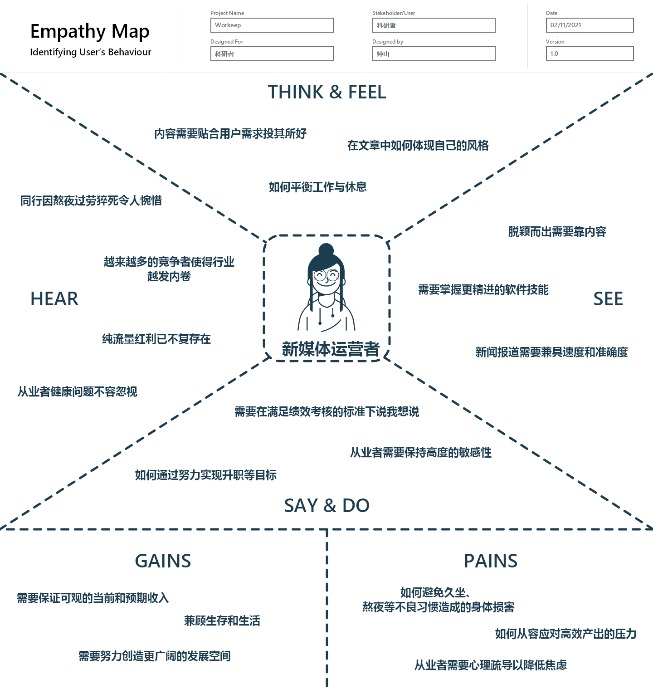

<h1 align ="center">商业模式设计</h1>

<h3 align ="center">Workeep: 一款为上班族量身打造的优质生活APP</h2>

<h4 align ="center">难逃加班九九六，依然健康久久留</h4>

|    姓名    |   学号    |
| :--------: | :-------: |
|  **钟山**  | 191250209 |
| **余欣然** | 191250187 |
| **冯亚林** | 191850036 |
| **关昕宇** | 191840077 |

[toc]

## 1. 文档介绍

### 1.1 内容框架与工作概要

根据作业要求，我们进行了六个部分的设计，并利用洞察和构思的产物对商业画布进行了完善和修补，但**保证内容调整在20%以下**。

- 客户洞察：我们挑选出四类典型的客户群体，分别是程序员，医生，新媒体运营者和科研工作者，对他们构建了移情图并进行了详细的分析。
- 构思：基于已有的商业画布要点，我们从客户驱动、资源驱动、资源驱动和供给驱动等多个角度，提出了七种商业模式创意，对这七种创意我们有详细的分析，最后经过团队讨论筛选留下了其中的五个。
- 视觉化思考：基于已有的商业模式画布，我们进行了进一步的讨论，对原有画布进行了细小的调整和改进，增加了视觉化内容，制作了视觉化画布。
- 讲故事：围绕画布分别编写了一个公司视角的故事和四个客户视角的故事，其中客户视角和客户洞察部分相契合。
- 场景：针对讲故事部分中的客户与产品交互的场景，编写了四个场景，着重突出场景与客户的交互与连接。

工作概要：

- 本次工作历时两周，共有三次线下讨论，分别在食堂、麦当劳和组长家里，每次讨论都超过两个小时，讨论时会有会议记录，开会内容包括确认画布修改内容，确定洞察的客户细分，确定构思的七种创意，确定任务分派等等。

- 本团队实行主负责人机制，即每作业有一个主负责人，主负责人分派任务，最后由组长检查质量。本作业是负责人是关昕宇。钟山，余欣然，冯亚林，关昕宇分别负责新媒体运营者，科研工作者，医生和程序员这四个客户细分的整套任务，包括绘制移情图、洞察、讲故事和场景。构思部分由四人讨论共同完成。视觉化思考和模型构建也由四人共同完成。

### 1.2 度量数值

|       项目       |     度量数值     |
| :--------------: | :--------------: |
|  客户洞察移情图  |        4         |
|   构思候选创意   |        7         |
|     画布要点     |        39        |
| 模型构建关联关系 |        15        |
|   引用调研报告   |        16        |
|      讲故事      | 5 (4客户，1公司) |
|       场景       | 28 (4个客户场景) |

## 2. 客户洞察

### 2.1 程序员

- 996，是中国程序员永远的痛。
  - 在互联网火热的时代，大量人才涌入IT届导致竞争加剧，新员工年轻想晋升所以努力加班，老员工担心工作不保也要加班刷KPI，但人月是一种神话，资本家发现可以给一个员工多付一倍工资而干几个人的活，便开始提高工作量并裁员。
  - 这种恶性循环让程序员身心俱疲，身体上：因为互联网公司普遍对迭代版本的要求很高，且大多时间都在半夜和凌晨，这就压榨了休息时间，所以许多程序员不会有定期体检体测，更不用说有规律的健身和运动了，长此以往身体素质每况愈下，所以他们希望能有一个程序帮助进行健康自测、运动指导和健康提示；
  - 快节奏时代下，程序员的午餐晚餐多为料理包外卖和食堂套餐，这种食品加工快口感好，但营养不够均衡，长此以往他们往往身材发福，并出现三高等症状，所以程序员希望得到简单易上手的养胃美食推荐。
  - 心理上：公司里不仅要面对老板的高压任务要求，还要面对项目经历频繁的需求变更，还有自己能跑通但测试跑不通的恼人场景...... 公司外还要面对来自父母、妻子等多方面的压力，同时程序员的朋友圈比较窄，所以程序员希望有一个自由轻松的社区去发现同好进而排解自己的压力。

- 下图是工作一年的程序员小关的移情图，他当下急需解决的问题是想要升职加薪。
- 

### 2.2 医生

- 据了解，目前国内近七成医生每天工作9-12小时。几乎所有的医生都曾连续工作24小时，半数人曾连续工作超过36小时。假期对很多医生都是天方夜谭。对于临床医生，这种过劳的情况更加严重。何况，医患矛盾伴随社会老龄化等等社会现象毫无疑问会继续加重医生的负担。医生是公众健康的守护者，他们当然掌握了许多关于健康的专业知识。
- 但是，医生毕竟也是人，他们也会因为繁重的工作压力而疲劳，也会因为医患矛盾而心理受伤，他们也不可能掌握所有分支的健康知识，这也是本App对医生有价值的原因。作为一款可以帮助用户进行健康自测、运动指导、心理疏导和健康提示的App，同样可以帮助医生更好地呵护自己的健康。
- 

### 2.3 新媒体运营者

* 在互联网、大数据、人工智能风行的新时代，以微信、微博为代表的新媒体迅猛发展，引领着时代潮流，而行业的火热也催生出一大批新媒体运营者。由于媒体行业对于新闻的敏锐捕捉、迅速报道的要求非常之高，造成了从业者生活不规律、工作压力大以至于昼夜颠倒的情况。承受着生理和心理双重压力的新媒体运营者们，正是本款APP的典型受众。
* 

* 看：潮流风向改变。过去纯靠流量、软文等低品质取胜的营销方式已然退场；优质的内容、精准的报道称为取胜的关键。但如何在不失速度的情况下提高新闻质量仍是亟待解决的困局。同时互联网大环境对大数据分析、网页制作等要求越来越高，掌握一定的计算机技术才能真正立于不败之地。
* 听：新媒体运营者昼夜颠倒已成常态。因熬夜赶文章而患病乃至猝死的新闻已数见不鲜。周边同事加班加点是家常便饭，久坐、长期面对电脑屏幕对人体的伤害亦不可忽视。行业门槛低，越来越多的人涌入新媒体行业争夺时代红利，行业内卷严重，从业者压力颇大。
* 想：想拥有点击量必须挖掘用户喜好。用户想要什么内容？用什么打动用户？如何契合用户的情愫？如何在行文中体现我的风格，提升与同类文章的区分度从而脱颖而出？新媒体运营者需要不断思考，不断创新，紧跟时代潮流以至于引领时代潮流，需要极强的洞察力和对社会事务的判断力。
* 说：新闻从业者在表达方面需要牢记遵从主流价值观，注意言辞，如何戴着镣铐却仍能翩翩起舞，需要新闻从业者有过人的智慧。在领导布置的KPI硬性考核下，在保证阅读量的同时表达自己的真知灼见，需要不断地磨砺和修炼。
* 痛： 身体和心理的双重压力。身体上由于长期处于要高效产出文章的压力下，必须要长时间面对电脑屏幕，且久坐、昼夜颠倒等对身体不利的现象也难以避免，需要利用碎片时间进行运动以保护身体。另一方面由于行业内卷严重，同行竞争激烈，以及“流量为王”的行业现实，要求着从业者必须保持高度的神经紧张和清醒，心理上也会产生一定影响。
* 收：首先是保证收入可观，在保证基本需要的基础上有更大的发展空间。同时升职，展现自己的风格成为行业专家是更为高级的目标。为了实现个人关键收益最大化，往往会牺牲其他方面的利益，例如休息时间等。平衡收益和压力需要认真的思考。

### 2.4 科研工作者

- 近些年，硕博扩招，在普通人看来高地位且轻松稳定的科研领域涌入了大量青年人才，迅速加剧了科研领域的内卷。考博难毕业更难的现实早已人尽皆知，而有幸上岸的科研者又陷入了教学任务重，科研指标多，非升即走，低薪996的新困局。心理上，众多科研者在实验室为论文成果而焦虑，同时还背负着自己和亲人的高期望，承受着同龄人的高薪压力。
- 科研人的心理健康已经不容忽视，他们急需适当的心理压力排解秘籍或是一个可以畅所欲言的自由社区。心理上的压力负担也很容易反映在身体上，失眠就是典型的例子。同时整日整夜地泡在实验室、图书馆，他们也希望有帮助规律运动，维持身体健康的专业指导。囿于传统观念，他们的急迫需求并没有被广泛关注发现，这为本app提供了更好发展环境。
- 

## 3. 构思

### 3.1 客户驱动

- **如果用户需要不同类型的服务会怎样？**
- 不同身份的用户、不同的使用场景下，用户会需要不同类型的服务。这些服务可能是软件具有的，也可能是不具有的。
- 首先，我们应该清楚明白地描述软件产品的功能和服务集合。对于软件具有的服务，软件应该为用户提供清晰、明确的使用接口，让用户能自由且方便地选择用户想要的服务；同时软件也会提供功能搜索服务或者具有一定智能的自动问答服务，帮助用户更精准地获取自己想要得到的服务；
- 对于迫切渴望定制化和精细化服务的用户，我们鼓励他们进行人工咨询或者充值升级为会员，得到更加贴心和全面的服务。对于软件不具有但可能扩展的服务，软件鼓励用户进行建议或反馈，向平台提出自己的见解，我们将根据用户的反馈进行更好的需求分析、功能设计或功能拓展。
- 对于软件不具有且不具有扩展可能的服务，我们将告知用户可能提供该服务的厂商或软件。

### 3.2 客户驱动

- **如果用户在平台提供的社区上不够活跃会怎样？**
- 在软件刚刚启动时，因为用户数量少、用户使用习惯未养成、社区数据无积累、社区精品内容少，可能会让社区显得不够活跃。对此，我们可以针对不足一个一个解决。
  - 比如针对用户数量少，我们可以推出分享推广奖励、注册奖励、社区发言奖励等计划，快速扩大社区用户量；
  - 再针对用户使用习惯未养成，我们可以推出签到奖励、每日发言奖励等机制，鼓励和不断引导用户去发言和发布内容；
  - 对于社区数据缺少积累，我们可以以官方或非官方的身份，主动去社区里提问或回复内容，加大社区热度；
  - 对于缺少社区精品内容，我们可以引入专业的认证用户，让他们定期分布专业的内容，也可以推出创作激励计划，让精品内容创作者拥有变现渠道，更好地鼓励他们创作。

### 3.3 资源驱动

- **如果平台提供的资源质量没有达到用户的预期会怎么样？**
- 我们提供的资源主要分为三个方面，第一方面为运动相关，主要包括：对自身身高体重肺活量，身体机能等方面的初步健康测评、根据自身身体情况和空闲时间提供定制化的健身训练计划、线下的健身房资源和一些健身实物；第二方面为健康食品相关，主要包括：营养师提供的健康食谱、健康餐餐厅推荐；第三方面为心理健康相关：主要包括心理问题的相关解决方法和专业的线上心理咨询服务等。
- 我们会安排专门的审核人依据我们制定的标准对所有内容进行审核，对部分通过审核的内容打上优质内容的标签；但由于各种问题和疏漏，难免出现资源质量不高的问题，对此，从平台角度来讲：平台会为所有用户提供反馈的渠道，对负反馈数较多的资源进行人工处理，主要处理方法包括：下架、提示整改、打负向标签等；从用户角度来讲：用户可以通过平台提供的专业认证渠道进行专业认证，认证后用户会带有专业认证的标签，这样就能自己发布一些专业性更强的内容。

### 3.4 供给驱动

- **如果用户认为我们线下合作商提供的商品质量不够令人满意会怎样？**
- 加大质量监管力度
  * 成立质量管理部门，专门负责定期检查合作单位的产品质量。若合作单位提供的产品质量不符合行业相关标准，则将相关情况及时反映到该企业质量部门，督促其进行整改。
  * 建立完善的合作商信用考察机制。若相关合作商多次发生质量不达标的情况，考虑终止与其合作并要求赔偿。
- 多方合作降低风险

  * 和多家企业进行合作，扩大进货渠道。一方面有利于保证货源充足，扩大可选择范围，不至于将鸡蛋都放在同一个篮子里。
  * 另一方面，通过货比三家，形成多家企业的竞争关系。将选择的主动权掌握在平台手中，通过竞争保证合作企业产品质量。
- 提供用户反映渠道

  * 成立用户意见处理小组。充分阅读用户反映的信息，验证真实性并及时给出处理方案。
  * 提供专人对接服务。对于一些意见较大的用户提供一对一意见反馈通道，专人对接，充分尊重用户的合理诉求。
- 给予用户适当赔偿

  * 一方面，对于蒙受损失的用户，根据实际情况给予赔偿。
  * 另一方面，对于及时反映产品问题的用户给予一定奖励。

### 3.5 财务驱动

- **如果用户付费意愿不强会怎样？**
- 坚持提供免费服务
  * 一方面，坚持继续广泛地提供免费服务。对于那些付费意愿不强的用户，平台提供一些例如健康自测、暖心食谱等针对性不强的普通服务。让大多数免费用户从中受益，吸引人气。
  * 另一方面，重点打造用户生态，通过建立用户讨论区（问答区）实现用户互帮互助，最大化发挥线上平台优势，重视UGC，从而增大用户黏度，扩大平台影响力。
- 设计个性增值服务
  * 平台根据用户需求，精心设计并提供针对性强的增值服务。通过平台的推荐系统机制，收集用户的关注点，通过高效算法为其推荐可能感兴趣的内容，为其提供针对性的、其可能需要的付费服务，投其所好。
  * 引入会员机制。提供会员专属定制服务，例如提供健身食谱心理咨询一站式服务，最大化用户价值，增强用户体验。
  * 可以适度使用“陷阱机制”，推出“试用会员”功能，对于“平台参与度”积分达到一定分数的用户提供“试用一周大会员”等功能，通过打造优质体验吸引用户。
- 加大广告投入力度
  * 最后，加大广告的投入，通过主题鲜明、吸引力强、针对性强的广告提升用户兴趣。关注流量效应，提高公众关注度，进而提升平台的吸引力。例如在“好物商城”板块加入明星代言健康食品广告等方式，催生其付费意愿。
  * 同时可以通过线下投放广告，或与其它平台合作协助自身宣传等方式，扩大平台影响力。

### 3.6 多点驱动
  - **如果平台提供专业的心理咨询服务会怎样？**
  - 对于workeep上班族健康软件而言，我们已经具备了基于专业知识的心理健康秘籍和常见问题的解决方案，但这都是普适性的内容，并不能很好地单独适用于每个用户，这种情况下往往需要专业人士的直接介入。因此，我们计划提供专业的心理咨询服务，更好地去实现定制化的价值服务。
  - 同时，在加入专业心理咨询服务后，workeep软件真正形成了集饮食健康、身体健康、心理健康和生活习惯健康的完整闭环生态圈，所有用户都可以体验到帮助保持健康的一站式服务，有付费意愿的用户还能体验到更专业的私人定制化服务。
  - 除此之外，引入专业的心理咨询服务也让以普通上班族为代表的用户和平时难以主动了解预约咨询的心理专家通过我们提供的平台产生关联，增大用户黏度，进一步维持扩大平台的持久力和影响力。

### 3.7 多点驱动

- **如果商城引入贫困地区的绿色产品会怎样？**
- 在考虑商业模式的同时，我们还要注意价值责任感的打造，良好的社会责任感和价值塑造能够对迅速扩大平台影响力起到单纯使用广告宣传等方式难以达到的作用。在我们的好物商城中有绿色健康食品售卖，而绿色这一点向来是用户所怀疑担心的，恰好部分贫困地区通过售卖自种农产品的方式创收脱贫，这为我们提供了良好的合作基础。一方面，通过这种方式，用户对于绿色产品是否真的“绿色”的担心得以消融；另一方面，平台的社会责任感与价值塑造也得以推动表现。
- 除此之外，该做法的可行性已经得到了充分论证。支付宝已经通过将蚂蚁运动和生态建设恢复结合，促进用户绿色出行，在平台影响力方面收获了显著的成效。因而在平台好物商城引入贫困地区绿色产品后，也能通过用户对贫困地区的支持提高用户活跃度，增强用户黏性，并以此为推广基础迅速扩大平台影响力。

### 3.8 最终确定的商业模式创意

- 通过小组讨论，我们对之前的商业画布进行了一定的补充、完善和整合，最后确定了如下五个创意
  - 客户驱动：如果用户需要不同类型的服务会怎样？
  - 资源驱动：如果平台提供的资源质量没有达到用户的预期会怎么样？
  - 客户驱动：如果用户在平台提供的社区上不够活跃会怎样？
  - 财务驱动：如果用户付费意愿不强会怎样？
  - 多点驱动：如果平台提供专业的心理咨询服务会怎样？
- 在这几个方向上，我们进行了深刻的分析，从而明确了本软件的商业模式。
  - 我们作为一个资源整合类的解压放松软件，**首要目的**就是通过多种类型的服务使得用户身心健康轻松，所以我们会通过清晰明确的使用接口为所有人提供大众普适的通用服务，而对于渴望定制化和精细化服务的用户，他们可以升级会员。
  - 同时系统会收集用户的反馈进行自我改进和提升；那对于我们提供的运动、健康食品和心理健康相关的资源，我们会尽可能达到用户的标准，安排审核人对所有内容进行审核，并通过打标签的方式给用户以提示，当然我们也鼓励专业人员自我发布获举报不实内容；
  - 我们的软件平台鼓励所有人的发言，当然希望平台社区能足够活跃，但如果活跃度不够时，我们会推出各种奖励和激励计划去吸引更多的新人关注，也会安排名气人员入驻引流；
  - 任何软件都需要收入支持，但难免有用户付费意愿不强的情况，对此我们会在坚持原有免费服务的同时，设计更精美的个性增值服务，让用户找到他付费的理由；
  - 最后，我们综合考虑，决定在平台上提供一个专业的心理咨询服务窗口，因为心理问题很难通过简单的普适性内容彻底解决，专业的心理咨询服务会帮我们形成集饮食健康、身体健康和心理健康的闭环，真正的一站式解决问题。

## 4. 视觉化思考

* 两段视频已上传至b站，点击下面文字链接即可观看。
  * 可视化画布讲解：https://www.bilibili.com/video/BV1x34y1Z755
  * 讨论花絮：https://www.bilibili.com/video/BV1Ch411t7xk
* 视觉化画布

### 4.1 客户群体

1. 运动缺乏群体

   * 上班族往往因为加班等原因导致运动时间不够，容易出现肥胖、高血压等症状。本APP旨在为这些运动缺乏群体提供健康自测方案以及运动指南，加强其身体素质。

2. 饮食不规律群体

   * 上班族由于工作时间较为紧张，容易出现饮食不规律等不良饮食习惯，进而导致肠胃健康问题。本APP面向该群体提供了健康食谱推荐等板块，提升其健康水平。

3. 心理压力大群体

   * 上班族由于都是生存压力以及升职、加薪等需求，往往造成工作中沉重的心理压力，容易形成焦躁不安、熬夜失眠等症状，长此以往甚至容易导致抑郁的发生，不利于其身心健康。本APP提供心理咨询功能，正是为该群体缓解心理压力，提升身心健康水平而服务。

     

### 4.2 价值服务

1. 打造健康需求的闭环
   - **聚焦上班族群体**，形成集饮食健康、身体健康、心理健康和生活习惯健康的完整健康需求闭环生态圈，探索出更多的保护上班族健康问题的解决方案，缓解如今日益严重并引发热议的上班族健康问题。
2. 多边自由交流的社区
   - 用户可经认证成为特定企业员工，平台为相同企业的员工营造了自由良好的交流社交平台。
3. 人人都能享受专属服务
   - 用户可以根据自身情况，选择**专业人士**定制适合自身的运动改善计划或心理咨询方案。
   - 同时在干饭攻略、好物商城等版块也提供诸多细化的**可选择性**设置，如可通过健康自测情况查看适合自己的饮食推荐。
4. 差异化服务与收费
   - 普通用户在不付费的情况下也能体验到产品的核心功能，获得良好的使用体验，打造用户生态，提高产品知名度、美誉度。
   - 有付费意愿的用户可以获得更多私人定制化服务。
5. 一键打开 ，便捷易用
   - 极大程度优化用户操作体验，降低用户学习成本，比如一键推荐实用的健康习惯并设定计划（如：避免久坐、定时饮水、按时护眼），一键推荐健身计划和各种健康饮品。
   - 支持线上健康自测，并且在细节上不断优化，比如健康自测支持中途退出后保存作答以及查看历史自测，尽可能避免用户重复操作。

### 4.3 渠道通路

- 政企伙伴合作
  * 政府、大型企业是本软件理想的客户。软件可以帮助政府或企业更好地呵护职员的生理和心理健康，给职员更多的幸福感和满足感。
  * 在政府的引导下，社会公平状况大大改善，以996闻名的各大互联网公司也越来越尊重员工的合法工作权益。一款可以全方位服务员工身体与心理健康的软件，既可以实在地帮助上班族，也可以成为各大互联网公司展示自我形象、响应社会风向的助力。
  * 如果能有效达成与政府、大型企业的合作，那么软件的知名度、可信度等都会大大提升。
- 互联网多平台推广
  * 本产品的技术难点不多，很容易出现复制品、类似竞品。大力宣发、快速抢占主体市场、培养主体用户群都依赖于知名度建设。而在这个万物互联、社交成本趋向于0的时代，最能快速提高知名度的方法就是在各高流量互联网平台上进行大力推广。
  * 具体有以下方式：
    * MCN，国外的网红经济已经形成了一套成熟的运作模式，中国的网红经济也在快速发展，像阿里系成功推出的薇娅、李佳琪就是典型。通过高流量网红运营推广，可以快速提升产品知名度。
    * 广告：在各个互联网平台投放精心设计的广告，最好能引用关于上班族常见疾病的医学报告，要表现出个人关注自我健康的必要性。既要提升知名度，更要传递自身价值主张，将对普通职工的健康与关心表现出来。
    * 平台运维：在各个主要的视频平台（如用户偏年轻的bilibili、抖音）投放一些健康短视频或健康知识讲座，并且聘用专门人员进行账户运维，借助平台流量提升知名度。

- 自身品牌建设
  1. 知名度
     * 建设官方网站，主页的UI和功能的设计都需求直接或间接地体现我们的价值主张。
     * 定期给坚持打卡、坚持上线或持续对社区做出贡献的用户提供免费的健康定制服务或短期会员。
     * 定期联合线下可以制作健康餐的餐馆、体育馆举办线下活动，在重要城市提升知名度。
     * 定期联合各种物资供应商举办打折促销活动。
     * 蹭热点：结合马拉松、奥运会等热点体育赛事进行健康重要性宣传，吸引用户，提高知名度。
  2. 评价
     * 通过填问卷有礼、问题反馈、在线客服等机制获取用户对产品的印象和评估，并据此进行产品的迭代。
  3. 购买
     * 提供差异化的服务与购买方式。既要能提供核心功能给价格敏感消费者，又要让付费用户认为额外付费是有意义的。既允许单个用户使用各种优惠券进行购买，又要允许某个单位以集体方式购买。
  4. 售后
     * 有智能客服和在线人工客服，向客户提供及时的售后支持。

### 4.4 客户关系

1. 上班族交流社区
   * 提供交流社区，供用户交流互助，同时帮助平台运营者了解用户的真实想法，从而精进我们的产品。

2. 自助互动服务、
   * 用户可以自助发帖、回帖、点赞、搜索感兴趣的内容等，获取其目标服务。

3. 自动化推荐服务
   * 根据用户个体的偏好通过推荐系统对每位用户进行个性化的内容推荐。

4. 内容共同创造
   * 任何用户都可以在平台上发布自己创作的内容，打造基于UGC的共享共建平台。

5. 私人定制服务

   * 为会员（付费用户）提供身体和心理健康的专属私人定制服务，对症下药精准解决用户需求。

### 4.5 收入来源

- 渠道分成

  * 与健康餐制作商、运动器材制造商等物资供应商合作，本质上是互惠互利的。我们可以补充他们的营销渠道，提升他们的知名度，从他们处获取渠道分成。
  * 当然，渠道分成的前提是：软件本身具有足够大的流量，有足够规模的核心用户圈，配得上做别人的强渠道。

- 广告费

  - 在不影响客户使用体验的前提下，开放一定的广告位。获取商家在我们平台投放⼴告的收益。

- 会员费

  - 从获取私人订制服务的用户处收取会员费，并且提供多样的、差异化的收取方式。比如可以按订购时间长短，或者按是否自动续订等分为多种会员。当然这种差异化的最大前提是合理、适度，不能出现“1级VIP”“18级会员”等过于“等级化”的会员种类。

    

### 4.6 核心资源

1. 高性能服务器
   - 通过高性能的服务器，以满足大量用户和海量数据的使用需求，支持平台的正常运行。
2. 健康知识仓库
   - 包括健康自测题目、训练计划、心理贴士、用户提出的问题以及回答等，这些共同组成了平台不断更新的健康知识仓库。
3. 专业团队
   - 以平台的开发团队为核心，营销宣传团队、进行专业心理咨询的心理从业者、制定运动定制计划的运动行业从业者等共同组成的专业团队。

### 4.7 关键业务

1. 健康自测

   -  用户可以通过平台基于专业的医学健身和心理知识建立的测试实时了解自己的健康状况，并得到相应的建议解决方案。

2. 强身运动

   * 用户可以查看平台专业的针对久坐、疲累等训练计划，并在软件的引导下完成相应的动作训练。
   * 运动激励：其中每完成相应的计划可以获得特定勋章和社区发言时的专属装扮，部分训练计划和定制计划需要会员权限或付费。

3. 养胃美食

   - 营养食谱：根据职业营养师的专业知识，平台应向用户提供兼具能量、营养、价格优势的三餐攻略。

   * 餐厅推荐：用户可以查看当前位置附近的有健康餐的餐厅和外卖，包括人均价格、健康好菜、推荐指数、营业时间、平均等候时间等信息，光顾后发表相应的点评可以获得商城优惠券等奖励。

4. 暖心小舍

   * 用户可以查看基于心理专业知识的秘籍，常见问题的解决方案，加入夸夸群，体验线上心理舒缓小游戏或音乐，或进行专业的线上心理咨询。

5. 健康助手

   * 习惯养成：用户在工作时可以启用健康助手，健康助手可以提供增强效率或舒缓心情等背景音乐，同时定期提醒用户补充水分、定时护眼、放松颈肩、避免久坐、离开电子产品。
   * 身体数据：用户可通过健康助手记录自己每天的卡路里等摄入量和喝水量，并可查看月数据分析等。

6. 问答空间

   * 认定为企业员工身份的用户可以在此提出问题或建议，企业可以查看并作出回答，付费用户可以更快地获得企业人工答复响应。
   * 普通用户可以在此查看各企业的相应问题及答复，同时也可以向特定企业提出问题，普通用户优先级低于已认定为本企业的员工。

7. 自由社区

   * 用户可以在此发表自己最近保持健康的措施或是心得，也可以分享自己所在企业的优劣，被评定为热门或优质发言可以获得商城优惠券等奖励。
   * 用户可以在这里发布或加入登山、徒步等运动活动或沙盘等心理减压游戏。
   * 企业可以在此发布团建活动，感兴趣的用户可以选择加入。
   * 平台会定期发布活动任务，在活动任务中表现良好的用户能够获得商城优惠券、或运动器材等好物奖励。

8. 好物商城

   * 用户可以在此购买平台合作商提供的靠枕、人体工学鼠标等提升工作幸福感的好物，又比如可以缓解视疲劳的蒸汽眼罩、眼药水，或者平台相应的周边。同时为响应国家扶贫政策和拉动乡村经济，好物商城中会为农村绿色食品提供单独带货通道。

### 4.8 重要合作

1. 云服务提供商
   * 包括云平台运维服务，云计算资源提供服务等。由其完成软件平台的搭建，并持续运行和维护云平台及其相关软硬件产品。
2. 企事业单位
   * 包括大型企业、政府、高校等机构，他们可以在平台上宣传自己的企业文化和福利待遇以增加企业吸引力。
3. 物资场地供应商
   * 包括线上健康食品供应商，线下健康午晚餐供应商，人体工学椅、工学鼠标厂商等物资供应商，还包括体育馆健身房等场地供应商。
4. 心理咨询机构
   * 提供健康自检、心理健康自测、心理疏导、健康习惯养成等服务，为健康自测、强身运动的业务提供理论基础和条件保障。

### 4.9 成本结构

- 营销推广
  * 前文提到，本产品技术难点不多，容易出现类似的竞品，因此必须要重视营销推广。
  * 我们需要用足够的经费，去制作精良的广告，并在各种互联网平台和热门论坛上制造和吸引流量，有力且快速地传递价值主张，以此抢占主体市场、培养核心用户群。
- 机构合作成本
  * 从合作伙伴处我们可以获得知名度和大量知识性资源，这些核心资源的获得、重要合作关系的维持都需要资金。
  * 比如：我们的健康自测需要与线下的各医院或医学院合作，以便获取健康标准，并在用户检出健康状况不良时推荐附近医院及著名医师。我们的暖心小舍功能要求我们聘请专业的心理咨询师或心理咨询团队，以便为核心用户提供一对一的、贴心的、可靠的心理疏导服务。

- 软件运维成本
  * 软件运维需要成本，从服务器的建设（或云服务器的租借、购买），到数据库的设计与实现，再到各种专业软件的付费使用，都需要不少费用。

- 人力成本
  * 主要是员工的工资、奖金、提成和社保等费用。

- 基础设施成本
  * 工作电脑、打印机以及各种办公用具的费用，土地购置或工作间/写字楼租借费用，以及其他支撑性的基础设施使用成本。

### 4.10 改进部分

- 在客户群体方面，对原来“上班族”这一较为宽泛的概念进行了细化。基于本APP提供的运动、饮食、心理三大服务，将上班族分为运动缺乏、饮食不规律、心理压力大三大群体，使得方案的针对性得以提高。
- 在价值服务方面，对其中的关键词均有了更明确更细致的定义，而不是仅仅停留于概念套路词句，如创新则明确为打造健康需求的闭环，多边交流则进一步拓展为多边自由交流的社区。除此之外，一些过于书面化的表述也被更改为更易于用户理解的常用表达，如定制化更改为人人都能享受专属服务。平台希望借此拉近和用户的距离，增大用户黏度，增强用户记忆，扩大平台影响力。
- 在核心资源方面，对原先的关键词进行了细化，不再是泛泛而谈的词句，而是落到实处同平台实际功能需求相契合的表述。如实物性资源直接确定为高性能服务器，知识性资源则确定为平台搭建维护更新的健康知识仓库。
- 在重要合作方面，将原有的运营商、企事业单位等合作方进一步具体化，选取了“云服务提供商”，“大型企业、政府高校”为代表的具体厂商或机构，有利于渠道、成本等相关项目的具体分析。

## 5. 模型构建

### 5.1 市场潜力预估

- 用户分析：
  - 本产品面向的用户主要为上班族，年龄主要分布在20-40岁，其中九零后中青年人是主力。他们可能面临着工作给自己带来的压力，包括加班带来的身体压力和竞争带来的心理压力等，他们需要一款软件帮他们拥有更健康的工作生活。同时这暗示着他们可能会有着较高的薪资，更多的可支配收入，并且他们也会更愿意花费金钱去改善身体和心理问题。总之，我们有着巨大的用户市场潜力。
- 环境分析：
  - 一方面：我国人口数居高不下，而用工单位不会有太多的招人需求，所以许多行业内卷化加重，特别是IT互联网相关企业，加班成为程序员的常态。在这种一职难求，加班成风，行业内卷，竞争激烈的环境下，我们的产品有着重要的作用和巨大的潜力。
  - 另一方面：当今的软件市场上并没有专门为上班族解压的成熟产品，有的是各个领域的专业软件，例如食品领域有提供做菜教程与分享的*下厨房*，有提供外卖服务的*饿了么*；健康领域有提供健身教程与分享的*keep*等，但这些软件过于专精，上班族们通常只会用到这些软件中的一小部分，我们的软件将上班族的需求进行整合，有着很好的用户环境。
- 商业分析：
  - 我们的商业模式充实完整，聚焦上班族群体，形成了饮食健康、运动健康和心理健康的完美闭环，同时为用户提供了多变自由交流的平台，鼓励让大家不仅接受信息也要积极产出；此外提供因人而异的专属服务，能更好满足用户需求的同时能差异化的定价和收费。总之，商业方面有着较好的潜力。
- 总之，从用户、环境和商业三方面，本产品的市场潜力巨大。

### 5.2 模块之间的联系

#### 5.2.1 相邻模块联系

* 关键业务 - 重要合作联系

  - 关键业务中的养胃美食和好物商城与物资提供商紧密关联。即健康食品和运动设备均需要与物资提供商进行合作，平台亦需要通过打造优质产品提升用户体验和回购率。

* 核心资源 - 成本结构联系

  - 核心资源中的人力资源和人力成本之间有关联。一方面企业的成功离不开专业的开发团队和营销团队，另一方面与心理从业者和运动行业从业者的合作都需要将雇佣产生的人力成本纳入预算。

* 重要合作 - 成本结构联系

  - 通过和软件开发者、云服务商等建立良好合作关系，有利于降低软件运维成本。

  * 在项目发展前期，由于需要进行大规模广告宣传和渠道推广，需要一定的广告支出和渠道费用。与运动、心理领域的合作方都需要人力成本。

* 价值服务 - 客户关系联系

  * “一键打开 ，便捷易用”的便利性使得用户操作体验得到极大化提升，促进了用户更多地利用平台进行互动交流，同时也使得基于单个用户的个性化推荐变得可能。

* 关键业务 - 重要合作 - 收入来源联系

  * 一方面，平台为企业提供了宣传渠道，也为广大上班族尤其是职场新人提供了解企业的全新角度，便于企业和员工相互了解，共同促进。

  * 另一方面，众企事业也可以通过此了解其他同行的情况，也可以更好地向整个公司的全体员工提供精细服务，既更加全面地保护其员工身心健康，又获取集体服务的费用。

- 重要合作 - 核心资源 - 关键业务联系
  * 4.1.8.4（心理咨询机构合作）- 4.1.6.2（健康知识仓库） - 4.1.7.4（暖心小舍）之间有关联。
    * 为了提高面向全体用户的健康知识仓库质量，增加专业的心理知识秘籍，以及为付费用户提供一对一的线上心理咨询服务，平台需要同专业的心理咨询机构合作，进一步提升暖心小舍功能的服务质量。

#### 5.2.2 纵向联系

- 价值主张 - 收入来源联系
  - 4.1.2.3（人人都能享受专属服务）- 4.1.2.4（差异化服务与收费）- 4.1.5.2（VIP定制费用）之间有关联。
    - 我们为有消费意愿的用户提供专属服务，包括成体系的身体训练计划、丰富的饮食搭配推荐和暖心的真人一对一心理咨询服务等，根据定制化的用户专属服务有差异地收取费用，从而成为收入来源的一部分。
- 价值主张 - 客户关系 - 关键业务联系 
  - 4.1.7.1/2/4/5/8（健康自测、强身健体、暖心小舍、健康助手、好物商城）- 4.1.2.1/2（打造健康需求的闭环、多边自由交流的社区）- 4.1.5.2（VIP定制费用）- 4.1.4.5（差异化服务与收费）之间有关联。
    - 我们为上班族提供了身体、饮食和心理三方面的一站式解决方案，用户可以通过本产品全方面的减轻工作带来的压力，从中我们回对有消费意愿的用户进行差异化收费。
    - 在关键业务中，本APP提供了供用户自由交流的“自由社区”，这与客户关系中的“社区”，即通过社区交流感受、互帮互助的功能紧密相关。
    - 在自由社区中，也涵盖了“自助服务”（自主发帖、点赞）以及“客户共同创造”（客户在平台发布内容）的部分，共同构成了多元化的客户关系。
    - 平台为用户搭建的自由社区，给相同公司或类似行业的用户提供了交流社交平台，有利于共同行业建立相应主题的社交圈。

#### 5.2.3 跨越的联系

- 渠道通路 - 重要合作联系
  - 4.3.1（政企伙伴合作）和4.8.2（企事业单位）之间有关联。
    - 企业和政府可以在平台上发布自己的企业文化和用人待遇，还可以倾听员工的反馈进行改善提高，他们是本平台重要的合作伙伴。
- 渠道通路 - 成本结构联系
  - 4.3.2（互联网多平台推广）- 4.9.1（营销推广）之间有关联。
    - 互联网时代下，各大平台的推广对于新平台的宣传尤为重要。适当加大广告费与其它营销、宣发成本的投入，有利于平台尤其是在初期迅速提升知名度、抢占主体市场。
- 核心资源 - 关键业务联系
  * 4.6.2（健康知识仓库）- 4.7（健康自测、强身运动、暖心小舍）等之间有关联。
    * 核心资源中“健康知识仓库”的部分，即健康自测题目、训练计划、心理贴士等等，正对应着关键业务中“强身运动”和“暖心小舍”的部分。充实而具有体系的知识资源使得关键业务有所支撑，构成了坚实的内容基础。
    * 知识性资源的精准度也可以作为关键业务中是否免费的标准。

#### 5.2.4	联系的联系

- 健康需求闭环与上班族

  - 目前市场上已经出现了多类健康、工作、美食APP，比如注重锻炼和健美的Keep，注重事务安排的番茄Todo，注重美食的菜谱大全等。
  - 但这些软件并没有为各类上班族的健康打造一个闭环。本APP从健康、习惯、饮食、社区等多个角度切入，共同为上班族健康的核心主题服务。以集成创新实现便利性和一站式服务，创造上班族健康呵护闭环，降低用户的各种使用成本，为用户创造价值。

- “一键打开，便捷易用”与上班族

  - 大部分上班族深陷加班甚至996困扰，他们的时间被各种工作挤压为一段段碎片。
  - 因此我们将融合各种专业知识，不断提高软件便利性，让用户以最低的学习成本和使用成本，在几次简单的点击中就可以获得多样的、有价值的健康攻略。并在选择攻略后，通过各种设置和功能，引导用户执行攻略。

- 差异化服务与不同类型的客户

  - 我们重视每一位用户的使用体验与反馈建议。我们既需要大量的免费使用用户支持我们的产品、提高产品的知名度，又需要从关键的付费用户那里获得资金、维持现金流。
  - 从客户群体来说，客户分为需要运动指导的、需要健康饮食规划的、需要心理疏导的。不同的客户需要的服务内容和服务品质当然也不同。
  - 因此我们将灵活运用差异化服务的原则，明确划分产品的不同服务范围。既免费提供泛用的核心的功能给用户，提高用户留存率；又要将有价值的、针对性强定制服务只提供给付费用户，让付费用户认为付费是有必要和值得坚持的。

- “多边自由交流的社区”与上班族

  - 我们将提供作为多边交流平台的社区给用户们使用，并且允许用户认证为多种身份，如普通用户、企业员工、企业官方账号等。

  - 对于那些想分享个人健康攻略或者保健心得的用户，我们提供的交流社区功能可以让他们有充足的展现舞台。他们不仅能在社区分享、交友、相互学习，也能因为贡献高品质内容而获得我们的内容创作激励。

    

### 5.3 支撑事实

1. 2020职场人加班研究报告 CEMIT智库

   https://cemit.net/3088.html

   > 
   >
   > 
   
   从两张图中不难看出，职场人加班已经成为一种常态，而近3/5的人都为加班导致的严重健康问题而烦恼，由此可以看出我们产品的必要性和市场需求的急切性。因此，我们必须时刻把握核心主题：健康，并以此为一个基本点，扩充至整个打工人闭环健康生态圈。
   
2. 科研人员非学术压力需减轻 光明日报
   https://mp.weixin.qq.com/s/bZJqp8SpPOQdFssXGkU4dw

   >科研管理、评价体系不完善，科研人员生存压力大、工作时间长，对科研环境满意度不高等，都在一定程度上酿成了悲剧。不过，具体到现实，这些问题的解决之道却有些打折扣，其中一个不容忽视的原因是，一些部门或机构的管理者将科研人员压力大、工作时间长“美化”为勤奋、奉献，进而忽视为科研人员创造良好的科研环境。

   由此看出，科研者承受着巨大的心理为主，身体次之的压力，他们代表了我们产品客户群体中心理压力更大的那部分，暖心小舍关键业务的必要性不言而喻。同时，平台也需要同专业心理咨询机构亲密合作，为需要的用户尽可能提供专业个性化的帮助。

3. 90后职场人的体检报告，比基金跌幅扎心多了 腾讯新闻谷雨数据
   https://mp.weixin.qq.com/s/i7VYzxsZFOYFcNtr9Qb36w

   >超过八成青年职场人曾担心自己会猝死，从未担心猝死的比例只有18.1%。
   >
   >30岁左右的年轻人中，超过三分之一的人患有颈椎病，接近五分之一的人患有腰椎病。
   >
   >长时间坐在工位上保持相似的姿势，身体僵硬，颈椎、腰椎等关节咔嚓响；
   >
   >情绪消耗大，分分钟被捉摸不定的甲方、甩锅的同事、令人崩溃的网速气到乳腺增生；
   >
   >闲暇时间被工作侵占，“报复性熬夜”“报复性饮食”，于是内分泌紊乱，过劳肥+过劳丑……

   由此看出，打工人往往对自己的健康问题格外关注，这给平台的发展、迅速占领市场提供了巨大的用户潜力。面对情绪消耗大的问题，产品需要“暖心小舍”以应对，同时通过好物商城提供护颈枕头、人体工学椅等缓解打工人久坐、疲劳、身体僵硬等问题。除此之外，打工人普遍时间紧张，平台将这几个功能共同统一在健康基本点之下，打工人只需通过一个平台，即可体验一键开启的保姆级专属定制化服务。

4. 网络问答社区“知乎”的知识分享与传播行为研究

   https://kns.cnki.net/kcms/detail/detail.aspx?dbcode=CJFD&dbname=CJFDLAST2015&filename=TSQC201506013&uniplatform=NZKPT&v=8MU_kHyiUpiHvQDk3CAQLWL4QLReeWBRBHxrnVliegNbrAkIUyB4W6i0-geqSw0c

   > 社交互动模式对于理解网上的知识分享与传播行为有非常重要的意义。社交互动创造了由节点、社交行为人、关联以及它们之间的关系组成的网络。在网上知识问答论坛中,节点即为参与者,关联即社区成员向他人贴出的消息发送的回复。
   >
   > 社群内各讨论者之间的联系并不紧密,不少节点属于孤立成员,没有与其他成员发生连接关系。
   >
   > 不少草根意见领袖也利用创造全面、高关注度答案的方式将讨论区变成了自媒体平台。
   >
   > 因此，“知乎”网络问答社区应密切重视核心成员的讨论与知识分享行为,建立完善的成员管理模式与激励社区其它成员互动的制度,从而带动普通成员，这对加强在线社区的知识分享、新知识的传播起至关重要的作用。同时,也要防止核心成员通过知乎提供的个人在线平台利用自己的影响力优势,把网络社区这种双向的交流工具变为单向传播的自媒体,从而限制了社群的成长与作为社会互动的功能性。

   这篇研究报告以知乎为蓝本，分析了网络问答社区的现存问题并提出了相应的解决建议。我们的平台中也存在同知乎类似的问答社区，不难看出其意义是非常重要的，但正如这篇报告中所提到的，我们在建设自由社区的同时也要从平台和用户双角度出发，采取平台人工处理负反馈较高的回答，用户反馈或专业认证提供答案，规避解决如部分答案质量不够高等问题。除此之外，我们平台的多边交流特性为同企业同行业的用户提供了更容易产生交流的圈子，最大程度避免了研究报告中的讨论者联系并不紧密的可能问题。

5. *医生过劳及其量表研究的进展综述*，魏秋雨，郝艳华，吴群红等，2017

   链接：https://kns.cnki.net/kcms/detail/detail.aspx?dbcode=CJFD&dbname=CJFDLAST2018&filename=YYGL201712029&uniplatform=NZKPT&v=1PHpt2tpKGUNrr3WEj8_Nq79ZJenOHkHXW3A1usm6c_LeqMPVmord8uA9ADLYMHO

   > 2.2 医生的职业特征与过劳的关系医生职业具有其特殊性：
   >
   > （1）工作强度大。随着人口老龄化的加剧及人们健康意识的提高，**患者人数呈爆发式增长**。医疗资源集中的三甲医院医生面临着**严重的超负荷工作状态**。《生命时报》与丁香园进行的网络调查结果显示，北京等8个城市的2 183名医生中近80%的医生每**天工作8～12小时**，**67%的医生曾连续工作超过36小时**。在高强度的工作状态下，医生过劳死并不鲜见 。
   >
   > （2）高风险承担。医生面临的职业对象是病人，由于**个体的差异性、疾病的变异性和医学的有限性**等造成了病人健康结局的不确定性，此外，**医患关系恶化**导致的伤医杀医事件频发的执业环境更加剧了医生职业的高风险。（3）**工作时间不规律**。突发性手术、加班、值夜班及节假日无休是许多医生工作的常态，很 难像常人那样享有正常规律的生活作息。（4） **技术、情感、体力密集型特征**。复杂的疾病诊治需要医生具有高超的诊疗技术；医学强调的人文服务需要医生在服务过程中的情感付 出；出诊、查房及长时间的手术站台等使得医生具有较重的体力负荷；由于**医生的劳动具有技术、情感、体力密集型三者兼具的特点**决定了医生职业的特殊性，且都对过劳的产生 有重要影响，因此对医生过劳的测量应充分体现医生职业的 特殊性。

   在客户洞察中，我们曾写到：“医生也是人，他们也会因为繁重的工作压力而疲劳，也会因为医患矛盾而心理受伤”等等。上文的报告锻炼显然证实了我们的话。这篇报告在对过劳及相关概念进行辨析的基础上，分析了目前国内外医生过劳的现状，并对医生过劳量表的研发提出了相关思考。医生靠专业知识守护普通人的健康，我们的APP也能通过运动指导、食谱推荐、健康自测等功能来关心医生们的健康。

6. *10年来媒体报道的295起伤医事件背后：医患矛盾的症结在哪里？*

   https://new.qq.com/omn/20191228/20191228A09R1L00.html

   > 2018年中国医师协会发布的《中国医师执业状况白皮书》显示：在中国，有**66%的医师**曾亲身经历过医患冲突事件，**超三成的医生有被患者暴力对待**的经历。而在我们搜集的近十年内中国媒体报道的295起伤医事件中（不包括港澳台地区），共有362名医护人员受伤，99名医护人员被患者持刀具袭击，24位医生在医患冲突中失去生命。
   >
   > 从近十年中国媒体报道的伤医事件来看，广东省暴力伤医事件被报道的频率最高，共有38件。山东、江苏、浙江、安徽等东部人口大省被报道的伤医事件也较多，西藏、青海、新疆等西部地区伤医事件较少。

   这篇报告搜集了2009-2018年十年内中国媒体（除港澳台地区）报道的295起伤医事件，并对这些事件及其报道做了数据分析。数据显示，医患矛盾虽然没有某些自媒体渲染的那样极端尖锐，但确实处在一种上升的趋势。医生大多保持着单纯的“治病救人”、“悬壶济世”的理想，但在遇到少数不讲理的患者或者患者家属时，可能会受到严重的伤害，因而产生委屈、痛苦等情绪。这时我们软件的心理疏导功能就大有用处了。疏导医生自身的情绪，不仅提高了他们的工作效率，也能让他们以更好的服务态度面对病人患者，事实上也算一种减少摩擦的手段。

7. *医务人员职业倦怠与健康生产力受损的关联*，黄丽，戴俊明，张浩——2013

   https://kns.cnki.net/kcms/detail/detail.aspx?dbcode=CJFD&dbname=CJFD2013&filename=LDYX201305002&uniplatform=NZKPT&v=qXM9hoSI7z_xcAlvdKtAtwE5W4fWfo0cMKCXp_jYD85yuLCX4Ps1pu-Iat61C2sD

   > 国内外的研究显示,**医务人员是职业倦怠的高发群体**,存在较高的职业倦怠率,它不仅给医务人员的正常工作和身心健康带来影响,而且已影响到医务人员的工作积极性和工作绩效。本次调查中,职业倦怠及其3个维度的平均得分分别为、情感耗竭2.88±1.55、人格解体2.06±1.63、个人成就感4.12±1.14、职业倦怠2.34±1.11,**调查人群中职业倦怠的阳性率为74.2%**,其中有15.0%为高度职业倦怠;结果说明医务人员的职业倦怠率较高。这与我国其他学者采用其他类似职业倦怠工具测量结果相似,但情感耗竭、人格解体和个人成就感3个维度的平均分均高于陆斯琦对某三甲医院的调查结果,可认为本研究中医务人员的职业倦怠发生程度更普遍。

   这篇报告分析医务人员职业倦怠与隐性缺勤所致健康生产力受损之间的关联关系。采用分层抽样方法,选择上海医务工会下辖的8家三级医院职工为调查对象进行调查。数据指出，医务人员职业倦怠感较强。这正是我们软件可以协助解决的一个问题。通过邀请医务人员作为我们平台的精品保健内容贡献者，既可以让他们的专业知识有了全新的施展之处，又可以让平台上的交流、交友增加他们生活的乐趣，减轻倦怠感。

8. *医护人员过劳测量、形成机制与危害研究综述*，唐昌敏，赵圣文，程潇，2019

   https://kns.cnki.net/kcms/detail/detail.aspx?dbcode=CJFD&dbname=CJFDLAST2019&filename=YYGL201907024&uniplatform=NZKPT&v=qPq4aSA9xIVVDmjlIOYYICl_ouhxLBwJUEQKXtJRyFkVOdWEl2dUTPmANSKMH10Z

   > 对“过劳”问题的原因以及形成机制, 我国也有多位学者进行了系统性的分析并构建了形成机制模型。张春雨等[10]根据工作要求JD-R模型建立了员工“过劳”形成机制模型, 其主要思想是个人在**工作要求和工作资源**影响下的反应, 同时考虑非工作场所的压力源、个人社会特征等因素影响。**工作要求**包括工作负荷 (工作时间长、工作不规律、换班工作/晚上工作、工作常出差等) 、情感要求、工作环境 (热/冷、嘈杂吵闹、突发事件) , **工作资源因素**包括工作控制因素 (参与、控制力、自主决定) 和社会支持或帮助, **非工作场所的压力源**包括工作家庭冲突 (家务劳动、处理家人和朋友关系、财务问题) 、社会或环境问题、突发事件。

   这篇报告就近年我国年轻医生“过劳死”现象进行了研究。它对“过劳”的内涵及研究发展趋势、“过劳”的测量与评估、医护人员“过劳”形成机制及危害进行相关文献研究, 发现国内医护人员“过劳”问题未引起足够重视。我们的软件正是从这些报告中看出了直面这一问题的必要性，并希望能通过健康自测、健康提示、饮食疗养、运动指导等功能来辅助医生缓解他们可能面对的过劳问题。

9. *新媒体运营人员生存现状和职业素养分析 ——基于广东省新媒体运营岗位从业者的调研*，汪海藻，黄可佳，2021

   https://xuewen.cnki.net/CJFD-XWDK202102038.html

   >互联网人大多**无法将生活和工作区分开**来，**加班、熬夜也成为常态化操作**。
   >
   >从2020年4月到8月访问了广东省多家新媒体公司的新媒体运营岗位的一线工作者得出“超过80% 的受访者有过多次应聘岗位失败的经历”，根本原因在于新媒体运营岗位的**准入门槛低**。
   >
   >职业前景引发焦虑，跳槽成为常态操作”的行业现状。一方面“**组织结构的扁平化趋势**也将其职业晋升道路变得更加血雨腥风”，另一方面与新媒体其他岗位相比，**运营的薪资低**成为行业痛点。
   >
   >

   本文基于对广东省新媒体运营岗位的从业者进行深度访谈，分析新媒体从业者当下生存的现状与困境。首先从业者多为年轻人，且工作的最大特点是“时效性”，最需要使用到的工具是电脑和网络。并直接指出新媒体运营者工作时间不规律，加班成常态的特点，与本报告分析的“新媒体从业者”特点相吻合。其次岗位供给在增长，求职却越来越难。新媒体运营是外行人进入新媒体行业的最佳选择。因此激烈的行业内部竞争给从业者带来了较大的心理压力。最后作者点明“职业前景引发焦虑，跳槽成为常态操作”的行业现状。

10. *加班“996”是与非*，张倩，2021

    https://www.1xuezhe.exuezhe.com/qk/art?id=764012&code=F102&pdcyear=2021&pdcno=05

    >“加班996”是**历史周期**中的一个阶段存在，但一旦开始伤害员工身心健康并给人的发展带来极大的负面影响时，就需要进行根本转向了。
    >
    >996的背后是社会经济高速发展的时代大背景，同时某些行业的“绩效至上”主义盛行，很多知识工作者具有的“非常强的成就动机”也是不容忽视的996成因。

    本文作者通过分析智联招聘2019年对职场人的加班情况调研报告，发现加班对于80%的办公室白领是工作常态，且70%的人无法获得相应的加班工资。同时通过对中国人民大学周禹教授的访谈，探讨了996收到推崇以及催生996文化的内在驱动因素。

11. *体质健康对抑郁症的影响：久坐行为的抑制效应*，上海师范大学天华学院体育教学部，2021

    https://d.wanfangdata.com.cn/periodical/wtyypkj202117019

    >**荧屏时间低于 3 小时**的大学生体质健康水平显著高于荧屏时间超过 3 小时的学生。 **久坐行为和荧屏时间在体质健康与抑郁症中起到抑制效应。** 
    >
    >本文建议在大学生中推广久坐行为和荧屏时间标准，创建活力校园文化环境。

    本文选材新颖，研究大学生的久坐现象对其心理状况的影响。采用问卷和体质测试的方式对 681 名大学生进行调查。 结果显示：**荧屏时间低于 3 小时**的大学生体质健康水平显著高于荧屏时间超过 3 小时的学生。 因此城市上班族长期面对电脑屏幕，久坐不活动的现状按照本文的结论，很可能对其心理产生负面影响，甚至导致抑郁症等心理疾病。

12. *新传播生态下中国传统媒体从业者的专业实践调查*，单凌，刘璐，2017

    http://www.cssn.cn/xwcbx/xwcbx_zhyj/201802/t20180207_3842936.shtml

    > 自媒体在垂直细分领域展现出优秀的信息策展能力，和对传播语态、热点的精准把握，内容生产的专业性不再为从业者专享，继而催生出媒体人的危机意识———必须**提升新闻业的专业门槛**。

    本文通过深度访谈北上广深四大城市的 **45 位一线媒体人**，研究认为从业者以自媒体为参照系，反观机构媒体的日常实践。文中通过访谈反映了“新闻从业者离职潮”，传统媒体与新媒体之争以及传统媒体何以立足的讨论。需要新闻从业者对理论和技术同步精进，学习更多互联网相关的知识形成“**数据思维**”，应对“**过度量化”的评价体系**。

13. *“工作 996， 生病 ICU”* 

    https://996.icu/

    > 996.ICU指工作996、生病ICU，这是中国程序员之间的一种自嘲说法，意思是如果按照 996 的模式工作，那以后就得进 ICU 了。2019年3月27日，一个名为996ICU的项目在GitHub上传开。程序员们揭露“996ICU”互联网公司，抵制互联网公司的996工作制度。
    >
    > “996”工作制，指的是一种越来越流行的非官方工作制（早上 9 点 ~ 晚上 9 点，每周 6 天）。在一个实行“996”工作制的公司工作就意味着每周至少要工作 60 个小时。
    >
    > 中国社科院一项调查显示，2017年中国人每天平均休闲时间仅为2.27小时。相比而言，美国、德国等国家国民每天平均休闲时间大约为5小时，是中国人的两倍以上。有统计结果称，中国抑郁症的患病率为6.1%，而且发病率近年来呈逐年上升趋势……

    这是一个Github上的开源项目，已经收获了超过26万人的点赞，是平台上点赞数最多的项目。项目列举了中国众多互联网大厂的强制加班行径，也提供了各界声音、法律规定等内容。

14. *2 058名男性程序员健康状况调查分析及对策*，龚志华，2021

    https://kns.cnki.net/kcms/detail/detail.aspx?dbcode=CJFD&dbname=CJFDLAST2021&filename=ZGLX202107004&uniplatform=NZKPT&v=XjTUdsd2XHe-npxN-0CnB7UXbUJhRa1XLOGuDtW9K7OCqfSqUfO2EuLl0-kkC8Pm

    >通过空军特勤疗养中心体检软件选取杭州市某公司2 058名男性程序员2019年度体检资料，年龄23～52岁，平均年龄(31.81±4.06)岁。体检项目为常规项目，详情请见下表。经过分析，得出以下几点结论：1. 代谢性疾病检出率高。2. 屈光不正、颈椎退行性病变、甲状腺结节检出率高。3. 痔、口腔疾病及心电图异常常见。
    >
    >

    这篇论文通过抽测两千名程序员并对其体检数据进行分析，发现大部分程序员都有脂肪肝、三高等疾病，脂肪肝比率超过百分之五十，让人十分震撼。这说明了程序员群体需要健康饮食和运动，需要针对性开展对程序员及类似从业人员的补救措施。

15. *在有加班经历的受访者中，71.9%感觉加班影响到了正常生活，中国青年报，2021*

    https://kns.cnki.net/kcms/detail/detail.aspx?dbcode=CCND&dbname=CCNDTEMP&filename=ZGQN202110140101&uniplatform=NZKPT&v=3WSi-Y7IOCAlTYfDGyYI_ePk__Y3JYMUPKN3tNX2DXKDWQT5Ze3tB3-sufZ5Q-oAOIA35R3vSV4%3d

    > 人社部、最高人民法院日前联合发布第二批劳动人事争议典型案例，员工拒绝“996”被解除合同后获赔。如今，加班正在影响很多年轻职场人。近日，中国青年报社社会调查中心通过问卷网（wenjuan.com），对1641名受访者进行的一项调查显示，79.9%的受访者日常工作需要加班。在有加班经历的受访者中，71.9%的人感觉加班影响到了正常生活。

    本文采访了一千多名青年职场人，约有百分之八十的人需要在日常工作中加班，因为工作实在太多干不完，但其中只有六成的人能拿到对应的加班工资，这令很多人感觉不满，其中71.9%的人认为加班已经影响到了他们的正常生活。本文主要展示了现如今职场的加班困境，公司要求加班但不给加班费，使得员工的身体和心理都备受摧残。

16. *四分之一的上班族存在心理健康问题， 个人图书馆*

    http://www.360doc.com/content/12/0711/00/2646494_223501491.shtml

    > 调查结果表明，在所有参加调查的人中，有25.04%的被调查者存在一定程度的心理健康问题，也就是说每四个被调查者中就有一个人存在一定心理健康问题。同时，我们发现，2.24%的被调查者存在着严重的心理健康问题，有22.81%的被调查者存在比较严重的心理健康问题。
    > 进一步的数据分析显示，被调查者经常频繁地出现的心理健康问题有：精神上的压力；感觉不开心、郁闷；觉得自己在事情中不能担当着有用的角色。

    本文通过中国人力资源开发网对一万多名上班族进行了心理健康调研，发现有超过四分之一的人有存在一定的心理问题。其中普通员工有心理健康问题人数比例最高，高层管理者最低。

## 6. 讲故事

### 6.1 公司视角

- 大宇，35岁，workeep产品经理
- 大宇是workeep的产品经理，从项目开始就一直跟进。最开始团队的想法是现在上班族普遍缺少运动，可以创建一个workeep软件仅仅为上班族提供专业的改善体质服务，团队首先推出了健康自测、健康助手和强身运动的业务，虽然软件广受好评，但仍有些用户表示软件推荐的运动对他还是很难，大宇于是决定增加基于人工智能的个性化定制服务，根据用户的自测数据和运动反馈通过AI算法智能推荐运动项目和次数，效果确实很明显。但随着项目的不断发展，大宇发现许多用户反馈说：身体变结实了，但体重增加了不少，于是大宇开始了调研，他发现体重增加主要是饮食结构的问题，短平快的外卖是上班族的主要饮食来源，所以团队在平台上增加了养胃美食模块，不仅提供健康菜谱鼓励大家自己做饭带饭，还给用户推荐线上线下的健康营养餐厅，通过和餐厅合作，平台还能增加一份收入。软件也增加了好物商城，上架一些经过筛选过的能提供上班族工作幸福感的好物，包括公学电脑椅、视疲劳眼药水等。
- 在不断的调研中，大宇发展上班族同时面临着比较严重的心理问题，而这部分也可以加入项目中，可以形成一套饮食、运动、心理问题的闭环解决方案，于是项目中加入了有常驻心理咨询师的暖心小舍，这也收获了很多好评，但也有人反馈到，他们需要一个相互交流的平台，有时相同境遇的人的帮助是最有效的，所以项目上线了自由社区，用户可以在社区中发表想法和参加官方举办的活动，越来越多的反馈说他们的工作和生活因为workeep变得明媚美好，大宇也因此十分自豪荣耀。

### 6.2 客户视角：程序员

- 小关，28岁，创业公司入职五年的程序员
- 下班到家，已经是半夜三点半了，我全身都能感觉到心脏在砰砰地跳，腿也在打晃。每次公司发新版本都是这样，开发和测试的时间都很紧，一堆功能没法自测，随便点点就交了，结果就是测试同事给我发回几十个bug，如果就是这样还好，产品经理又把需求改了，他说“这个修改很重要，否则产品会有非常严重的问题！”我再一次去找主管，主管说这是老板定的，必须得改，问我还想不想要加薪了，我只能回到椅子上继续工作，结果刚坐下，小张就跟我说他离职刚办完，老板把他的任务交给我了，我差点吓死，自己的事都做不过来，还要加一倍的工作量，那就只能加班了。加班到半夜感觉有点饿，食堂里早就没有饭菜了，只能随便吃点亮的垫垫肚子。手忙脚乱到凌晨两点半，修好最后一个bug又出来俩，在修好然后发版就是三点钟了，好在大楼里有不少办公室还在亮灯......第二天，小关听到同事在讨论一个新的软件Workeep，同事们说这是一个关注上班族身体心理健康的软件。本来小关是不打算安装的，毕竟很多软件安装了也没用几次，但听说新人有各种礼物，就顺手注册了个账号。午休过后，小关发现同事都在做一些放松动作，他们说是从workeep上学到的，看他们不一会就睡熟的样子，小关也试着做了一组，发现效果真的不错。下班后小关打开了这个软件，进行了健康自测，他发现自己的身体状况真的很差，不过软件上给出了强身运动恢复健康的具体方法，他决定从今天开始每晚抽出15分钟改善体质。
- 小关又尝试了其他功能，他首先看到了养胃美食专区，因为小公司并没有食堂，每天中午都是订外卖的，软件上推荐了一些便宜健康的外卖和好评分高的线下店，小关一一尝试了一次，发现确实食物很好，虽然口感有些清淡，但明显更加健康了；小关又翻了翻平台上的好物商城，发现了好多实惠有用的生活好物，例如保护人体脊椎的工学电脑椅、降低蓝光保护眼镜的电脑显示器等，这为小关省下了不少时间；小关还点开了平台上的自由社区，看到了林林医生写的如何保护手腕的文章，欣赏了萱萱剪辑的视频，找到了境遇相同的好友科研者宏宏，小关感觉自己职业也因为workeep变得丰富多彩了起来。

### 6.3 客户视角：医生

- 林林，28岁，某二甲医院的年轻临床医生
- 林林几年前从南京大学医学院的临床专业毕业，很快凭借着自己优秀的学历和扎实的专业基础，被南京市鼓楼医院聘用，成为一名新手住院医师。虽然医院很重视自己，但是南京房价太贵，房子租金太高，自己不知道还要多久才能成为一个有房的南京人，这是林林第一个发愁的地方。林林每天工作至少9个小时，手术多时，甚至连续工作过20几个小时。过劳让林林感到疲惫。最不幸的是，一次因治疗不及时，手术失败了，一位家属愤怒地斥责林林。虽然有同事和领导的安慰，但林林还是感到委屈。委屈感、倦怠感、疲惫等等困扰着林林的职业理想。
- 一天，林林听到同事们在谈论一个关注健康的新软件Workeep。本来林林身为医生，对这种软件并不感冒：我自己就是专业的医生了，还需要什么东西来告诉我保健？但当林林听到同事们在Workeep的论坛上，分享保健攻略、养生知识，不仅收获了粉丝，还获得了可观的内容创作奖励以后，林林突然产生了兴趣。自己的时间比较碎片化，何不利用一些碎片的时间，去这个论坛上发布内容，不仅多赚点小钱，还可以温习一下自己的知识。
- 林林很快在应用商店里下载了Workeep，简单、好看的界面和不影响使用的广告让林林产生了不错的第一印象。林林带着一些好奇的尝试了Workeep的健康自测功能，他一方面认可了这些自测有科学性，但另一方面又挑剔地觉得还有很多改进之处。林林果断地进行反馈，提出了改进意见。林林又尝试了其他的功能，感兴趣的终于还是养胃美食和交流社区。作为资深吃货，林林早就想自己做些大餐好好享用了。在交流社区里，林林也看到了同事们提到的内容创作激励计划。这让林林发现了新大陆。交流社区里涉及的知识并不复杂和专业，林林觉得可以发布一些更加专业的内容。
- 林林通过多次发布医学视频和健康攻略，在平台上成为了百大博主，这个过程中，林林感到了巨大的成就感。平台不仅采纳了林林的一些反馈建议，还给成为百大的林林提出了合作邀请，希望林林能成为平台的医学顾问之一。在跟领导对话之后，林林欣然接受了这一邀请。林林此后将向大众普及、传播专业医学知识作为了自己新的任务。

### 6.4 客户视角：新媒体运营者

* 萱萱，26岁，某互联网公司新媒体部编辑组组长
* 四年前，萱萱从M市的顶级学府MAU毕业。受到在M市日报担任多年编辑部主任的父亲的影响，萱萱从小便怀着有朝一日用自己的笔去勾勒社会的真实模样，带着还原真相、伸张正义的使命感在新闻界闯出一片天地的理想。为此，十年寒窗苦读换来金榜题名，而后四年大学生涯中她刻苦钻研各门技术，并在校园编辑部积累实习经验，一举成为那年学校的优秀毕业生。毕业后她在父亲和导师的建议下，选择进入本市老牌报社M市日报的新媒体部工作。一方面报社名声在外，并且“继承父亲衣钵”的感情羁绊无形中加深着对报社的归属感，另一方面她感到传统媒体到新媒体存在着巨大的转型空间，令她可以大展拳脚。
* 然而，入职报社两年后的她却感到前所未有的挫败和失望。报社虽顺应潮流设立了新媒体部，但实际上重视度和给予的支持远远不够。部门人手与分配下来的宣发任务不相匹配，且周边同事良莠不齐，有的对新媒体软件的使用仍不甚熟悉。作为部门骨干的她凭着一颗强烈的责任心，一方面负责着软件培训工作，另一方面也自愿加班到深夜，乃至家里的卧室、客厅都是她的办公桌。长期熬夜带来的副作用让曾经健康开朗的她变得竟有些憔悴，父母看在眼里也急在心里。更糟糕的是她的上级是思想保守传统的老编辑，每当她怀着满腔热情提出极具创新色彩的提案时，总会遭来上级的当头棒喝。“换汤不换药”的“端到端翻译”工作消磨着她的热情，无形的压力让她陷入焦虑，也让她一度怀疑自己是否真的适合从事新媒体行业。
* 一日，大学同学群里突然活跃起来。原来大家都在讨论一款名为“Workeep”的健康服务软件，在大学闺蜜的强烈安利下萱萱下载了软件。通过软件的“**健康自测**”功能，她发现自己的身体指标不甚理想，心理上也存在着轻度抑郁的风险。萱萱顿时意识到了健康问题的严重性，并在软件的推荐下在“**强身运动**”模块选择了“每周定时跑”计划，决心通过行动改善自己脆弱的身体状况。同时她也在“**暖心小舍**”板块看到了舒缓心理压力的建议和可以采取的措施，软件推荐的“个性电台”守护着她度过了一个个加班的夜晚。
* 三个月后，萱萱已然获得了软件的“运动达人”称号，气色也大为改善。在“**自由社区**”板块，她分享着在编辑部的上班日常，凭借着新闻从业者的专业水准和精致的剪辑，收获了一大批粉丝的关注和同行的认可。曾经充斥着漫漫长夜的焦虑、疑惑也在“**问答空间**”中被一扫而空。在这里，同样来自传统报社新媒体部门的同行们走过的坎坷经历，让她不再感到孤立无援。得到帮助的她也开始在社区里为焦虑的萌新们答疑解惑，看到自己的绵薄之力正积极地影响着素昧平生的他人，她感到无比的欣慰和幸福。
* 而后，她了解到软件最新的**会员**功能能为她提供其他公司的薪酬待遇、工作状况等真实信息，抱着对软件培养起的信任她选择充值成为会员。当天晚上，她便得到了最新的行业岗位动态信息，并可以查看企业内部人员对于工作的评论。经过深思熟虑和与家人的讨论，她决定离开报社尝试新的挑战。在软件**一对一服务专员**的帮助下，她联系到了意向互联网企业的新媒体运营岗位HR并递交了简历。凭借着她的专业素质和两年的从业经历，她成功地收获了一份满意的offer，也默默地为Workeep点下了五星好评。

### 6.5 客户视角：科研工作者

- 宏宏，29岁，助理研究员
- 宏宏是一年前博士毕业回国，入职N校实验室的菜鸟研究员，博得众人艳羡的海归如今也有着属于自己的烦恼。作为正式的科研者中的萌新，他现在不仅要承担两门课的教学任务，非升即走的机制也压得他难得喘息。曾经无忧无虑的他最近也开始辗转反侧，深夜emo。墙角的篮球已经瘪了且布满灰尘，体重秤的指针摆幅却越来越大，实验室-居所-食堂的三点一线已经成为一种习惯。最近，宏宏在难得的摸鱼时间打开抖音，意料之外地发现了一款名为“Workeep”的健康服务软件的宣传视频，他想起了实验室新人朋友圈里的健康餐配图也有该软件的图标水印，正有着强烈需求的他迅速去应用市场下载了软件，决定尝试一下。
- 打开软件就进入了健康自测的界面，上次体检已经是入职前，宏宏正想要体检却抽不出时间。现在，通过线上的简单自测，宏宏确认了自己身体并无大碍，体检安排也不必过于着急。来到“暖心小舍”，宏宏发现了许多排解压力的秘籍，他选择了一个帮助舒缓身心的歌单，尽管暂未感受到明显变化，但他莫名地很安心，听着歌声难得地睡了一个好觉。
- 后面，宏宏在“自由社区”里意外发现了一个名为“N校007”的圈子，在这里宏宏和别的青年研究员一同诉说难处、相互安慰，让孤身在异国度过了硕博时期的宏宏想起了当初在N校温暖的本科时光。正值双十一，宏宏发现平台的好物商城也推出了系列活动，对质量物流速度等尚存疑惑的他咨询了客服，经过客服细致地解答后，他下单了心水已久的电脑支架。平台的速度让他惊喜，在不到24h后，宏宏就收到了自己的电脑支架，腰疼脖子酸的问题总算得到了缓解，他迅速确认了收货并给了商品和软件五星好评。
- 一两个月的时间很快过去，宏宏早已娴熟地使用该软件，自己的气色也越来越好，当同样入职的实验室的海归同学向他询问秘诀时，宏宏毫不犹豫地将平台推荐给了询问的同学，他很感谢这个平台和自己当时下载一试的想法。

## 7. 场景

### 7.1 用户一：程序员

程序员小关发现同事们每天下午都在做拉伸和放松运动，问了才知道他们是在workeep上看到的，同事们最近睡得很香应该跟它有关(**了解并评估**)。于是他也下载了这个软件(**获得**)，他通过健康自测发现自身的状况不太乐观，但好在软件推荐了相关的解决方案，小关决定每晚抽出十五分钟来改变现状(**交互**)。小关翻到了软件中的好物商城，看到推荐的人体工学椅，小关拿出了一部分工资买了一个(**购买**)，坐了几天感觉确实很舒服，然后联系售后加购了一个配套的腰枕(**售后**)，随后给出了五星好评，并把它推荐给同事们(**评价与可能的再次购买**)。

### 7.2 用户二：医生

林林在同事闲聊时听说了Workeep软件，同事们在Workeep的论坛上作为专业人士发表保健攻略，收获了一大票好评，甚至还受到官方的内容创作激励金，这让他也产生了兴趣（**了解并评估**）。他很快在应用商店里下载了APP（**获得**）。刚打开App，他就发现App有健康自测功能。作为专业人士，他很好奇测试的内容是什么、是不是有违反自己的专业知识。他很快打开，发现健康自测的试题质量很高，无疑是专业人士设计的，但测试范围上还有可以改进的地方，他又通过反馈通道写了一些个人意见（**交互**）。随后他又了解到软件的“强身运动”“暖心小舍”等板块，并小小尝试了一下（**交互**）。他很快又探索到了“好物商城”和“自由交流社区”的功能，既发现了想买的健身器材，又知道了在平台分享个人健康攻略，可以获得打折优惠的活动。抱着试一试的心态，林林去论坛上分享了一些平时生活中保健的小习惯，不仅收获了一些粉丝，还获得了购物优惠，他愉快地付款了（**交互**、**购买**）。收到货后，林林发现质量非常满意，给软件打了五星好评。（**评价与可能的再次购买，交互**）在多次购买和分享内容后，公司人员注意到了活跃的林林，他们很快联系到了林林，希望能与专业知识丰富的林林签约，雇佣林林作为公司的医学顾问（**售后，交互**），林林高兴地同意了。

### 7.3 用户三：新媒体运营者

萱萱在同学群里了解到Workeep软件，同学们的广泛赞誉让她有了使用的想法（**了解并评估**），并在闺蜜的安利下下载了APP（**获得**）。通过健康自测她意识到自己存在着不可小视的身体、心理问题（**交互**），并通过软件的“强身运动”“暖心小舍”等板块了解到可以采取的措施并付诸行动（**交互**）。凭着对软件的信任，她购买了会员以寻求跳槽的机会（**购买**），在一对一专员的全程帮助下，她联系到了意向公司的HR并成功入职（**售后，交互**）。最后她为软件点了五星好评（**评价与可能的再次购买**）。

### 7.4 用户四：科研工作者

宏宏看到了实验室新人朋友圈里的宣传，同时在顶尖流量平台（如抖音）刷到了软件的推广视频（**了解并评估**），他迅速在应用市场里免费下载了Workeep软件（**获得**）。在经过线上的简单自测后，宏宏确认了自己健康状况（**交互**），同时借助“暖心小舍”和“自由社区”极大地缓解了自己的心理压力（**交互**）。在使用好物商城的功能时，宏宏有许多疑虑，但客服都细致解答，消除了他的疑惑（**售后**）。在购买并收到好物商城的商品后（**交互、购买**），宏宏去应用市场给了软件五星好评（**评价与可能的再次购买**）。在有类似需求的用户向他咨询时，他毫不犹豫地推荐了workeep软件（**评价与可能的再次购买**）
