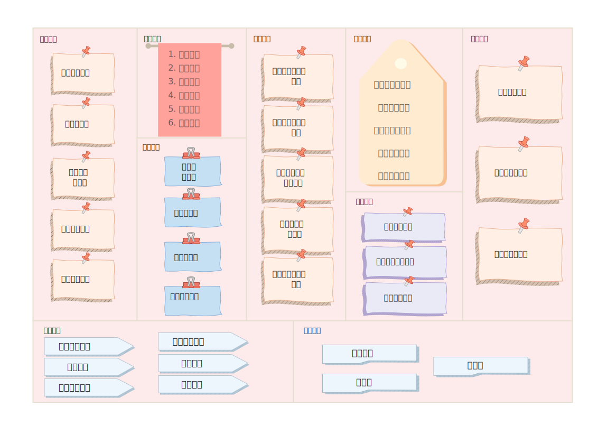

<h1 align ="center">商业模式评估</h1>

<h3 align ="center">Workeep: 一款为上班族量身打造的优质生活APP</h2>

<h4 align ="center">难逃加班九九六，依然健康久久留</h4>

## 1. 	基本信息

### 1.1	组员信息

|    姓名    |   学号    |
| :--------: | :-------: |
| **冯亚林** | 191850036 |
| **关昕宇** | 191840077 |
| **余欣然** | 191250187 |
|  **钟山**  | 191250209 |

### 1.2	度量数值

| 项                   | 度量值                       |
| -------------------- | ---------------------------- |
| 商业模式环境分析方面 | 4个方面，所有子方向          |
| 总体评估加分项       | 7点                          |
| 总体评估减分项       | 4点                          |
| SWOT分析             | 97项(SWOT每一项都进行了评分) |
| 蓝海战略             | 1个方向，即价值主张方向      |
| 引用的调研报告和新闻 | 35篇                         |
| 更新后的画布总要点数 | 40个                         |

### 1.3	文档概要

​	本次作业历时2周，我们先后进行了商业模式环境评估、SWOT分析、蓝海战略探索，并在过程中参考了35篇报告，最后根据讨论，对商业模式画布进行更新，形成了这篇文档。

​	在商业模式环境评估中，我们对4个方面的每个子方向都进行了分析。大致得出以下的结论：

- **1）市场上**，我们分析了年轻上班族日渐增长的健康需求，认为有部分客户群体的需求可能萎缩，但主体的需求是在增长。健康类软件上，存在竞品与我们的业务有重叠和相似，但从核心价值主张上，我们有一定创新性。
- **2）行业影响力上**，我们认为现有软件中如Keep、心潮等软件将是不可忽视的竞争对手，新挑战者也可能具有一定的威胁和可借鉴之处，同时也展现了与供应商和利益相关方合作的必要。
- **3）在关键趋势上，**我们认为计算机技术领域的发展迅速，比如大数据、云计算、机器学习等都应该关注并及时利用；同时随着经济周期的演进，社会经济发展速度相对减慢，社会对财富分配和社会正义的要求提高，主流舆论也对不合理的工作制度和管理趋势进行了批评，这些趋势对我们软件的影响总体上难以简单地判断。
- **4）在宏观经济领域，**我们认为世界仍处于新冠肺炎后的萧条期，除东亚外，各地各洲各国市场波动较大，东亚尤其是我国在经济稳定和复苏上优势较大，同时随着北交所的成立、基础设施的不断建设和其他系统性政策的推进，我国的经济有望进入高质量发展的阶段。这些对我们的软件当然是积极的影响。

​	在SWOT分析的总体评价中，我们首先分析出了7个软件的加分项和4个减分项；然后从3个表格，每个表格4个维度上对我们的软件产品进行了评分。从评分中，我们更加清晰了以下想法：

- **1）**我们产品的价值主张具有一定的创新性，在SW表&O表中表现较好，但是因为技术难度不足以隔绝竞争者，不可替代性较弱，在T表上表现较差，容易出现模仿者；
- **2）**我们的产品继承了传统轻资产的互联网软件的优缺点，在成本收入上有较大的不足，主要是收入来源不够多样、稳定。
- **3）**在客户界面上，同样因为是轻资产的互联网软件，容易接受客户反馈并进行迭代，所以在SW表、O表、T表中，都是表现最好的一个维度。
- **4）**基础设施这个维度上，与价值主张相似，同样在SW表和O表上表现良好，在T表上表现较差，又一次体现了软件没有技术护城河、容易被模仿复制的缺点。

​	在蓝海战略探索上，我们选择**价值主张**方向进行内容探讨。先是介绍了为什么选择价值主张方向：因为它能**串联起整个画布**的成本侧（左侧的成本结构、核心资源等）、收入侧（右侧的收入来源、客户细分等），同时我们的软件在价值主张上具有一定创新性。选择价值主张进行探讨，可以进一步发掘创新点。然后介绍了如何通过“消减、提升、创造、删除”对进行修改。

​	最后是画布的更新，在文档的**5.画布更新**中已经有了对画布更新的总体描述和更新点讲解，这里就略过了。

### 1.4	内容框架

本文档分为5个主要部分：

1. 基本信息介绍

1. **商业模式环境**

   针对上阶段得到的商业模式画布，我们进行了四方面的商业环境评估。

   - 市场影响力：从 市场问题、市场分类、需求和诉求、切换成本、收入吸引力 5个子方向进行产品的市场分析。
   - 行业影响力：从 竞争对手、新进入者、替代产品和服务、供应链与价值链上的其他厂商与利益相关者 5个子方向进行行业分析。
   - 关键趋势：针对 技术趋势、行业管理趋势、社会与文化趋势和社会经济趋势 4个关键趋势进行市场和社会的关键趋势分析。
   - 宏观经济影响：针对 全球经济情况、资本市场、大宗商品和其他资源、经济基础设施 4个方面进行了宏观经济层面的分析。

2. **评估商业模式**

   - 我们首先对上阶段得到的商业模式画布进行了讨论和总体评估，给出了画布存在的加分项和减分项。
   - 我们接着运用SWOT分析产品，以3个表格：优势劣势（SW）、机会（O）、威胁（T），对商业模式的核心部分——价值主张、成本收入、客户界面、基础设施进行了评估。

3. **蓝海战略**

   该部分首先介绍为什么选择**价值主张**方向来进行画布的蓝海战略探索。

   接着根据删除、消减、提升、创造这“四项行动架构”，具体描述探索内容。

4. **画布更新**

   经过整理和讨论已有成果，我们对画布的一些不足之处做了调整，重点改变了关键业务和核心资源等模块，并且给出了新画布、新画布总体分析、更新之处重点说明和更新后的要点依赖。

5. 参考资料

   这部分给出了文档涉及的所有参考报告、新闻等。

   

## 2.	商业模式环境

### 2.1	市场影响力

#### 2.1.1 市场问题

1. 影响客户环境的关键因素是什么？

   **问题解析：**我们的客户主体是上班族，影响上班族健康服务软件市场的关键因素是什么？

   随着人们的物质生活水平逐渐提升，上班族们的健康意识逐渐加强，他们越来越多地关注自己的健康，却可能没有足够的时间去强身健体或是放松身心，在工作日甚至连饮食休息都不规律。因而，存在这样的需求，我们的软件就可以帮助他们保持健康、满足健康需求。对于这片市场，关键因素应该是健康服务的质量，是否能让客户真实有效地感觉到健康提升或保持的效果，足够优秀的评价才能留得住已有用户，并不断引进新的⽤户。

   

2. 现在正在发生什么转变？

   **问题解析：**上班族健康软件市场在发生什么转变？

   通过之前的分析，我们已经知道如今上班族健康市场得到了极大的发展，越来越多的年轻上班族开始关注自己的健康问题。与此同时，上班族有稳定的薪水，通常有较强烈的消费意愿，愿意在健康养生上投入。正如《90后养生指南》中所述，仅4.53%年轻人不在意养生，而超80%年轻人会自主关注养生。同时，由于疫情反复的影响，加之上班族平时忙于工作，很难找到合适的守护健康途径，加之移动互联网的日渐发展，越来越多的人会主动去尝试现有的健康软件。我们软件的目标市场正在日渐扩张，越来越多的潜在用户已经有了足够的意识，下一步就是落实到行动。但如前所述，只有提升服务质量，进而完善自身品牌建设，同时通过用户协同推荐等方式，才能够迅速扩大客户群体，加快扩张崛起的速度。

   > 来自参考【1】：
   >
   > 日前，Just So Soul研究院发布的《90后养生指南》显示，这届年轻人比想象中更关注养生话题，超过九成的90后年轻人都在意养生。综合数据显示，10个90后，超过9个都在意养生，仅有4%的90后年轻人不在意养生。这意味着，90后年轻人已经非常关注养生及健康生活方式，但调查还显示，因各种因素，能够维持或实际付诸行动仍待加强。
   >

   

3. 市场在朝什么方向发展？

   **问题解析：**上班族健康软件市场的发展方向？

   在移动互联网迅速发展的大环境下，软件快速进行功能迭代，不断推陈出新已经成为其生存的必要条件。未来的健康软件自然也不能免俗，因而一定不能忽视多元化。正如下面的几则新闻所述，上班族不仅面对着身体上的健康问题，还有心理压力、职场pua、饮食不规律等诸多问题，这为上班族健康软件提供了绝佳的多元化契机。只有完善上班族的健康需求生态圈，才能留住已有用户，吸引新的用户。除此之外，如果说多元是广度，那么专属就是深度，未来的健康软件同样需要提供高品质的专属服务，才能为愿意付费的用户提供优秀的体验，同时吸引广大的免费体验用户主动消费。

   > 来自参考【2】：
   >
   > 超过八成青年职场人曾担心自己会猝死，从未担心猝死的比例只有18.1%。
   >
   > 30岁左右的年轻人中，超过三分之一的人患有颈椎病，接近五分之一的人患有腰椎病。
   >
   > 长时间坐在工位上保持相似的姿势，身体僵硬，颈椎、腰椎等关节咔嚓响；
   >
   > 情绪消耗大，分分钟被捉摸不定的甲方、甩锅的同事、令人崩溃的网速气到乳腺增生；
   >
   > 闲暇时间被工作侵占，“报复性熬夜”“报复性饮食”，于是内分泌紊乱，过劳肥+过劳丑……
   
   > 来自参考【3】：
   >
   > 调查结果表明，在所有参加调查的人中，有25.04%的被调查者存在一定程度的心理健康问题，也就是说每四个被调查者中就有一个人存在一定心理健康问题。同时，我们发现，2.24%的被调查者存在着严重的心理健康问题，有22.81%的被调查者存在比较严重的心理健康问题。
   > 进一步的数据分析显示，被调查者经常频繁地出现的心理健康问题有：精神上的压力；感觉不开心、郁闷；觉得自己在事情中不能担当着有用的角色。

#### 2.1.2 市场分类

1. 哪块客户细分群体最为重要？

   **问题解析：**在我们商业模式画布中的客户细分中，哪⼀部分是最重要的客户？

   在客户细分群体中，毫无疑问是能够给软件带来更多收益的最为重要，而这也意味着他们有更强烈更必要的需求。在饮食不规律、缺乏锻炼和心理压力大三类客户群体中，无疑是缺乏锻炼的客户群体更大，同时需求更多更强烈。这类客户兼具了对专业服务和商城好物购买的需求。除此之外，缺乏锻炼的客户群体使用软件后，更容易直接感受到效果，同时周围人也可以直接感受到，为拓展新用户提供了更好的契机。

   

2. 最大的增长潜力在哪里？

   **问题解析：**在我们的客户群体中，哪一部分未来增长潜力最大？

   毋庸置疑，自然是年轻人。先前的参考【1】《90后养生报告》中提到，仅有4%的90后年轻人不在意养生，但实践上依旧有待加强，年轻上班族市场如今正大有可为。同时，正如下方新闻所述，年轻人的同辈群体影响更加明显，也更加能够接受新事物、尝试新事物，能够带动更多的身边人、同龄人一起使用软件守护健康。除此之外，年轻上班族群体能够不断补充迭代，新成为上班族的年轻人往往有更大的可能性了解相应软件、使用相应软件。

   > 来自参考【4】：
   >
   > 2020年《青年大健康消费报告》提出，近六成青年对健康有较强消费意愿，饮食和运动是其中“大头”。31—35岁这一群走在年轻“边缘”的青年人，为此消费的意愿度接近80%。这也就细分了养生消费的市场，青年养生的市场正在逐渐壮大，显示出良好的消费潜力。
   >
   > 北京大学医学人文学院副院长王岳认为，“同辈群体在社会化过程中发挥着重要作用”，会进一步促进年轻人养生观念的转变。一旦有人养生，便有可能带动大家一起行动；一旦有人以较为新颖的方式养生，大家就都有可能尝试接受。

   

3. 哪个细分市场在萎缩？

   **问题解析：**在我们的客户群体中，哪一部分在缩减？

   一般情况下，该市场对应的各群体通常都较为稳定，而唯一称得上萎缩的应该是中老年上班族群体。年龄较大的上班族通常拥有较高的自由度，可以更自由地安排健康活动。同时，他们在健康方面通常也形成了自己的一套有效的方法，同时对于新软件新功能的适应度相应较低，从而使用软件的意愿都逐渐下降。

   

4. 哪个边缘细分市场值得关注？

   **问题解析：**在我们的客户群体中，哪一部分较小或容易被忽视但值得关注？

   最值得关注的应该是科研工作者。他们通常在高校或研究所等较为封闭象牙塔的环境，因而往往关注外界的程度不足，通常也往往被外界忽视，划分上班族时也往往被忽略。但正如下方新闻所述，科研者，尤其是博士生、助理研究员等往往面临极大的科研或教学压力，这种压力不仅仅是身体上的，同时也是心理上的。针对这类边缘细分市场，由于他们自身的封闭局限性，我们需要采用更加有效甚至直接定点的宣传方式，进一步拓宽这部分市场。

   > 来自参考【5】：
   >
   > “不发表、发表少就出局”。顶着最高学历的光环，高校青年教师却似乎比同龄青年有着更多的焦虑和迷茫，而他们所承受的论文指标考核（包括今年6月曾经引起热议的“非升即走”制度考核）压力，是高校中老年教师在青年时无法比拟的。
   >
   > 我之前提到过，我个人非常注重教学，但我发现一个奇怪的现象是，教师想要升职，只看重你发表了多少论文，从来不看重你教了多少好学生，教学满意度如何，等等。相信很多人在上大学时都遇到过不认真上课的老师，学生们都能很快察觉到，哪些老师只是在走过场，对教学毫无热情。我作为学生的时候不理解，但我当了老师之后，越来越能理解这些青年老师的心理感受了。如果认真备课、上课不能帮助他升职甚至保住教职，每天还要为论文发表数量达不到要求而焦虑，那么应付式上课成为常态，恐怕也是人之常情。

#### 2.1.3 需求和诉求

1. 客户需要什么？

   **问题解析：**客户需求是什么，通过软件解决什么问题？

   一款能够完美满足客户各项健康需求的软件。具体来说，在身体健康、心理健康、饮食健康和生活习惯健康四大方面都能够提供相应的健康指导，根据参考【6】，全健康的时代已经降临。同时又不像*Keep*等软件过于专精化，更适用于普罗大众，尤其是平时忙于工作，时常面临加班时间紧张且碎片化的上班族；也不像下厨房、小睡眠等只能满足一小部分需求，且有大部分冗余功能。

   > 来自参考【6】：
   >
   > 在全健康体系当中，个体健康是基础需求，但完整的健康需求不局限于此。本次研究中，36.4%受访者的关注点聚焦于个体的身心全面健康，14.4%的受访者上升到环境健康，12.9%上升到全产业链的健康。对于50.9%的受访者而言，个体健康还不是完整的“健康”，健康理念还需要关照社会和环境的全面健康。74.3%的受访者认为品牌的“全健康”属性会影响他们的购买决策。随着消费者健康诉求升级，品牌企业也需要更多地关注“全健康营销”，借助社会责任方面的传播势能，构建认知杠杆，打造面向消费者的正面健康的品牌形象。

   

2. 在客户需求中，哪些没有得到满足，最大的缝隙在哪里？

   **问题解析：**我们的产品没有满足客户哪些需求，其中最基本的是什么？

   打造了集身体健康、心理健康、饮食健康和生活习惯健康四大健康问题闭环的软件几乎满足了所有的客户需求。其中唯一没有得到满足的还是集中在社交方面，用户除了在社区友好交流外，平台并没有提供相应的健康运动竞赛等活动，可能会在提高用户活跃度方面面临相应的问题，但不开展这类活动也帮助了软件规避安全风险、意外等相关问题，避免了突然出现无法应对的雷区问题。对于提高用户活跃度，软件也有相应的奖励机制和用户激励计划，尽最大可能弥补这方面的欠缺。

   

3. 客户最渴望满足的需求是什么？

   **问题解析：**客户使⽤我们的产品时最基本的需求是什么？

   2020年疫情猝发，如今还在常态化防疫期，海外依旧高风险，这无疑使得所有人更加关注健康，这一方面扩大了我们软件的市场，但另一方面也为我们软件的健康服务质量提出了更高的要求。从下面的新闻，不难看出，当代上班族，尤其是我们关注的主体，年轻上班族，更愿意健康消费，其中很大一部分还是精致健康消费。所以我们要不断更新健康仓库，为用户提供最新最全面的健康服务，同时开辟专门的通道收集用户反馈意见。除此之外，为有付费意愿的人提供定制化专属服务。

   > 来自参考【7】：
   >
   > 新冠疫情是促使人们健康消费增长的一个重要原因。口罩、消毒液等防疫产品，在过去一年已经成为每个家庭的“必需品”。
   >
   > 而抛开突如其来的疫情这个“黑天鹅”事件，在经济持续增长、消费升级以及老龄化等等趋势下，人们也愈来愈认识到，健康的身体才是一切幸福生活的前提和基础。
   >
   > 其实除了意识的提升，当下，人们对“健康”的内涵也有了新的理解。
   >
   > 过去，或许将身体仅仅维持在一种非生病状态就可称之为健康，但如今，这种“粗放型”的健康理念已经过时。除了“不生病”，人们更追求好的身体品质和质感，即“精致型”健康，它包括让身体更强健、更具活力，甚至更具魅力。
   >
   > 相应的，人们的健康消费，也不再仅仅停留在“治病”上，保健、滋补、健身、美容，以及身体各部位的保养都已被纳入“健康消费”的范畴。健康产业的外延正逐步扩大与细化，健康产品的品类不断丰富与迭代，共同驱动一个过万亿市场的升级转型。
   >
   > 精细地维护身体几乎已经成为每个消费者的心理共识，且不分年龄、不分地域。
   >
   > 我们正进入一个“精养时代”。

   

4. 哪些需求在增长？

   **问题解析：**健康软件市场的需求哪些在增长？

   正如前面所述，疫情和日渐提高的生活水平使得人们对健康的意识也不断提升，需求逐渐增长。而具体到细节，无论是在强身健体、心理咨询、健康饮食和健康习惯知识分享，都有着不断扩增的需求。同时这几个方面又不是互相撕裂的，反而是息息相关的。当用户满足了某一方面的健康需求，很自然会产生对另外方面的需求，达成闭环后又生发出更高水平要求的需求。因而，增长的需求都集中在核心的健康业务方面。

   

5. 哪些在降低？

   **问题解析：**健康软件市场的需求哪些逐渐对客户不重要？

   用户对人体工学鼠标、人体工学椅等需求可能会降低。囿于我们同合作商建立了良好关系同时有一整套良好的筛选机制，我们提供的各类好物都有着高品质，可以长时间使用。因而，该项需求主要取决于新增的且愿意付费的用户的增长速度，而用户增长的比率不可能是一直迅速攀升的，因而可能会出现降低的现象。

#### 2.1.4 切换成本

1. 联系客户和公司及其产品或服务的纽带是什么？

   **问题解析：**有哪些服务是我们可以提供给客户⽽其他公司或产品提供不了的？

   公司产品最大的特点即是专属服务和闭环生态，前者是深度，后者则是广度。通过我们的软件，用户可以获得专属服务，这往往是用户自己很难单独获得或像心理咨询这类部分客户羞于去主动直接获取，而别的产品也很少涉及的。而闭环生态则为用户创造了更便捷获得全面的健康秘籍的途径，用户自己往往只能收集到零散琐碎的未知质量的健康秘籍，而上班族则更加缺乏时间，因而绝大多数客户都会直接选择我们软件以获取全方面的专业健康秘籍。

   

2. 阻止客户投靠竞争对手的转移成本是什么？

   **问题解析：**如果客户不使用我们的产品，会失去什么？

   如果放弃我们的产品，客户首先面临的问题则是琐碎化。为了解决健康饮食的问题，需要下载一个相关应用；为了强健体魄，则又需要下载另外一个应用。除此之外，我们的社区为用户提供了亲切友好的交流平台，投靠竞争对手后用户很难找到如此内容优质，审核机制完善及时的社区。同时，我们的产品是为上班族量身定做的，比*Keep*等专业健身软件，*下厨房*、*美团*各类专业饮食领域软件侧重点更明显，入门难度更低，同上班族适配度最高。

   

3. 客户找到和购买相似产品或服务的难度大吗？

   **问题解析：**现在市场上有和我们提供相似的服务的软件吗？

   客户基本不可能在市场上找到类似产品。当今的软件市场上并没有保姆级专注上班族健康的成熟产品，有的是各个领域的专业软件，例如食品领域有提供做菜教程与分享的*下厨房*，有提供外卖服务的*饿了么*；健康领域有提供健身教程与分享的*keep*等，但这些软件过于专精，上班族们通常只会用到这些软件中的一小部分，正如新闻所述，现在的软件功能单一、同质化严重，同时也没有满足用户渴望找到组织的社交需求。我们的软件将上班族的健康需求进行整合，打造生态圈，有着很好的用户环境。

   > 来自参考【8】：
   >
   > **产品同质化明显，缺乏核心竞争力**
   >
   > 不仅界面相似，内容版块也差不多，功能单一，缺乏核心竞争力，使得不少APP的7日留存率不达20%，用户粘性低。
   >
   > ……
   >
   > **用户渴望找到组织**
   >
   > 兼具社交属性的健康健美APP，协助使用者拓展新社会关系，并加强现有社会关系。
   >
   > 用户群体属性相近的社交圈层，一定程度减轻了个体的孤独感，也帮助使用者协同他人一起管理生活，以更好地坚持自我管理。
   >
   > APP在辅助减重塑形、运动锻炼、规律作息的过程中，保护和拓展着用户的精神自留地，满足用户在现实世界中未能实现的生活愿景，并重塑着个体对自我的感知，建构着“更好”的自我形象。

   

4. 品牌的作用大吗？

   **问题解析：**我们会打造怎样的品牌，发挥品牌作用？

   目前该领域并没有巨头级别的软件，甚至连小软件也很难找到，这为我们的品牌建设提供了天然沃土。我们既要通过在互联网各平台投放广告宣传迅速占领市场，也要打造自身品牌价值，同用户建立联系，让用户自觉好评推荐，共同打造品牌自身渠道建设。

#### 2.1.5 收入和影响力

1. 让客户真正愿意掏腰包的是什么产品或服务？

   **问题解析：**客户愿意为我们提供的哪些服务付费？

   主要包括两类，一类是实物，具体为平台专业筛选后的品质好物；另一类是服务，以专属服务为代表，包括但不限于专业心理咨询、专业强身计划制定和专业食谱规划。当然，虽然有以上付费部分，我们软件产品依旧有着许多免费服务提供给暂时没有付费意愿的用户。

   

2. 什么产品或服务能获得最大的收益率？

   **问题解析：**我们的收入来源中最大的一部分来源于？

   正如前文所述，用户需要付费的分为实体好物和专属服务，毫无疑问，后者提供了更大的收益率。在实体好物方面，我们通常将收益提成尽量转变为资源，换取为用户提供更好的服务和高品质产品，进而增强用户黏性，为更大的市场铺垫。因而专属服务成为我们更稳定直接的收益来源。

   

3. 客户能轻而易举地发现和购买更为便宜的产品和服务吗？

   **问题解析：**有没有相似或同类型的软件会⽐我们的收费更低？

   首先，我们的收益基本只有会员费和专属服务、好物购买等，而这通常是大多软件具有的。更便宜的软件则只有纯免费软件，而提供健康闭环生态圈服务的软件已经凤毛麟角，更不必说免费软件。同时我们的软件是为上班族定制的，而当今市场上还没有提供相似服务的软件。

### 2.2	行业影响力

#### 2.2.1	现有的竞争对手

**问题解析：**我们产品旨在打造年轻上班族健康需求的闭环，从软件分类的角度看，我们属于健康类软件。健康类软件有很多，但从商业模式和业务领域上看，市场上暂时没有一个成熟的产品。我们的竞争对手主要是运动类和心理放松类两类软件。

1. 谁是我们的竞争对手？哪些是我们这个领域主导规则公司？

   >来自参考【9】：
   >
   >Keep软件在2021年月活运动用户为1478万，周启动次数为14.6次，其软件30日留存率为53.2%，以上数据均排名行业前列。
   >
   >从“软件+硬件”到“软件+内容+硬件”，Keep商业化仍在不断尝试阶段，其业务布局包括运动、购物、分享、聊天和推荐等内容，形成完整闭环。
   >
   >Keep累计融资近50亿元人民币，包括高盛、腾讯和GGV等资方。

   *Keep*在运动饮食健康方面是我们的竞争对手，这款软件是健康分类的顶级软件，他们提供包括运动教程、运动推荐、健康饮食、交流社区、好物商城的完整服务闭环。

   *心潮*在心理减压方面是我们的竞争对手，这款软件是心理、睡眠管理的顶级应用，他们提供了减压、睡眠、冥想和专注的服务，有着很大的用户基数。

2. 他们的竞争优势是什么？

   >来自参考【10】：
   >
   >Keep：各类型健身者最佳选择，各方面表现出色，整体均衡的一款运动App：
   >1.课程内容最为丰富，课程解析最详尽；
   >
   >2.机算与个性化定制结合，易于制定健身计划；
   >
   >3.陪练体验较好；
   >
   >4.用户基数大，进驻达人多，社区交流氛围好；

   Keep在健身内容方面，有着丰富的课程和内容，不仅适合无锻炼基础的小白，也适合有健身基础的老鸟。Keep有着丰富的课程和讲解，并提供AI计算哪多定制服务，使得交互性很强；Keep有着最完整最高质量的社区，而且Keep开始做软硬件结合，近期在内置商城中推出了包括跑步机、手环、瑜伽垫、鸡胸肉等物品。

   心潮有着大量的内容基础和用户基础，它不用借助外部设备，能缓解心理压力、改善睡眠、通过生物反馈实现快速情绪调节。

3. 他们的竞争劣势是什么？

   Keep和心潮的劣势就是他们对特殊群体提供的特殊服务较少，他们都在做普适性的内容。

4. 他们的主要产品和服务？

   Keep：饮食推荐、个性化训练、讨论社区、分享、健身课程、商城、与线下结合的活动，包括线下的商城实体店和健身房，同城见面活动等。

   心潮：白噪音、身体监测服务、睡眠改善、减压放松、情绪调节、专注提升等。

5. 他们聚焦哪些客户群体？

   Keep聚焦于有健身兴趣的群体，不仅包括健身小白，也包括有健身基础的老鸟。

   心潮聚焦于有心理压力想通过简单方法快速改善的人。

6. 他们对于我们的客户群体、收益来源和利润有多大影响？

   我们的客户群体为期望得到身体心理放松的上班族，这与上述软件的群体有重叠，会有影响，并且他们的市场基础很大，我们产品的收入和利润在初期时会受到他们的影响。

#### 2.2.2	新进入者（挑战者）

**问题解析：**在健康类软件中，专精于为上班族提供减压服务的产品较少，新进入者主要也是关注普适身体和心理放松的。

1. 谁是你所处市场的新进⼊者？他们之间有什么不同？

   >来自参考【11】：
   >
   >《2018-2023年中国睡眠医疗市场分析与投资前景研究报告》提供的数据表示：2017年中国改善睡眠产业市场规模高达2797亿元，数据仍在逐年攀升中，睡眠市场体量逐年扩大。在人们日益想改善睡眠状况的需求下，睡眠类的APP应运而生。

   冥想星球[12]。这是一款一站式冥想睡眠放松专注工具。与心潮相比，此软件更注重于冥想，其公司也开发了壹心理软件，借助于公司强大的专业心理知识，冥想星球在冥想方面的专业性显著强于其他竞品。

2. 他们有什么竞争优势或劣势？

   其优势在于：专注于冥想，能提供专业性极强的冥想教程，所以能较好地提高用户睡眠质量和专注度。

   其劣势在于：相对于心潮或者蜗牛睡眠等行业顶级软件来说，软件功能较为单薄。作为新软件很难和行业顶级软件争取用户。

3. 他们必须克服哪些障碍？

   怎样扩大自己的业务范围，怎样增强自己的业务能力，去吸引更多的用户，并一定要提高用户粘性。

4. 他们的价值主张是什么？

   随时随地冥想练习、白噪音帮助平复心境、专业大牛帮助走出阴霾、多维度陪伴式冥想练习。

5. 他们聚焦哪些客⼾群体？

   睡眠质量差、记忆力下降、思维迟钝、容易情绪化、注意力不集中的客户群体。

6. 他们的成本结构是什么样的？

   软件研发成本、内容创造成本、广告宣发成本等

7. 他们对我们的客⼾群体、收益来源和利润有多⼤影响？

​		我们的客户细分主要是3部分，即需要运动指导、心理疏导、饮食建议的3部分。他们可能吸引这3部分中某一类的部分客户，可能会影响我们的会员费收入，从而影响软件利润。

#### 2.2.3	替代产品和服务

**问题解析：**我们专注于上班族身心健康的需求闭环，但用户也可以通过几种健康类软件的组合来替代我们。

1. 哪些产品和服务能够替代我们的产品和服务？

   Keep等运动健身软件中的转为职场人设计的模块可以代替我们的运动健身服务。

   美团、口碑等美食推荐软件中的健康餐可以代替我们的养胃美食服务。

   壹心理、小睡眠等关注心理问题帮助放松心理的产品可以代替我们的放松心理服务。

2. 它们的成本与我们相差多少？

   他们这些软件都是大众性普适性的，所以软件体量很大，运营成本比我们的软件高。广告方面，他们需要更多的推广，所以推广成本也较高。

3. 客⼾需要切换到这些替代品有多容易？

   并不太容易，因为我们的客户群体较为小众，他们需要的服务也并不容易直接获取，需要在庞大复杂的软件里精挑细选，所以切换成替代品并不容易。

4. 这些替代产品起源于何种商业模式传统？

   健身软件起源于线下健身房。

   美食软件起源于传统媒体广告。

   心理软件起源于心理咨询机构。

#### 2.2.4	供应商和价值链上的其他厂商

**问题解析：**作为一个互联网+健康的软件，我们的供应商主要是软件服务的供应商。价值链上的其他厂商包括：内容共同创作者、商城物品供应商、线下健身房和线下饭店等。

1. 谁是你的⾏业价值链中的关键玩家？

   内容共同创作者：软件中的交流社区需要大家一起贡献内容，如果没有高质量的内容产出，该模块就很难达成放松的目的。

   物品供应商：这里指在软件中的好物商城的物品供应者，他们需要提供真正能帮助用户放松的商品，例如健康食品、工学座椅和健身器材等，他们身上的抽成也是平台的重要收入来源。

   线下门店：主要包括线下健身房，线下健康饮食提供者等，他们作为硬件的部分，是我们的关键玩家。

   软件支持：毕竟我们的产品是一款软件应用，需要高可用服务器保证。

   心理咨询机构：软件上提供更多专业心理咨询服务需要心理咨询师。

2. 你的商业模式在多⼤程度上依赖其他这些玩家？

   内容方面：公司本身会单独安排一个小部分产出内容，也会转载其他平台的内容，但也十分依赖用户自己创造内容；物品供应方面：十分依赖供应商，所以需要高标准，需要多个供应商支持；线下门店：十分依赖，线下门店会影响整个产品的形象；软件：十分依赖；专业心理咨询机构：十分依赖。

3. 有边缘玩家在涌现吗？

   大型政企可以加入到我们的软件中，宣传他们的企业文化和员工福利，用来招揽人才，所以他们可能是边缘玩家。

4. 哪个的利润最⾼？

   软件支持：因为考虑到上班族有着较强的付费能力，所以我们会提供价格较高的个性化推荐服务，这个服务的收益大部分会进入软件支撑者部分，所以他们利润高。

#### 2.2.5	利益相关者

1. 哪些利益相关者会影响我的商业模式？

   股东和公司员工。

2. 利益相关者的影响力有多大？

   平台需要股东的投资进行发展和扩展，但也必须符合股东的利益，他们需要增大利润率，所以这会影响到平台的价值主张，所以我们需要从中周旋，保持本心的同时提高股东利益。而员工方面影响力更大，软件需要大量优质员工，例如内容审核者、活动策划者、食品健康鉴定部门等，他们是最关键的人才，所以我们需要增加企业文化培养和完善员工福利政策。

   

### 2.3	关键趋势

#### 2.3.1	技术趋势

1. 你的市场内外的主要技术趋势有哪些？

   **问题解析：**我们的软件可以看做一款为国内年轻的上班族群体提供“互联网+健康”服务的产品，因此国内互联网计算机领域以及健康医疗领域的技术创新都需要关心。	

   - 计算机领域：

     我们所处时代的最根本特征就是大数据，以海量的数据为输入和中心，衍生了一系列相关新兴技术，包括为大数据的存储和计算做依托的云计算技术，针对大数据做统计和处理的人工智能技术，加强数据的收集、处理和连通的物联网技术，加快数据流通的互联网技术，以及最近越炒越热的“元宇宙”概念等等。

   - 大数据技术：

     在党和国家的第十四个五年规划（2021-2025）和2035年远景目标纲要中，“加快数字化发展，建设数字中国”作为独立章节，明确指出大数据是七大数字经济重点产业之一；“数据”一词在规划纲要中出现了53次，充分说明了中国官方对于大数据发展极为重视。

     在《2021中国大数据产业发展白皮书》（来自参考【13】）中指出：

     > 企业端高度重视大数据在降本增效、流程优化、低碳经营、产品创新、客户服务、安全管控方面的应用。行业端应用以服务业为主，热点集中于软件和信息服务、政务、社会治理（安防、舆情、应急管理、信用、环境监测、交通、能源、城市管理等）、健康医疗、互联网和相关服务等领域。

   - 云计算：

     来自中国信通院2020年发布的《云计算白皮书》(来自参考【14】）：

     > 我国云计算市场呈爆发式增长。2020年，我国经济稳步回升，云计算整体市场规模达2091亿元，增速56.6%。……
     >
     > 我国SaaS市场稳定增长，IaaS、PaaS迎突破。2020年我国公有云SaaS市场规模达到278亿元，较2019年增长了43.1%……公有云市场规模突破100亿元，与去年相比提升了145.3%……
     >
     > 阿里云、天翼云、腾讯云、华为云、移动云占据公有云IaaS市场份额前五；公有云PaaS方面，阿里云、腾讯云、百度云、华为云仍位于市场前列。

     从报告可以看出，云计算服务因为其廉价、节能、高效、强大支撑性的作用而发展很快，但几乎可以称为是“行业大头的胜利”，我们的软件如果想要使用云计算的服务，最好与各大厂商合作，在我们画布的“重要合作”部分也有体现。

   - 机器学习：

     来自清华大学人工智能研究院的刊物《人工智能之机器学习》2020年第一期的（来自参考【15】）:

     > 机器学习是人工智能研究的核心内容，它的应用已遍及人工智能的各个分支，随着机器学习能力的增强和技术的发展，其应用前景也十分广泛，近年来我们看到机器学习与金融、自动驾驶、健康和医疗、制造、零售等行业产生了更为精密的融合，并开始实现大规模的商业应用。……

   - 5G 技术：

     以华为为代表的中国企业参与了 5G 国际标准的制定，产业布局居于世界领先行列。5G 时代万物互联，这将催生新的技术架构、生产体系、运营模式。

   - 元宇宙：

     近期Facebook公司首席执行官zuckberg将公司改名为Meta，充分表明了其对元宇宙的重视与未来布局的战略重心，虽然其较为激进和充满话题性的举动在国内国外都招致了大量的批评，但无疑会引起中国国内资本市场和互联网领域的层层涟漪。

   - 医疗健康领域：

     城市上班族的医疗健康需求吸引了越来越多的竞争者，目前各种新兴和成熟的医疗健康服务商都在推动和进行医疗健康的数字化创新。根据2021上半年度APP分类排行（来自参考【16】），目前健康类APP、医疗类APP、医药类APP都在快速出现，并且紧张激烈。
     
     

2. 哪些技术代表了重要的机会或者颠覆性的威胁？

   **问题解析：**机器学习中的推荐系统部分、云计算技术可以看做我们的重要机会；各种新兴的、成熟的医疗健康服务提供商的数字化转型可能是我们的颠覆性威胁。

   推荐系统在我们的软件里有显著的应用场景，比如说健康食谱的推荐、比如说自由社区中好友的推荐，都需要应用到该领域的创新算法和重要实现。云计算对于我们而言，是可以降本增效、甩去重资产的重要技术，我们可以通过与重要云服务提供商的合作，在竞争中获得优势。

   成熟的医疗健康服务提供商在专业知识上可能胜过我们，我们需要利用对互联网理解更深入的比较优势，先一步地获得市场、培育核心用户，建立自己的先发优势；如果我们被拖入对手擅长的领域内内，比如与专业的医疗机构比问诊，那就很可能导致失败。

   

3. 哪些技术是边缘客户正在逐步采用的？

   **问题解析：**在上文中曾指出科研工作者可能是我们目标群体中相对边缘和占比较小的部分。：

   科研工作者由于高强度地从事脑力工作，对医疗与健康的需求也在逐渐增长。目前健康类软件Keep、医疗类软件如丁香医生等中有一大批使用用户就是本硕博学生和科研工作者。其中如丁香医生，就是肿瘤免疫学硕士李天天利用互联网技术进行的一次跨领域创新。
   
   

#### 2.3.2	行业管理趋势

1. 那些管理趋势会影响你的市场？

   **问题解析：**我们软件的市场是指健康类软件的市场，健康类软件的市场与目标客户的健康需求有关。

   目前各大公司在政府引导和社会压力下，纷纷采取了减负降薪的管理方式。如近日字节跳动在取消了大小周工作方式的同时，也给员工降低了薪酬。在字节、腾讯等头部互联网企业的示范下，许多小型企业也纷纷采用了类似的方式。有人认为，减少工作时间也客观上减小了上班族的身心压力、久坐时间，上班族对我们软件的需求似乎减小了；但另一方面，也存在相反的作用：上班族多出来了可自由支配的时间，可能会将时间更多地投入到自我的保健、锻炼之中。两种推断结果相反的作用哪一种更加重要，在目前没有更多数据和事实支撑下，很难以判断。

   

2. 哪些规则会影响你的商业模式？

   **问题解析：**规则指的是互联网健康软件领域的相关规则。

   2020年疫情袭来，客观上让互联网医疗行业迎来了一个高速发展期。2020年国务院国家卫生健康委等部门印发了《关于深入推进“互联网+医疗健康”“五个一”服务行动的通知》（来自参考【17】），十四五规划里也明确提出支持社会办医，推广远程医疗。在《五个一通知》里指出：

   > **一、推进“一体化”共享服务，提升便捷化智能化人性化服务水平**
   >
   > 1.坚持线上线下一体融合。……
   >
   > 2.优化智慧医疗服务流程。……
   >
   > 3.推动区域信息共享互认。……
   >
   > **二、推进“一码通”融合服务，破除多码并存互不通用信息壁垒**
   >
   > **三、推进“一站式”结算服务，完善“互联网+”医疗在线支付工作**
   >
   > ……

   可以看出，在官方的各种规定中，对更注重“医疗”的软件实体要求较多，而对相对轻资产、注重“健康”概念的软件要求相对较少。我们的软件在设计时，就努力避免与线上问诊、转诊、买药等传统医疗软件重合，我们属于相对轻资产的”健康“类软件。因为收到的限制较少，可能成为我们竞争的一种优势。

   

3. 那些管理规定和税费会影响客户需求？

   新闻《人民日报评自动续费套路深：开通容易退出难》（来自参考报告【18】）指出：

   > 当前，部分APP自动续费套路深，给退订续费服务设置了诸多障碍。……
   >
   > 我国消费者权益保护法规定，经营者在经营活动中使用格式条款的，应当以显著方式提请消费者注意与消费者有重大利害关系的内容；电子商务法也规定，电子商务经营者搭售商品或者服务，应当以显著方式提请消费者注意。**现实中，一些APP提供的格式合同条款，并没有尽到提示义务。**
   >
   > ……
   >
   > **将主要责任归咎于消费者维权意识缺乏，恐怕有失公允。**

   我们都知道，以会员费作为重要盈利收入的软件：百度云、爱奇艺、QQ音乐、bilibili等，都有一项自动续费开通会员的功能。这种自动续费具有2个明显的特点：(1)开通容易关闭难 (2)低价；

   低价优势让用户更愿意开启自动续费，然后企业再通过在关闭流程上做些手段，提高用户的“关闭成本”，事实上只有不多的用户在开启后能立即关闭，换句话说企业通过这种并不光彩的手段提高了自身的会员费收入。随着官方媒体人民日报的调查报道，这种现象势必会遭到工信部或其他政府部门的限制。如果能克服上面提到的缺点（1）开通容易关闭难，客户需求反而会增加，让客户更有一种“自由和自主”的体验，而非“被欺骗”的感觉。

   我们的软件在考虑会员费的收取时要吸取这种教训，引入自动续费的机制是有必要的。但宁可少获得一些收入，也不能在关闭流程上做手段，这样只能加深用户对软件的反感和不满。

   

#### 2.3.3	社会和文化趋势

1. 描述关键社会趋势

   自从08年金融危机以后，全球经济的增长率都在逐渐下降，随着移动互联网这一次产业革命的创新红利即将用尽，即使是中国这样成长最快的经济体都有**滞胀的危险**。在经济逐渐陷入慢速增长的背景下，**财富分配和社会公平**日益成为社会的关注重点。仅仅是在不久之前，比如2016年，社会主流还对马云等人推崇备至，称之为“改革先锋”，而现在，在以年轻人为主要客户群体的bilibili上，马云被普遍冠以“资本家”这种带有明显倾向的称号。

   前些年经常提到的“消费升级”概念也逐渐被“**性价比**”所取代。比如在奶茶饮品的市场上，以物美价廉为主要卖点的蜜雪冰城获得了重大成功。

   社交软件领域是软件供应商竞争最激烈的领域，但即使是在QQ、微信占据国内大头的情况下，客户细分、价值主张上做的更加深入和精细的Soul、小红书等依然在快速发展。国外亦然，即使有Facebook和Twitter的挤兑，像Snapchat这种提出新的价值主张（即时聊天）的软件居然也可以杀出一条血路。近年流行的名词——“**内卷**”在某种意义上，就是不断**精细化**目标客户群体、价值主张、关键业务等的意思。

   18年爆发的中美贸易战、20年的疫情危机、美国对华为和TikTok不公正的制裁等剧烈冲突的国际政治背景，也让国内重新凝聚了较强的**民族意识**。比如在河南暴雨中，为河南灾区捐款捐物的鸿星尔克瞬间受到热捧。又比如近日的联想，因为长期在国际上推出比国内更优质的服务（同样的型号在大陆售价高于国外），和可能的一些违规操作，受到了社会舆论较为普遍的反对。

   

2. 文化或社会价值观上的哪些变化会影响你的商业模式？

   观察自移动流量时代以来国内的商业发展热点：移动端的信息门户软件（头条、微博），直播平台，共享单车，网上融资，短视频等，不难发现国内资本的竞争强度不断提高，”烧钱大战“愈演愈烈。最终的结果是强胜劣汰，在不同的领域形成了不同的占据了主体地位的巨头企业。有些巨头甚至希望将主体地位变成垄断，比如因蚂蚁金融而受到官方直接警告的阿里巴巴。

   我国副总理刘鹤在2013年就做过调查研究《两次全球大危机的比较研究》（来自报告【19】），其中指出：

   > （两次大危机前）大众的心理都处于极端的投机状态，不断提出使自己相信可以一夜致富的理由。

   可以见得，官方对金融无序扩张、社会盲目投资早有警觉，对不是劳动致富而是投机致富的价值观也早有不满。最近，政府更是明确地、严厉地打击了各行各业、尤其是互联网领域的垄断行为，正是为了纠正这一不正之风。

   随着北交所开始运作，官方的引导意图更加明显：北交所禁止金融类企业和房地产类企业融资，显然是要鼓励真正做出技术创新、商业模式创新和实际社会贡献的小微企业发展。

   随着曾经崭新的互联网企业占据了垄断地位，社会大众不再以“新奇、有趣”的观点看待许多互联网企业。对百度网盘非会员限速的不满、对腾讯几十种“钻“会员的抱怨、对淘宝千奇百怪却减不了几分钱的折扣券的厌烦，等等成为了社会大众的普遍心理。

   综合官方和社会民众的明确态度，我们应该专注我们的核心价值主张——打造健康需求的闭环，不要盲目扩张。并且吸取各家公司的会员收费的正反教训，既必须引入多样的会员支付方式—自动续费、不同时段会员、会员等级等，又要照顾客户的情绪和使用成本，通过及时发放优惠券、赠送定时会员等，避免客户产生不满情绪。

   

3. 哪些趋势会影响购买者的行为？

   上文的1.和2.已做过一些分析，已出现的不再赘述。

   - 追求性价比、消费降级

   - 商业模式精细化

   - 注重社会价值观（或者说支持那些在国内体现了社会正义或促进了社会进步的企业）

   - 反对垄断

   - 相对保守的投资和消费观念

     疫情加剧了国际政治和经济格局的冲突与动荡，比如疫情期间美国股票的4次熔断。现在国内的投资观和消费观都在朝更加稳健、保守的方向发展。

   - “国风”：其实可以跟”注重社会价值观“一起归属于“民族意识”，但是我们更希望两者分开体现区别，因为现在的国风热更多是在美学的角度上。当前的崇尚”国风“现象有几处可以体现：（1）以国家宝藏和河南电视台等为主阵地的”国风美“宣传潮流 （2）传统服饰热，如旗袍热和汉服热的发展 

#### 2.3.4	社会经济趋势

1. 关键的人口统计学趋势有哪些？

   未来智库网的报告（来自参考资料【20】）指出：

   > **1.1 中国人口现状目前呈现了四个特征，分别是总量上人口增速放缓、老龄化、 低生育率程度增加以及生育率和育龄人口下降。**
   >
   > **第一，在人口总量方面，我国人口总量较高但是增速下降较为明显，**2017 年我国总人口达到 13.90 亿，人口增速仅为 0.53%，同时中国劳动力拐点出现，2015 年达到劳动力峰值后，中国劳动力已经出现下降。
   >
   > **第二，中国人口呈现了老龄化和低生育率的趋势，**随着医疗条件改善，中国人口平均预期寿命不断提升，2015 年平均预期寿命已达到 76.3 岁，老年人占比已经达到了 11.4%，老年抚养比15.9%，未来可能老龄化程度可能会继续提高，同时低生育率趋势明显，统计局口径每名育龄妇女生育数量仅为 1.05 人。

   显然，老龄化社会对中国而言，是可以清楚预见的明天。

   

2. 你的市场中收入和财富的分布有哪些特征？

   程序员是我们客户细分中最重要的部分。根据程序员客栈的报告《2020 年中国程序员薪资和生活现状调查报告》（来自报告【21】）：

   > 程序员的年薪呈正态分布，主要集中在 5-25 万之间，占比高达 67.2%。年薪在 5-10 万的程序员占比为 19.4%，年薪在 10-15 万的程序员占比为 21.6%，年薪在 15-20 万的程序员占比为 15.8%，年薪在 20-25 万的程序员占比为 10.4%，年薪在 25-30 万的程序员占比为 7.6%。此外，年薪在 30 万及以上的程序员占比为 15.2%，年薪在 5 万以下的占比仅为 10.1%。

   可以看出年薪在5万达30万之间的收入区间是主要的。虽然可能不如现象中的那样高，但程序员们满足基本需求之余，进行适度消费是没有问题的。

   

3. 描述你所处市场的消费特征。

   国内市场的消费特征有几点：

   （1）**线下消费仍占大头**，约七成左右；**线上消费**虽然占比较小，但是**增速远快于线下**。

   （2）**性别消费观差异**明显。尤其是出现了一系列针对消费力强的女性的商业模式。

   （3）追求**性价比**。对于大部分国内消费者，对商品精挑细选和对各种折扣精打细算是一件购物的基本功。

   （4）内需相对萎靡，随着老年化加剧，内需可能进一步萎缩。中国财富分配差异大，常年内需萎靡，但是随着国家政策调整和各项扶贫计划的开展，有较大的提升空间。

   

4. 城镇人口相对于农村人口的比例如何？

​	根据第七次人口普查，中国城镇人口为9亿多人，占比为63.89%，根据国家的目标和社会普遍预测，城市化率依然会快速攀升。

### 2.4	宏观经济影响

#### 2.4.1	全球市场情况

1. 经济发展处在蓬勃发展期还是萧条衰败期？描绘出市场的整体气氛。

   * 从长期来看，目前全球经济仍处在**新冠疫情**阴影下的**萧条衰败期**。除去新冠疫情导致的大规模停工停产、供应链中断、企业经济性裁员等影响之外，2008-2020的又一个12年周期内全世界主要经济体的**增速都在放缓**也是全球经济停滞不前的重要因素。
   * 针对**中国**来说，由于较早、较好地控制了新冠疫情的爆发，从去年5月开始企业逐渐恢复大规模生产，在疫情还在其他地区大规模扩散之时赢得了发展优势。同时，我国实现了脱贫攻坚战的胜利，实现了消除贫困全面小康的目标，某种程度上也促进了农村和城市更为平衡的发展。因此，相较于世界其他国家和地区，我国目前的经济形势相对乐观。

   >参考【22】*[于潇：全球经济衰退风险加剧，这些机遇值得关注]( https://www.163.com/dy/article/GOBKEIGD05483VOU.html)*
   >
   >于潇表示，从长周期来看，2008年是阶段性的分水岭，这个分水岭是由美国次贷危机引起的金融海啸，世界经济自此出现了大规模的衰退。全球范围内贸易增长减缓，贸易保护主义盛行。
   >
   >究其原因，于潇认为：
   >
   >**一**是20世纪90年代中期以来，全球经济进入**长周期增长**阶段，互联网新经济蓬勃发展，美国政府过度放松信贷政策；
   >
   >**二**是世界经济的结构性问题逐步显现，欧洲主权债务危机爆发，部分发达国家相对衰落，且维持高福利体制透支国力；
   >
   >**三**是新冠肺炎疫情在全球大流行，导致全球经济衰退，各国面临经济就业和增长困难，全球生产链、供应链中断，生产、供应、贸易中断，各国纷纷采取量化宽松政策，刺激了全球大宗商品上涨，通胀压力加大。
   >
   >而**中国成功应对新冠肺炎疫情，赢得了新一轮发展机遇**，中国经济实力上升和世界力量的对比发生变化，让以美国为首的一些西方国家，在执政策略上由合作竞争转向对抗中国，凸显贸易保护主义、单边主义、种族主义、美国优先等。

   

2. GDP增速是多少？

   * 从中经数据提供的中国国内生产总值同比增长率数据来看，2021年三季度我国的**GDP增幅达到了4.9%**，在同为金砖国家的俄罗斯、南非等国还处于负增长的时候，我国已经实现了GDP较为**大幅度的正增长**。

   * 可以看出，在2020年一季度我国的GDP增幅一度断崖式下跌，正是由于新冠疫情爆发初期国内大规模停工停产所致，但我国强有力的防疫举措迅速控制了疫情的进一步蔓延，在**去年二季度**就已经基本**扭转**了负增长的**颓势**，并在此后完成了相对稳定的正向增长，为我国在世界新冠大流行的阴霾下突出重围，赢得发展新机遇提供了可能。

     |  |  |
     | ------------------------------------------------------------ | ------------------------------------------------------------ |

   

   * 根据**国家统计局数据**，前三季度GDP总值相对于2020年同期上涨了9.8%，并且进一步缩短了与美国之间的差距，相较于其他国家目前较为严重的物价上涨、失业等现象，我国的经济形势相对稳定，正在逐步复苏。
   * 根据社科院的预计，我国今年经济增速预计为6.5%。经济学人预判我国经济运行总体平稳，外贸和就业形势稳中有进，通胀上行压力减小。

   >参考【23】*[中国GDP总值与增幅双提升，缩小与美国的差距，或超日韩英德之和](https://new.qq.com/omn/20211116/20211116A066T500.html)*
   >
   >今年11月10日，国家统计局公布了前三个季度的GDP总值，国内已经达到了82.31万亿人民币的高值，依据平均汇率来计算，大概是12万亿美元。**这样的数据比起2020年同期上涨了9.8%，可以说是疫情恢复后得到的又一个好成绩，而反观美国，经历了疫情和通胀危机后，经济增速明显放缓，其GDP总值约为106.47万亿人民币，也就是16.9万亿美元。**
   >
   >从这一数值上来看，中美之间的差距已经基本稳定在了5万亿美元左右，这是什么概念呢？广东在今年9个月所贡献的GDP总值已经是8.8万亿人民币，大概是1.39万亿美元，**也就是说中美之间只差了3个广东，未来广东和排名前几的省份再努努力，中美之间的差距将会进一步缩小，直至追平。**

   >参考【24】*[社科院：今年我国经济增速预计为6.5%](http://app.myzaker.com/news/article.php?pk=6197e9248e9f0924a81edcc0)*
   >
   >12 月 12 日，中国社会科学院工业经济研究所发布了 2018 年四季度 " 中国经济学人热点调研 " 结果。调研结果显示，经济学人预判 2018 年全年我国经济增速为 6.5%。北京商报记者了解到，判断 2018 年经济增速达到或超过 6.5% 的经济学人占比超过七成，其中判断经济增速为 6.5% 和 6.6% 的经济学人占比最高，达到 54%。

   

3. 失业率有多高？

   * 根据**国家统计局**数据，10月城镇调查失业率为4.9%，比去年同期下降0.4个百分点。同时青年人失业率14.2%，且连续三个月下降。可见我国在疫情防控取得重大进展的同时，实现了就业率的逐步改善。
   * 另一方面，我国当前高技术制造业和现代服务业都处于快速发展的阶段。其中，信息传输、软件和信息技术服务业生产指数同比增长14.8%，租赁和商务服务业生产指数增长9.3%。这无疑为从业者创造了更多的就业机会。

   >【参考25】*[统计局：10月城镇调查失业率为4.9%，与上月持平，比上年同期下降0.4个百分点](https://baijiahao.baidu.com/s?id=1716458480307484300&wfr=spider&for=pc)*
   >
   >**就业形势总体稳定，城镇调查失业率持平**
   >
   >1-10月份，全国城镇新增就业1133万人，提前完成全年目标任务。10月份，全国城镇调查失业率为4.9%，与上月持平，比上年同期下降0.4个百分点。本地户籍人口调查失业率为4.9%，外来户籍人口调查失业率为4.8%。16-24岁人口调查失业率为14.2%，比上月下降0.4个百分点；25-59岁人口调查失业率为4.2%，与上月持平。31个大城市城镇调查失业率为5.1%，比上月上升0.1个百分点。全国企业就业人员周平均工作时间为48.6小时，比上月增加0.8小时。

   >【参考26】*[国家统计局：青年人失业率连续三个月下降](https://baijiahao.baidu.com/s?id=1716465311991584623&wfr=spider&for=pc)*
   >
   >国家统计局新闻发言人、国民经济综合统计司司长付凌晖指出，从就业情况来看，10月份，就业形势总体保持稳定。10月份，全国城镇调查失业率为4.9%，不仅低于去年同期，也低于2019年同期水平。**其中青年人失业率是14.2%，连续三个月下降，这说明青年人就业情况在逐步改善。**主要原因还是由于大学生就业入职在逐步增加。

#### 2.4.2	资本市场

1. 资本市场的情况怎么样？

   * 当前，中国的资本市场呈现多元化多层次特点。前不久刚挂牌起航的**北京证券交易所**就是我国多层次**资本市场改革**发展迈出关键一步。**81只**北交所上市股票合计成交212.49亿元，较开市前一周增长158.69%。
   * 根据新华财经客户端的报道，投资者积极进场，入市热情高涨，8只北交所主题基金11月19日集体发售，**均在上午时段实现超募**。可见北交所为资本市场投入了新的活力。

   >【参考27】*[北交所开市首周，表现如何？](https://baijiahao.baidu.com/s?id=1717046681730130463&wfr=spider&for=pc)*
   >
   >**一周市场数据出炉 整体平稳符合预期**
   >
   >**整体看，81只北交所上市股票合计成交212.49亿元，较开市前一周增长158.69%。其中10只新股合计成交82.39亿元；71只存量股票合计成交130.10亿元。**分阶段看，开市首日成交额最大，随后逐步企稳，日均交易量比开市前的精选层大幅增长。
   >
   >“新股整体表现活跃，成交贡献突出，存量股价格回调，但交投活跃度明显提升。”北交所相关负责人表示。据介绍，10支新股首日高开后逐日回调，但整体上涨，截至19日收盘，本周10只新股整体价格较发行价上涨123.91%。成交方面，新股首周成交活跃，全周成交82.39亿元，平均换手率133.95%，成交金额占北交所全市场的38.77%。本周71只存量股整体有所回调，存量股票日均成交26.02亿元，较10月份增长4.21倍，每日换手率2.50%，较10月份增加1.98个百分点，换手率已处于较高水平。

   

2. 你所处的行业融资容易吗？获取融资的成本高吗？

   * 根据京报网的报道，北交所要求企业必须充分披露**创新特征**，保荐机构也要充分核查申请上市企业的**创新**发展能力，彰显了中国谋求**创新发展**的雄心。

   >【参考28】*[“设立北交所，标志我国多层次资本市场改革发展迈出关键一步”](https://baijiahao.baidu.com/s?id=1716819343062963479&wfr=spider&for=pc)*
   >
   >亮明“入场券”，力挺“潜力股”，北交所的定位十分清晰。致力于成为“有效服务‘**专精特新**’中小企业的资本市场专业化发展平台”，贯穿于北交所从布局筹建到敲钟开市的全过程。就拿首批81家上市公司来说，皆在**高新技术**、**商业模式**、**服务网络**等方面有独门绝技或拳头产品，很多还是行业内的“隐形冠军”，发展潜力不可小觑。再看“禁止目录”上所涉及的企业门类，或是不符合“专精特新”定义，或是与新发展理念相悖，总之在“成长性”要求上存在差距。一面优化门槛、做好服务，一面严格审查、亮明红线，兼顾包容性与精准性的姿态，也彰显了我国资本市场的改革方向。
   >
   >**创新驱动发展**，是应对发展环境变化，把握发展主动权，提高核心竞争力的必然选择。新一轮科技革命方兴未艾，在日趋激烈的国际竞争下，靠什么摆脱核心技术受制于人，靠什么抢占未来发展先机，北交所的**IPO审核标准**提供了一面镜子。

   * 根据东方财富网的报道，首批上市的公司包括同辉信息VR公司、浩淼科技、艾融软件等，**信息软件公司占到非常大的比重**。由此可见当前信息技术行业热度不减。而本APP即使基于都市上班族量身定做的软件，具有广泛的受众。在国家、资本市场对信息行业的大力支持的背景下，以创新为出发点，相对于传统行业获得融资的**难度相对较低**。

   >【参考29】*[计算机行业：北交所首批上市计算机公司全梳理](https://finance.eastmoney.com/a/202111212188014226.html)*
   >
   >**北交所首批上市计算机公司特征分析**
   >
   >数量统计：北交所首批上市的81家公司中，信息技术类公司占比27%，仅次于工业类公司。从计算机行业来看，共有14家企业涉及信息技术的系统建设和下游应用。
   >
   >子版块分布：14家计算机公司中，子板块方面以工业软件和AI大数据为主，同时也涉及金融科技、科学仪器、网络安全、智慧交通和智慧医疗板块。
   >
   >营收及[净利润](http://data.eastmoney.com/bbsj/)分布：首批上市的计算机公司收入体量在1-5亿之间，其中2-3亿收入的公司占比较高，大部分计算机公司收入体量依然较小；净利润方面，均不足1亿元，5000万左右净利润的公司占比较高。
   >
   >市值及市盈率分布：首批上市的计算机公司市值在5-30亿之间，大部分企业市值在15亿之下；市盈率方面，大部分集中在30-50倍PE之间，总体市盈率均不高，较计算机板块整体市盈率来看，处于中等偏下区间，未来具备估值向上空间。

#### 2.4.3	大宗商品和其他资源

1. 描述对你的业务至关重要的商品和其他资源市场的当前情况（例如人力成本）。

   * 对于本款APP相关的核心商品资源主要是“好物商城”模块的**健康食品**。然而，食品安全问题一直以来是商品质量监督的重中之重，关乎人民的生命安全。今年9月末，中国食品科学技术学会主办的论坛上提出“后疫情时代，人们在关注自身免疫力的同时，也开始寻找提高免疫力和满足身体所需营养的方法，越来越多的人们注意到**特殊食品**这一领域。”反映出人们对于健康食品的需要日益增长，该部分市场有待进一步开拓。

   >【参考30】*[专家学者共话特殊食品行业发展之道](https://m.thepaper.cn/baijiahao_15247579)*
   >
   >中国食品科学技术学会名誉副理事长、中国农业大学特殊食品研究中心主任罗云波表示，我国的保健品经历了“从发展到规范，从规范到发展”的过程；在社会各界的共同努力下，我国特殊食品的安全指数也在逐年上升，产业发展日趋向好，消费者信心不断增强。
   >
   >不过，他也提出，当前我国特殊食品行业还面临着一些问题。一是装备智能化与信息化成为特殊食品产业应对风险挑战的关键；二是消费者日益增长的美好生活需要与特殊食品产业发展不平衡、不充分之间的矛盾突出；三是新食品原料的安全评价体系亟待发展；四是中药类保健食品行业缺乏统一有效的标准。“面对特殊食品行业中出现的各种问题，还需要各界积极沟通、交流，找出我国特殊食品的发展之道。”罗云波说。

   * 前段时间，食品行业发生了一波**大规模的涨价**风潮。据报道，从今年4月份以来，国内的雀巢、可口可乐、达利食品等企业先后发布其提交公告，其中这些食品涨价最高的达到18%。而这很大程度上与疫情减产带来的物价迅速上涨有着密不可分的联系。

   >参考【31】*[食品行业“涨”声一片：油盐酱醋齐涨价，上涨达到3％-35％](https://baijiahao.baidu.com/s?id=1715951262150472593&wfr=spider&for=pc)*
   >
   >利润被压缩，成本大幅度上涨，企业通过提价来化解企业的危机，看似这一切非常合情合理。但事实情况可能和大家所想的不一定一致。短期来看，这种提价能让企业把成本进行二次转移，从而提升企业的利润。**但企业的利润必须要建立在有销售量的基础上，若大范围的提价必然会导致企业的市场份额有所下降**。
   >
   >尤其是对当下我国的食品行业来说，行业整体**进入门槛相对较低**。一旦提价，能否稳定其市场地位。而从恒顺醋业的公告中来看，此轮涨价必定会对企业的市场份额有所影响。因此，对我国的食品行业来说，不涨价意味着企业的利润暴跌。**涨价则意味着企业的市场份额受到影响**。

   * 人力资源方面，软件行业存在着知识密集型的特点，对掌握前沿技术的高层次人才具有较大的需求。进而带来了为了争夺激烈人才导致薪资不断攀升，造成**人力成本居高不下**的特点。
   * 另一方面，企业不仅需要从高校以及社会招募优质人才，对员工的培训成本也占到了很大的比例。尤其对于注重**科研开发**的公司来说，为稳固现有市场份额以及开拓新的市场份额，企业需要持续投入研发资金、高技术人才等资源，导致软件企业的**研发费用**处在比较**高的水平**。

   >参考【32】*[软件与信息技术服务业特点及面临的机遇（附报告目录）](https://www.163.com/dy/article/GMVREM430518WMF4.html)*
   >
   >**行业准入门槛高，企业较容易掘深护城河**
   >
   >软件和信息技术服务业在行业应用经验、技术实力、研发能力、转换成本、人才团队、从业资质等方面形成了进入壁垒，新的行业进入者难以在短期内开拓出稳定的市场。而行业内企业则通过深耕客户细分领域，把握客户信息化过程的难点、痛点，培养核心技术人才，提升自身技术实力，为客户提供优质服务，提升企业与客户之间的黏性，从而形成企业稳定的客户群，有效将同行业竞争企业区隔开来。
   >
   >**知识密集型行业，企业人力成本、研发费用较高**
   >
   >软件和信息技术服务行业作为知识密集型产业，行业内企业多依靠和运用复杂的科技知识、手段进行生产运作，因而企业需要聘用掌握前沿技术的高层次人才，以适应技术创新带来的市场需求变化，从而为客户提供匹配的产品及服务；此外，为稳固现有市场份额以及开拓新的市场份额，企业会不断更新现有技术，力求创新，注重研发，从而提供更好的产品和服务。在研发阶段，企业需要持续投入研发资金、高技术人才等资源，导致软件企业的研发费用处在比较高的水平。

   

2. 获取你的商业模式运作所需要的相关资源容易吗（如吸引核心人才）？它们的成本高吗？价格的变化趋势是怎样的？

   * 当前信息技术行业热度居高不下，一定程度上影响了学生的专业选择。同时较高的薪资和就业率也吸引着越来越多人称为软件行业从业者。因此，本款APP需要的关键人力资源即软件开发运营团队**相对容易获取**。
   * 关于成本问题在上一个问题中已解答。对于高端人才的争夺导致行业薪资逐年攀升，聘用核心人才的成本越来越高。

   >参考【33】*[2020大学生就业报告：计算机专业持续领跑！这些专业被亮“红牌”撤销 ](https://www.sohu.com/a/427463589_120495931)*
   >
   >2020年中国大学生就业报告调查数据显示，2019届的本科专业中，**计算机相关专业以平均月工资6858元领跑大学本科专业薪资榜**；其次为电子信息类相关专业平均月工资6145元、自动化类相关专业平均月工资5899元分居第二名、第三名。

   

#### 2.4.4	经济基础设施

1. 你所在的市场公共基础设施怎么样？针对企业的公共服务怎样？

   * 首先由于本APP高度依赖互联网，因此与**信息传输**相关的基础设施建设尤为重要。当前国内**新一轮5G建设正在提速**。近日，《四川省“十四五”新型基础设施建设规划》发布，对于5G建设提出量化指标，5G基站数量将从2020年的3.6万个，增加到2025年的25万个；5G网络用户普及率，将从11%增至60%。此前已有多个省份发布“十四五”新基建规划，5G网络建设均成为其中重点。

   >参考【34】*[新一轮5G建设进入加速期 产业链业绩持续释放](https://baijiahao.baidu.com/s?id=1714003860224081383&wfr=spider&for=pc)*
   >
   >多地“十四五”新基建规划近期密集出台，5G建设成为其中重点。与此同时，地方政府也正积极释放政策红利推进5G网络建设。此外，运营商集采方面也在实现量价齐升。机构表示，随着目前**5G发展进入商用部署的关键阶段**，国内新一轮5G建设正进入加速期，产业链业绩也将迎来持续释放。
   >
   >中国信通院无线电研究中心副主任潘峰撰文表示，当前5G已进入商用部署的关键阶段，我国正在以**“适度超前”的节奏**推动5G网络建设。国家出台政策文件指导5G网络建设，地方政府也积极释放**政策红利**，支持5G网络建设。根据调查，全国约92.3%的地市已出台了支持5G建设的相关政策。截至2021年8月底，全国省、市、区共出台5G政策近570个，其中省级67个，市级259个，区级243个。**多数政策都对加快5G网络建设提出了明确任务。**

   * 另一方面，结合本款APP推出的健康食品、运动器材等产品，我们对**物流仓储**也必然有一定要求。目前，我国**A级物流企业**已达5000家，其中5A级物流企业将近300家。这导致“中国物流企业50强”的评选“门槛”逐渐提高，比如主营业务收入从之前的8300亿要求提高到现在的30亿元左右。在这种情况下，企业之间的并购重组会成为一种趋势。届时，整个市场占比会更加集中化，进一步提高市场的运行效率。

   >参考【35】*[从“三通一达”看我国物流行业的那些事儿](https://www.sohu.com/a/501295700_120644848)*
   >
   >双十一到来之际，菜鸟表示全国超200所高校已实现无人车送快递，总计投放350辆无人车，执行常态化物流配送。可见智能化物流系统的发展趋势很明显，随着互联网以及大数据、区块链等科技的应用范围逐渐加大，智能仓库、智能仓库、无人分拣、机器人、无人机配送等已进入实质探索阶段。这些智能设备的应用，不仅会提高整个物流体系的效率，更加发掘出更为广阔的市场。
   >
   >我国近年来的物流基础设施也取得重大突破。有着“一带一路”要塞之称的中欧班列成功通线，海外物流基础建设投入力度逐渐加大，京津冀交通一体化取得重大突破，长江经济带综合立体交通走廊建设稳步推进。一个个伟大的设施的成功建立都在为我国物流建设添砖加瓦。

2. 个人和公司的所得税有多高？

   * 根据财政部近日发布的相关数据，今年1-10月全国企业所得税总收入为40852亿元，同比增长14.9%。个人所得税总收入为11562亿元，同比增长21.1%。
   * 据报道，2022年1月1日起我国个人所得税的计算方法将发生改变。居民个人取得的**全年一次性奖金**，应**并入**当年综合所得计算缴纳个人所得税（合并申报）。这意味着对于企业和个人来说，需要缴纳的所得税金额将更多。

## 3.商业模式评估

### 3.1	总体评估

#### 3.1.1	加分项

- **受众广泛**

  我们的产品面向整个上班族群体打造了健康生态闭环，满足各类用户的需要。

- **重视合作**

  我们的产品同物资场地提供商、企事业单位均有良好合作关系，他们本身也需要我们的服务，可以通过交叉销售的方式获取更大利益和稳定关系。

- **渠道丰富，品牌建设**

  我们既拥有线上互联网渠道宣传，也有线下企事业单位定点宣传，同时注重品牌建设，强化品牌效应。

- **高质量交流社区**

  我们旨在打造高质量的交流社区，促进用户共同创造精品内容，形成网络效应，增强用户黏性。

- **简单易用，定制服务**

  我们的产品友好易用，自动化水平高，用户操作容易，还可以根据需要体验定制专属服务。

- **健康需求闭环，业务有机结合**

  我们的核心业务均以健康为核心，打造闭环生态，可以满足上班族群体的各方面迫切需要。

- **稳定更新的知识性资源**

  我们旨在打造庞大且专业的健康知识资源，并通过与专业人士合作、用户创造等方式不断更新。

#### 3.1.2	减分项

- **没有技术护城河，容易被模仿**

  我们想要提供的关键业务并不是特别具有技术含量的难事，很容易被竞争对手模仿。

- **推广成本高**

  我们的推广渠道丰富，在前期不可避免地需要较大的宣发成本投入。

- **社区维护成本高**

  为保持社区的良好交流环境，我们需要较高的人力成本完善监管更新机制。

- **较为单一的收入来源**

  我们的收入来源相对较为单一，除了会员费和广告费外，我们还需要开辟更多的收入来源。当然，变现难事实上也是轻资产的互联网类软件产品的通病之一。
  
  

### 3.2	SW评估

#### 3.2.1	价值主张

| 问题                                   | 评分(-5~5) | 打分理由                                                     |
| -------------------------------------- | ---------- | ------------------------------------------------------------ |
| 我们的价值主张与客户需求一致           | 4          | 我们的价值主张涵盖了定制化、便利性、一站式服务等多个基于用户需求的要素。为客户量身打造满足其身体、心理健康要求的APP，与客户需求基本一致。 |
| 我们的价值主张具有很强的网络效应       | 5          | 本APP集成了“暖心小舍”“问答空间”等多个互动交流社区，重视用户共情和社交需求，有利于加强用户关系网的建立以及UGC的持续产出。 |
| 在我们的产品和服务之间有很强的协同效应 | 4          | Workeep实现了产品与服务的强耦合。以为用户提供身心健康帮助服务为核心，我们的“好物商城”“干饭攻略”等模块提供了物质上（健康食品、运动器材）和内容上（攻略、计划建议）的高质量产品。 |
| 我们的客户非常满意                     | 5          | 我们的价值主张中“差异化定价”为用户提供分级的付费、免费服务，为不同需求层次的用户提供不同的解决方案。同时，“一站式服务”更是聚焦用户个性化需求，量体裁衣，有利于顾客满意度最大化。 |

#### 3.2.2	成本收入

| 问题                                     | 评分(-5~5) | 打分理由                                                     |
| ---------------------------------------- | ---------- | ------------------------------------------------------------ |
| 我们有较高的利润率                       | 2          | 对于互联网轻资产的APP来说，盈利、变现永远是一件难事。因为要么形成竞争优势，拿到行业多数利润，要么在竞争的过程中就巨额亏损了。就算是竞争优势，可能因扩张时的成本过高，真正转亏为盈也需要时间。但毕竟是轻资产软件，至少好过传统重资产企业。 |
| 我们的收益是可预测的                     | -2         | 我们的主要收入是广告费、会员费、渠道分成，都不是特别稳定的来源，需要基于广告方、软件用户、合作方的信任。 |
| 我们有很多经常性收入，有很多回头客       | 3          | 我们可以通过给长期使用用户发放各种折扣券、优惠券，赠送短期会员，开通自动续费会员等功能，争取留存会员用户。通过给广告商和合作方优惠，维持与他们的合作。 |
| 我们的收入来源是多样化的                 | 1          | 我们的目标收入来源主要是广告费、会员费、渠道分成3类，并不十分多样。 |
| 我们的收入来源是可持续的                 | 3          | 通过合适的经营策略，我们可以提高用户留存率，加强广告业务，将收入稳定下来。 |
| 我们在支出成本之前就有收入进账           | -3         | 在支付一定成本，宣传产品、获得用户之前，我们不太可能获得收入。 |
| 客户真正想买的就是我们提供的             | 5          | 我们强烈反对诱导和欺骗客户进行消费，我们会真诚地告知客户我们在健康需求闭环上能提供的服务和存在的不足，确保客户真正想买的就是我们提供的。 |
| 我们的定价机制可以抓住客户全部的购买意愿 | 5          | 我们会提供多种定价方式让用户灵活选择支付的方式。比如是否开通自动续费、选择多久的会员、选择哪样的折扣券等等。 |
| 我们的成本是可预测的                     | 4          | 我们的成本包括人力成本、基础设施成本、营销成本、合作成本等，这些都不是有重大变化可能的成本。 |
| 我们的成本结构与商业模式是完全匹配的     | 5          | 我们针对我们提供的关键业务和价值主张，详细审视了成本结构。   |
| 我们的运营低成本、高效率                 | 5          | 我们是轻资产的互联网软件，并且志在团队中共享收益、不养懒人，高效的运维和经营产品。 |
| 我们受益于规模效应                       | 2          | 仅就目前，我们的产品与规模效应关系不大，可能也只有在服务器性能等不十分重要的环节上与此相关。 |

#### 3.2.3	基础设施

| 问题                                         | 评分(-5~5) | 打分理由                                                     |
| -------------------------------------------- | ---------- | ------------------------------------------------------------ |
| 竞争对手很难复制我们的核心资源               | -3         | 我们的核心资源包括高性能服务器，健康知识仓库，专业团队等，这些部分都是可复制的 |
| 我们的资源需求是可预测的                     | 3          | 我们绝大多数的资源需求都是可预测的，包括稳定的服务器、健康知识内容、专业的人员和团队等 |
| 我们在恰当的时间合理的调配核心资源           | 3          | 对核心资源的调配建立在对资源需求的预测上，只要能正确预测资源需求，就能合理调配核心资源 |
| 我们高效的执行了关键业务                     | 4          | 我们能够高效执行关键业务，我们在关键业务上进行了仔细设计。   |
| 我们的关键业务很难被复制                     | -1         | 市面上已经有较多的竞品，很多竞品实现了我们一部分的关键业务   |
| 我们的执行质量很高                           | 3          | 已经定下商业模式，就严格按照商业模式设计书执行               |
| 我们很好的平衡了自主业务和外包业务           | 3          | 我们讲物资准备、线下门店、专业心理咨询等业务完全外包，其他部分几乎都是自主实现的 |
| 我们专心致志，并且在必要的时候与合作伙伴合作 | 5          | 合作共赢是所有人都离不开的，我们要在做好自己本身原有的工作上，积极和伙伴合作 |
| 我们和重要合作伙伴的工作关系十分融洽         | 3          | 要建立和物资供应商、软件支撑者、心理咨询机构、线下饭店和线下健身房建立起融洽的合作关系。 |

#### 3.2.4	客户界面

| 问题                                     | 评分(-5~5) | 打分理由                                                     |
| ---------------------------------------- | ---------- | ------------------------------------------------------------ |
| 我们的客户的流失率很低                   | 4          | 市场上没有类似的专注于上班族健康且打造了健康闭环生态的软件   |
| 我们很好的细分了客户群体                 | 2          | 并没有很好地分类，我们的客户既可以是缺乏运动，也可以饮食不规律 |
| 我们不断的获得新的客户                   | 5          | 健康市场还在持续扩张，疫情影响下人们健康意识越来越高         |
| 我们的渠道通路很有效率                   | 4          | 我们既有互联网大范围投放，也有政企定点投放，还有自身渠道建设 |
| 我们的渠道通路设置合理                   | 4          | 新用户既可以通过互联网，还可以通过自己所在的企事业单位，以及亲友推荐 |
| 我们的渠道通路与客户群是强接触的         | 4          | 通过线上线下结合，互联网范围和定点结合，用户可以很方便接触到我们的产品 |
| 我们的客户很容易就能看到我们的渠道通路   | 5          | 无论是网站、app还是线下，都是客户很容易看到的                |
| 我们的渠道通路被高度整合                 | 4          | 线上线下结合基本实现全覆盖                                   |
| 我们的渠道通路创造出了范围效应           | 4          | 流量时代我们需要加大投入，以在前期迅速形成良好的宣传效果     |
| 我们的渠道通路很好的匹配了客户群体       | 3          | 我们依旧需要加大和用户的线下交流                             |
| 我们有良好的客户关系                     | 4          | 我们有各类渠道和客户交流互动，接受客户反馈，形成良好客户关系 |
| 我们的客户关系品质与客户群体相匹配       | 5          | 针对不同的客户群体有完全定制化的专属服务                     |
| 客户切换的成本很高，客户与我们绑定了关系 | 5          | 当今市场上几乎没有类似软件，产品和对应各类服务耦合性极高     |
| 我们的品牌很强                           | 2          | 初期较弱但建设力度很大，服务质量很高，后期应该会具有良好品牌效应 |

### 3.3 机会评估

| 问题                                                     | 评分(1~5) | 打分理由                                                     |
| -------------------------------------------------------- | --------- | ------------------------------------------------------------ |
|                                                          |           | ——————**价值主张中的机会**——————                             |
| 能通过把产品转化为服务而产生重复收入吗？                 | 2         | 我们的实体产品主要是好物商城中的健康食品和运动器材，其产生的服务多为后期维护如保修期返修以及食品推荐等等，产生重复收入难度较高。 |
| 我们能更优地整合我们的产品或服务吗？                     | 4         | 我们的产品和服务基本上保证了一致性，例如健康食品与“健康检测”服务相结合，运动器材与“强身运动”相结合等等，对于我们提供的每一项服务，基本上都有对应的产品供用户选购，实现了较好的整合。 |
| 我们还能满足客户的哪些额外需求？                         | 3         | 在我们的核心业务，即身心健康之外，我们开发了“自由社区”模块，为我们的用户提供了交流分享的平台，以满足他们除了身心健康之外的社交需求。 |
| 我们的价值主张还可能做哪些补充和外延？                   | 4         | 为了更好地实现用户“定制化服务”的要求，系统会收集用户的反馈进行自我改进和提升，并安排审核人对所有内容进行审核，并通过打标签的方式给用户以提示，同时我们也鼓励专业人员自我发布获举报不实内容，改善平台环境。 |
| 我们还能为客户做哪些工作？                               | 4         | 在平台上提供一个专业的心理咨询服务窗口，因为心理问题很难通过简单的普适性内容彻底解决，专业的心理咨询服务会帮我们形成集饮食健康、身体健康和心理健康的闭环，真正的一站式解决问题。 |
|                                                          |           |                                                              |
|                                                          |           | ——————**成本收入中的机会**——————                             |
| 我们能将一次性交易收入改为重复性收入吗？                 | 4         | 对于会员定价，我们不希望有终身会员，而是推出多个确定时间段的会员支付方式。 |
| 客户还愿意为哪些元素买单？                               | 3         | 定制的心理咨询服务、营养食谱制定、专属健身计划               |
| 我们有内部交叉销售或者和合作伙伴交叉销售的机会吗？       | 5         | 在重要合作和关键业务中，我们就设想了与各种健康餐供应商、锻炼器材供应商的合作。 |
| 我们还能增加或者创造哪些其他的收益来源？                 | 2         | 很难，许多同类软件都倒在了变现的道路上。在获得足够多的用户之前，增加太多增值服务的地方，反而会流失用户。 |
| 我们能提价吗？                                           | 2         | 很难，作为轻资产的互联网软件，用户和流量就是核心，如果贸然提价，势必会流失用户。 |
| 我们能在哪里削减成本？                                   | 3         | 提高经营效率，减少人力成本；优化软件性能，减少硬件开销；提高宣传性价比，降低营销成本。 |
|                                                          |           |                                                              |
|                                                          |           | ——————**基础设施中的机会**——————                             |
| 我们能使用成本更低廉的资源获得同样的效果吗？             | -3        | 低质量的劣质文章会导致用户的体验变差，现在是内容为王的时代，我们无法为了节约成本去降低内容质量 |
| 哪些核心资源适合转移给合作伙伴？                         | 2         | 健康知识仓库可以外包给专业的团队，我方提出大纲，他们负责填充 |
| 哪些核心资源开发不足？                                   | 1         | 专业团队需要细化和扩充，我们需要对用户做大量的共情，所以需要许多相关人才 |
| 我们有没有哪些没有使用的知识资产对别人是有价值的？       | 3         | 软件中用户留下的使用痕迹会生成他的用户画像，可以让广告商智能投放广告 |
| 我们能将某些关键业务标准化吗？                           | 4         | 包括健康自测、强身运动、健康助手等关键业务都是标准化、自动化甚至是智能化的 |
| 我们能提升整体效率吗？                                   | 3         | 能，需要队伍的团结一致，并需要积累一段时间的经验，就可以提升团队工作效率 |
| IT能够提升效率吗？                                       | 3         | 能提升一部分，例如我们的可以提供AI搜索技术，给用户精确推荐他想要的内容，并安排智能客服，从而提升售后效率 |
| 有外包的机会吗？                                         | 2         | 可以将健康知识仓库的内容外包给其他专业的团队                 |
| 与合作伙伴扩大合作能够帮助我们聚焦核心业务吗？           | 3         | 与合作伙伴的合作已经帮助我们聚焦核心业务了，若扩大合作，更能聚焦 |
| 有与合作伙伴交叉销售的机会吗？                           | 5         | 可以为线下的物资场地提供商和专业的心理咨询机构打广告，之间也可以搞促销提高销售量 |
| 合作伙伴的渠道能够帮助我们更好地连接客户吗？             | 4         | 企事业单位可以给我们扩大客户来源，线下场地提供商和心理咨询机构可以为那些空闲时间零碎化的人推荐我们的产品 |
| 合作伙伴能够补充我们的价值主张吗？                       | -3        | 我们是根据价值主张寻找合作伙伴                               |
|                                                          |           |                                                              |
|                                                          |           | ——————**客户界面的机会**——————                               |
| 我们如何能从一个增长的市场中获益？                       | 4         | 我们需要不断完善健康生态圈闭环，迭代出新功能，不断吸引新用户 |
| 我们能服务新的客户群体吗？                               | 4         | 健康需求是所有用户都具备的，虽然我们的产品目前专注于为上班族服务，但后续也可以拓展至学生以及中老年人群体 |
| 我们能够通过更加细致地给客户分类来更好地服务客户吗？     | 3         | 可以根据客户的工作性质、工作时间、工作方式等方面继续细分客户，提供对应的高质量服务 |
| 我们如何能提升渠道的效率和效益？                         | 4         | 除了加大线上的宣传营销推广，我们还可以通过扩大线下政企事业单位合作，定点推广 |
| 我们能更好地整合渠道吗？                                 | 2         | 我们的渠道已经明确分工，各司其职，可重合整合的内容偏少       |
| 我们能够找到补充性的新渠道伙伴吗？                       | 3         | 我们可以通过用户的影响力扩展新的渠道，如在用户就职的单位进行定点宣传 |
| 我们能够通过直接服务客户来提升利润吗？                   | 4         | 我们提供的绝大多数服务都是直接服务于客户的，尤其是付费的定制化专属服务 |
| 我们能够更好地匹配渠道和客户群体吗？                     | 3         | 未来可以在对客户群体进一步精细化分类的基础上分别匹配更合适的渠道 |
| 有可能提升客户跟进的效果吗？                             | 5         | 可以通过收集用户在好物商城和社区的反馈，以及发放体验问卷，收集应用市场评价等方式提升客户根进效果 |
| 如何能让我们与客户的关系更加紧密？                       | 4         | 提供尽可能多的高质量服务，提供极致的UI交互式体验，维护有多种反馈互动渠道 |
| 我们能够在定制化上面做改进吗？                           | 4         | 我们的产品本来就是以定制化服务为一大利益来源，势必需要在这方面不断提升，而定制化UI也是几乎所有软件的必备项目 |
| 我们如何能够提升客户的切换成本？                         | 3         | 提高社区活跃度，提升专属服务，让用户自发形成圈子，互相绑定，同时利用高质量服务绑定更多用户 |
| 我们识别并“炒掉”了没有利润的客户了吗？如果没有，为什么？ | 1         | 没有，我们始终认为免费体验的用户都有潜在的消费欲，且是我们的重要资源，可以通过免费用户建立口碑，同时提供高质量专属服务促使更多免费用户主动消费体验 |
| 我们需要让某些客户关系变得可以自动维护吗？               | 3         | 社区管理时可以引入专业机制，让专业领域的用户加入维护         |

### 3.4 威胁评估

| 问题                                                   | 评分(1~5) | 打分理由                                                     |
| ------------------------------------------------------ | --------- | ------------------------------------------------------------ |
|                                                        |           | ——————**价值主张中的威胁**——————                             |
| 存在可替代的产品和服务吗？                             | 1         | 本款APP立足于对于上班族身心健康全方位关怀，构建了“健康检测”“自由社区”“暖心小舍”等八项关键业务，体系较为完善（集成度较高）。价值主张中“定制化服务”“一站式”等理念也使我们的产品和服务更具个性化，更贴合用户的各类需求。因此相较于目前只局限于单方面提供服务的APP来说，本APP的可替代性较低。 |
| 竞争对手会报出更有竞争力的价格，或者提供更好的价值吗？ | 2         | 当前由于都市上班族的市场逐渐显现，未来为其量身打造服务的APP必将逐渐涌现，激烈的竞争不可避免。但如果我们把握住先发优势，打造好“定制化”和“一站式”等服务方式，我们在品牌影响力、渠道、合作伙伴等多方面的优势将逐步建立，当我们能做到行业内数一数二之时，竞争对手将难以提出更具竞争力的价格或提供更好的价值。 |
|                                                        |           |                                                              |
|                                                        |           | ——————**成本收入中的威胁**——————                             |
| 我们的利润受到竞争对手的威胁吗？是技术原因造成的吗？   | 4         | 受到竞争对手威胁，比如keep在运动健康领域给我们软件威胁很大；这种原因不是因为哪一方拥有核心科技，而是大家的技术水平都差不多，很难体现技术差距，没有谁能拉开差距。 |
| 我们过多地依赖某一项或多项收益来源吗？                 | 3         | 在渠道成熟之前，会员费和广告费应该是我们收入的两个最主要部分，我们较为依赖这两项。 |
| 未来有哪些收益来源会消失？                             | 1         | 除非某一项收益特别失败，否则几乎不会消失。                   |
| 哪几项成本会变得无法预测？                             | 2         | 可能只有营销成本是无法预测的。                               |
| 哪些成本的增加会快过它们所支撑的收入？                 | 3         | 如果进入了产品在市场上扩张的节奏，那么营销成本、人力成本、软件运维成本、合作成本，都非常容易增加。但如果产品是维持市场，那么可能只有软件运维成本、合作成本会继续增加。 |
|                                                        |           |                                                              |
|                                                        |           | ——————**基础设施中的威胁**——————                             |
| 我们会面临某些资源的供应短缺吗？                       | 3         | 可能服务器的稳定性会有波动，其他资源不会一时短缺             |
| 资源的质量能够保证吗？                                 | 3         | 我们会安排一个小部门专门负责保障资源质量                     |
| 哪些关键业务会被打扰？                                 | -1        | 我们的自由社区社区可能会被恶意攻击，会出现不当言论           |
| 我们的活动质量会受到威胁吗？                           | 3         | 活动会由专业的策划人和执行者完成，不会受到威胁               |
| 我们有可能会失去哪些合作伙伴？                         | -3        | 有可能被竞争对手竞争走，所以我们要和合作者展开长期稳定的合作关系 |
| 我们的合作伙伴有可能和竞争对手合作吗？                 | -3        | 非常可能，因为竞争对手也需要相同的或类似的合作               |
| 我们是不是过分依赖某些合作伙伴了？                     | -5        | 无论是物资平台提供商，还是软件提供商和心理咨询机构，我们都十分依赖 |
|                                                        |           |                                                              |
|                                                        |           | ——————**客户界面中的威胁**——————                             |
| 我们的市场很快会饱和吗？                               | 2         | 上班族的健康问题是一直存在并被持续重视的，也不断会有新上班族涌入，市场不会很快饱和 |
| 有竞争对手在威胁我们的市场份额吗？                     | 1         | 目前市场上还没有和我们一样专注于上班族健康生态圈的竞争对手出现 |
| 客户转投竞争对手的可能性有多高？                       | 2         | 我们提供的服务和创新思路通常不会让客户转投竞争对手，但不排除后续出现一系列效仿的产品 |
| 我们市场中的竞争多快会变得白热化？                     | 3         | 健康市场还依旧没有饱和，但随着人们健康意识增强，越来越多的产品公司注意到这块市场的巨大收益，未来竞争势必更加激烈 |
| 竞争对手会威胁我们的渠道吗？                           | 3         | 竞争对手可能会通过抢夺资源、恶意造谣等方式对我们产品的品牌建设造成影响，因而我们需要在前期快速建立起品牌信誉度 |
| 我们的渠道有变得和客户不相关的危险吗？                 | 2         | 线上推广宣传可能会和客户产生隔阂，但我们也有完整及时的反馈渠道等可以和客户直接连接 |
| 我们的客户关系有可能恶化吗？                           | 1         | 我们有专业团队和完整的筛选机制应对社区建设，同时有实时渠道供客户反映问题建议，提供帮助，能够很好地维护客户关系 |

## 4.蓝海战略

### 4.1 选择价值主张为优先探究方向的原因

不难发现，整个商业画布左侧是成本侧，主要包含重要合作与基础设施等；右侧是客户侧，主要是客户细分与客户关系等；而将二者串联在一起的正是价值主张，也就是**核心**所在。通过询问“四项行为构架”的问题来改变价值主张，并不仅仅局限于价值主张本身的改变，而既对成本侧带来了影响，也需要对价值侧的元素进行评估。

通过**探索价值主张**的影响，我们对产品的核心价值有了**更全面深入的认定精确**。而当明晰了价值主张以后，不可避免地会对关键业务产生影响。如明确了打造健康需求闭环的价值主张，则我们需要对关键业务进一步分析，探寻在心理情绪缓解、助眠等更多健康方面是否存在缺失并及时调整。而关键业务的调整也势必对整个成本侧产生影响，如相应的资源是否需要，合作关系是否需要修改等等，也就达到了选择成本方向探究的目的与效果，而价值主张方向探究的效果还不仅仅局限于此。

在对价值主张进行明确的过程中，不难发现，价值的选择同客户密不可分，这就和**客户侧**紧密联系了起来。如在我们画布中的多边自由交流的社区的**价值主张**正是源于客户对社交的迫切需要，也因此我们在客户关系中才建立了上班族交流社区，实现内容共同创造。而这部分正是探索客户的影响所涉及的。因而，我们选择了价值主张方向进行探究的重要原因就是**价值主张在画布中心**，**沟通了成本侧和客户侧**，并没有明确的偏向导致疏漏。通过对价值主张的探究，我们可以进一步**拓展**到成本侧和客户侧，更全面地通过蓝海战略分析整个商业画布存在的问题、风险和机会。

除此之外，在当今移动互联网迅速发展的时代，各软件迭代更新快速，为使我们软件更好地发展，需要不断明确我们的价值主张，以提高投入的效率和质量。同时为更好更直接留住客户，**坚持做好价值主张才是根本**，价值主张将对渠道中的自身品牌建设与**品牌效应**产生巨大的影响力，良好的价值主张才能从源头上增强老用户黏性，扩增新用户，进而形成用户网络，积极作用于品牌建设与品牌效应。而快速的迭代更新的迫切要求，也让我们不得不将价值主张作为优先探究的方向，有了价值主张为基础，确定基调，我们才能优先推出被用户认可，能够初步带来收益的产品，进而拥有时间空间，更好地从成本侧和客户侧出发，为商业画布进一步丰富内容。

综合来看，无论是为了更好地完善商业模式，明细商业画布，还是从软件的生存环境出发，从软件生命力的角度考虑，亦或是关注紧迫度，确定优先级，**价值主张都是绕不开的核心所在**。

**因此，我们在蓝海战略中选择价值主张为优先探究方向。**

### 4.2 探究价值主张方向

#### 4.2.1	删除

我们的**价值主张**中强调“**一键打开，便捷易用**”，意味着我们必须对现有的功能进行整合，删除一些有重叠的版块，从而使得我们的功能点更加明晰、集聚，提高用户的使用满意度。

通过对原有画布的进一步思考，我们发现画布中关键业务部分的多项业务存在着内容相近的情况。

* 原本的**问答空间**板块，其主要功能为普通用户对相关企业的咨询、建议，获取其目标公司的相关信息，但本质上仍然是基于信息交流的行为，这与自由社区企业与用户的交互有部分功能上的重叠。因此，我们认为可以**删除“问答空间”模块**，将相关的功能并入自由社区，作为其一个子功能，更加凸显出我们构建“**多边自由交流的社区**”的价值主张。

* 同时，**健康自测**功能作为软件的入口，虽然具有一定的用户画像和引流作用，但存在着功能单一，且与其他功能点关系不够紧密的特点，与我们便捷易用的主张相违背。因此，我们认为可以**删除“健康自测”模块**，并将相关功能作为健康助手的一部分，为用户提供自由的定期自检服务，使得我们的价值主张得以进一步体现。

#### 4.2.2	消减

我们的**价值主张**中强调“**人人都能享受专属服务**”。毫无疑问，想要为客户提供更加精准，更加贴合其真实需求的服务，我们必须对我们的团队进行更加精细的划分和削减，提高服务的质量和效率。

在原本的画布中，核心资源中的人力资源部分表述为“**专业团队**”。但是此概念过于笼统，容易造成团队内部分工不明，不利于团队的组织和不同部门之间的配合，进而对用户提供高质量服务也会造成负面影响。同时，针对“核心资源”一词需要再三斟酌，因为团队中的每一个部分并非都是最为核心的，与我们最终提供专属服务紧密相关的要素。对那些非核心要素也需要进行消减。

因此，我们对“专业团队”这一概念进行了消减。提取出两个最为重要的核心部分，即**“多领域专家”**和**“研发运营团队”**。

* **多领域专家**是我们非常重要的知识性资源来源。包括健身教练、心理咨询师、专业营养师等等在内的专家可以为平台提供相关文章、视频课程等等，壮大平台的知识资源；同时他们也可为一些付费用户提供一对一的专属定制服务，达成我们价值主张中“**差异化定价和收费**”的目标。

* 而**研发运营团队**在大团队中的重要性不言而喻，我们的平台对互联网有着很强的依赖，保证APP的安全、平稳运行，并提升APP的运行效率和客户满意度，是最为基本的要求，而这就要求我们研发运营团队在做好日常运维工作的同时不断迭代，以满足用户不断变化的需求。

#### 4.2.3	提升

我们**价值主张**中“**打造健康需求的闭环**”，要求我们对已有的功能进行进一步提升，以满足用户不断提出的无论是身体方面还是心理方面的新需求。同时为了“闭环”的全面打造，我们需要对我们的核心资源和关键业务相关部分进行**重组**，并**赋予新的，更加实际的内容**，从而达到提升服务品质，增强健康需求闭环的良性运转。

从核心资源入手，我们画布中“**健康知识仓库**”原本指用于“健康自测”板块的自测题库以及平台专家提供的建议、方案等等。但是这一概念具有不小的**局限性**：

* 一方面，我们已经删除了“健康自测”板块，并入了“健康助手”，因此原本有关自测题库相关的内容已不再是我们的核心资源；同时专家撰写的文章、录制的视频可以作为长期的盈利知识性资源，但是仍需要根据用户的需求不断迭代，以适应当下用户（上班族）最为重要、最为关注的方面。
* 另一方面，原本的健康知识仓库忽略了**用户创造的知识**，并没有最大程度上利用到UGC的丰富资源。因此，我们需要将用户创造的具有价值的，获得平台内用户极大认同的相关知识融入我们的知识性资源中。

综上我们决定将原画布中“健康知识仓库”转变为“知识性资源”，以囊括包括身体心理相关文章、权威专家回答、高赞用户回答等在内的诸多知识性资源，以扩充平台的知识基础，提升平台的权威性和影响力。

而从关键业务入手，我们为打造“**健康需求的闭环**”，仍需要从用户健康考虑，增加最能贴合上班族实际需求的服务。从上文中的调查可以看出，目前上班族熬夜现象普遍，睡眠质量不佳导致的失眠、抑郁等症状数见不鲜。

因此，我们决定在“**健康助手**”板块增加**助眠**的功能。例如通过睡前故事、助眠音乐（白噪音）等促进用户进入静息状态，达到调节情绪、提高睡眠质量的效果，从用户心理和身体两方面着手改善用户生活质量，实现构建健康闭环的价值主张。

#### 4.2.4	创造

**价值主张**中我们强调要“**打造健康需求的闭环**”，构建闭环不仅需要考虑客户端的诉求，业务端尤其是合作伙伴和成本方面的考量亦不容忽视。只有真正与合作伙伴达成紧密的、长期稳定的合作，才能保证我们的产品和服务长期维持高质量，提升用户体验，增强品牌效应。

因此，我们决定从成本结构和合作伙伴两方面着手，对原来画布中未曾提及的方案进行**创造性补充**。

* 首先，我们在**成本结构**部分**增加“激励成本”**。激励表现在两个方面，一方面对平台上提供优质回答获得高赞的用户提供一定的创作激励，提高其内容产出质量和数量，打造平台生态。另一方面，对平台产品供应商（如器材供应商、健康食品供应商）进行月度评估，对能够长期保持输送高质量产品，收到用户好评的企业（合作商）给予一定的合作激励金，从而从客户和业务两端通过激励来打造我们的“业务闭环”。
* 此外，我们在合作伙伴方面增加“**第三方监管委员会**”。我们会组织内部部分运维人员，并邀请相关监管机构成立**用户意见处理小组**。我们会充分阅读用户反映的信息，验证真实性并及时给出处理方案。提供专人对接服务。对于一些意见较大的用户提供一对一意见反馈通道，专人对接，充分尊重用户的合理诉求。同时我们也创造性地增加了“**用户协助管理**”的模式，我们将用户也视作我们的重要合作伙伴之一，在产品方面对于及时反映产品问题的用户给予一定奖励，在平台运行方面对于参与举报违法言论等等破坏网络生态行为的用户给予奖金，从而达到”用户自治“，打造平台良好生态的效果。

## 5.画布更新

### 5.1 更新后的画布

1. 客户群体：我们的目标客户群体是偏年轻的上班族，通过查找报告，我们依据他们身上普遍存在的健康问题，细分为运动缺乏群体、饮食不规律群体和心理压力大群体。
2. 价值主张：我们最核心的价值主张是打造**运动、饮食、心理三方面健康的闭环**；在**用户体验**上，我们还主张提供提供**便捷的使用方式和专属定制服务**；在收入上我们主张进行差异化服务和收费，既让消费能力较弱的群体能体验核心功能，便于扩大用户群体，又让愿意付费的用户感到付费是有价值的。此外我们还旨在建立多边自由交流的社区，以更好地服务用户和激发用户的创作兴趣。
3. 渠道通路：自身方面我们注重知名度、评价、购买和售后建设；并依靠互联网多平台进行个性化推广；并积极和政企伙伴建立合作，希望他们也能帮助宣传我们的产品。
4. 客户关系：我们提供交流社区供大家发表自己的真实想法；提供自助互动服务让用户主动获取目标服务内容；提供自动化推荐服务根据用户的画像进行个性化推荐；并鼓励用户在平台上发表自己的创作，打造基于UGC的共同创造平台；为付费用户提供私人定制服务，精准解决用户问题。
5. 收入来源：在好物商城中我们于多家物资供应商合作，相应的我们可以拿到渠道分成；在不影响用户体验的前提下，我们会开放一些广告从而获得广告收益；私人定制服务方面会有相应的会员费。
6. 核心资源：高性能服务器为我们提供了最关键的高可用软件支持；在运动、饮食和心理三方面都需要很多知识型资源，这是我们的核心资源；我们需要专业的营养师团队和心理咨询师团队等多领域专家为软件提供专业的建议；我们还需要研发和运营团队进行软件开发维护、活动策划等。
7. 关键业务：运动方面包括强身运动和健康助手：强身运动业务包括健身课程、跑步骑行瑜伽行走跳绳等记录、直播教程与文字教程等，健康助手包括体质评估、定时走动和饮水提醒、久坐身体放松和助眠等模块；饮食方面包括养胃美食的：这个业务主要包括食物热量表、健康餐食谱和线上线下健康餐馆推荐等；心理方面有暖心小舍和自由社：暖心小舍提供一些心理上的开导内容和专业的心理咨询服务，自由社区为所有用户提供一个畅所欲言的和谐环境。
8. 重要合作：云服务提供商提供高可用软件支持；企事业单位帮我们在他们的公司做宣传；物资场地供应商提供线上商城支持和线下健身房支持；心理咨询结构为我们提供专业的理论基础和条件保障。
9. 成本结构：线下工作环境和其他支持性的基础设施需要成本；人力资源需要成本；软件运维需要成本；和各种合作伙伴合作需要资金；在其他平台投放广告引流需要营销成本；举办活动鼓励用户创造内容需要激励成本。

### 5.2 新画布描述及更新讨论
- 我们小组从核心价值主张出发，进行了进一步的思考，对画布上的部分板块进行了调整。
- 我们产品的核心是打造健康需求的闭环，为用户提供运动、饮食和心理三方面的健康服务，帮助用户改善和放松。之前为了体现这种“闭环”、集成性，我们在关键业务中列了足足8项业务。经过分析，认为这样臃肿而业务重叠，本次经过评估，删去了“问答空间”和“健康自测”，将它们的功能合并到有重叠的其他关键业务中，健康自测归属到健康助手里去，问答空间归属到业务的自由社区里去。这样剩下了6项关键业务，就比之前更加清晰、紧凑、明确了。
- 经过评估，我们认为上一阶段中画布的“核心资源”部分也同样有划分粗糙、不够清晰全面的缺点。比如上一次的”专业团队“指的到底是我们有专业的架构设计师、程序员、产品经理，能开发出优秀的软件；还是健康指导领域的专家，能提供用户有价值的内容。本次我们就细化为研发运营团队和多领域专家。上一次画布写的”知识资源仓库“我们认为它的名字不能很好地匹配我们想表达的意思，这一次又将它改为知识性资源，以避免仓库让人误认为”只有存储的作用“。
- 我们提供的价值主张中有一项“多边自由交流的平台”，在经过评估后，我们认为上一阶段画布在这方面并没有体现得很好。多边的一个关键在于让用户提高参与度，因此在合作伙伴上，我们创造了“用户协助管理”这一项，旨在激励和挑选用户进行社区管理，助力社区的良好发展。在成本上，也应该有各种创作激励活动和计划，让社区的精品内容创作者有变现渠道，有持续创作、活跃社区的动力，因此在成本结构中加入了激励成本。

### 5.3 更新后要点的依赖关系

1. 关键业务的强身运动、健康助手、养胃美食和暖心小舍的内容依赖于核心资源的多领域专家和知识型资源。健康助手中要让用户进行健康自测、强身运动业务中需要需要健身课程、健身动作，并根据用户自测的身体素质推荐相应的训练强度，这些需要专业的健身教练给出理论支持；养胃美食需要给出健康食谱、推荐健康餐馆，这需要专业的营养师做决策；暖心小舍提供专业的心理咨询服务，这需要专业的心理咨询师。
2. 关键业务的自由社区依赖于核心资源的研发运营团队。自由社区需要平台和用户共同构建，要让社区真正的活跃起来，需要保证社区上有和谐的环境和温馨的氛围，这就需要研发运营团队的精心策划和维护。
3. 价值主张中的 多边自由交流平台 依赖于 客户关系的内容共同创造 和 成本结构中的激励成本。在各个业务中，用户创作的内容都是很重要的部分，为了让创作者能持续不断的产出高质量作品，平台需要提供丰富的创作激励奖励计划，这就需要在成本结构的激励成本。有了客户的持续参与，多边交流平台才有了最重要的一边。

## 6.参考资料

1. [Soul聚焦90后年轻人养生生活 推出《90后养生指南》](https://xw.qq.com/amphtml/20211117A06A5F00)

2. [90后职场人的体检报告，比基金跌幅扎心多了](https://xw.qq.com/partner/hwbrowser/20210902A06H8Y/20210902A06H8Y00?ADTAG=hwb&pgv_ref=hwb&appid=hwbrowser&ctype=news)

3. [四分之一的上班族存在心理健康问题](http://www.360doc.com/content/12/0711/00/2646494_223501491.shtml)

4. [中国青年观察：食补药补、运动健身，青年人加入养生大军](https://www.toutiao.com/a6994207676062401031/?channel=&source=search_tab)

5. [为什么说学术发表压力大？我们和4位高校文科青年教师聊了聊](https://www.toutiao.com/a6992410812228993550/?channel=&source=search_tab)

6. [2021年中国消费者“全健康”需求洞察](https://www.toutiao.com/a7002920926387978760/?channel=&source=search_tab)

7. [不只健康，更要精致健康《2021健康消费洞察报告》](https://www.toutiao.com/a6968720627347751438/?channel=&source=search_tab)

8. [2020年中国区健康健美类APP发展趋势分析报告](https://www.toutiao.com/a6973870756056793631/?channel=&source=search_tab)

9. [2021年中国运动健身行业报告](http://www.ifastdata.com/data/upload/ueditor/20210530/60b36af138d7d.pdf)

10. [Fittime、硬派健身、keep等健身app哪个体验比较好？哪家课程设置更合理？](https://www.zhihu.com/question/41107038/answer/154244307)

11. [2018-2023年中国睡眠医疗市场分析与投资前景研究报告](http://www.bosidata.com/report/X51618SRLJ.html)

12. [冥想星球-一站式冥想睡眠放松专注工具 (countsheep.cn)](https://www.countsheep.cn/)

13. [中国大数据产业生态联盟：《2021中国大数据产业发展白皮书》](https://blog.51cto.com/kymdidicom/3313064)

14. [中国信通院：《云计算白皮书》](http://www.caict.ac.cn/kxyj/qwfb/bps/202107/P020210727458966329996.pdf)

15. [清华大学人工智能研究院刊物：《人工智能之机器学习》2020年第1期]( https://static.aminer.cn/misc/pdf/pdf/MachineLearning.pdf)

16. [沉玲：2021上半年度APP分类排行](https://kns.cnki.net/kcms/detail/detail.aspx?dbcode=CJFD&dbname=CJFDLAST2021&filename=HLZK202114008&uniplatform=NZKPT&v=_EdQEOip_B-VL5Orac_HfwvnoX4s_Lah0b3Naldn4F1E4gwpdfSIhtsyNwZzrSDN)

17. [国务院：《关于深入推进“互联网+医疗健康”“五个一”服务行动的通知》](http://www.gov.cn/zhengce/zhengceku/2020-12/10/content_5568777.htm)

18. [人民日报评自动续费套路深：开通容易退出难](https://tech.ifeng.com/c/8BRW3X6XPDc)

19. [刘鹤：两次危机前,大众的心理都处于极端的投机状态](https://finance.huanqiu.com/article/9CaKrnJU0Eb)

20. [未来智库网：中国人口结构现状、趋势及其影响深度分析](https://www.vzkoo.com/read/b558600c06a2148897fe5b808198aab8.html)

21. [程序员客栈：2020 年中国程序员薪资和生活现状调查报告](https://zhuanlan.zhihu.com/p/109185515)

22. [于潇：全球经济衰退风险加剧，这些机遇值得关注](https://www.163.com/dy/article/GOBKEIGD05483VOU.html)

23. [中国GDP总值与增幅双提升，缩小与美国的差距，或超日韩英德之和](https://new.qq.com/omn/20211116/20211116A066T500.html)

24. [社科院：今年我国经济增速预计为6.5%](http://app.myzaker.com/news/article.php?pk=6197e9248e9f0924a81edcc0)

25. [统计局：10月城镇调查失业率为4.9%，与上月持平，比上年同期下降0.4个百分点](https://baijiahao.baidu.com/s?id=1716458480307484300&wfr=spider&for=pc)

26. [国家统计局：青年人失业率连续三个月下降](https://baijiahao.baidu.com/s?id=1716465311991584623&wfr=spider&for=pc)

27. [北交所开市首周，表现如何？](https://baijiahao.baidu.com/s?id=1717046681730130463&wfr=spider&for=pc)

28. [“设立北交所，标志我国多层次资本市场改革发展迈出关键一步” ](https://baijiahao.baidu.com/s?id=1716819343062963479&wfr=spider&for=pc)

29. [计算机行业：北交所首批上市计算机公司全梳理](https://finance.eastmoney.com/a/202111212188014226.html)

30. [专家学者共话特殊食品行业发展之道](https://m.thepaper.cn/baijiahao_15247579)

31. [食品行业“涨”声一片：油盐酱醋齐涨价，上涨达到3％-35％](https://baijiahao.baidu.com/s?id=1715951262150472593&wfr=spider&for=pc)

32. [软件与信息技术服务业特点及面临的机遇（附报告目录）](https://www.163.com/dy/article/GMVREM430518WMF4.html)

33. [2020大学生就业报告：计算机专业持续领跑！这些专业被亮“红牌”撤销](https://www.sohu.com/a/427463589_120495931)

34. [新一轮5G建设进入加速期 产业链业绩持续释放](https://baijiahao.baidu.com/s?id=1714003860224081383&wfr=spider&for=pc)

35. [从“三通一达”看我国物流行业的那些事儿](https://www.sohu.com/a/501295700_120644848)
