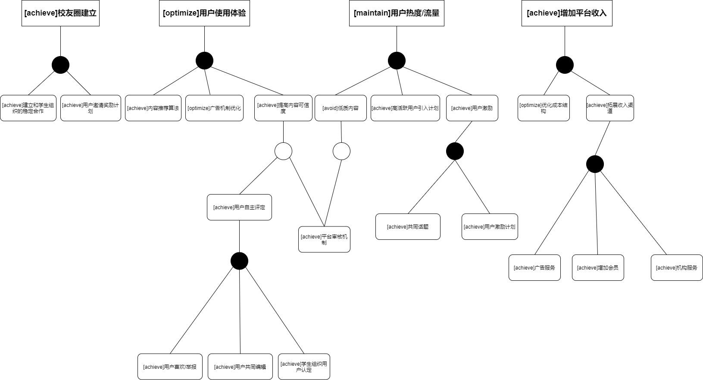
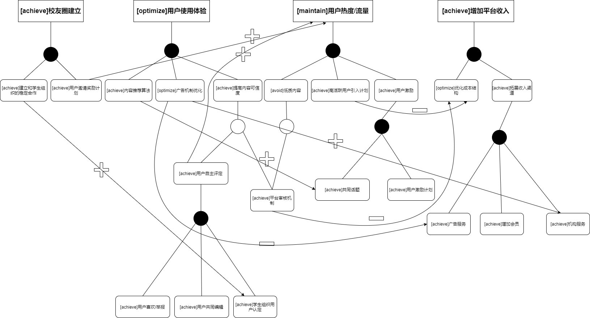
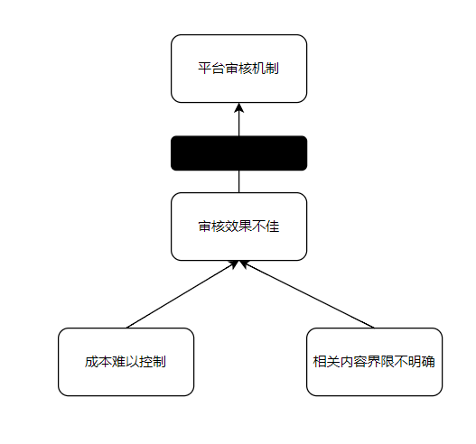
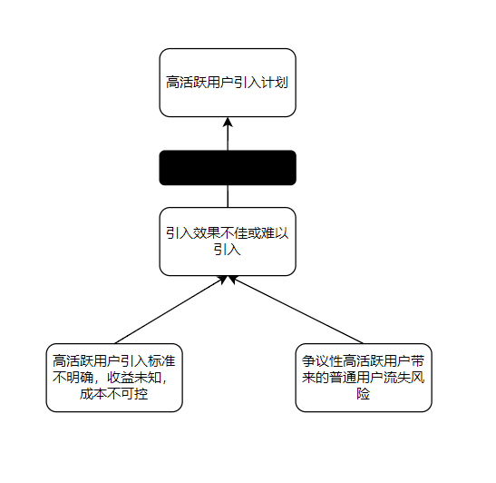
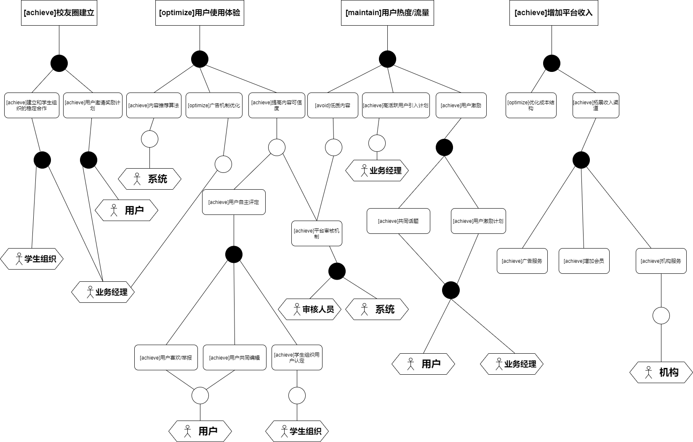
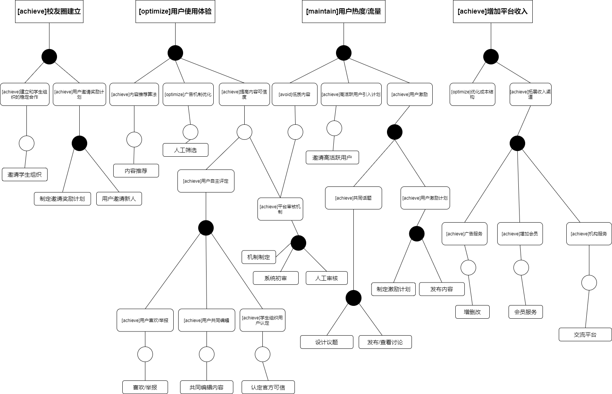
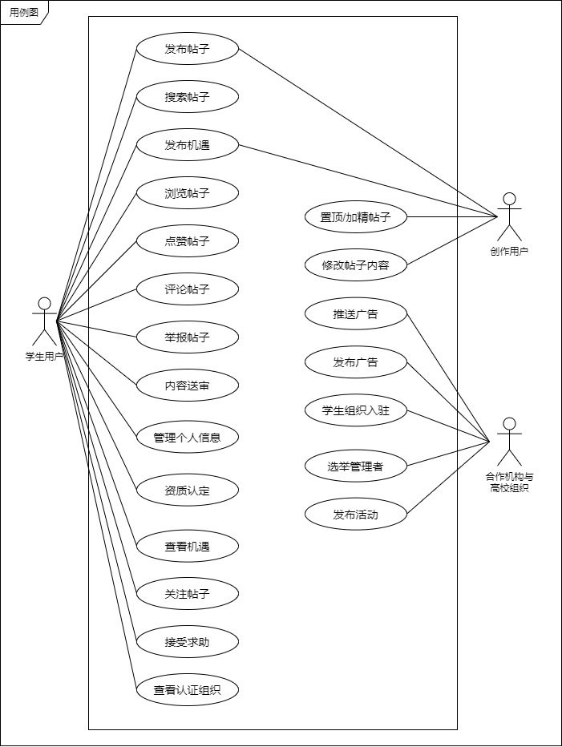

<h1 align ="center">项目需求获取</h1>

[toc]

## 1. 基本信息

### 1.1 组员信息

|    姓名    |   学号    |
| :--------: | :-------: |
| **冯亚林** | 191850036 |
| **关昕宇** | 191840077 |
| **余欣然** | 191250187 |
|  **钟山**  | 191250209 |

### 1.2 文档简介

本⽂档为我们⼩组为“校校”项目所做的需求获取结果⽂档。

⽂档主要包括五个部分，分别是需求获取安排计划书、⽬标模型分析、项⽬前景与范围、获取过程中使⽤的⾯谈报告与原型物件、基于⽤例/场景的⽤户需求⽂档。

### 1.3 度量数值

- 面谈安排与正式面谈报告：3次
  - 前景范围：1次
  - 用户需求获取：2次
- 覆盖的商业模式要素：37%
  - 覆盖的商业模式设计要素约37%，画布右侧感性端重要要素完整覆盖，价值主张完整覆盖，产品最独特功能的使用场景（用户系统互动）的用例完整。
- 总用例数：20个

## 2. 需求获取安排计划书

在对甲方完整的商业模式设计评估文档充分阅读了解后，我们同甲方协商后形成了以下需求获取安排计划书，并进行了多次详细深入的面谈，形成了最终的需求获取文档。

### 项目前景与范围阶段

- 第一轮面谈
  - 预定时间：2021年12月16日下午
  - 预定地点：广州路麦当劳
  - 出席情况：甲方：诸高骅、李智强；乙方：冯亚林、关昕宇、余欣然、钟山
  - 准备情况
    - 会前小组成员对甲方的三次大作业进行了分析研究，对项目产生初步了解。
    - 针对甲方的商业画布各模块内容，共设计了共十七个问题，对甲方提供的文档中较为含糊的部分提出疑问以便后期设计。
  - 核心目标
    - 与甲方敲定本次需求开发迭代的商业模式部分
    - 确定业务需求、系统特性、交互场景、产品的涉众
    - 确定产品的高层解决方案

### 用户需求获取阶段

- 第一轮面谈（总第二轮）
  - 预定时间：2021年12月19日晚上
  - 预定地点：广州路麦当劳
  - 出席情况
    - 甲方：诸高骅、李智强、崔艺馨、丁云翔
    - 乙方：冯亚林、关昕宇、余欣然、钟山
  - 准备情况
    - 根据第一次面谈中甲方的反馈，明确了甲方项目的核心业务需求和涉众群体等关键内容，完成前景范围文档。
    - 设计开放式问题，以便进一步确定软件的具体核心功能，明确下一步需要完成哪些工作。
  - 核心目标
    - 通过开放性问题进一步确定软件核心功能
    - 明确任务与任务中的主要问题
- 第二轮面谈（总第三轮）
  - 预定时间：2021年12月22日下午
  - 预定地点：广州路麦当劳
  - 出席情况
    - 甲方：诸高骅、李智强
    - 乙方：冯亚林、关昕宇、余欣然、钟山
  - 准备情况
    - 根据第二次面谈甲方的反馈，完善目标分析，初步完成用户需求文档，明确了软件的模块及各模块的功能。
    - 根据落实设计方案过程中产生的具体细节问题，整合成若干封闭型问题，以明确最终的解决方案。
  - 核心目标
    - 通过封闭性问题明确任务细节，澄清困难内容
    - 确认最终的解决方案

## 3. 目标模型分析

### 3.1 目标获取

通过面谈的需求获取方式，我们与甲方深入沟通交流，确定了以下的抽象目标：

- 系统上线后，通过校友圈为学生用户提供发帖交流平台以及更加便捷的信息检索功能，构建用户生态。
- 系统上线后，通过机遇圈为学生用户提供实习机会、考研保研经验等专业内容，增加用户信任度和用户粘性。
- 系统上线后，通过机遇圈为机构用户提供广告宣传平台，通过为小机构提供定制服务获得收入。
- 平台运营前期，通过与南京本地高校的学生组织合作构建宣传渠道，提升平台热度，扩大用户影响力，后期推广至全国。

通过以上的抽象目标，我们总结归纳了以下的业务需求/最高层目标：

#### 3.1.1    [achieve]核心功能（校友圈）建立

* 本项目核心（最具创新点和核心竞争力）的模块即为“校友圈”。在面谈中甲方也提到在项目初期应“以深度为主”，全力打造校友圈。
* 为达成建立校友圈的目的，需要建立吸引用户的渠道通路，而这又涉及到投放广告成本、与高校相关组织合作等问题，此外丰富的内容、优质的体验也必不可少。

#### 3.1.2	[maintain]用户热度/流量

* 由于本软件基于”交流社区“，维持用户群体尤其是学生用户在平台的活跃度至关重要，这直接影响到平台能够保持的用户数量、能够通过广告带来的潜在收益以及平台的影响力。
* 维持用户流量分为短期和长期两方面。短期流量需要优质内容、开放平台、激励计划以吸引用户；长期流量（不只是寒暑假）需要增加新的“日常性板块”例如生活分享等，提升软件在用户生活中的“存在感”。

#### 3.1.3	[optimize]用户使用体验

* 面谈中甲方提到产品的主要竞争优势在于功能众多且集成度高、搜索功能和推荐算法强大、商业软件保证投入和专业性，三者最终的目标都是打造极致的用户体验。
* 因此，本产品需要在功能多样性、提高算法效率、提升开发收入等角度着力，以达到优化用户使用体验的目标。

#### 3.1.4	[achieve]增加平台收入

* 稳定的收入来源是一切商业活动的生命线。在前期必须投入巨大的研发和宣传成本的情况下，如何在平台上线后通过我们提供的服务获得收入是亟待解决的问题。
* 价值主张中“一站式服务”具有巨大的附加值，此外各机构在平台投放宣传广告等方式也可以为平台带来持续的收入。

### 3.2 目标精化

#### 3.2.1  [achieve]核心功能（校友圈）建立

##### 3.2.1.1 [maintain]建立和学生组织的稳定合作

在项目初期和中期，可能和高校的合作相对困难，而为了尽快建立校友圈，可以引入更容易达成稳定合作关系的学生组织，发布活动信息、校园知识等。

##### 3.2.1.2 [achieve]用户邀请奖励计划

在校友圈建立初期，用户量相对较低，可以通过用户邀请奖励计划，促进用户间的内部推荐，增大现有用户黏性，扩大新用户量。

#### 3.2.2	[maintain]用户热度/流量

##### 3.2.2.1 [achieve]高活跃用户引入计划

在用户热度不高时，可以引入在现有平台上已经有一定热度的校园用户，如b站校园区up主等，并给予相应认证，以扩大平台流量。

##### 3.2.2.2 [achieve]用户激励

###### 3.2.2.2.1 [achieve]用户激励计划

通过专门的审核人员和完善的审核机制，对用户发布的动态信息的质量和数量进行综合评定，给予评定为优秀的用户相应的特权奖励。

###### 3.2.2.2.2 [achieve]共同话题

因为是以校友圈为背景依托，平台可以定期发布相关的问题倡议用户讨论，比如探讨为什么读研等，参与的用户均可以根据内容质量得到相应的奖励。

##### 3.2.2.3 [avoid]低质内容

###### 3.2.2.3.1 [achieve]平台审核机制

通过专门的审核人员和完善的审核机制，对质量较低或包含不良内容的发布进行暂时回撤，并提示原发布用户进行整改。

#### 3.2.3	[optimize]用户使用体验

##### 3.2.3.1 [achieve]提高内容可信度

###### 3.2.3.1.1 [achieve]平台审核机制

通过专门的审核人员和完善的审核机制，对一定数量或级别用户举报为不实内容的发布进行暂时回撤，并提示原发布用户进行整改。

###### 3.2.3.1.2 [achieve]用户自主评定

- [achieve]用户喜欢/举报

  用户可以对相关内容表示喜欢或举报。

- [achieve]资格用户共同编辑

  拥有一定资格的用户可以对相关不实信息进行编辑修改。

- [achieve]学生组织用户认证

  官方认证入驻的学生组织等用户可以对相关内容进行认证，提高可信度。

##### 3.2.3.2 [optimize]广告机制优化

平台可以适当减少一些低收益广告，同时可以将大部分广告放置在特定的板块内，提高用户体验。

##### 3.2.3.3 [optimize] 内容推荐算法

平台根据用户的日常观看内容习惯，为用户推荐其重点关注的内容，并不断优化推荐。

#### 3.2.4	[achieve]增加平台收入

##### 3.2.4.1 [optimize]优化成本结构

适当去除初期相对低收益率的宣发渠道，通过达成互利双赢的模式去尽量扩大。

##### 3.2.4.2 [achieve]拓展收入渠道

###### 3.2.4.2.1 [achieve]广告服务

通过在平台投放如出国机构、考公培训等高收益率的广告，收取广告费。

###### 3.2.4.2.2 [achieve]会员服务

通过将一站式服务会员化，进一步扩大平台收益。

###### 3.2.4.2.3 [achieve]机构服务

平台为机构和意向学生创造了交流的契机，能够从中获取相应的收入。

### 3.3 目标冲突与协作

#### 3.3.1 目标协作

1. 用户邀请奖励计划——维持用户热度

   通过激励老用户对新用户进行邀请，增加用户数量，同时提高用户黏性，足够数量的用户是维持热度的基础。

2. 用户自主评定——维持用户热度

   用户能够自主对看到的内容进行评定，有利于增加其参与感，进而得以维持活跃。

3. 机构服务——广告机制优化

   通过和部分能够带来高回报率的机构合作，舍去较低收益的合作，有利于我们更好地完成广告机制的优化。

4. 和学生组织建立稳定的合作——学生组织认证

   通过和学生组织建立稳定的合作，有利于通过学生组织对用户发布的内容进行官方认证，提高内容可信度。

5. 内容推荐算法——共同话题

   内容推荐算法可以对大部分用户的关注内容有所统计，有利于共同话题板块中设计相应的议题，以促使更多用户关注发布相关内容。

#### 3.3.2 目标冲突

1. 平台审核机制——优化成本结构

   平台审核会增加人力成本，相当于增加了新的成本项，与优化成本结构相矛盾。

2. 高活跃用户引入计划——优化成本结构

   高活跃用户的引入势必需要投入相应的成本，相当于增加了新的成本项，与优化成本结构相矛盾。

3. 广告服务——广告机制优化

   广告服务需要尽可能多投放广告，让更多的用户看到广告，与广告机制优化相矛盾。

### 3.4 目标阻碍

#### 3.4.1 平台审核机制

平台审核效果不佳或效率较低。

1. 审核成本难以控制。
2. 不良内容或低质内容的界限不明确。

#### 3.4.2 高活跃用户引入计划

高活跃用户难以引入或引入效果不佳。

1. 高活跃用户的判定界限不明确，在引入前未知收益效果，相关成本投入很难明确。
2. 高活跃用户大多自带争议性，可能引发平台用户对立流失等负向问题。

### 3.5 目标实现

#### 3.5.1 为目标分配主体

- 同学生组织建立稳定的关系主要由产品的业务经理和相关学生组织共同完成。
- 用户邀请奖励计划主要由用户通过邀请新用户完成。
- 引入高活跃用户主要由产品的业务经理和相关高活跃用户共同完成。
- 用户激励计划主要包含两个部分，分别是产品的业务经理制定用户激励计划以及用户发布内容获得激励。
- 共同话题同用户激励计划类似，也是由产品的业务经理制定激励计划和发布议题，用户发布内容获得激励。
- 平台审核机制分为两个部分，分别是由系统自动完成的初步简单筛查，以及由专业审核人员进行的二次人工筛查。
- 用户喜欢/举报、资深用户共同编辑进行认证都应该由用户完成，学生组织用户认证主要由学生组织完成。
- 广告优化机制应该由产品的业务经理完成，根据相应的收入和用户反馈对收益率进行考量。
- 推荐算法应该由系统完成，并不断进行优化。
- 机构服务主要由相关机构完成，基于我们提供的平台和用户进行交流。

#### 3.5.2 为目标分配任务

- （用户激励计划、共同话题、用户邀请奖励计划）系统需要提供制定激励计划的功能。
- （建立和学生组织的稳定合作、高活跃用户引入计划）系统需要提供用户注册为学生组织或注册后认证为学生组织/活跃用户的功能。
- （推荐算法）系统需要提供自动推荐用户感兴趣内容的功能。
- （平台审核机制）系统需要提供机器初步筛查以及人工审核的功能。
- （用户喜欢、举报、共同编辑、认证）系统需要提供检索内容、喜欢/举报、共同编辑内容以及给内容认证官方的功能。
- （机构服务）系统需要提供用户和机构连接的交流平台功能。
- （会员）系统需要提供会员相关的基本服务并支持相应的权限机制。

## 4. 项目前景与范围

### 4.1 本次需求开发迭代的商业模式部分

本次项目前景与范围任务严格遵循作业要求，只分析了校校项目中的校友圈功能及其完整的用户系统互动，这部分功能是该软件中最独特的功能。

总体覆盖比例：约37% 。

- 价值主张：覆盖校友圈、信息共享、生活分享、经验交流、消息发布，无未覆盖。
- 关键业务：覆盖校友圈、广告，未覆盖高校圈、机遇圈。
- 客户细分：覆盖学生用户，未覆盖公众号用户、毕业生用户、合作用户、机构用户。
- 渠道通路：覆盖自有渠道，未覆盖合作方渠道。
- 客户关系：覆盖自助服务和与客户协作，未覆盖社区、自动化服务、专属私人服务。
- 收入来源：无覆盖，未覆盖广告收费、信息收费、会员收费。
- 成本结构：无覆盖 ，未覆盖服务器成本、推广成本、人力场地成本。
- 核心资源：覆盖推荐算法，未覆盖云服务器、优秀团队、开放论坛。
- 重要合作：覆盖教育企业、高校学生组织，未覆盖云服务器、各大主流论坛。

### 4.2 业务需求

#### 4.2.1 项目背景

​	大学校园中信息获取缺少集成而统一的平台。
​	大学生有着生活分享、经验交流、信息发布与获取、信息共享等方面的需求，以往大家都在QQ或者微信上实现，但由于信息过多，会出现信息源分散、缺少集成知识库的问题；以往在发布消息时，通常通过群公告或空间说说的方式，这导致个人用户大部分情况只能在自己的朋友圈中发布消息，难以大面积扩散信息；由于缺少数据仓库，在QQ空间或微信朋友圈发布的消息无法通过搜索引擎快速查找，在群里的消息也需要通过查看上下回复得知结果，这样费时费力，效果不好；而且在个人的交流圈会出现明显的“茧房”现象，例如大一学生的交流圈通常大部分都是大一学生，他们很难和高年级或已毕业同学进行信息交流。

#### 4.2.2 业务机遇

​	作为集成了表白墙、小助手、权服侠、小百合、招生号等多个功能的校内统一信息平台，用户可以软件替代原来的跨越多个app关注多个渠道，这种一站式的服务为用户提供良好的信息交流校友圈；校友圈最强调的就是信息共享部分：信息差是大学生的最大敌人之一，本软件能在打破现有的跨平台背景下学生群体关注的信息杂乱导致的信息壁垒，消除不同细分学生群体间的信息差，同时对于不同细分群体又能提供特定的圈子，从而大大提高信息交流的效率，本软件不仅为所有人提供一个透明好用的信息交流平台，还由此构建相应的数据仓库和知识系统，能快速搜索想要的内容；当今的大学生个性越来越凸显，很多人希望拥有被看见的权利，所以校友圈的生活分享部分就非常适合，通过形成一个“校园朋友圈”，让用户愿意刷，乐于评论，并积极分享，如同刷朋友圈，刷表白墙，刷脉脉一样成为日常生活交流的重要平台，同时认识更多的校内同学；经验交流模块提供了丰富的信息交流途径：例如对于高三毕业生，他们可以通过和目标大学相关专业的学长学姐直接交流，获得无法公开但真实确切的就读信息，这是不能通过其他软件轻易获取的，其他还包括保研、考研、出国、组队、实习、社团、学生工作、奖学金等等方面的信息交流。

#### 4.2.3 业务目标

| 业务目标ID | BO-01                               |
| ---------- | ----------------------------------- |
| 内容       | 扩大系统内用户数量                  |
| 度量标准   | 项目上线一年后，已认证的用户数      |
| 计量方法   | 系统后台⾃动统计                    |
| 理想标准   | 项目上线一年后，认证用户数超过100万 |
| 最低标准   | 项目上线一年后，认证用户数超过10万  |

| 业务目标ID | BO-02                               |
| ---------- | ----------------------------------- |
| 内容       | 提高平台收入                        |
| 度量标准   | 项目上线一年后，平台收入达到        |
| 计量方法   | 系统后台⾃动统计                    |
| 理想标准   | 项目上线半年后，平台净收入超过100万 |
| 最低标准   | 项目上线半年后，平台净收入超过10万  |

| 业务目标ID | BO-03                                |
| ---------- | ------------------------------------ |
| 内容       | 提升用户粘性                         |
| 度量标准   | 项目上线一年后，⽤⼾发帖、回帖的频率 |
| 计量方法   | 系统后台⾃动统计                     |
| 理想标准   | ⽤⼾发帖、回帖的频率超过2次/天       |
| 最低标准   | ⽤⼾发帖、回帖的频率为1次/天         |

| 业务目标ID | BO-04                                                  |
| ---------- | ------------------------------------------------------ |
| 内容       | 建立核心校友圈                                         |
| 度量标准   | 项目上线一年后，校友圈功能与规模                       |
| 计量方法   | 系统统计，专家评估                                     |
| 理想标准   | 项目上线一年后，校友圈重要功能超过10个，专家评估规模大 |
| 最低标准   | 项目上线一年后，校友圈重要功能超过5个，专家评估规模中  |

#### 4.2.4 业务风险

| 风险ID | 风险描述               | 可能性 | 影响 |
| ------ | ---------------------- | ------ | ---- |
| RI-01  | 使⽤平台的⽤⼾太少     | 0.5    | 8    |
| RI-02  | 平台覆盖地区太少       | 0.3    | 6    |
| RI-03  | 愿意合作的学生组织太少 | 0.5    | 7    |
| RI-04  | 用户粘性较低           | 0.3    | 8    |
| RI-05  | 信息质量低下           | 0.5    | 6    |

### 4.3 系统特性

#### 4.3.1 具体系统特性

SF1： 系统提供创作者、公众号用户发布帖子的服务

SF2： 系统提供用户评论、点赞、转发帖子的服务

SF3： 系统提供帖子置顶、加精的功能

SF4： 系统提供根据用户画像推荐信息的服务

SF5： 系统提供根据搜索功能

SF6： 系统提供用于机构用户发布广告的功能

SF7： 系统提供用户发布求助信息的功能

SF8： 系统提供用户承接求助任务的功能

SF9： 系统提供用户登录、注册、认证的服务

SF10： 系统提供学生组织入驻的服务

SF11： 系统提供选举学校管理员的功能

#### 4.3.2 系统特性依据

##### 4.3.2.1 解决方案

⾸先，我们经过⼩组讨论和与客户⾯谈，对每个明确的问题都确定了⼀致的解决⽅案：

| 要素         | 内容                                                         |
| ------------ | ------------------------------------------------------------ |
| ID           | P1                                                           |
| 解决方案描述 | 系统为创作者、公众号用户提供发帖的功能，帖子的内容是可修改的，发布帖子时可以给帖子打标签；系统为学生用户建立用户画像，根据推荐系统为用户做内容推荐；系统提供用户评论、点赞、转发帖子的共功能。 |
| 业务优势     | 这部分功能为软件核心功能中校友圈的最核心功能，即信息共享。简而言之就是集成了原来的表白墙、小助手、权服侠、招生号等多个功能，在这里用户可以享受一站式的信息服务，不要再多个APP关注多个渠道；这部分功能最核心的目的就是进一步解放信息、降低信息差，增强同校内部的信息交流，甚至打破不同学校的交流屏障。该模块强调圈子、可以为不同细分群体的用户提交交流的效率。所有发布的帖子都会被存入系统的数据仓库，并构建相应的知识系统，让用户能快速查找他们想要的内容。系统会根据用户的浏览情况为他们绘制用户画像，并根据用户画像为他们做内容过滤和推荐。 |
| 代价         | 需要维持数据仓库存储海量数据；需要根据推荐系统绘制用户画像并推荐；需要系统搜索功能；需要与高校组织、机构等合作提供有价值的信息资源。 |

| 要素         | 内容                                                         |
| ------------ | ------------------------------------------------------------ |
| ID           | P2                                                           |
| 解决方案描述 | 系统提供用户登录、注册、认证的服务；系统提供学生组织入驻的服务；系统提供选举学校管理员的功能 |
| 业务优势     | 为了根据用户的学校为其定制不同的服务，系统可以根据学生用户的校园卡信息进行校园身份认证，这样做还方便机构用户为其定制化发布推广和广告。不仅如此，此功能会形成校园圈子，用户可以发表自己的校园见闻和心情，铸成一个“校园朋友圈”。旨在于让用户乐于评论并积极分享，如同刷朋友圈，刷表白墙，刷脉脉一样，方便日常生活交流，同时认识更多的校内同学；系统提供学生组织入驻服务，让官方号也能在校园圈里发布信息，进一步解放信息；学校校园圈中需要管理员，在人数较少时管理员由员工指定，后期可以举行选举，让已经认证的同学做管理员。 |
| 代价         | 需要与高校组织、机构等合作，共同创造质量高的信息资源。       |

| 要素         | 内容                                                         |
| ------------ | ------------------------------------------------------------ |
| ID           | P3                                                           |
| 解决方案描述 | 系统提供用于机构用户发布广告的功能                           |
| 业务优势     | 系统会根据用户画像进行个性化广告推荐，通过合理的算法在增加广告收益的同时尽量保持用户粘性，提高电子商务活动的简便性和有效性，同时也提高了服务水平 |
| 代价         | 需要用户画像和推荐系统做支撑；需要与相关的高质量机构合作     |

| 要素         | 内容                                                         |
| ------------ | ------------------------------------------------------------ |
| ID           | P4                                                           |
| 解决方案描述 | 系统提供用户发布求助信息的功能；系统提供用户承接求助任务的功能 |
| 业务优势     | 系统在校园圈中提供跑腿求助模块，主要是发布求助信息和接受求助任务两个功能，能方便同校学生。对于发布求助信息者，他们或是因为缺少时间或是因为缺少精力，所以可以寻求同校学生中合适的帮助自己；对于接受任务者，他们可以利用自己时间和精力赚取相应的赏金和奖励。 |
| 代价         | 系统需要存储相应的数据；系统需要处理相应的关系，承担可能出现的风险问题 |

##### 4.3.2.2 确定系统特性

在选定解决⽅案之后，我们进⼀步明确了该解决⽅案需要具备的功能特征，即系统特性：

| 系统特性编号 | 针对的问题 | 解决方案需要具备的系统特征               |
| ------------ | ---------- | ---------------------------------------- |
| SF1          | P1         | 系统提供创作者、公众号用户发布帖子的服务 |
| SF2          | P1         | 系统提供用户评论、点赞、转发帖子的服务   |
| SF3          | P1         | 系统提供帖子置顶、加精的功能             |
| SF4          | P1         | 系统提供根据用户画像推荐信息的服务       |
| SF5          | P1         | 系统提供根据搜索功能                     |
| SF6          | P3         | 系统提供用于机构用户发布广告的功能       |
| SF7          | P4         | 系统提供用户发布求助信息的功能           |
| SF8          | P4         | 系统提供用户承接求助任务的功能           |
| SF9          | P2         | 系统提供用户登录、注册、认证的服务       |
| SF10         | P2         | 系统提供学生组织入驻的服务               |
| SF11         | P2         | 系统提供选举学校管理员的功能             |

#### 4.3.3 系统用例图

针对校园圈功能的用例图

### 4.4 假设、依赖与限制

#### 4.4.1 假设

| 假设项 | 内容                                                         |
| ------ | ------------------------------------------------------------ |
| AS-1   | 学生用户和创作用户具有较高活跃度，积极参与内容创作、管理员选举、建议反馈等等活动。 |
| AS-2   | 学生用户和创作用户在享受到满意的服务后，会产生付费意愿。     |
| AS-3   | 有创作用户能创作出充满吸引力的精品帖子。                     |
| AS-4   | 合作机构的推广能有效地传达给学生用户。                       |
| AS-5   | 用户处于随时可以接入互联网的网络环境下。                     |
| AS-6   | 用户具有熟练使用移动端设备的能力。                           |

#### 4.4.2 依赖

| 依赖项 | 内容                                                 |
| ------ | ---------------------------------------------------- |
| DE-1   | 系统的学生身份认证依赖于学生邮箱或学生卡等身份证明。 |
| DE-2   | 系统的功能实现有赖于与学校、学校学生组织进行合作。   |
| DE-3   | 系统的服务器依赖于第三方云服务提供商。               |
| DE-4   | 系统需要提供第三方支付平台的接口。                   |
| DE-5   | 要求用户、机构参与选举学校管理员。                   |

#### 4.4.3 限制

| 限制项 | 内容                                                         |
| ------ | ------------------------------------------------------------ |
| LT-1   | 系统主要服务国内高校市场，国外不做考虑。                     |
| LT-2   | 系统的合作机构只限于经备案的、所有教师有教师资格认证的机构。 |
| LT-3   | 系统维护期间可能暂停部分服务。                               |
| LT-4   | 校友圈功能中的关键信息发布必须经过审核。                     |
| LT-5   | 系统支付只接受人民币作为支付货币。                           |
| LT-6   | 系统暂时只提供移动端App的使用方式，暂时不提供web服务。       |

### 4.5 系统的场景交互环境

**用户地理集中情况：**用户在地理位置上具有明显的分散的特点

**各类用户使用系统的时间状况：**

| 用户类别 | 使用时段状况                               |
| -------- | ------------------------------------------ |
| 学生用户 | 全天任何时间、任何时段都可能使用。         |
| 创作用户 | 主要在工作时间使用，可能在非工作时间使用。 |
| 合作机构 | 在工作时间使用。                           |

**数据生成与使用情况：**

| 数据种类     | 生成出处           | 使用情况                                                     |
| ------------ | ------------------ | ------------------------------------------------------------ |
| 用户资料     | 用户自行填写和认证 | 用户自行填写，为不同类型的用户提供不同服务，同时对于合作机构和创作用户而言， |
| 创作内容     | 创作用户的作品     | 创作用户发布内容，吸引学生用户阅读，优质内容可能被选为精品内容，为创作者自身带来收益。 |
| 机构推广广告 | 合作机构           | 入驻平台的合作机构发布的推广内容，可能包括文字、图片、视频等形式，用于宣传机构和吸引学生用户。 |
| 求助信息     | 学生用户           | 学生用户发布自己的求助贴，可以通知其他学生用户或者专业的创作用户进行回答。 |
| 评论信息     | 学生用户           | 学生用户对其他用户发布的帖子进行评论。                       |
| 反馈信息     | 所有用户           | 用户对系统的现存功能或不足之处进行反馈。                     |

**访问数据的最大响应时间：**3s

**是否需要提供数据保护：**强烈需要

**是否需要提供安全控制、权限控制和用户身份验证：**强烈需要

### 4.6 涉众分析

#### 4.6.1 涉众识别

总体而言，该系统的涉众有：在校生用户、VIP用户、机构用户、创作用户、管理员。

#### 4.6.2 涉众描述

| 涉众     | 主要目标                                                     | 态度                                                   | 主要关注点                                                   | 约束条件                                                     |
| -------- | ------------------------------------------------------------ | ------------------------------------------------------ | ------------------------------------------------------------ | ------------------------------------------------------------ |
| 学生用户 | 在校学生用户对校园信息有强烈需求，他们想与校园信息集成平台快捷、方便、全面地交互，获取校园内各种信息，发布求助信息；同时，他们也希望了解其他感兴趣高校的校园生活或者招生信息；最后，他们也希望获得留学、培训、实习、招聘等更多的渠道。 | 支持                                                   | 软件使用体验、能不能获取想要的信息和服务                     | 要提供部分个人资料进行学生身份验证。每个学生用户有一定账号分，若因发表不当内容被举报，账号分会逐渐扣除。 |
| VIP用户  | VIP用户对校园信息和渠道有更强烈的需求。他们急切的想要知道关注高校的关键信息，或者是对留学、培训、实习、招聘等渠道的有效性、便利性等有更高的要求。 | 强烈支持，但是需要平台能提供更加优质和更加独特的服务。 | 软件使用体验、会员价值、软件能不能提供定制或更加高级的服务。 | VIP用户要提供更多的个人资料，以便于平台提供更加定制化、专属化的会员服务。 |
| 机构用户 | 许多机构对如何广泛接触大学生、有效展示产品、推销产品有强烈需求。经过资质认证的机构，经平台提供一个低成本的渠道给学生，实现共赢。机构可以获得和利用平台提供的流量，更好地进行宣传。 | 比较支持，但是需要平台有效推广和分发机构的宣传广告。   | 平台流量、平台广告和推广的分发效率                           | 机构用户必须经过教育部认证，老师必须拥有教师资格证。         |
| 创作用户 | 创作用户对高流量平台天然有亲和性，他们对如果吸引流量和有效变现需求强烈。他们希望在平台上发布内容，吸引流量，培养自己的粉丝，并且通过流量变现，获得收益。 | 比较支持，但是需要平台保障创作者内容的权益问题。       | 平台流量、平台分发精品内容的效率、平台上创作内容变现的能力   | 如创作用户发布违规内容，会扣除账号信用分，信用分低于阈值后禁言，如果多次被举报直接封禁。 |
| 管理员   | 管理员不仅需要管理系统拥有的所有资源和各种数据，还需要定时检查系统是否有明显缺陷、各类bug和故障，同时也要对用户反馈做出处理，及时对违规帖子、违规内容和相关用户做出处罚。 | 强烈支持                                               | 系统正常运行、系统故障与缺陷、用户反馈处理、违规内容处罚     | 管理员需要经过一定时间的培训。                               |

#### 4.6.3 涉众评估

##### 4.6.3.1 优先级评估

| 用户群体 | 任务                                                         | 群体数量                     | 优先级 |
| -------- | ------------------------------------------------------------ | ---------------------------- | ------ |
| 学生用户 | 使用软件获取校内校外信息，获取各种留学、培训等渠道。产品的主体用户群体。 | 至少能达到十万人以上         | 5      |
| VIP用户  | 使用软件更加定制化和专属化的服务，获得更加准确的信息推送，渠道优惠。 | 不确定，约几千至上万人       | 4      |
| 创作用户 | 通过平台获取流量，创作内容吸引粉丝，并且通过流量变现，获得收益。 | 较多，万人及以上             | 3      |
| 机构用户 | 通过平台推广自身，获取流量，与广泛的学生群体对话和推销自身。 | 不确定，约几十家到几百家     | 2      |
| 管理员   | 管理系统资源，处理系统故障，处理用户反馈，处理违规内容       | 一个团队的规模，约十人至百人 | 1      |

- 普通的学生用户是平台的使用者，群体数量最多，是支持软件发展的最根本力量。虽然相对来说，他们在软件提供的服务、内容和支持软件的正常运维等方面起到的作用较小，付费率不高，但他们是根本，没有根本的核心用户群体，就吸引不到优质的创作用户和机构用户。他们的优先级应该最高。
- 目标软件系统在收入来源上不够稳定多样，而VIP用户是软件平台的主要收益来源之一，同时他们也是我们的服务对象，因此他的优先级应当仅次于学生用户。
- 创作用户可能创作出精品内容，为软件平台吸引大量流量，是软件功能得以实现的重要一环，优先级第三。
- 机构用户虽然可能为我们带来推广收益，但吸引机构用户不是我们做软件产品的目的，我们最重要的是提供给目标学生群体以有意义的服务，培养自己的核心用户，而不是一味寻求各种合作和获取收益，本末倒置，所以他们优先级第四。
- 管理员对软件系统的正常运维和发展十分重要，他们必须专业可靠，有能力为所有用户提供优质的服务，但相对于支持软件发展的根本力量的学生客户、收益主要来源的VIP用户、也能带来流量和收益的创作用户和机构用户，管理员的收益并不明显，甚至可能还需要平台付出一定成本，同时管理员的数量也是所有群体中最小的，因而优先级最低。

##### 4.6.3.2 风险评估

- 因为机构、创作用户、学生用户是粒度较大的群体，所以在风险评估图里衡量这三类群体时，加入了限定词，以缩小粒度、精确特征。
- 软件的强支持者包括了VIP用户、系统管理员和与软件合作成功的机构，管理员支持着软件系统的运维和发展；与系统合作成功的机构资金充足、合作意愿高，也支持着软件；VIP用户群体也是系统的主要支持者。
- 软件的弱支持者包括两类用户。有收获的创作用户指在软件提供的平台上收获流量和变现较理想的用户；获得满意服务的学生用户对软件系统发展会有较大的支持。但比起专业的机构、VIP用户来说，他们给系统的支持力度会小一些。
- 软件的强反对者主要是合作失败的机构。软件为机构分发广告、推广宣传，但效果可能并不总是百分百理想，对于没有达成理想效果的机构，他们甚至可能会寻求与我们平台的竞争对手进行合作。
- 软件的弱反对者可能包括收获较小或被侵权的创作用户、未满足使用需求的学生用户。前者可能因自己创作的内容不能带来足够的收益，或者自己的内容被违规转载而平台未能及时处理，而对平台失望，从而放弃平台。后者可能是使用过程中没有找到理想的功能，而放弃使用软件。

##### 4.6.3.3 共赢分析

五类关键涉众所参与的共赢行为和彼此交互如上所示。

- 除管理员外都可以申请用户身份认证、向系统反馈，管理员可以认证用户身份、参考用户反馈修改系统。管理员可以发布内容创作激励计划，鼓励创作用户创作精品内容；可以与机构用户共享渠道收益；可以为VIP用户提供定制服务。
- 创作用户可以创作出优质内容，获得激励计划收益，并且让优质内容借由平台分发，供学生用户和VIP用户阅读。
- 学生用户可以浏览创作用户的作品，也可以获得机构用户发布的推广内容。
- VIP用户同样可以获得创作用户的创作内容和机构用户的推广内容，但同时系统会以高效的分发机制为VIP分发。如果VIP用户使用机构用户的服务，可以提供一定折扣。VIP用户也可以获得平台管理员的更加定制化的服务。
- 机构用户可以发布推广内容，经平台分发给学生用户和VIP用户，也可以与系统共享渠道收益。

#### 4.6.4 涉众代表选择

5类涉众：学生用户、VIP用户、平台管理员、机构用户和创作用户。

- 学生用户、VIP用户和创作用户这 3 类涉众群体的人数较多，我们需要进行采样的方法， 在每个涉众群体中分别选择一部分较少的人，尽量可以准确代表群体中的所有人。我们要保证完整采样，即这三种涉众群体都有自己的代表；涉众群体的代表应保持积极的态度向我们提供需求；每个涉众群体代表的数量适中，约为 5-10 个，要保证体现出整个涉众群体的共同看法同时也要保证效率；涉众代表中也要有明显的个人特征，比如选择不同高校，不同年级，不同专业的学生用户；不同创作类型的创作用户；不同付费习惯的VIP用户。

- 在机构用户和平台管理员这2个群体中，群体人数比较少，应考虑让这个涉众群体的大多数人都参与到需求的开发中来，比如以10%-20%的比例，选为本类别的代表。

#### 4.6.5 涉众参与策略制定

学生用户、创作用户和VIP用户是平台的主要使用者，其中学生用户和VIP用户需要平台以良好的推荐分发方式提供精品内容，创作用户需要平台将作品高效地传播出去。

平台管理员作为平台的主要运维者，需要保障平台的正常运行和使用。他们在计算机方面的知识丰富，需要参与系统的实现设计中来。而学生用户和创作用户的计算机方面知识良莠不齐，只需要在实现后进行试用评估即可。

机构用户和VIP用户是软件获取收益的最重要来源，需要在软件开发和运维的过程中，鼓励他们提出有效建议和反馈。

还有以下几点：

- 如条件允许，可以选择将所有涉众代表进行分组，然后以组为单位参与软件开发的规划与评估。

- 平台管理人员需要参与软件运维的全流程。

- 如果用户建议或反馈有冲突时，不同用户的反馈意见的权重不同，机构用户、VIP用户、高流量的创作用户和学生用户，一般按这样的顺序权重递减。

### 4.7 参考资料

[1] 需求工程：软件建模与分析，骆斌、丁二玉，高等教育出版社，2009-04-01，ISBN：9787040262957

## 5. ⾯谈报告与原型物件

### 5.1 前言

#### 5.1.1 引言

⾯对⾯访谈是⼀种最具丰富内容的交流⽅法，同时也是实践中应⽤为⼴泛的需求获取⽅法之⼀。通过⾯谈可以获得很多信息内容，包括了事实与问题，被会⻅者的感受，组织与个⼈的⽬标等等。

#### 5.1.2 目的

本⽂档旨在通过⾯对⾯会⻅，获取构建“校校”所需的各类信息，从⽽可以细化解决⽅案中遇到的⼀些问题，在存在问题的⽅⾯与⽤户之间达成共识，确定该项⽬的解决⽅案。

#### 5.1.3 阅读说明

本⽂档主要是需求⼯程活动中的整个⾯谈过程为主要内容。通过叙述⾯谈过程中的⾯谈计划，⾯谈过程，⾯谈报告以及参考内容。其中内容主要以笔录和电⼦⽂档等⽅式进⾏⾯谈过程的记录⼯作。

#### 5.1.4 参考说明

[1] 需求工程：软件建模与分析，骆斌、丁二玉，高等教育出版社，2009-04-01，ISBN：9787040262957

### 5.2 面谈计划阶段

#### 5.2.1 产生背景

​	大学校园中信息获取缺少集成而统一的平台。原本，大学生在生活分享、经验交流、信息发布与获取、信息共享等方面的需求，是在QQ或者微信上实现，但经常出现信息过多、信息源分散、缺少集成知识库的问题；并且以往在发布消息时，是在群公告或空间说说上，这导致个人用户大部分情况只能在自己的朋友圈中发布消息，难以大面积扩散信息；由于缺少数据仓库，在QQ空间或微信朋友圈发布的消息无法通过搜索引擎快速查找，在群里的消息也需要通过查看上下回复得知结果，这样费时费力，效果不好；而且在个人的交流圈会出现明显的“茧房”现象，例如大一学生的交流圈通常大部分都是大一学生，他们很难和高年级或已毕业同学进行信息交流。

#### 5.2.2 面谈目的

1. 对项目前景和范围进行确认

2. 明确业务需求
3. 对目标分析产生的业务目标进行确认
4. 明确具体业务细节
5. 明确用户操作偏好
6. 分析过程中积累的问题，解决前期需求开发过程中的疑惑及问题

#### 5.2.3 面谈对象

甲方客户：“校校”团队

#### 5.2.4 面谈类型和面谈结构

本次面谈类型主要采取两种类型：
1. 开放式问题（Open-Ended）
2. 封闭式问题（Closed）

### 5.3 面谈具体过程

#### 5.3.1 第一次面谈

##### 5.3.1.1 面谈具体参与人员

甲方：诸高骅、李智强

乙方：冯亚林、关昕宇、余欣然、钟山

##### 5.3.1.2 面谈时间

2021年12月16日下午

##### 5.3.1.3 面谈地点

广州路麦当劳

##### 5.3.1.4 面谈目的

1. 与甲方敲定本次需求开发迭代的商业模式部分
2. 确定业务需求、系统特性、交互场景、产品的涉众
3. 确定产品的高层解决方案

##### 5.3.1.5 面谈方式

线下面谈，组员分工完成提问和会议记录工作

#### 5.3.2 第二次面谈

##### 5.3.2.1 面谈具体参与人员

甲方：诸高骅、李智强、崔艺馨、丁云翔

乙方：冯亚林、关昕宇、余欣然、钟山

##### 5.3.2.2 面谈时间

2021年12月19日晚上

##### 5.3.2.3 面谈地点

广州路麦当劳

##### 5.3.2.4 面谈目的

1. 通过开放性问题进一步确定软件核心功能
2. 明确任务与任务中的主要问题

##### 5.3.2.5 面谈方式

线下面谈，组员分工完成提问和会议记录工作

#### 5.3.3 第三次面谈

##### 5.3.3.1 面谈具体参与人员

甲方：诸高骅、李智强

乙方：冯亚林、关昕宇、余欣然、钟山

##### 5.3.3.2 面谈时间

2021年12月22日下午

##### 5.3.3.3 面谈地点

广州路麦当劳

##### 5.3.3.4 面谈目的

1. 通过封闭性问题明确任务细节，澄清困难内容
2. 确认最终的解决方案

##### 5.3.3.5 面谈方式

线下面谈，组员分工完成提问和会议记录工作

### 5.4 面谈报告

#### 5.4.1 第一次面谈

##### 5.4.1.1 面谈内容

>1. 为何想到这个主题
>
>* 很多学校应该都存在着“**学生和学校之间没有交流反馈渠道**”的问题
>* 学生有自发形成过平台但无法长期稳定运行。
>* 希望做一个产品，让全国学校向内有个交流平台，校外有个了解的方式。
>
>2. 项目希望达到的规模
>
>* 短期：涵盖南京高校，吸引到更多的用户和流量
>* 长期：确定一定规模后，更大范围的推广（推向全国）；在吸引到用户后希望保持用户粘性和流量。
>
>3. 该项目最具竞争力的价值主张
>
>* **校友圈**
>* 集成了一个**众多功能的社交平台**，比表白墙、贴吧内容更加丰富。
>* 大家看到特定的**推荐算法**关注的东西/人。
>* 引入学生社团、公众号等**官方渠道**，让学生方便的查看活动，因为之前的内容限制在私有的流量池里，所以可以弄一个广泛的平台，提高学生组织发布活动的关注度。
>
>4. 如何实现信息共享和经验交流（是否监管）
>
>* 平台发布规则，提前做筛选，审核用户发布的内容，但矫枉不会过正。
>* 必要的管理不可或缺。适当引流有助于提高热度，对过于敏感的话题会进行限制。
>
>5. 公众号、机构、创作三类用户的分别
>
>* 公众号用户分为订阅过的公众号，受众更广，考虑用推荐算法推荐可能喜欢的内容。
>
>* 机构用户如新东方等，发布广告
>
>6. 如何通过学生组织形成推广渠道
>
>* 邀请一些**有影响力且有意愿的组织**，在高校进行实地考察调研。
>* 希望学生组织内部互相推荐，并加入认证方式，鼓励组织加入。
>
>7. 为何削减开放论坛
>
>* 现有的论坛很多，开发成本削减，运维成本不削减。
>* 将精力与资源放在更多投入初期**宣传**和高校实地**调研**，以扩大用户规模。
>
>8. “专属私人服务”指哪些
>
>* **只面对机构用户**，这部分独立于为学生提供的服务。
>* **小机构**没有办法自己提供宣发能力，平台可以给一些机构用户提供流量，帮助他做广告做推广做宣传。
>
>9. 项目前期侧重深度（专注校友圈）还是广度（多模块并行）
>
>* 先深度，校友圈需要**做深做强**，因为有很多替代软件，如果做的广可能**竞争力**不强，后续再发展其他的。
>* **如何做深**（以防止被替代）？重点打造“**信息搜集的简易程度**”，特定时间点呈现相关信息，比自己手动找渠道方便更多
>
>10. 校友圈和机遇圈的区别
>
>* 校友圈：较为**零散**，以打广告，发帖为主
>* 机遇圈：较为正式，包括实习、考研保研等等，是专门正式的平台，例如机构HR发布的正式的推广声明
>
>11. 校友圈的管理问题
>
>* 早期用户有限情况：产品方管理人员，管理发布内容。
>* 学校形成用户基础以后：内部自治管理机制，竞选等方式决定。
>* **为何不直接与高校合作**？实现难度问题，外校很难有和官方合作的渠道，最终渠道还是落实到社团、学生组织等。
>
>12. 校友圈最主要的功能
>
>* **搜索和发布**为主，关键在于**零碎信息的集成**，想专门做成一个板块和区域。
>* 其他功能如**寻求帮助**的特殊板块，悬赏等方式。
>
>13. 相较校内平台（如表白墙，南小宝等）的竞争优势
>
>* 校内的平台大多为志愿服务，而我们产品是商业软件。
>* 投入会更大，质量保证更好，会有更好的交互方式和迭代版本。
>
>14. 如何兼顾不同层次院校的需求
>
>* 不会覆盖所有学校。
>* 用户激励计划：通过用户创作激励等推广方式，让活跃度高和创作更多作品的用户取做宣传。
>* 通过经验分享等方式激励吸引新用户。
>
>15. 主流论坛合作的动机与合作方式
>
>* **动机**？竞争关系不明显，有利益就能合作
>* 微信相对闭塞，微信群只有群成员才能查看；而本平台提供的圈子相对开放，所有人都能看到，能接触到的人更多。
>* 方式？利用主流论坛来为我们的平台引流、在他们上打广告。
>
>16. 与教育机构的合作方式
>
>* 给教育机构提供一个平台，能让他提供学生资源，发展潜在的客户。
>* 提供一个机会给教育机构打广告等。
>
>17. 是否仍保留与高校直接合作的可能
>
>* 尽可能和高校合作，但在初期和中期合作较难。
>* 如何面对相对敏感的话题带来的高校压力？后期会转向生活分享等，保持平台流量和用户粘性。

##### 5.4.1.2 面谈报告

| 日期 | 2021年12月16日                                               |
| ---- | ------------------------------------------------------------ |
| 甲方 | 诸高骅、李智强                                               |
| 乙方 | 冯亚林、关昕宇、余欣然、钟山                                 |
| 目的 | 1. 与甲方敲定本次需求开发迭代的商业模式部分。 2. 确定业务需求、系统特性、交互场景、产品的涉众。 3. 确定产品的高层解决方案。 |
| 结论 | 1. 产品**核心**是“**校友圈**”，希望构建具有搜索功能的信息发布和交流平台。     **竞争优势**在于功能众多且集成度高、搜索功能和推荐算法强大、商业软件保证投入和专业性。 2. 产品**用户**（**涉众**）主要分为学生用户和机构用户两大类。**交互场景**如下：     为**学生群体**提供发帖交流的平台，整合的集成度高的信息，机遇（实习、考研）等服务     而为**机构用户**提供广告宣传平台，对于一些小机构提供”专属定制推广服务“。     ”用户激励计划“鼓励用户创作，同时在监管方面刚柔并济，维持平台良好开放生态。 3. 项目**前期注重”深度发展“**，着力于校友圈生态的建立，逐步将产品由南京推广至全国。     **主要合作伙伴**是高校学生组织，并进行市场调研，形成推广渠道。后期仍保留直接与高校合作可能性。 |

#### 5.4.2 第二次面谈

##### 5.4.2.1 面谈内容

>1. 再次明确一下项目背景
>  - 发布信息普遍通过QQ群，这样信息分散，缺少集成
>  - 发布公告普遍是群公告或者说说，但这样扩散范围有限
>  - 信息难以搜索和查找的问
>  - 交流圈固定，例如自己的好友大部分为同年级同学，难以和其他院系其他年级同学交流
>2. 校友圈中有哪些具体功能
>  - 帖子相关：用户都能发帖看贴点赞评论转发举报，看帖部分会给用户进行推荐，基于用户画像进行个性化推荐
>  - 认证相关：对用户进行学校认证，对组织也要进行认证
>  - 广告相关：和机构用户合作，让他们发布广告，对用户做个性化广告推荐
>  - 求助相关：可以在校友圈加入求助/跑腿业务，承接者可以赚取赏金
>3. 怎样创作用户发布的内容合不合理、是否违规，怎样处罚
>  - 我们有审核部门会对内容进行粗审，用户也有反馈的渠道，审核部门会仔细审核举报内容
>  - 考虑信誉分，即每个用户都会有一个信誉分，发布违规内容会降低其信誉分，信誉分降低阈值后禁言或者封号
>4. 为VIP用户提供怎样的服务？谁来提供？
>  - VIP用户能获得更多的信息，包括升学、出国、工作相关的。
>  - 由专门的部门提供，也会考虑ai。
>5. 如何激励用户发布内容
>  - 激励计划：定期举办激励计划和活动
>  - 收益：考虑根据流量提供奖励、提供打赏入口
>  - 考虑提供机构和内容创作者间的通道
>6. 项目确立了哪些高层目标？合不合适？深入解释和挖掘
>  - 抽象来说，系统希望通过校友圈辅助学生信息交流和信息查询，通过机遇圈为学生提供实习、升学等方面的经验，在有一定的流量后，让机构用户在平台上发布推广，从而完成校园信息交流的闭环。
>  - 具体的高层目标：
>    - 建立核心校友圈：提供丰富内容，强化各种合作
>    - 提高用户量
>    - 增强用户体验
>    - 提高平台收入
>7. 对于建立校友圈目标，怎样精化(深度)
>  - 增加用户基数：通过各种拉新、推广方式
>  - 强化内容质量：审核、加强于学生组织官方合作、减少低劣内容
>  - 保证内容数量：激励计划、收益打赏
>8. 对于提高流量目标，怎样精化(深度)
>  - 和流量明星合作(引流)：类似  *我xxx入驻b站啦！*
>  - 新用户奖励：长期举办相应线上活动；线下校园地推，拉新奖励
>  - 强化内容质量：审核、加强于学生组织官方合作、减少低劣内容
>9. 对于增强体验目标，怎样精化(深度)
>  - 强化内容质量：审核、加强于学生组织官方合作、减少低劣内容
>  - 广告：个性化推荐，不求多求精
>  - 推荐内容：不断优化算法
>  - 用户自己评定：考虑用户点赞、点踩、举报、观看时间、发布评论等度量值，优化模型
>10. 对于增加收入目标，怎样精化(深度)
>   - 降低成本：减少低效支出
>   - 增加收入：广告、会员等
>
>11. 对于下一次面谈涉及的原型图和用户需求用例，大概有什么要求吗？
>
>   - 没有特别明确和严格的要求
>   - 要充分体现项目的特点与核心价值主张
>   - 要体现“校友圈”这一核心功能和不同客户间的细分

##### 5.4.2.2 面谈报告

| 日期 | 2021年12月19日                                               |
| ---- | ------------------------------------------------------------ |
| 甲方 | 诸高骅、李智强、崔艺馨、丁云翔                               |
| 乙方 | 冯亚林、关昕宇、余欣然、钟山                                 |
| 目的 | 1. 与甲方敲定本次需求开发迭代的需求获取部分。 2. 确定项目的高层目标，以及对应的精化方案。 3. 与甲方明确一些原型图和用户需求用例初稿的要求。 |
| 结论 | 1. 产品背景是大学普遍有消息分散、消息范围受限、信息难以搜索和查找、交流圈太小的问题  校友圈中有帖子、认证、广告、求助相关的功能，完整闭环地解决了相应问题。 2.产品中会通过各种激励方案鼓励内容发布、并有专门办法进行内容审核、提供VIP特殊服务 3. 项目确立了以下四个高层目标：建立核心校友圈、提高用户量、增强用户体验、提高平台收入，并对四个目标有着精化方法 |

#### 5.4.3 第三次面谈

##### 5.4.3.1 面谈内容

> 1. 对于我方提供的用户需求用例初稿，你们有什么想法，有任何需要强调、修改、删除等的地方吗？
>
> - 似乎你们准备将所有用户发布信息做成了一个用例“发布内容”？这里可能双方没有沟通清楚。我们觉得应该将不同用户发布内容区分开。
> - 各类用户发布帖子交流是我们的产品作为交流平台能提供的最主要的一种服务方式，帖子相关的用例，已经有了发布内容、搜索点赞等，但每个人发布的内容多了以后，他可能希望用一种方式标记自己的重要帖子，这点你们可以注意。
>
> 2. (接问题1）那么，比如学生用户和机构用户，学生发布帖子对比机构用户发布广告和机遇信息，应该将二者如何区别？发布帖子上有什么设计吗？
>
> - 学生用户发布帖子（一般）不是为了获利的，为了更好地服务他们的交流需求，我们绝不会在这上面收费。但机构用户发布广告信息是一种商业行为，我们会对此明确地收费。
> - 对于付费的机构用户，我们在推荐信息流时会给予更多的权重，应该专门有一个用例描述如何进行广告的推广。
> - 如前所述，学生发布帖子不包括机构用户发布广告和机遇信息，但是发布帖子时，我们认为需要将帖子分类，如生活分享、如专业学习讨论、如疑问与求助等，既有利于学生用户自己寻找感兴趣的帖子，也有利于信息流的推荐分发。
> - 学生用户发布帖子应该还可以选择仅本校可见或所有人可见。
>
> 3. （接问题1、2）根据学生用户和机构用户的区别，其他用户发布内容之间是不是也有一些区分或特殊之处？
>
> - 是的，学生组织兼具了我们产品的合作伙伴和客户这双重属性，他们可以发布针对在校学生用户的校园活动，而学生用户当然也可以自发的组织一些活动，但这两者显然是有区别的。
> - 后者是学生用户发布帖子时的一种类别，而对于前者，我们希望能提供更加规范、正规和高效的发布方式，最好专门用一个用例进行描述。
>
> 4. （接问题1）你们提到，用户可能希望用一种方式标记自己的重要帖子，是不是类似于像B站用户的个人空间里，用户可以把自己最重要的视频或动态设置为置顶这样的？
>
> - 是的，我们也是想到了B站。当然，我们还想到了：“置顶”毕竟只能置顶一个帖子，对于其他重要内容，可以用加精的方式标注？比如用户创作了A、B、C，他置顶了A，但也希望C能更突出，就可以将C加精。
>
> 5. 对于文档的其他部分，比如涉众、目标模型图，等等有什么意见吗？
>
> - 总体比较满意，尤其是目标模型图，之前担心不能很好地体现深度，但似乎效果很不错。
>
> - 系统用例图和涉众的共赢分析图也还可以，有些地方你们的理解补充了我们的不足。
> - 但是对于涉众分析里的优先级评估，似乎不太妥当。你们将VIP和机构优先级设置为最高的优先级1，将管理员、创作用户和学生用户优先级列为2、3、4。这里我们觉得可以修改。
>
> 6. （接5）那么如何调整优先级评估呢？
>
> - 你们之前写到“普通学生用户是平台使用者，群体数量最多，是支持软件发展的最根本力量。但相对来说，他们付费率不一定很高，不一定转化为VIP用户，对支持软件不断运维、维持现金流作用较小，优先级最低”。有些奇怪，前面都说了是根本力量，后面又说优先级最低。
> - 我们产品最重要的是提供给目标学生群体以有意义的服务，好培养自己的核心用户圈，而不应该一味寻求各种和机构的合作和获取收益，不能本末倒置，我们觉得可以将机构用户的优先级降到最低。
> - 将学生用户的优先级调整到仅次于VIP用户。
>
> 7. 那对文档草稿的其他部分还有意见吗？
>
> - 其他部分都基本满意。没有了。
>
> 8. 你们对原型图草稿总体有什么意见吗？
>
> - 这里的注册页面和登录页面，我们觉得可以像部分APP那样，提供一个微信登录/QQ登录等的接口。
> - 这里注册页面设置密码的时候应该有提示吧，比如至少多少位包含数字字母等。
> - 发布帖子的话题有点多余。上一项都选择分类了，下一项又需要选择话题，显得冗余。我们的推荐算法虽然是考虑了话题的，但这个话题更多的依靠用户选择的分类和帖子的内容本身，而不是用户自己选择。
>
> 9. 校友圈的卡片式布局你们满意吗？
>
> - 基本满意，有“精选分类” “今日热帖”，像微博、知乎、b站那样提供一些热门内容，跟我们想的差不多。
>
> 10. 机遇圈页面、个人信息页面等等，还有意见吗？
>
> - 个人信息页面的联系方式和密码在布局中的占比太大了，可以略略调整小一点。
>
> 11. 还有其他不满意的地方吗？
>
> - 没有了，整体还可以。

##### 5.4.3.2 面谈报告

| 日期 | 2021年12月22日下午                                           |
| ---- | ------------------------------------------------------------ |
| 甲方 | 诸高骅、李智强                                               |
| 乙方 | 冯亚林、关昕宇、余欣然、钟山                                 |
| 目的 | 1.继续获取和理解甲方对用户需求用例的要求 2.获取甲方对用户需求用例列表、项目需求获取文档、原型图等草稿的意见、建议 3.明确甲方对最终解决方案的整体要求 |
| 结论 | 1. 用户需求用例中，需要将不同类型的用户发布内容做区分，比如区分学生用户发布帖子、机构用户发布广告、学校学生组织发布活动等。用户应该能给自己的内容置顶和加精。 2.调整项目需求获取文档草稿的涉众优先级分析。 3.登录和注册页面应提供微信、QQ等的登录接口，注册页面新增密码强度设置提示，调整个人信息页面上的联系方式和密码框大小，删去发布帖子上的选择标签项，增加可见性选择。 |

### 5.5 原型

#### 5.5.1 校友圈页面

* 用户可以浏览校友圈的帖子，包括广告。

#### 5.5.2 机遇圈页面

* 用户可以浏览机遇圈的公告，包括广告。

#### 5.5.3 注册页面

- 用户输入用户名、密码、手机号进行账号注册。

修改前:

修改后:

- 新增了密码设置强度相关提示。

#### 5.5.4 登录页面

- 用户输入用户名和密码进行账号登录，提供手机号快捷登录的方式。

修改前:

修改后:

- 可以通过微信、QQ、微博等第三方登录。

#### 5.5.5 个人信息页面

- 可以修改个人信息，并置顶/加精帖子

修改前：

修改后：

- 缩小了联系方式和密码框的大小，布局更好看。

#### 5.5.6 发布帖子页面

修改前：

修改后：

- 将略显冗余的“话题”改为了“可见性“，即设置谁可见不可见。

#### 5.5.7 浏览帖子页面

* 可以对帖子进行点赞、评论、举报的操作

#### 5.5.8 发布广告页面

* 分为两种策略，若点击左边的”自主发布“则弹出设置时间和位置的选项，点击自动发布则不会弹出下面选项。

  

## 6.基于用例/场景的用户需求文档

### 6.1 概述

#### 6.1.1 目的

本文档为大学生信息交流集成应用“校校”的基于用例/场景的用户需求文档。

#### 6.1.2 项目背景

“校校”是一个致力于打造大学生信息交流聚合平台的应用。当今，大学生有着生活分享、经验交流、信息发布与获取、信息共享等方面的需求。本软件能在打破现有的跨平台背景下学生群体关注的信息杂乱导致的信息壁垒，消除不同细分学生群体间的信息差，同时对于不同细分群体又能提供特定的圈子，从而大大提高信息交流的效率，本软件不仅为所有人提供一个透明好用的信息交流平台，还由此构建相应的数据仓库和知识系统，能快速搜索想要的内容。

#### 6.1.3 达成共识

| 要素 | 内容                                                         |
| ---- | ------------------------------------------------------------ |
| ID   | P1                                                           |
| 涉众 | 机构用户                                                     |
| 问题 | “专属私人服务”指什么                                         |
| 共识 | 只面对机构用户，这部分独立于为学生提供的服务：小机构没有办法自己提供宣发能力，平台可以给一些机构用户提供流量，帮助他做广告做推广做宣传。 |

| 要素 | 内容                                                         |
| ---- | ------------------------------------------------------------ |
| ID   | P2                                                           |
| 涉众 | 学生用户                                                     |
| 问题 | 覆盖地区与范围                                               |
| 共识 | 首先先考虑覆盖南京地区和江苏地区的学校，通过线上推广、线下地推等多种方式和学校官方组织取得联系并展开合作，等产品逐渐扩大规模，在考虑吸引其他地区的学校 |

| 要素 | 内容                                                       |
| ---- | ---------------------------------------------------------- |
| ID   | P3                                                         |
| 涉众 | 学生用户，机构用户                                         |
| 问题 | 与教育机构的合作种类与方式                                 |
| 共识 | 给教育机构提供一个平台，能让他提供学生资源，发展潜在的客户 |

| 要素 | 内容                                                         |
| ---- | ------------------------------------------------------------ |
| ID   | P4                                                           |
| 涉众 | 用户                                                         |
| 问题 | 项目前期侧重深度（专注校友圈）还是广度（多模块并行）         |
| 共识 | 先深度，校友圈需要做深做强，因为有很多替代软件，如果做的广可能竞争力不强，后续再发展其他的。 |

### 6.2 用户需求列表

| 编号     | 内容                         |
| -------- | ---------------------------- |
| **UR1**  | 用户可以发布帖子             |
| **UR2**  | 用户可以搜索帖子             |
| **UR3**  | 用户可以浏览帖子             |
| **UR4**  | 用户可以评论帖子             |
| **UR5**  | 用户可以点赞帖子             |
| **UR6**  | 用户可以置顶/加精帖子        |
| **UR7**  | 用户可以举报帖子             |
| **UR8**  | 用户可以收藏帖子             |
| **UR9**  | 用户可以选举学校管理员       |
| **UR10** | 用户可以管理个人信息         |
| **UR11** | 用户可以认证就读高校         |
| **UR12** | 机构用户可以发布广告         |
| **UR13** | 用户可以广告反馈             |
| **UR14** | 用户可以发布机遇             |
| **UR15** | 用户可以查看机遇             |
| **UR16** | 用户可以查看认证学生组织列表 |
| **UR17** | 学生组织用户可以发布活动     |
| **UR18** | 机构用户可以购买会员         |

### 6.3 用例列表

| 编号     | 内容                 |
| -------- | -------------------- |
| **UC1**  | 发布帖子             |
| **UC2**  | 搜索帖子             |
| **UC3**  | 浏览帖子             |
| **UC4**  | 评论帖子             |
| **UC5**  | 点赞帖子             |
| **UC6**  | 置顶/加精帖子        |
| **UC7**  | 举报帖子             |
| **UC8**  | 收藏帖子             |
| **UC9**  | 内容审核             |
| **UC10** | 管理个人信息         |
| **UC11** | 学生用户认证         |
| **UC12** | 发布广告             |
| **UC13** | 推送广告             |
| **UC14** | 广告反馈             |
| **UC15** | 发布机遇             |
| **UC16** | 查看机遇             |
| **UC17** | 学生组织入驻         |
| **UC18** | 选举学校管理员       |
| **UC19** | 查看认证学生组织列表 |
| **UC20** | 学生组织发布活动     |

### 6.4 详细用例描述

#### 6.4.1 发布帖子

| ID               | UC1                                                          |
| ---------------- | ------------------------------------------------------------ |
| **名称**         | 发布帖子                                                     |
| **创建者**       | 冯亚林                                                       |
| **优先级**       | 高                                                           |
| **参与者及目标** | 学生用户，目标是发布一条带有类别等特征的帖子                 |
| **触发条件**     | 用户在论坛界面                                               |
| **前置条件**     | 用户已登录                                                   |
| **后置条件**     | 系统在论坛中发布一条新帖子，同时也要在用户已发布的内容中新增该帖子 |
| **正常流程**     | 1.用户在论坛发出发布帖子的请求 2.系统跳转到发布帖子页面，并显示发布帖子的提示与要求 3.用户根据提示填写帖子内容 4.用户为帖子添加图片或视频 5.用户选择帖子的类别、谁可见不可见 6.用户确认填写信息，并提交帖子 7.系统检查帖子，显示提交是否成功，对帖子内容进行自动或人工审核 8.系统根据审核是否通过，提示用户发布是否成功，同时更新论坛  |
| **扩展流程**     | 1-6a.用户中途退出该页面     1.系统要求用户确认是否记住已填写内容          1.1 用户确认记住已填写内容，系统进行保存，用户下次打开发布帖子页面时，在流程的2.系统显示用户本次已填写的内容          1.2 用户选择不保存已填写内容，系统不保存，用户下次打开发布帖子页面时，在流程的2.系统显示清除后的规范化的提示信息 3a.用户在帖子内容输入区填写了超过规定数量的文字     1.更多的输入内容将被忽略 4a.用户选择添加过大的图片或视频     1.系统拒绝用户的上传请求，并提示用户，图片或视频过大不能上传 4b.用户请求添加更多图片或视频     1.系统拒绝用户的添加图片或视频请求，提示用户图片或视频数已经达到上限 5a.用户未选择类别     1.系统提示用户此处是必选 5b.用户未选择谁可见谁不可见     1.系统默认所有用户可见 7a.系统检查帖子必填项是否都已填写     1.如帖子中没有任何文字内容，拒绝用户的提交请求，提示用户文字内容是必填项     2.帖子没有选择类别，拒绝用户的提交请求，提示用户帖子类别是必选项 7b.系统自动审核时检测到内容中包括敏感词或广告信息等     1.系统转为人工审核          1.1 若审核未通过转到扩展流程7c.          1.2 若审核通过则转到正常流程8，提示用户发布成功 7c.审核未通过     1.系统提示用户帖子为什么发布失败，需要进行何处修改，并允许用户申诉          1.1 用户发起申诉请求，填写申诉理由，并交由系统的人工审核              1.1.1 人工审核通过，用户申诉成功，返回正常流程第8步，提示用户发布成功、更新论坛              1.1.2 人工审核未通过，申诉失败，返回正常流程第8步，提示用户发布失败           1.2 用户不发起申诉请求，选择修改发布帖子，返回正常流程第3步 |
| **特殊需求**     | 1.发布帖子的文字内容不得多于150字，也不得不填写 2.发布帖子的内容中不得包括任何类型的广告信息和联系方式。 3.用户添加的每张图片大小不得超过1M，每个视频不超过5分钟，大小不超过256M。 4.用户添加的图片和视频数之和不得超过9张，视频数不得超过3个。 |

#### 6.4.2 搜索帖子

| ID               | UC2                                                          |
| ---------------- | ------------------------------------------------------------ |
| **名称**         | 搜索帖子                                                     |
| **创建者**       | 冯亚林                                                       |
| **优先级**       | 高                                                           |
| **参与者及目标** | 任何用户，包括未登录用户，目标是搜索自己感兴趣的内容         |
| **触发条件**     | 用户在论坛界面，点击搜索框                                   |
| **前置条件**     | 无                                                           |
| **后置条件**     | 系统记录用户的搜索历史                                       |
| **正常流程**     | 1.用户点击搜索框后，系统放大搜索框，用户查看系统提供的搜索提示 2.用户根据提示，输入搜索内容 3.用户确认搜索 4.系统检查用户的搜索输入 5.系统返回搜索结果 |
| **扩展流程**     | 2a.用户填写内容的长度超过规定数字     1.提示用户更多的输入将被忽略，忽略超过规定的输入 2b.用户请求高级搜索功能     1.系统提示用户可以选择带特征的帖子（如:搜索带图片或带视频的帖子，可以选择某种确定分类的帖子)         1.1 用户确定了搜索帖子的某种特征，系统在第5步返回搜索结果时根据特征多做一次筛选         1.2 用户选择了使用高级搜索功能，却没有确定任何特征，那么系统默认将此次搜索重新归为普通的搜索 4a.系统检查到用户的输入中包括敏感词或一些极端消极词汇      1.系统检测到一些极端消极词汇(如自杀、抑郁等)，系统提示用户进行其他搜索、获取帮助     2.系统检测到用户输入的信息包括敏感词或不良内容，系统直接返回无任何帖子的搜索结果 5a.若用户选择了高级搜索功能，并输入了帖子特征     1.系统根据特征，对查询数据后得到的结果进行一次筛选，然后再返回。 |
| **特殊需求**     | 1.输入的搜索内容不得超过256个字符。 2.用户可以选择无痕模式，系统将不计入用户的搜索历史。 |

#### 6.4.3 浏览帖子

| ID               | UC3                                                          |
| ---------------- | ------------------------------------------------------------ |
| **名称**         | 浏览帖子                                                     |
| **创建者**       | 冯亚林                                                       |
| **优先级**       | 高                                                           |
| **参与者及目标** | 帖子的任何可见用户，目标是浏览贴子、获取帖子内容             |
| **触发条件**     | 用户点击进入某个帖子的页面                                   |
| **前置条件**     | 用户在论坛界面，帖子对用户是可见的（帖子没有屏蔽用户）       |
| **后置条件**     | 系统记录用户的浏览历史                                       |
| **正常流程**     | 1.用户点击进入某个帖子的页面后，系统显示帖子内容 2.用户浏览帖子内容 3.用户在该帖子的页面上进行交互，系统即时反馈 4.用户关闭帖子，系统回到论坛界面 |
| **扩展流程**     | 3a.用户点赞帖子      1.根据点赞帖子的用例，系统进行反馈 3b.用户评论帖子      1.根据评论帖子的用例，系统进行反馈 |
| **特殊需求**     | 1.用户可以设置成无痕浏览模式，系统将不记录用户的浏览历史     |

#### 6.4.4 评论帖子

| ID               | UC4                                                          |
| ---------------- | ------------------------------------------------------------ |
| **名称**         | 评论帖子                                                     |
| **创建者**       | 冯亚林                                                       |
| **优先级**       | 高                                                           |
| **参与者及目标** | 帖子的任何可见用户，目标是发表对帖子的评论内容               |
| **触发条件**     | 用户浏览贴子过程中发出评论帖子的请求                         |
| **前置条件**     | 用户浏览贴子                                                 |
| **后置条件**     | 系统在帖子的评论区发布该评论帖，将该评论帖计入用户的评论表中 |
| **正常流程**     | 1.用户发出评论帖子的请求 2.系统跳转到评论帖子页面，并显示评论帖子的提示与要求 3.用户根据提示填写评论帖内容 4.用户确认评论帖信息，提交帖子 5.系统检查评论，显示提交是否成功，对评论进行自动或人工审核 6.系统根据审核是否通过，提示评论是否发布成功，同时更新帖子 |
| **扩展流程**     | 1-4a.用户中途退出该页面     1.系统要求用户确认，是否记住该次已编辑的内容          1.1. 用户确认记住已填写的内容，系统保存内容，用户下次评论该帖子时，在本流程的2.系统显示已编辑的内容          1.2 用户选择不保存已填写内容，系统不保存，用户下次评论该帖子时，在本流程的2.系统显示清除后的规范化的提示信息 3a.用户可以在填写评论内容时，插入最多一张图片     1.用户上传更多图片或图片大小超过规定，系统拒绝上传，并且进行提示 5a.系统检查评论帖，     1.若评论帖没有任何文字内容，系统提示用户输入一些文字后再次提交     2.若系统检查到敏感内容或广告信息         2.1 转为人工审核             2.1.1 若审核不通过，转到扩展流程5b.             2.1.2 若审核通过，转到正常流程6.，提示评论发布成功，同时更新帖子 5b.评论帖审核不通过     1.系统提示评论为什么发布失败，需要进行何处修改，并允许用户申诉          1.1 用户发起申诉请求，填写申诉理由，并交由系统的人工审核              1.1.1 人工审核通过，用户申诉成功，返回正常流程第6步，提示用户评论成功              1.1.2 人工审核未通过，申诉失败，返回正常流程第6步，提示用户评论失败           1.2 用户不发起申诉请求，选择修改发布帖子，返回正常流程第3步 |
| **特殊需求**     | 1.评论内容不得多于100字，也不得不填写 2.评论帖的内容不得包括任何类型的广告信息和联系方式 3.评论帖最多只能包括1张图片，大小不超过1M |

#### 6.4.5 点赞帖子

| ID               | UC5                                                          |
| ---------------- | ------------------------------------------------------------ |
| **名称**         | 点赞帖子                                                     |
| **创建者**       | 冯亚林                                                       |
| **优先级**       | 高                                                           |
| **参与者及目标** | 帖子的任何可见用户，目标是对帖子内容表示好评                 |
| **触发条件**     | 用户浏览贴子过程中发出点赞/取消点赞帖子的请求                |
| **前置条件**     | 用户浏览贴子                                                 |
| **后置条件**     | 系统更新帖子的点赞数，并且记录用户对该帖子的点赞行为         |
| **正常流程**     | 1.用户浏览贴子，并发出点赞帖子的请求 2.系统显示操作是否成功，更新点赞数 3.系统显示点赞/取消点赞特效，提示操作成功  |
| **扩展流程**     | 1a.如用户已经点赞过帖子，又发出了点赞帖子的请求     1.系统将该请求理解为取消点赞操作。 |
| **特殊需求**     | 1.点赞两次为取消点赞。                                       |

#### 6.4.6  置顶/加精帖子

| ID               | UC6                                                          |
| ---------------- | ------------------------------------------------------------ |
| **名称**         | 置顶/加精帖子                                                |
| **创建者**       | 钟山                                                         |
| **优先级**       | 低                                                           |
| **参与者及目标** | 创作用户，目标是置顶、加精自己发布的帖子                     |
| **触发条件**     | 创作用户进入发帖管理界面                                     |
| **前置条件**     | 创作用户已发布该帖子                                         |
| **后置条件**     | 系统存储用户修改，退出修改界面返回至校友圈首页               |
| **正常流程**     | 1. 用户发起置顶/加精请求 2. 系统跳转至发帖管理页面 3. 用户在指定帖子下方点击指定/加精加精按钮 4. 系统更新已发帖列表，返回发帖管理页面 |
| **扩展流程**     | 1-3. 用户发起取消置顶/加精帖子请求      1. 系统跳转回用户的发帖管理界面 |
| **特殊需求**     | 1. 置顶帖子至多只有一条。若已存在置顶帖子则原置顶帖取消置顶。 |

#### 6.4.7 举报帖子

| ID               | UC7                                                          |
| ---------------- | ------------------------------------------------------------ |
| **名称**         | 举报帖子                                                     |
| **创建者**       | 钟山                                                         |
| **优先级**       | 低                                                           |
| **参与者及目标** | 学生用户，目的是举报校友圈的指定帖子                         |
| **触发条件**     | 无                                                           |
| **前置条件**     | 学生用户已登录                                               |
| **后置条件**     | 系统接受用户反馈信息，跳转至校友圈首页                       |
| **正常流程**     | 1. 用户发起举报帖子请求 2. 系统跳转至举报帖子页面 3. 用户填写举报原因，联系方式 4. 系统保存用户举报信息，提示举报成功，跳转至校友圈首页。 |
| **扩展流程**     | 1-3. 用户发起取消举报帖子请求      1. 系统跳转回用户信息界面 3. 用户填入的联系方式不合法      1. 系统提示错误信息，拒绝用户请求 |
| **特殊需求**     | 1. 用户的联系方式规定为11位手机号。                          |

#### 6.4.8 收藏帖子

| ID               | UC8                                                          |
| ---------------- | ------------------------------------------------------------ |
| **名称**         | 收藏帖子                                                     |
| **创建者**       | 关昕宇                                                       |
| **优先级**       | 中                                                           |
| **参与者及目标** | 学生用户，目标是收藏一个帖子                                 |
| **触发条件**     | 学生用户点击帖子下的收藏按钮                                 |
| **前置条件**     | 学生用户已经登录，并进入了某帖子的详情页面                   |
| **后置条件**     | 该帖子加入用户的收藏列表                                     |
| **正常流程**     | 1.用户在帖子列表中选择查看一个帖子的详情 2.用户点击帖子下的收藏按钮 3.按钮变为已收藏状态，帖子加入用户的默认收藏列表 |
| **扩展流程**     | 1-3a.用户中途退出     1.系统丢弃相关信息，退回至上一页面 3a.若用户已经收藏过该帖子并重复点击收藏按钮     1.取消收藏该帖子 3b.若用户设置过自己确认收藏列表     1.点击收藏按钮后仍需再选择保存的收藏夹 |
| **特殊需求**     | 无                                                           |

#### 6.4.9 内容审核

| ID               | UC9                                                          |
| ---------------- | ------------------------------------------------------------ |
| **名称**         | 内容审核                                                     |
| **创建者**       | 关昕宇                                                       |
| **优先级**       | 高                                                           |
| **参与者及目标** | 学生用户，目标是将写好的帖子送去审核然后发布                 |
| **触发条件**     | 学生用户保存好草稿后，选择开始审核按钮                       |
| **前置条件**     | 学生用户已经登录，并已经准备好一个帖子的草稿                 |
| **后置条件**     | 学生用户提交的内容将交给系统审核                             |
| **正常流程**     | 1. 用户保存编辑好的草稿 2.点击开始审核按钮 3.一段时间后，系统显示审核通过，此时可以发布内容 |
| **扩展流程**     | 1-2a.用户中途退出     1.系统丢弃相关信息，退回至上一页面 2a.用户选择结束审核     1.系统结束审核流程     2.用户重新编辑草稿后可再次送审 3a.审核未通过     1.系统提示违反的规则     2.用户根据修改提示修改，并重新送审 |
| **特殊需求**     | 无                                                           |

#### 6.4.10 管理个人信息

| ID               | UC10                                                         |
| ---------------- | ------------------------------------------------------------ |
| **名称**         | 管理个人信息                                                 |
| **创建者**       | 关昕宇                                                       |
| **优先级**       | 中                                                           |
| **参与者及目标** | 学生用户，目的是查看、填写和修改个人信息                     |
| **触发条件**     | 学生用户点击个人信息按钮，进入个人信息页面                   |
| **前置条件**     | 学生用户已经登录                                             |
| **后置条件**     | 学生用户个人信息被修改                                       |
| **正常流程**     | 1.用户请求查看个人信息 2.系统跳转到个人信息页面 3.若初次使用，需要用户补全个人信息 4.用户点击修改按钮，可以修改个人信息 5.点击提交修改，系统自动保存 |
| **扩展流程**     | 1-4a.用户中途退出     1.系统丢弃相关信息，退回至上一页面 3a.用户填写不完整     1.系统提示不完整信息，用户继续填写 5a.用户修改不规范     1.系统提示不规范位置，用户修改 |
| **特殊需求**     | 1.不规范位置的内容采用红色醒目标注出                         |

#### 6.4.11 学生用户认证

| ID               | UC11                                                         |
| ---------------- | ------------------------------------------------------------ |
| **名称**         | 学生用户认证                                                 |
| **创建者**       | 余欣然                                                       |
| **优先级**       | 中                                                           |
| **参与者及目标** | 学生用户，目的是认证或更新在读或毕业高校生身份，查看仅校内可见的内容 |
| **触发条件**     | 学生用户请求身份认证                                         |
| **前置条件**     | 学生用户已经登录                                             |
| **后置条件**     | 学生用户身份信息更新                                         |
| **正常流程**     | 1.用户发起高校学生身份认证更新请求 2.系统跳转到身份认证页面 3.用户填写相关信息，并添加佐证材料 4.点击确认提交按钮 5.系统对用户提交材料信息进行审核 6.一段时间后，系统显示审核通过，用户身份信息更新 |
| **扩展流程**     | 1-4a.用户中途退出     1.系统丢弃相关信息，退回至上一页面 3a.用户填写不完整     1.系统提示不完整信息，用户继续填写 6a.系统无法确认审核     1.自动转为人工对用户信息进行审核 6b.审核未通过     1.回到正常流程第3步 |
| **特殊需求**     | 无                                                           |

#### 6.4.12 发布广告

| ID               | UC12                                                         |
| ---------------- | ------------------------------------------------------------ |
| **名称**         | 发布广告                                                     |
| **创建者**       | 钟山                                                         |
| **优先级**       | 中                                                           |
| **参与者及目标** | 合作机构和高校组织，目标是发布广告内容                       |
| **触发条件**     | 无                                                           |
| **前置条件**     | 机构用户已登录                                               |
| **后置条件**     | 系统保存机构提交的广告内容，跳转至用户信息页面               |
| **正常流程**     | 1. 机构用户发起发布广告请求 2. 系统跳转至广告发布页面 3. 机构用户发起下载广告材料附件请求 4. 系统下载附件到用户指定位置 5. 用户填写并上传广告材料 6. 系统保存机构提交的广告内容，跳转至用户信息页面 |
| **扩展流程**     | 1-5. 用户发起取消发布广告请求      1. 系统跳转回用户信息界面 3-4. 用户下载时发生网络故障导致下载失败      1. 系统提示错误信息，返回第3步 |
| **特殊需求**     | 无                                                           |

#### 6.4.13 推送广告

| ID               | UC13                                                         |
| ---------------- | ------------------------------------------------------------ |
| **名称**         | 推送广告                                                     |
| **创建者**       | 钟山                                                         |
| **优先级**       | 中                                                           |
| **参与者及目标** | 合作机构和高校组织，目的是推送广告内容                       |
| **触发条件**     | 无                                                           |
| **前置条件**     | 机构用户已通过发布广告的审核                                 |
| **后置条件**     | 系统推送该广告，并跳转至校友圈首页                           |
| **正常流程**     | 1. 机构用户发起推送广告请求 2. 系统跳转至推送广告界面 3. 机构用户设置广告封面、简介、视频信息 4. 系统保存信息并展示推送策略 **5.0.**  自主发布 5.0.1 机构用户选择发布时间、发布位置、发布频次并提交 5.0.2 系统保存用户设置，推送广告并跳转至校友圈首页 **5.1.**  自动发布 5.1.1 机构用户选择自动发布 5.1.2 系统根据推荐算法根据用户数据自行发布广告，并跳转至校友圈首页 |
| **扩展流程**     | 1-5. 用户发起取消推送广告请求      1. 系统跳转回校友圈首页 3. 用户填写简介字数超过限制      1. 系统提示错误信息“字数超过限制” |
| **特殊需求**     | 1. 简介字数不得超过50字                                      |

#### 6.4.14 广告反馈

| ID               | UC14                                                         |
| ---------------- | ------------------------------------------------------------ |
| **名称**         | 广告反馈                                                     |
| **创建者**       | 钟山                                                         |
| **优先级**       | 低                                                           |
| **参与者及目标** | 学生用户，目标是对不满意的广告进行反馈                       |
| **触发条件**     | 无                                                           |
| **前置条件**     | 学生用户已登录                                               |
| **后置条件**     | 系统保存用户反馈，退出弹窗返回校友圈首页                     |
| **正常流程**     | 1. 用户发起广告反馈请求 2. 系统跳转至校友圈首页 3. 用户在指定帖子下方选择反馈内容 4. 系统保存用户反馈，隐藏该广告 |
| **扩展流程**     | 无                                                           |
| **特殊需求**     | 1. 用户若选择反馈为“其他”，须填写反馈理由                    |

#### 6.4.15 发布机遇

| ID               | UC15                                                         |
| ---------------- | ------------------------------------------------------------ |
| **名称**         | 发布机遇                                                     |
| **创建者**       | 关昕宇                                                       |
| **优先级**       | 中                                                           |
| **参与者及目标** | 学生用户或机构用户，目标是发布一条机遇                       |
| **触发条件**     | 学生用户或机构用户点击发布按钮                               |
| **前置条件**     | 学生用户或机构用户已经填写好机遇的内容，选择好发布的分类     |
| **后置条件**     | 对应的机遇列表中新增一条机遇                                 |
| **正常流程**     | 1.学生用户或机构用户选择创建机遇 2.填写机遇内容，包括标题、文字、配图等 3.选择投放分类 4.点击发布按钮，发布到机遇列表 |
| **扩展流程**     | 1-4a.用户中途退出     1.系统丢弃相关信息，退回至上一页面 4a.信息填写不完整     1.系统提示不完整位置，用户补全后重新点击发布 |
| **特殊需求**     | 无                                                           |

#### 6.4.16 查看机遇

| ID               | UC16                                                         |
| ---------------- | ------------------------------------------------------------ |
| **名称**         | 查看机遇                                                     |
| **创建者**       | 关昕宇                                                       |
| **优先级**       | 中                                                           |
| **参与者及目标** | 学生用户，目标是查看机遇                                     |
| **触发条件**     | 学生用户点击查看机遇列表                                     |
| **前置条件**     | 学生用户已经登录                                             |
| **后置条件**     | 系统跳转到机遇页，展示机遇列表                               |
| **正常流程**     | 1.用户选择浏览机遇列表 2.系统展示机遇列表，包括标题和类型，还有浏览次数、发布时间和记录类型等标签 3.用户选择某个具体类别 4.系统展示小类机遇列表 5.用户选择某个具体机遇 6.系统跳转到机遇详情页，展示具体信息 |
| **扩展流程**     | 1-6a.用户中途退出     1.系统丢弃相关信息，退回至上一页面 2a.用户请求筛选机遇     1.系统提供删选接口和筛选选项     2.用户选择筛选项后，系统展示符合条件的列表 2b.用户请求搜索机遇     1.用户在搜索栏中输入关键词，并点击搜索按钮     2.系统展示符合条件的列表 |
| **特殊需求**     | 无                                                           |

#### 6.4.17 学生组织入驻

| ID               | UC17                                                         |
| ---------------- | ------------------------------------------------------------ |
| **名称**         | 学生组织入驻                                                 |
| **创建者**       | 余欣然                                                       |
| **优先级**       | 高                                                           |
| **参与者及目标** | 学生组织用户，目标是认证学生组织身份，以发布活动             |
| **触发条件**     | 学生组织用户请求身份认证                                     |
| **前置条件**     | 无                                                           |
| **后置条件**     | 用户认证为学生组织身份，拥有发布活动的权限                   |
| **正常流程**     | 1.用户发起学生组织用户认证请求 2.系统跳转到身份认证页面 3.用户填写相关信息，并添加佐证材料 4.点击确认提交按钮 5.系统对用户提交材料信息进行审核 6.一段时间后，系统显示审核通过，用户身份信息更新为学生组织 |
| **扩展流程**     | 1-4a.用户中途退出     1.系统丢弃相关信息，退回至上一页面 1b.用户首次使用软件     1.用户需要首先进行账号注册     2.完成注册后，回到正常流程第2步 2a.用户已成功认证过资质     1.系统提示用户已成功认证，并返回用户信息界面 3a.用户填写不完整     1.系统提示不完整信息，用户继续填写 6a.系统无法确认审核     1.自动转为人工对用户信息进行审核 6b.审核未通过     1.回到正常流程第3步 |
| **特殊需求**     | 1.学生组织认证时需要提交有效的佐证材料或图片                 |

#### 6.4.18 选举学校管理员

| ID               | UC18                                                         |
| ---------------- | ------------------------------------------------------------ |
| **名称**         | 选举学校管理员                                               |
| **创建者**       | 余欣然                                                       |
| **优先级**       | 低                                                           |
| **参与者及目标** | 学生用户，目标是选举出学校的管理员，对校内内容管理等更多操作权限 |
| **触发条件**     | 当前学校没有管理员且用户超过一定规模，且有用户申请成为管理员 |
| **前置条件**     | 用户已经登录                                                 |
| **后置条件**     | 选举出的用户成为管理员，拥有管理校内内容的相关权限           |
| **正常流程**     | **1.0**.  自主申请 1.0.1.用户发起申请管理员请求 1.0.2.系统跳转到申请表填写界面 1.0.3.用户填写相关信息，并点击确认提交 1.0.4.系统检查用户填写的相关资料 1.0.5.用户成为管理员候选人 **2.0**.  用户投票 2.0.1.系统推送选举相关信息给该校所有认证用户 2.0.2.用户进入候选人列表界面 2.0.3.用户查看相关信息，并进行投票选择 2.0.4.截止后，系统统计投票信息，公布当选为管理员的用户 |
| **扩展流程**     | 1.0.1-1.0.3a.用户中途退出     1.系统丢弃相关信息，退回至上一页面 1.0.4a.用户填写不完整     1.系统提示不完整信息，用户继续填写 2.0.3a.用户选择人数超过最大限额     1.系统提示用户重新进行选择 2.0.3b.用户未选择任何候选人     1.系统询问用户是否确认提交 |
| **特殊需求**     | 1.高校认证用户超过50人时，可拥有一名管理员，以此类推，每所高校最多拥有20名管理员 2.用户申请管理员自述信息不能超过200字 |

#### 6.4.19 查看认证学生组织列表

| ID               | UC19                                                         |
| ---------------- | ------------------------------------------------------------ |
| **名称**         | 查看认证学生组织列表                                         |
| **创建者**       | 余欣然                                                       |
| **优先级**       | 低                                                           |
| **参与者及目标** | 学生用户和学生组织用户，目标是查看认证学生组织列表           |
| **触发条件**     | 用户请求查看认证学生组织列表                                 |
| **前置条件**     | 用户已经登录                                                 |
| **后置条件**     | 系统展示认证学生组织列表                                     |
| **正常流程**     | 1.用户选择查看认证学生组织列表 2.系统展示认证学生组织列表，主要包括所属学校、名称和logo 3.用户选择某所高校 4.系统展示该高校认证学生组织列表 5.用户选择某个具体认证学生组织 6.系统跳转到学生组织用户页面，展示具体信息 |
| **扩展流程**     | 1-6a.用户中途退出     1.系统丢弃相关信息，退回至上一页面 2a.用户请求筛选学生组织     1.系统提供删选接口和筛选选项     2.用户选择筛选项后，系统展示符合条件的列表 2b.用户请求搜索学生组织     1.用户在搜索栏中输入关键词，并点击搜索按钮     2.系统展示符合条件的列表 |
| **特殊需求**     | 无                                                           |

#### 6.4.20 学生组织发布活动

| ID               | UC20                                                         |
| ---------------- | ------------------------------------------------------------ |
| **名称**         | 学生组织发布活动                                             |
| **创建者**       | 余欣然                                                       |
| **优先级**       | 中                                                           |
| **参与者及目标** | 学生组织用户，目标是发布一项活动                             |
| **触发条件**     | 学生组织请求发布活动                                         |
| **前置条件**     | 学生组织用户已完成认证并登录                                 |
| **后置条件**     | 校友圈新增一条活动发布帖                                     |
| **正常流程**     | 1.学生组织用户选择发布活动 2.填写活动内容，包括标题、介绍、时间地点、配图等 3.选择活动分类 4.点击发布按钮，发布到校友圈 |
| **扩展流程**     | 1-4a.用户中途退出     1.系统丢弃相关信息，退回至上一页面 3a.活动校外也可参与     1.学生组织用户选择活动发布范围为开放 4a：信息填写不完整     1.系统提示不完整位置，用户补全后重新点击发布 |
| **特殊需求**     | 1.系统默认活动发布可见的范围为仅对应高校内                   |