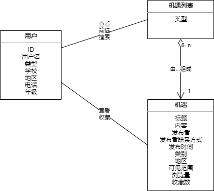
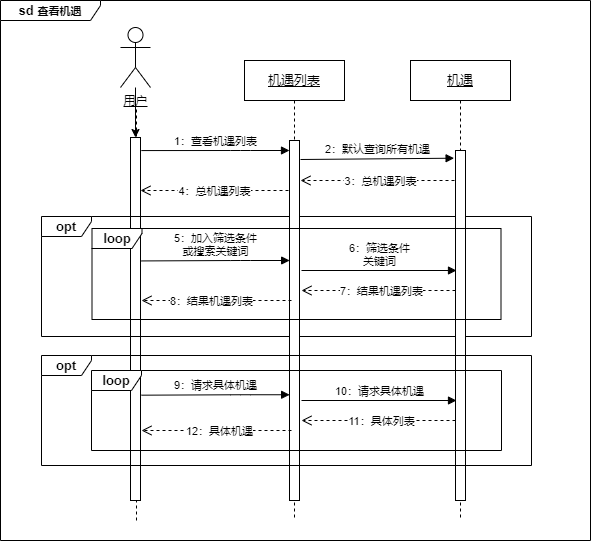
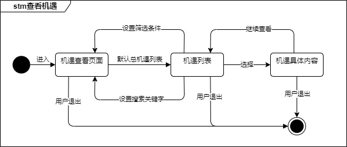
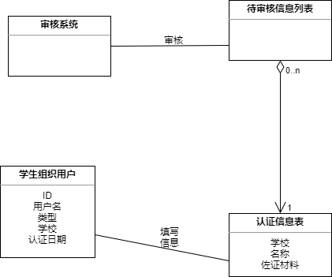
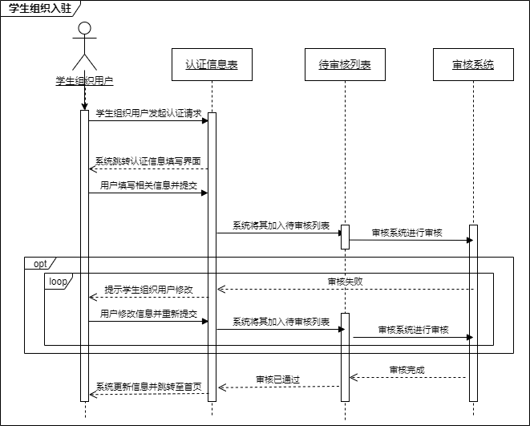
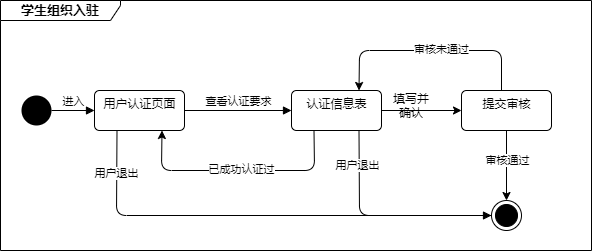

<h1 align ="center">需求规格说明</h1>

[toc]

## 1.  基本信息

### 1.1 组员信息

|    姓名    |   学号    |
| :--------: | :-------: |
| **冯亚林** | 191850036 |
| **关昕宇** | 191840077 |
| **余欣然** | 191250187 |
|  **钟山**  | 191250209 |

### 1.2 文档简介

本⽂档为我们⼩组为“校校”项目所做的需求规格说明⽂档，主要包括分析模型和软件需求规格说明文档两部分，基于已顺利完成的项目需求获取文档。

### 1.3 度量数值

- 分析模型：4个用例所对应的4个模型，均有一定复杂度，均为重要用例
- 约束：4个
- 假设与依赖：11个

## 2. 分析模型

### 2.1 用例一：发布帖子

#### 2.1.1 概念类图

下图是发布帖子用例的概念类图，目的是显示发布帖子用例过程中相关联的类的静态关系，展示用例中学生用户、发帖草稿、帖子、帖子列表、内容检测器这几个概念类之间的关系。

其中发帖草稿是一个帖子在编辑而未发布的状态，而帖子则是指已发布的帖子，两者之间存在明显的状态和动作行为区别，因此将二者区分成了两个概念类。

审核系统是以系统自动检测，如以正则等方式实现的敏感内容检测器，需要检测用户提交的帖子内容，只有合法的帖子草稿，才能成为发布后的帖子。

#### 2.1.2 顺序图

下图是发布帖子用例的顺序图，强调了时间维度上几个概念对象的交互性，展示了用例的行为顺序。因为该用例足够复杂，对用例在顺序图里的表现已经做了一些简化。

其中值得注意的点主要在以下：首先用户在发布帖子时可以中途退出，下次进入发布页面直接基于保存的上次编辑记录编辑发布。其次用户可以重复选择分类、可见性等。除此之外，在审核不通过的情况下，用户可以反复修改提交审核，直至审核通过。最后，在审核通过后，系统自动帮助用户创建发布帖子，并将提示用户审核通过。

#### 2.1.3 状态图

下图是发布帖子的状态图，主要描述了不同状态之间的转换顺序从而清晰地看出事件的执行顺序。

该图展现了用户从浏览贴子列表，发起发布帖子请求的状态转移情况。用户发起推送请求后进入帖子编辑状态，完成编辑后提交进行审核。审核完成后，如果审核通过，则帖子发布成功。如果审核不通过，用户可以选择重新编辑，回到编辑发布内容状态；也可以放弃发布，回到查看论坛帖子列表的状态。如果用户在编辑待发布内容时退出，会回到查看论坛帖子列表的状态。

### 2.2 用例二：推送广告

#### 2.2.1 概念类图

下图是推送广告用例的概念类图，目的是显示推送广告相关模型的静态结构，展示用例中机构用户、广告信息和推送策略三个概念类之间的关系，发现其中的对象从而建立之间的关联。

推送策略是广告信息的一个成员，机构用户可以查看、编辑广告信息，并可以选择推送策略。需要注意推送策略是“二选一”，即自主推送和自动推送只能选择一种。

#### 2.2.2 顺序图

下图是推送广告用例的顺序图，强调了时间维度上的机构用户、广告和推送策略的交互性，此图其描述了推送广告用例中系统各模块交互的时间顺序，展示了用例的行为顺序。

该图展示了推送广告的整个流程，机构用户发起推送广告请求进入推送广告页面，而后通过设置广告信息、选择发布策略并进行设置，系统即进行推送。其中需要注意自主发布和自动发布为可替代的两个分支。

#### 2.2.3 状态图

下图是推送广告的状态图，主要描述了不同状态之间的转换顺序从而清晰地看出事件的执行顺序。

该图展现了用户从发起推送请求起状态的转移情况。用户进入发起推送请求进入广告编辑状态，完成编辑跳转至待发布状态。此时若选择自主推送策略则进入在自主推送状态，并通过设置发布时间、频次等信息进入自主待发布状态，确认推送广告（提交）后完成推送广告。若选择自动推送则进入自动推送状态，提交后完成推送广告。需要注意状态图存在分支。

### 2.3 用例三：查看机遇

#### 2.3.1 概念类图

此图为查看机遇用例的概念类图，目的是显示机遇相关模型的静态结构，展示用户、机遇列表和机遇之间的关系，发现其中的对象从而建立之间的关联。

查看机遇的用例由用户、机遇列表和机遇三个类组成，机遇列表聚合了机遇，可以理解为机遇组成了机遇列表。⽤⼾可以直接查看总机遇列表，也可以通过条件筛选，还可以搜索查看小类机遇列表。从机遇列表用户可以查看具体的机遇，也可以收藏方便下次查看。

#### 2.3.2 顺序图

查看机遇的顺序图强调了时间维度上的用户、机遇列表和机遇的交互性，此图其描述了查看机遇用例中系统各模块交互的时间顺序，展示了用例的行为顺序。

该图展示了用户查看机遇的整个流程：用户点击进入机遇页面后，系统会查询机遇列表，默认条件下会查询含有所有机遇的总机遇列表，用户可以选择加入一些筛选条件或者搜索目标关键字，这样系统就可以返回相应的筛选结果列表和搜索结果列表；再列表中点击某一项就可查看机遇的具体信息。

#### 2.3.3 状态图

下图是查看机遇的状态图，主要描述了不同状态之间的转换顺序从而清晰地看出事件的执行顺序。

该图展示了查看机遇的状态及其转换情况，点击查看机遇时默认会显示总机遇列表，在此状态可以选择设置筛选条件更新列表，也可以选择设置关键字进行搜索，还可以直接点击具体机遇查看具体内容。在具体机遇页面可以选择退回上一界面继续查看列表。所有状态均可直接退出此流程。

### 2.4 用例四：学生组织入驻

#### 2.4.1 概念类图

下图是学生组织入驻的概念类图，目的是显示学生组织入驻相关模型的静态结构，展示学生组织用户、认证信息表、待审核信息列表和审核系统之间的关系，发现其中的对象从而建立之间的关联。

学生组织用户在填写完认证信息表后提交审核，相关信息表将被添加至待审核信息列表，审核系统将按先来先服务顺序依次审核。

#### 2.4.2 顺序图

学生组织入驻的顺序图强调了时间维度上的学生组织用户、认证信息表、待审核列表和审核系统的交互性，此图其描述了学生组织入驻用例中系统各模块交互的时间顺序，展示了用例的行为顺序。

该图展示了学生组织入驻的整个流程，用户发起认证请求后，系统会跳转至认证信息界面，待用户填写相关信息并提交后，将相关信息加入待审核列表，供审核系统进行审核。其中若审核未通过，系统将提示用户进行修改并重新提交审核，该过程可循环直至用户通过审核。

#### 2.4.3 状态图

下图是学生组织入驻的状态图，主要描述了不同状态之间的转换顺序从而清晰地看出事件的执行顺序。

该图展示了学生组织入驻的状态及其转换情况，在查看认证要求后填写提交认证信息表，其中若已成功认证过则直接返回。提交审核后若审核通过，则直接退出该流程；若审核未通过，用户可以进行认证信息表修改重新提交，或直接退出该流程。

## 3. 软件需求规格说明

### 3.1 引言

#### 3.1.1 目的

本文档为大学生信息交流集成应用“校校”的需求规格说明文档，主要供用户方和系统开发团队使用。

#### 3.1.2 范围

当下，大学生有着生活分享、经验交流、信息发布与获取、信息共享等方面的需求。本软件作为重视一站式服务的商业应用，能在打破现有的跨平台背景下学生群体关注的信息杂乱导致的信息壁垒，消除不同细分学生群体间的信息差，同时对于不同细分群体又能提供特定的圈子，从而大大提高信息交流的效率，本软件不仅提供了一个透明好用的信息交流平台，还由此构建相应的数据仓库和知识系统，能快速搜索想要的内容。

#### 3.1.3 定义、首字母缩写和缩略语

##### 3.1.3.1 定义

- 机构用户：具有营业执照等相关资质且有开展大学生相关业务的机构，以机构专业身份注册且经过平台认证的用户。

#### 3.1.4 参考文献

【1】需求工程：软件建模与分析，骆斌、丁二玉，高等教育出版社，2009-04-01，ISBN：9787040262957

【2】软件工程与计算（卷二）：软件开发的基础，骆斌，机械工业出版社，2012-12-01，ISBN：9787111407508

【3】“校校”需求获取文档

### 3.2 总体描述

#### 3.2.1 产品前景

##### 3.2.1.1 应用背景

​	大学校园中信息获取缺少集成而统一的平台。
​	大学生有着生活分享、经验交流、信息发布与获取、信息共享等方面的需求，以往大家都在QQ或者微信上实现，但由于信息过多，会出现信息源分散、缺少集成知识库的问题；以往在发布消息时，通常通过群公告或空间说说的方式，这导致个人用户大部分情况只能在自己的朋友圈中发布消息，难以大面积扩散信息；由于缺少数据仓库，在QQ空间或微信朋友圈发布的消息无法通过搜索引擎快速查找，在群里的消息也需要通过查看上下回复得知结果，这样费时费力，效果不好；而且在个人的交流圈会出现明显的“茧房”现象，例如大一学生的交流圈通常大部分都是大一学生，他们很难和高年级或已毕业同学进行信息交流。

##### 3.2.1.2 业务机遇

​	作为集成了表白墙、小助手、权服侠、小百合、招生号等多个功能的校内统一信息平台，用户可以软件替代原来的跨越多个app关注多个渠道，这种一站式的服务为用户提供良好的信息交流校友圈；校友圈最强调的就是信息共享部分：信息差是大学生的最大敌人之一，本软件能在打破现有的跨平台背景下学生群体关注的信息杂乱导致的信息壁垒，消除不同细分学生群体间的信息差，同时对于不同细分群体又能提供特定的圈子，从而大大提高信息交流的效率，本软件不仅为所有人提供一个透明好用的信息交流平台，还由此构建相应的数据仓库和知识系统，能快速搜索想要的内容；当今的大学生个性越来越凸显，很多人希望拥有被看见的权利，所以校友圈的生活分享部分就非常适合，通过形成一个“校园朋友圈”，让用户愿意刷，乐于评论，并积极分享，如同刷朋友圈，刷表白墙，刷脉脉一样成为日常生活交流的重要平台，同时认识更多的校内同学；经验交流模块提供了丰富的信息交流途径：例如对于高三毕业生，他们可以通过和目标大学相关专业的学长学姐直接交流，获得无法公开但真实确切的就读信息，这是不能通过其他软件轻易获取的，其他还包括保研、考研、出国、组队、实习、社团、学生工作、奖学金等等方面的信息交流。

##### 3.2.1.3 业务需求

| 编号 | 描述                                                 |
| ---- | ---------------------------------------------------- |
| BR-1 | 项目上线一年后，认证用户数量可以达到十万             |
| BR-2 | 项目上线一年后，覆盖江苏省高校和全国各省份的知名高校 |
| BR-3 | 项目上线一年后，⽤⼾平均发帖、回帖的频率超过2次/天   |

#### 3.2.2 产品功能

“校校”是一个致力于打造大学生信息交流聚合平台的应用，在当今，大学生有着生活分享、经验交流、信息发布与获取、信息共享等方面迫切需求的情景下，打破跨平台背景下学生群体关注的信息杂乱导致的信息壁垒，消除不同细分学生群体间的信息差。同时对不同细分群体提供特定的圈子，包括但不限于生活分享、活动发布、互帮互助和机遇广告等内容，从而大大提高信息交流的效率。本软件不仅为所有人提供一个透明好用的信息交流平台，还由此构建相应的数据仓库和知识系统，能快速搜索想要的内容。

#### 3.2.3 用户特征

- 学生用户
  - 学生用户对校园信息有强烈需求，他们想与校园信息集成平台快捷、方便、全面地交互，获取校园内各种信息，发布求助信息；同时，他们也希望了解其他感兴趣高校的校园生活或者招生信息；最后，他们也希望获得留学、培训、实习、招聘等更多的渠道。
- VIP用户
  - VIP用户对校园信息和渠道有更强烈的需求。他们急切的想要知道关注高校的关键信息，或者是对留学、培训、实习、招聘等渠道的有效性、便利性等有更高的要求。
- 机构用户
  - 许多机构对如何广泛接触大学生、有效展示产品、推销产品有强烈需求。经过资质认证的机构，经平台提供一个低成本的渠道给学生，实现共赢。机构可以获得和利用平台提供的流量，更好地进行宣传。
- 创作用户
  - 创作用户对高流量平台天然有亲和性，他们对如果吸引流量和有效变现需求强烈。他们希望在平台上发布内容，吸引流量，培养自己的粉丝，并且通过流量变现，获得收益。
- 管理员
  - 管理员不仅需要管理系统拥有的所有资源和各种数据，还需要定时检查系统是否有明显缺陷、各类bug和故障，同时也要对用户反馈做出处理，及时对违规帖子、违规内容和相关用户做出处罚。

#### 3.2.4 约束

| 编号 | 描述                                           |
| ---- | ---------------------------------------------- |
| CO-1 | 需要符合互联网平台管理运营相关法规             |
| CO-2 | 系统基于移动端APP进⾏开发，后端使⽤Java/Kotlin |
| CO-3 | 支持访客数量级突变的弹性访问方案               |
| CO-4 | 代码提交前必须通过⻛格检查                     |

#### 3.2.5 假设与依赖

##### 3.2.5.1 假设

| 假设项 | 内容                                                         |
| ------ | ------------------------------------------------------------ |
| AS-1   | 学生用户和创作用户具有较高活跃度，积极参与内容创作、管理员选举、建议反馈等等活动。 |
| AS-2   | 学生用户和创作用户在享受到满意的服务后，会产生付费意愿。     |
| AS-3   | 有创作用户能创作出充满吸引力的精品帖子。                     |
| AS-4   | 合作机构的推广能有效地传达给学生用户。                       |
| AS-5   | 用户处于随时可以接入互联网的网络环境下。                     |
| AS-6   | 用户具有熟练使用移动端设备的能力。                           |

##### 3.2.5.2 依赖

| 依赖项 | 内容                                                 |
| ------ | ---------------------------------------------------- |
| DE-1   | 系统的学生身份认证依赖于学生邮箱或学生卡等身份证明。 |
| DE-2   | 系统的功能实现有赖于与学校、学校学生组织进行合作。   |
| DE-3   | 系统的服务器依赖于第三方云服务提供商。               |
| DE-4   | 系统的付费需要与第三方支付平台集成。                 |
| DE-5   | 要求用户、机构参与选举学校管理员。                   |

### 3.3 详细需求描述

#### 3.3.1 对外接口需求

##### 3.3.1.1 用户界面

界面风格：本系统采用图形用户界面，界面风格冷色为主。

界面布局：界面布局整齐，便捷易用，直观简洁。

| 编号 | 界面         | 描述                                                 |
| ---- | ------------ | ---------------------------------------------------- |
| UI-1 | 校友圈页面   | 用户浏览校友圈的帖子及广告                           |
| UI-2 | 机遇圈页面   | 用户浏览机遇圈发布的机遇                             |
| UI-3 | 注册页面     | 未有帐号的用户在该页面可完成注册                     |
| UI-4 | 登陆页面     | 已注册用户在该页面可完成登录                         |
| UI-5 | 个人信息页面 | 用户可以修改个人信息，并置顶/加精帖子                |
| UI-6 | 发布帖子页面 | 用户可以发布帖子，并设置类别和话题                   |
| UI-7 | 浏览帖子页面 | 用户可以浏览帖子，并对帖子进行点赞、评论、举报的操作 |
| UI-8 | 发布广告页面 | 机构用户可以编辑广告封面及内容，并选择推送策略       |

##### 3.3.1.2 软件接口

| 编号 | 描述                            |
| ---- | ------------------------------- |
| SI-1 | 使用MySQL作为底层数据库存储数据 |
| SI-2 | 使用Linux服务器                 |
| SI-3 | 使用SpringCloud框架搭建         |

##### 3.3.1.3 硬件接口

无

##### 3.3.1.4 通信接口

| 编号 | 描述                 |
| ---- | -------------------- |
| CI-1 | 采用HTTP传输规范     |
| CI-2 | 传输数据以json格式化 |

#### 3.3.2 功能需求

##### 3.3.2.1 发布帖子

###### 3.3.2.1.1 刺激响应序列

> 刺激：用户发起发布帖子的请求
>
> 响应：系统跳转至发布帖子界面
>
> 
>
> 刺激：用户编辑帖子内容
>
> 响应：系统定时保存内容为草稿
>
> 
>
> 刺激：用户选择帖子类别，可见性
>
> 响应：系统保存用户设置
>
> 
>
> 刺激：用户发起确认提交帖子请求
>
> 响应：系统保存信息并提交审核系统
>
> 
>
> 刺激：用户发起取消发布帖子请求
>
> 响应：系统保存内容为草稿，并返回帖子列表界面
>
> 
>
> 刺激：用户发起查看审核结果请求
>
> 响应：系统显示该帖子当前审核状态
>
> 
>
> 刺激：用户发起直接返回不保存内容请求
>
> 响应：系统丢弃相关信息，返回帖子列表界面
>
> 
>
> 刺激：用户发起人工申诉审核请求
>
> 响应：系统保存相关内容并提交待人工审核列表
>
> 
>
> 刺激：用户发起添加图片或视频请求
>
> 响应：系统提示相关格式、大小要求，并保存信息

###### 3.3.2.1.2 相关功能需求

| 编号                     | 需求描述                             |
| ------------------------ | ------------------------------------ |
| Posts.addPost            | 系统允许用户发布帖子                 |
| Posts.addPost.info       | 系统允许用户编辑待发布帖子内容       |
| Posts.addPost.type       | 系统允许用户设置待发布帖子类型       |
| Posts.addPost.visibility | 系统允许用户设置待发布帖子可见性     |
| Posts.addPost.result     | 系统允许用户查看帖子审核结果         |
| Posts.addPic             | 系统允许用户添加图片到待发布帖子内容 |
| Posts.addVideo           | 系统允许用户添加视频到待发布帖子内容 |
| Posts.save               | 系统允许用户将已编辑内容保存为草稿   |
| Posts.quit               | 系统允许用户放弃发布帖子             |
| Posts.complain           | 系统允许用户发起人工审核请求         |

##### 3.3.2.2 推送广告

###### 3.3.2.2.1 刺激响应序列

>刺激： 机构用户发起推送广告请求
>
>响应： 系统跳转至推送广告界面
>
>
>
>刺激：机构用户设置广告封面、简介、视频信息
>
>响应：系统保存信息并展示推送策略
>
>
>
>刺激：机构用户选择发布时间、发布位置、发布频次并提交
>
>响应：系统保存用户设置，推送广告并跳转至校友圈首页
>
>
>
>刺激：机构用户选择自动发布
>
>响应：系统根据推荐算法根据用户数据自行发布广告，并跳转至校友圈首页
>
>
>
>刺激：用户发起查看推送广告数据请求
>
>响应：系统展示广告数据，包括根据时间变化趋势图

###### 3.3.2.2.2 相关功能需求

| 编号                      | 需求描述                         |
| ------------------------- | -------------------------------- |
| Advertise.addInfo         | 系统允许用户设置广告信息         |
| Advertise.chooseStrategy  | 系统允许用户选择推送策略         |
| Advertise.setSelfStrategy | 系统允许用户设置自主推送策略信息 |
| Advertise.setAutoStrategy | 系统允许用户设置自动推送策略信息 |
| Advertise.checkData       | 系统允许用户查看推送广告数据     |

##### 3.3.2.3 查看机遇

###### 3.3.2.3.1 刺激响应序列

>刺激：用户请求浏览机遇列表
>
>响应：系统跳转到机遇页面，默认返回总机遇列表
>
>
>
>刺激：用户设置筛选条件筛选机遇
>
>响应：系统根据条件返回筛选结果机遇列表
>
>
>
>刺激：用户设置关键字搜索机遇
>
>响应：系统根据关键字返回搜索结果机遇列表
>
>
>
>刺激：用户选择某一机遇
>
>响应：系统跳转到机遇的具体展示页面，并显示相关内容
>
>
>
>刺激：用户收藏某一机遇
>
>响应：系统将该机遇加入到用户的收藏列表中

###### 3.3.2.3.2 相关功能需求

| 编号                       | 需求描述                       |
| -------------------------- | ------------------------------ |
| Opportunity.List           | 系统允许用户请求浏览机遇列表   |
| Opportunity.List.All       | 系统将总机遇列表展示给客户     |
| Opportunity.List.query     | 系统根据关键词搜索机遇形成列表 |
| Opportunity.List.filter    | 系统根据筛选条件得到机遇列表   |
| Opportunity.Detail         | 系统允许用户查看机遇的具体内容 |
| Opportunity.Detail.Collect | 系统允许用户收藏机遇           |

##### 3.3.2.4 学生组织入驻

###### 3.3.2.4.1 刺激响应序列

> 刺激：学生组织用户发起认证请求
>
> 响应：系统跳转至认证界面
>
> 
>
> 刺激：学生组织用户确认提交认证信息表
>
> 响应：系统将信息表加入待审核信息列表
>
> 
>
> 刺激：学生组织用户请求查看认证信息
>
> 响应：系统跳转至用户信息界面
>
> 
>
> 刺激：学生组织用户请求查询认证审核结果
>
> 响应：系统跳转至用户信息界面

###### 3.3.2.4.2 相关功能需求

| 编号                          | 需求描述                                 |
| ----------------------------- | ---------------------------------------- |
| StudentsO.authenticate        | 系统允许用户请求认证为学生组织           |
| StudentsO.authenticate.submit | 系统允许用户提交相关认证信息材料         |
| StudentsO.authenticate.audit  | 系统允许用户查看审核结果                 |
| StudentsO.authenticate.fail   | 系统提示用户审核失败，修改后提交重新审核 |
| StudentsO.authenticate.pass   | 系统提示用户审核通过                     |
| StudentsO.authenticate.info   | 系统允许用户查看相关认证信息             |

#### 3.3.3 性能需求

* Performance1：移动端APP的响应时间应当在3秒以内。
* Performance2：产品可以支持至少一万名用户同时访问。
* Performance3：产品可以支持至少五千次同时搜索。

#### 3.3.4 约束

* IC1：系统采用java/kotlin语言，基于Android Studio开发。

* IC2：系统开发时长为30天。

* IC3：平台上发布的内容都应相关符合法律法规，出现问题后可以及时追踪到发言人。

#### 3.3.5 质量属性

##### 3.3.5.1 安全性

* Safety1：机构用户需要提交营业执照等材料进行机构认证。
* Safety2：用户个人信息应加密存储，避免信息泄露。
* Safety3：系统按照用户身份验证用户的相关权限。

##### 3.3.5.2 可维护性

* Modifiability1：如果审核标准发生变化，可以在1个工作日内完成更新。
* Modifiability2：如果系统要增加新的会员服务，要能够在0.25个人月内完成。
* Modifiability3：如果系统要支持新的图片视频格式，要能够在0.25个人月内完成。

##### 3.3.5.3 易用性

* Usability1：软件中的字体大小，颜色都可以更换。
* Usability2：初次使用软件的用户应能自行根据提示进行操作。
* Usability3：软件良好适应不同大小的屏幕。
* Usability4：需要用户修改或格外留意的信息应该使用红色鲜明标注出。

##### 3.3.5.4 可靠性

* Reliability1：在客户端与服务器通信时，如果网络故障，系统不能出现故障
  * Reliability1.1:客户端应该检测到故障，并尝试重新连接网络3次，每次15秒
    * Reliability1.1.1:如果重新连接成功，客户端应该继续之前的工作
    * Reliability1.1.2:如果重新连接不成功，客户端应该等待10分钟后尝试重新连接
      * Reliability1.1.2.1:重新连接成功后，客户端应该继续之前的工作
      * Reliability1.1.2.2:如果重新连接仍然不成功，客户端提示网络故障，关闭客户端
* Reliability2：用户和帖子等重要数据，至少需要保证有1份备份

#### 3.3.6 其他需求

Others1：系统应提供一个简单的演示视频，讲解系统的主要功能。
