# Workeep商业计划书

## 0、任务划分：

gxy：余下的所有

zs：一.4市场情况和二.3市场规模

yxr：一.6财务预测

fyl：三.1和2

就是硬写点字，每人不超过一千

## 一、项目简介

### 1. 项目背景

​		“几点钟，结束梦，他按下闹钟；如往常，开始了一天生活；几点钟，也许是，月出的时候；如往常，结束了一天工作 ...”

​		打工人，干饭人，九九六零零七 ...... 无数略带调侃却流露万般无奈的标签，诉说着都市上班族日复一日工作生活的点点滴滴。加班，自然常态；盒饭，已是享受；休假，更成奢求。面对着竞争压力、行业内卷日益白热化的当下形势，大部分的他们不敢离职，不敢生病，甚至不敢结婚。默默在岗位上战斗的他们，维持着社会齿轮的脉搏，他们的权益应当被我们关注。

​		近期，相关部门公布“996严重违反法律关于延长工作时间的规定，相关公司制度应认定为无效”的相关条例，使得社会再次聚焦都市上班族群体。如何为重压下的他们提供更加优质的生活体验，引发着我们的思考。

​		一方面，上班族由于长时间在办公室工作，以及加班时间较长，容易引发肥胖、腰椎间盘突出等体质问题。同时，诸如盒饭、烧烤等不健康的饮食，熬夜、饮酒等恶劣的生活习惯，进一步危害着本就脆弱的健康。

​		以上班族的一大主体程序员为例。在龚志华、靳桂阳等人的报告《2058名男性程序员健康状况调查分析及对策》中，他们对杭州某公司2058名平均30岁左右的男性程序员进行体检，竟检出大小疾病10151例次。并且发现程序员容易因屈光不正、代谢性疾病、颈椎退变、痔疮等危害健康。报告更指出，通过一些小习惯的培养（避免久坐、适时锻炼、控制饮食等），可以有效降低患病概率。如何充分利用碎片时间引导上班族进行定时放松和体育锻炼，同时在饮食上加以调理，是我们应当考虑的问题。

​		另一方面，日复一日面对职场各种业务和人际交往的压力，使得很大一部分上班族心力交瘁。工作缺乏积极性，易怒易躁，甚至抑郁的心理问题也对他们产生着不小的困扰。因此，对上班族的心理疗愈也是不可避免的话题。

### 2. 项目结构总览

​		我们产品的核心是打造健康需求的闭环，为用户提供运动、饮食和心理三方面的健康服务，帮助用户改善和放松。经过多次讨论和商议，最后决定项目中共有六项关键业务，分别是强身运动模块、养胃美食模块、暖心小舍模块、健康助手模块、自由社区模块和好物商城模块，这是我们的项目整体结构。

### 3. 产品简介

​		本款Workeep APP希望针对上班族这一群体，通过运动、饮食、心理、健康小习惯 四大模块的内容建设，为其提供一站式身心健康护航计划。让上班族即使在竞争压力与日俱增的当下， 依然每日元气满满，身心舒畅，让996的日子里健康也能久久长留。

### 4. 市场情况

​		随着互联网技术的蓬勃发展以及新冠疫情的大背景下，线上平台已经逐渐取代线下售卖成为主流的市场营销场所，“平台经济”逐渐成为主流的市场营销形态。我们通过线上平台的方式，为用户群体提供身心健康的一站式服务，具有积极的市场前景。

​		同时，本款APP面向的主体是上班族，市场规模庞大，潜力丰富。此外，在工作加班996、新冠病毒肆虐等等负面事件的影响下，相当大比例的上班族存在着或多或少的生理或心理问题亟待解决，从某个层面上反映了身心疗愈服务存在着很大的市场需求，这也为我们的APP提供了进一步发展、扩大影响力的空间。

### 5. 商业模式

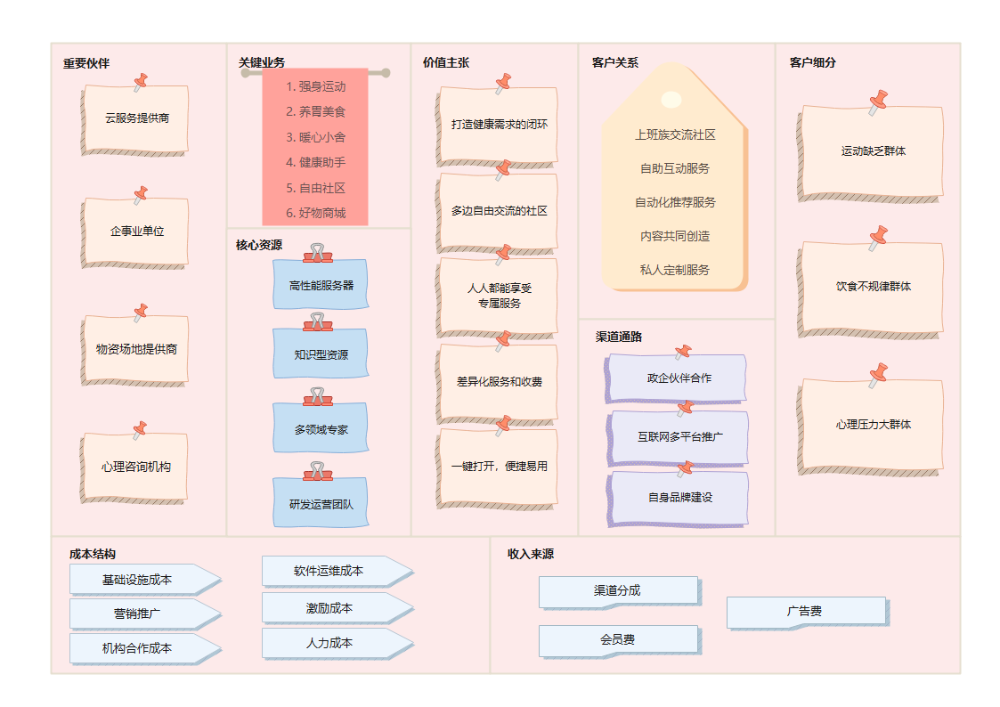

我们的商业模式类型是多边平台类商业模式：以打造健康需求闭环为核心，为上班族、物资提供商和心理咨询师等多客户提供了一个平台，我们希望用户能通过平台完成业务，并专注于平台开发、管理和运维上。下面来详细介绍我们的商业模式：

1. 客户群体：我们的目标客户群体是偏年轻的上班族，通过查找报告，我们依据他们身上普遍存在的健康问题，细分为运动缺乏群体、饮食不规律群体和心理压力大群体。
2. 价值主张：我们最核心的价值主张是打造**运动、饮食、心理三方面健康的闭环**；在**用户体验**上，我们还主张提供提供**便捷的使用方式和专属定制服务**；在收入上我们主张进行差异化服务和收费，既让消费能力较弱的群体能体验核心功能，便于扩大用户群体，又让愿意付费的用户感到付费是有价值的。此外我们还旨在建立多边自由交流的社区，以更好地服务用户和激发用户的创作兴趣。
3. 渠道通路：自身方面我们注重知名度、评价、购买和售后建设；并依靠互联网多平台进行个性化推广；并积极和政企伙伴建立合作，希望他们也能帮助宣传我们的产品。
4. 客户关系：我们提供交流社区供大家发表自己的真实想法；提供自助互动服务让用户主动获取目标服务内容；提供自动化推荐服务根据用户的画像进行个性化推荐；并鼓励用户在平台上发表自己的创作，打造基于UGC的共同创造平台；为付费用户提供私人定制服务，精准解决用户问题。
5. 收入来源：在好物商城中我们于多家物资供应商合作，相应的我们可以拿到渠道分成；在不影响用户体验的前提下，我们会开放一些广告从而获得广告收益；私人定制服务方面会有相应的会员费。
6. 核心资源：高性能服务器为我们提供了最关键的高可用软件支持；在运动、饮食和心理三方面都需要很多知识型资源，这是我们的核心资源；我们需要专业的营养师团队和心理咨询师团队等多领域专家为软件提供专业的建议；我们还需要研发和运营团队进行软件开发维护、活动策划等。
7. 关键业务：运动方面包括强身运动和健康助手：强身运动业务包括健身课程、跑步骑行瑜伽行走跳绳等记录、直播教程与文字教程等，健康助手包括体质评估、定时走动和饮水提醒、久坐身体放松和助眠等模块；饮食方面包括养胃美食的：这个业务主要包括食物热量表、健康餐食谱和线上线下健康餐馆推荐等；心理方面有暖心小舍和自由社：暖心小舍提供一些心理上的开导内容和专业的心理咨询服务，自由社区为所有用户提供一个畅所欲言的和谐环境。
8. 重要合作：云服务提供商提供高可用软件支持；企事业单位帮我们在他们的公司做宣传；物资场地供应商提供线上商城支持和线下健身房支持；心理咨询结构为我们提供专业的理论基础和条件保障。
9. 成本结构：线下工作环境和其他支持性的基础设施需要成本；人力资源需要成本；软件运维需要成本；和各种合作伙伴合作需要资金；在其他平台投放广告引流需要营销成本；举办活动鼓励用户创造内容需要激励成本。

基于文字画布，我们对画布进行了视觉化的呈现：

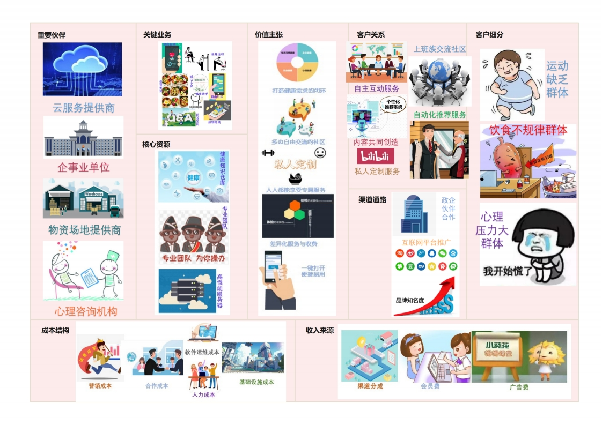

### 6. 财务预测 

本项目通过打造健康需求闭环，提供多项健康服务帮助用户改善放松。主要成本在于软件开发维护支出和宣传推广支出，其中项目前期宣传推广支出相对较高，后期则会增大软件开发维护及相应的人力成本支出，但成本能始终控制在较低水平。而项目的主要收入由付费服务收入、商城售卖分成、会员费用收入和平台广告收入四部分组成，各项收入预计都将逐年取得较大增长。

项目启动计划注资150万元，其中创业团队总计入股120万元，其余30万元来自天使投资。项目预计从经营期第二年开始盈利，收入和利润逐年增长，预计在第五年年底净利润达到1584.69万元。企业将一直保持低资产负债率运行，财务风险小，偿债能力、营运能力、盈利能力和发展能力指标良好；企业将竭力配合战略投资商，从多种方式中选择一种最适合的投资资本退出方式，在保障战略投资商利益的同时，也实现公司自身的发展。

## 二、市场与竞争分析

### 1. 市场环境

#### 1.1 宏观环境

##### 1.1.1	全球市场情况

1. 受疫情影响，世界经济发展处萧条衰败期，但我国形式较好

   * 从长期来看，目前全球经济仍处在**新冠疫情**阴影下的**萧条衰败期**。除去新冠疫情导致的大规模停工停产、供应链中断、企业经济性裁员等影响之外，2008-2020的又一个12年周期内全世界主要经济体的**增速都在放缓**也是全球经济停滞不前的重要因素。
   * 针对**中国**来说，由于较早、较好地控制了新冠疫情的爆发，从去年5月开始企业逐渐恢复大规模生产，在疫情还在其他地区大规模扩散之时赢得了发展优势。同时，我国实现了脱贫攻坚战的胜利，实现了消除贫困全面小康的目标，某种程度上也促进了农村和城市更为平衡的发展。因此，相较于世界其他国家和地区，我国目前的经济形势相对乐观。
   
2. 我国GDP增速增长较大

   * 从中经数据提供的中国国内生产总值同比增长率数据来看，2021年三季度我国的**GDP增幅达到了4.9%**，在同为金砖国家的俄罗斯、南非等国还处于负增长的时候，我国已经实现了GDP较为**大幅度的正增长**。

   * 可以看出，在2020年一季度我国的GDP增幅一度断崖式下跌，正是由于新冠疫情爆发初期国内大规模停工停产所致，但我国强有力的防疫举措迅速控制了疫情的进一步蔓延，在**去年二季度**就已经基本**扭转**了负增长的**颓势**，并在此后完成了相对稳定的正向增长，为我国在世界新冠大流行的阴霾下突出重围，赢得发展新机遇提供了可能。

   * 根据**国家统计局数据**，前三季度GDP总值相对于2020年同期上涨了9.8%，并且进一步缩短了与美国之间的差距，相较于其他国家目前较为严重的物价上涨、失业等现象，我国的经济形势相对稳定，正在逐步复苏。
   * 根据社科院的预计，我国今年经济增速预计为6.5%。经济学人预判我国经济运行总体平稳，外贸和就业形势稳中有进，通胀上行压力减小。

3. 我国失业率较低

   * 根据**国家统计局**数据，10月城镇调查失业率为4.9%，比去年同期下降0.4个百分点。同时青年人失业率14.2%，且连续三个月下降。可见我国在疫情防控取得重大进展的同时，实现了就业率的逐步改善。
   * 另一方面，我国当前高技术制造业和现代服务业都处于快速发展的阶段。其中，信息传输、软件和信息技术服务业生产指数同比增长14.8%，租赁和商务服务业生产指数增长9.3%。这无疑为从业者创造了更多的就业机会。

##### 1.1.2 资本市场

1. 资本市场改革方兴未艾

   * 当前，中国的资本市场呈现多元化多层次特点。前不久刚挂牌起航的**北京证券交易所**就是我国多层次**资本市场改革**发展迈出关键一步。**81只**北交所上市股票合计成交212.49亿元，较开市前一周增长158.69%。
   * 根据新华财经客户端的报道，投资者积极进场，入市热情高涨，8只北交所主题基金11月19日集体发售，**均在上午时段实现超募**。可见北交所为资本市场投入了新的活力。

2. 本行业融资较为容易，成本较低

   * 根据京报网的报道，北交所要求企业必须充分披露**创新特征**，保荐机构也要充分核查申请上市企业的**创新**发展能力，彰显了中国谋求**创新发展**的雄心。

   * 根据东方财富网的报道，首批上市的公司包括同辉信息VR公司、浩淼科技、艾融软件等，**信息软件公司占到非常大的比重**。由此可见当前信息技术行业热度不减。而本APP即使基于都市上班族量身定做的软件，具有广泛的受众。在国家、资本市场对信息行业的大力支持的背景下，以创新为出发点，相对于传统行业获得融资的**难度相对较低**。

##### 1.1.3 大宗商品和其他资源

1. 对你的业务至关重要的商品和其他资源价格偏高

   * 对于本款APP相关的核心商品资源主要是“好物商城”模块的**健康食品**。然而，食品安全问题一直以来是商品质量监督的重中之重，关乎人民的生命安全。今年9月末，中国食品科学技术学会主办的论坛上提出“后疫情时代，人们在关注自身免疫力的同时，也开始寻找提高免疫力和满足身体所需营养的方法，越来越多的人们注意到**特殊食品**这一领域。”反映出人们对于健康食品的需要日益增长，该部分市场有待进一步开拓。

   * 前段时间，食品行业发生了一波**大规模的涨价**风潮。据报道，从今年4月份以来，国内的雀巢、可口可乐、达利食品等企业先后发布其提交公告，其中这些食品涨价最高的达到18%。而这很大程度上与疫情减产带来的物价迅速上涨有着密不可分的联系。
   
   * 人力资源方面，软件行业存在着知识密集型的特点，对掌握前沿技术的高层次人才具有较大的需求。进而带来了为了争夺激烈人才导致薪资不断攀升，造成**人力成本居高不下**的特点。
   * 另一方面，企业不仅需要从高校以及社会招募优质人才，对员工的培训成本也占到了很大的比例。尤其对于注重**科研开发**的公司来说，为稳固现有市场份额以及开拓新的市场份额，企业需要持续投入研发资金、高技术人才等资源，导致软件企业的**研发费用**处在比较**高的水平**。
   
2. 获取商业模式运作所需要的相关资源容易

   * 当前信息技术行业热度居高不下，一定程度上影响了学生的专业选择。同时较高的薪资和就业率也吸引着越来越多人称为软件行业从业者。因此，本款APP需要的关键人力资源即软件开发运营团队**相对容易获取**。
   * 关于成本问题在上一个问题中已解答。对于高端人才的争夺导致行业薪资逐年攀升，聘用核心人才的成本越来越高。

##### 1.1.4 经济基础设施

1. 市场公共基础设施和针对企业的公共服务比较乐观

   * 首先由于本APP高度依赖互联网，因此与**信息传输**相关的基础设施建设尤为重要。当前国内**新一轮5G建设正在提速**。近日，《四川省“十四五”新型基础设施建设规划》发布，对于5G建设提出量化指标，5G基站数量将从2020年的3.6万个，增加到2025年的25万个；5G网络用户普及率，将从11%增至60%。此前已有多个省份发布“十四五”新基建规划，5G网络建设均成为其中重点。

   * 另一方面，结合本款APP推出的健康食品、运动器材等产品，我们对**物流仓储**也必然有一定要求。目前，我国**A级物流企业**已达5000家，其中5A级物流企业将近300家。这导致“中国物流企业50强”的评选“门槛”逐渐提高，比如主营业务收入从之前的8300亿要求提高到现在的30亿元左右。在这种情况下，企业之间的并购重组会成为一种趋势。届时，整个市场占比会更加集中化，进一步提高市场的运行效率。
   
2. 个人和公司的所得税不算太高

   * 根据财政部近日发布的相关数据，今年1-10月全国企业所得税总收入为40852亿元，同比增长14.9%。个人所得税总收入为11562亿元，同比增长21.1%。
   * 据报道，2022年1月1日起我国个人所得税的计算方法将发生改变。居民个人取得的**全年一次性奖金**，应**并入**当年综合所得计算缴纳个人所得税（合并申报）。这意味着对于企业和个人来说，需要缴纳的所得税金额将更多。

#### 1.2 行业环境

##### 1.2.1 现有的竞争对手

我们产品旨在打造年轻上班族健康需求的闭环，从软件分类的角度看，我们属于健康类软件。健康类软件有很多，但从商业模式和业务领域上看，市场上暂时没有一个成熟的产品。我们的竞争对手主要是运动类和心理放松类两类软件。

1. 我们这个领域主导规则公司有keep和心潮

   *Keep*在运动饮食健康方面是我们的竞争对手，这款软件是健康分类的顶级软件，他们提供包括运动教程、运动推荐、健康饮食、交流社区、好物商城的完整服务闭环。
   
   *心潮*在心理减压方面是我们的竞争对手，这款软件是心理、睡眠管理的顶级应用，他们提供了减压、睡眠、冥想和专注的服务，有着很大的用户基数。
   
2. 他们的竞争优势如下

   Keep在健身内容方面，有着丰富的课程和内容，不仅适合无锻炼基础的小白，也适合有健身基础的老鸟。Keep有着丰富的课程和讲解，并提供AI计算哪多定制服务，使得交互性很强；Keep有着最完整最高质量的社区，而且Keep开始做软硬件结合，近期在内置商城中推出了包括跑步机、手环、瑜伽垫、鸡胸肉等物品。
   
   心潮有着大量的内容基础和用户基础，它不用借助外部设备，能缓解心理压力、改善睡眠、通过生物反馈实现快速情绪调节。
   
3. 他们的竞争劣势如下

   Keep和心潮的劣势就是他们对特殊群体提供的特殊服务较少，他们都在做普适性的内容。

4. 他们的主要产品和服务如下

   Keep：饮食推荐、个性化训练、讨论社区、分享、健身课程、商城、与线下结合的活动，包括线下的商城实体店和健身房，同城见面活动等。

   心潮：白噪音、身体监测服务、睡眠改善、减压放松、情绪调节、专注提升等。

5. 他们聚焦客户群体如下

   Keep聚焦于有健身兴趣的群体，不仅包括健身小白，也包括有健身基础的老鸟。

   心潮聚焦于有心理压力想通过简单方法快速改善的人。

6. 他们对于我们的客户群体、收益来源和利润影响如下

   我们的客户群体为期望得到身体心理放松的上班族，这与上述软件的群体有重叠，会有影响，并且他们的市场基础很大，我们产品的收入和利润在初期时会受到他们的影响。

##### 1.2.2 新进入者（挑战者）

在健康类软件中，专精于为上班族提供减压服务的产品较少，新进入者主要也是关注普适身体和心理放松的。

1. 所处市场的新进⼊者是冥想星球

   冥想星球。这是一款一站式冥想睡眠放松专注工具。与心潮相比，此软件更注重于冥想，其公司也开发了壹心理软件，借助于公司强大的专业心理知识，冥想星球在冥想方面的专业性显著强于其他竞品。
   
2. 他的竞争优势或劣势如下

   其优势在于：专注于冥想，能提供专业性极强的冥想教程，所以能较好地提高用户睡眠质量和专注度。

   其劣势在于：相对于心潮或者蜗牛睡眠等行业顶级软件来说，软件功能较为单薄。作为新软件很难和行业顶级软件争取用户。

3. 他们必须克服的障碍是怎样扩大自己的业务范围，怎样增强自己的业务能力，去吸引更多的用户，并一定要提高用户粘性。

4. 他们的价值是随时随地冥想练习、白噪音帮助平复心境、专业大牛帮助走出阴霾、多维度陪伴式冥想练习。

5. 他们聚的客⼾群体为睡眠质量差、记忆力下降、思维迟钝、容易情绪化、注意力不集中的客户群体。

6. 他们的成本结构是软件研发成本、内容创造成本、广告宣发成本等

7. 他们对我们的客⼾群体、收益来源和的影响较大：我们的客户细分主要是3部分，即需要运动指导、心理疏导、饮食建议的3部分。他们可能吸引这3部分中某一类的部分客户，可能会影响我们的会员费收入，从而影响软件利润。

##### 1.2.3 替代产品和服务

我们专注于上班族身心健康的需求闭环，但用户也可以通过几种健康类软件的组合来替代我们。

1. 这些产品和服务能够替代我们的产品和服务

   Keep等运动健身软件中的转为职场人设计的模块可以代替我们的运动健身服务。

   美团、口碑等美食推荐软件中的健康餐可以代替我们的养胃美食服务。

   壹心理、小睡眠等关注心理问题帮助放松心理的产品可以代替我们的放松心理服务。

2. 它们的成本与我们相差较高

   他们这些软件都是大众性普适性的，所以软件体量很大，运营成本比我们的软件高。广告方面，他们需要更多的推广，所以推广成本也较高。

3. 客⼾需要切换到这些替代品比较容易

   并不太容易，因为我们的客户群体较为小众，他们需要的服务也并不容易直接获取，需要在庞大复杂的软件里精挑细选，所以切换成替代品并不容易。

4. 这些替代产品起源于传统商业模式

   健身软件起源于线下健身房。

   美食软件起源于传统媒体广告。

   心理软件起源于心理咨询机构。

##### 1.2.4 供应商和价值链上的其他厂商

作为一个互联网+健康的软件，我们的供应商主要是软件服务的供应商。价值链上的其他厂商包括：内容共同创作者、商城物品供应商、线下健身房和线下饭店等。

1. ⾏业价值链中的关键玩家

   内容共同创作者：软件中的交流社区需要大家一起贡献内容，如果没有高质量的内容产出，该模块就很难达成放松的目的。

   物品供应商：这里指在软件中的好物商城的物品供应者，他们需要提供真正能帮助用户放松的商品，例如健康食品、工学座椅和健身器材等，他们身上的抽成也是平台的重要收入来源。

   线下门店：主要包括线下健身房，线下健康饮食提供者等，他们作为硬件的部分，是我们的关键玩家。

   软件支持：毕竟我们的产品是一款软件应用，需要高可用服务器保证。

   心理咨询机构：软件上提供更多专业心理咨询服务需要心理咨询师。

2. 商业模式十分依赖这些玩家

   内容方面：公司本身会单独安排一个小部分产出内容，也会转载其他平台的内容，但也十分依赖用户自己创造内容；物品供应方面：十分依赖供应商，所以需要高标准，需要多个供应商支持；线下门店：十分依赖，线下门店会影响整个产品的形象；软件：十分依赖；专业心理咨询机构：十分依赖。

3. 有边缘玩家在涌现

   大型政企可以加入到我们的软件中，宣传他们的企业文化和员工福利，用来招揽人才，所以他们可能是边缘玩家。

4. 软件部分利润最⾼

   软件支持：因为考虑到上班族有着较强的付费能力，所以我们会提供价格较高的个性化推荐服务，这个服务的收益大部分会进入软件支撑者部分，所以他们利润高。

##### 1.2.5 利益相关者

1. 股东和公司员工会影响我的商业模式

2. 利益相关者的影响力很大

   平台需要股东的投资进行发展和扩展，但也必须符合股东的利益，他们需要增大利润率，所以这会影响到平台的价值主张，所以我们需要从中周旋，保持本心的同时提高股东利益。而员工方面影响力更大，软件需要大量优质员工，例如内容审核者、活动策划者、食品健康鉴定部门等，他们是最关键的人才，所以我们需要增加企业文化培养和完善员工福利政策。

### 2. 目标市场与需求分析

#### 2.1 市场分析

##### 2.1.1 市场问题

1. 影响客户环境的关键因素是健康意识

   我们的客户主体是上班族，影响上班族健康服务软件市场的关键因素是健康意识

   随着人们的物质生活水平逐渐提升，上班族们的健康意识逐渐加强，他们越来越多地关注自己的健康，却可能没有足够的时间去强身健体或是放松身心，在工作日甚至连饮食休息都不规律。因而，存在这样的需求，我们的软件就可以帮助他们保持健康、满足健康需求。对于这片市场，关键因素应该是健康服务的质量，是否能让客户真实有效地感觉到健康提升或保持的效果，足够优秀的评价才能留得住已有用户，并不断引进新的⽤户。

2. 上班族健康市场得到了极大的发展

   通过之前的分析，我们已经知道如今上班族健康市场得到了极大的发展，越来越多的年轻上班族开始关注自己的健康问题。与此同时，上班族有稳定的薪水，通常有较强烈的消费意愿，愿意在健康养生上投入。正如《90后养生指南》中所述，仅4.53%年轻人不在意养生，而超80%年轻人会自主关注养生。同时，由于疫情反复的影响，加之上班族平时忙于工作，很难找到合适的守护健康途径，加之移动互联网的日渐发展，越来越多的人会主动去尝试现有的健康软件。我们软件的目标市场正在日渐扩张，越来越多的潜在用户已经有了足够的意识，下一步就是落实到行动。但如前所述，只有提升服务质量，进而完善自身品牌建设，同时通过用户协同推荐等方式，才能够迅速扩大客户群体，加快扩张崛起的速度。

3. 市场在朝什么深度和广度方向发展

   在移动互联网迅速发展的大环境下，软件快速进行功能迭代，不断推陈出新已经成为其生存的必要条件。未来的健康软件自然也不能免俗，因而一定不能忽视多元化。正如下面的几则新闻所述，上班族不仅面对着身体上的健康问题，还有心理压力、职场pua、饮食不规律等诸多问题，这为上班族健康软件提供了绝佳的多元化契机。只有完善上班族的健康需求生态圈，才能留住已有用户，吸引新的用户。除此之外，如果说多元是广度，那么专属就是深度，未来的健康软件同样需要提供高品质的专属服务，才能为愿意付费的用户提供优秀的体验，同时吸引广大的免费体验用户主动消费。

##### 2.1.2 市场分类

1. 缺乏锻炼的细分群体最为重要？

   在我们商业模式画布中的客户细分中，缺乏锻炼的客户是最重要的客户

   在客户细分群体中，毫无疑问是能够给软件带来更多收益的最为重要，而这也意味着他们有更强烈更必要的需求。在饮食不规律、缺乏锻炼和心理压力大三类客户群体中，无疑是缺乏锻炼的客户群体更大，同时需求更多更强烈。这类客户兼具了对专业服务和商城好物购买的需求。除此之外，缺乏锻炼的客户群体使用软件后，更容易直接感受到效果，同时周围人也可以直接感受到，为拓展新用户提供了更好的契机。

2. 最大的增长潜力在年轻人

   在我们的客户群体中，年轻人未来增长潜力最大

   毋庸置疑，自然是年轻人。《90后养生报告》中提到，仅有4%的90后年轻人不在意养生，但实践上依旧有待加强，年轻上班族市场如今正大有可为。同时，正如下方新闻所述，年轻人的同辈群体影响更加明显，也更加能够接受新事物、尝试新事物，能够带动更多的身边人、同龄人一起使用软件守护健康。除此之外，年轻上班族群体能够不断补充迭代，新成为上班族的年轻人往往有更大的可能性了解相应软件、使用相应软件。

3. 中老年上班族群体细分市场在萎缩

   一般情况下，该市场对应的各群体通常都较为稳定，而唯一称得上萎缩的应该是中老年上班族群体。年龄较大的上班族通常拥有较高的自由度，可以更自由地安排健康活动。同时，他们在健康方面通常也形成了自己的一套有效的方法，同时对于新软件新功能的适应度相应较低，从而使用软件的意愿都逐渐下降。

4. 科研工作者这个边缘细分市场值得关注

   最值得关注的应该是科研工作者。他们通常在高校或研究所等较为封闭象牙塔的环境，因而往往关注外界的程度不足，通常也往往被外界忽视，划分上班族时也往往被忽略。但正如下方新闻所述，科研者，尤其是博士生、助理研究员等往往面临极大的科研或教学压力，这种压力不仅仅是身体上的，同时也是心理上的。针对这类边缘细分市场，由于他们自身的封闭局限性，我们需要采用更加有效甚至直接定点的宣传方式，进一步拓宽这部分市场。

#### 2.2 需求分析

1. 客户需要一款能够完美满足客户各项健康需求的软件

   一款能够完美满足客户各项健康需求的软件。具体来说，在身体健康、心理健康、饮食健康和生活习惯健康四大方面都能够提供相应的健康指导，全健康的时代已经降临。同时又不像*Keep*等软件过于专精化，更适用于普罗大众，尤其是平时忙于工作，时常面临加班时间紧张且碎片化的上班族；也不像下厨房、小睡眠等只能满足一小部分需求，且有大部分冗余功能。

2. 客户需求中，满足与缝隙如下

   打造了集身体健康、心理健康、饮食健康和生活习惯健康四大健康问题闭环的软件几乎满足了所有的客户需求。其中唯一没有得到满足的还是集中在社交方面，用户除了在社区友好交流外，平台并没有提供相应的健康运动竞赛等活动，可能会在提高用户活跃度方面面临相应的问题，但不开展这类活动也帮助了软件规避安全风险、意外等相关问题，避免了突然出现无法应对的雷区问题。对于提高用户活跃度，软件也有相应的奖励机制和用户激励计划，尽最大可能弥补这方面的欠缺。

3. 客户最渴望满足的需求是健康

   2020年疫情猝发，如今还在常态化防疫期，海外依旧高风险，这无疑使得所有人更加关注健康，这一方面扩大了我们软件的市场，但另一方面也为我们软件的健康服务质量提出了更高的要求。从下面的图片，不难看出，企业白领和在读学生是我们的客户主力。我们要不断更新健康仓库，为用户提供最新最全面的健康服务，同时开辟专门的通道收集用户反馈意见。

4. 人们对健康的意识在增长

   正如前面所述，疫情和日渐提高的生活水平使得人们对健康的意识也不断提升，需求逐渐增长。而具体到细节，无论是在强身健体、心理咨询、健康饮食和健康习惯知识分享，都有着不断扩增的需求。同时这几个方面又不是互相撕裂的，反而是息息相关的。当用户满足了某一方面的健康需求，很自然会产生对另外方面的需求，达成闭环后又生发出更高水平要求的需求。因而，增长的需求都集中在核心的健康业务方面。

   此外，如下图所示，国家出台了相关的政策，也促进运动健身产业加快发展，这也促进了健康软件市场的需求增长。

5. 用户对人体工学鼠标、人体工学椅等需求可能会降低

   用户对人体工学鼠标、人体工学椅等需求可能会降低。囿于我们同合作商建立了良好关系同时有一整套良好的筛选机制，我们提供的各类好物都有着高品质，可以长时间使用。因而，该项需求主要取决于新增的且愿意付费的用户的增长速度，而用户增长的比率不可能是一直迅速攀升的，因而可能会出现降低的现象。

### 3. 市场规模

1. 生理健康市场（在线健身市场）

   * 新冠疫情的爆发使得大部分体育场馆不得不关闭以减少群众聚集，由此而生的新兴健身方式，即“在线健身”迅速崛起。相关资料显示，云健康热度增大到原来的三倍左右，居家健身人士增加，健身APP下载量也迅速攀升。

   * 下面是一些关于在线健身的指数数据：

     * 百度指数：2020年起“郑多燕减肥操”、“健身”、“瑜伽”等关键词的搜索热度飙升，搜索热度平均上涨超100%。
     * 七麦数据：2020年1月-4月，健身APP的搜索指数由5831上升到了6744。2020年2月，运动健身APP行业用户月活8928万，同比+93.3%。大量线下健身用户大批量向线上健身转移，健身APP、在线健身集中爆发。
     * 智研咨询：2018年在线健康客户人数超过1.26亿，百分之四十三的人是企业白领。

   * 此外，其他统计数据显示2018年全国在线运动健身行业广告收入为3.45亿元，产品、服务收入为0.97亿元。国内主要的在线健身用用APP有KEEP(健身类应用市场)、咕咚(跑步类应用市场)、悦动圈(健走类应用市场)、糖豆广场舞(其他健身类应用市场)。截止2019年初，国内在线运动健身行业APP数量达到了9944个。

   * 由此不难看出，在线健身这一市场具有相当可观的用户规模。由下面的数据（来自小白财经），在线健身的市场中企业白领的占比高达43.7%，几乎是在线健身市场的半壁江山。因此本APP引入在线健身相关的功能以及产品（在商城中销售），是符合用户需求的正确决策。

     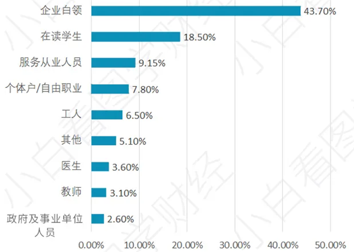

2. 心理健康市场（心理咨询市场）

   * 2020年，全球心理咨询行业市场规模达到542.9亿美元，较2019年增长5.58%。企查查数据显示：2019年底我国心理咨询机构总数为6649家，2020年11月企业数增长至8241家。 按照世界卫生组织“每千人拥有一个心理咨询师是健康社会的平衡点”的建议，中国至少需要140万名心理咨询师。

   * 目前，我国的中国心理咨询业发展初具规模，2020年我国心理咨询业市场规模达到480.4亿元，同比2019年增长10.92%。然而，目前我国持证的心理咨询师全国约为130万人。相比美国等发达国家，中国心理咨询师存在着巨大的缺口。

     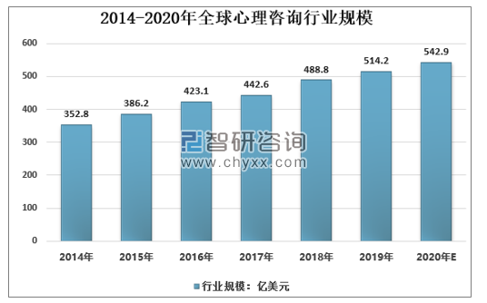

   * 智研咨询发布的《2021-2027年中国心理咨询行业发展现状调查及投资前景趋势报告》内容显示，伴随经济社会的快速发展，中国居民的生活节奏逐渐加快。部分居民在生活、工作、学习等方面的压力无法排解，导致心理障碍及心理问题的产生。为降低因心理问题导致的社会恶性事件，政府对于居民心理问题干预、精神卫生方面的支持力度逐渐加大，居民寻求心理咨询的需求持续增长，推动行业市场规模显著扩大。

   * 由此不难看出，心理咨询市场具有很大的发展潜力。本款APP聚焦在升职加薪、身体心理重重压力下的上班族身上，针对性地提供心理咨询服务，具有巨大的发展上升空间。

### 4. 竞品分析

我们的竞争对手主要是运动类和心理放松类两类软件。

1. 健康类：keep

   *Keep*在运动饮食健康方面是我们的竞争对手，这款软件是健康分类的顶级软件，他们提供包括运动教程、运动推荐、健康饮食、交流社区、好物商城的完整服务闭环。Keep在健身内容方面，有着丰富的课程和内容，不仅适合无锻炼基础的小白，也适合有健身基础的老鸟。Keep有着丰富的课程和讲解，并提供AI计算哪多定制服务，使得交互性很强；Keep有着最完整最高质量的社区，而且Keep开始做软硬件结合，近期在内置商城中推出了包括跑步机、手环、瑜伽垫、鸡胸肉等物品。Keep的劣势就是他们对特殊群体提供的特殊服务较少，他们都在做普适性的内容。Keep的主要业务包括饮食推荐、个性化训练、讨论社区、分享、健身课程、商城、与线下结合的活动，包括线下的商城实体店和健身房，同城见面活动等。Keep聚焦于有健身兴趣的群体，不仅包括健身小白，也包括有健身基础的老鸟。

2. 放松类：心潮

   *心潮*在心理减压方面是我们的竞争对手，这款软件是心理、睡眠管理的顶级应用，他们提供了减压、睡眠、冥想和专注的服务，有着很大的用户基数。心潮有着大量的内容基础和用户基础，它不用借助外部设备，能缓解心理压力、改善睡眠、通过生物反馈实现快速情绪调节。心潮的劣势就是他们对特殊群体提供的特殊服务较少，他们都在做普适性的内容。心潮的主要功能有白噪音、身体监测服务、睡眠改善、减压放松、情绪调节、专注提升等。心潮聚焦于有心理压力想通过简单方法快速改善的人。

我们的客户群体为期望得到身体心理放松的上班族，这与上述软件的群体有重叠，会有影响，并且他们的市场基础很大，我们产品的收入和利润在初期时会受到他们的影响。

### 5. SWOT分析矩阵

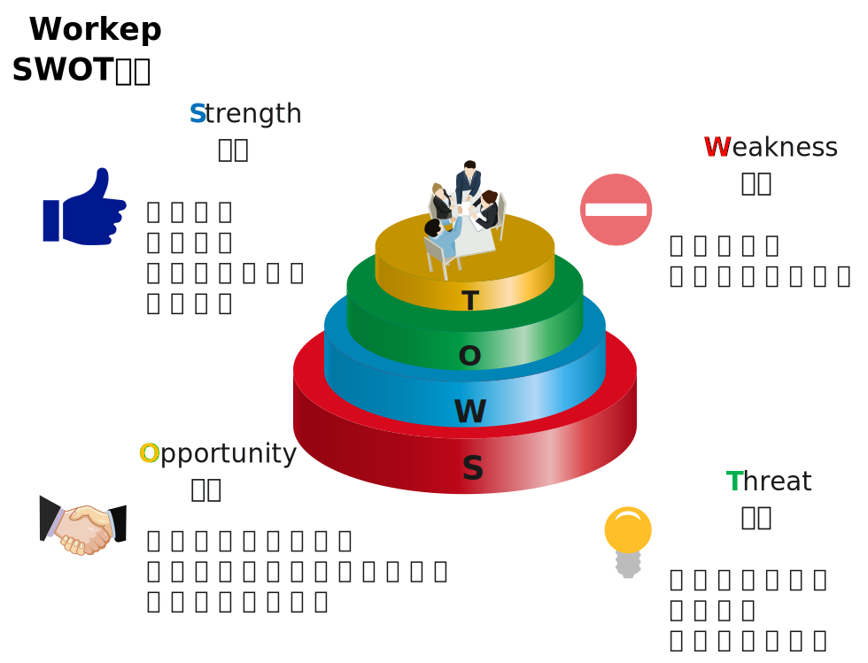

#### 5.1	SW评估

1. 	价值主张

| 问题                                   | 评分(-5~5) | 打分理由                                                     |
| -------------------------------------- | ---------- | ------------------------------------------------------------ |
| 我们的价值主张与客户需求一致           | 4          | 我们的价值主张涵盖了定制化、便利性、一站式服务等多个基于用户需求的要素。为客户量身打造满足其身体、心理健康要求的APP，与客户需求基本一致。 |
| 我们的价值主张具有很强的网络效应       | 5          | 本APP集成了“暖心小舍”“问答空间”等多个互动交流社区，重视用户共情和社交需求，有利于加强用户关系网的建立以及UGC的持续产出。 |
| 在我们的产品和服务之间有很强的协同效应 | 4          | Workeep实现了产品与服务的强耦合。以为用户提供身心健康帮助服务为核心，我们的“好物商城”“干饭攻略”等模块提供了物质上（健康食品、运动器材）和内容上（攻略、计划建议）的高质量产品。 |
| 我们的客户非常满意                     | 5          | 我们的价值主张中“差异化定价”为用户提供分级的付费、免费服务，为不同需求层次的用户提供不同的解决方案。同时，“一站式服务”更是聚焦用户个性化需求，量体裁衣，有利于顾客满意度最大化。 |

2.	成本收入

| 问题                                     | 评分(-5~5) | 打分理由                                                     |
| ---------------------------------------- | ---------- | ------------------------------------------------------------ |
| 我们有较高的利润率                       | 2          | 对于互联网轻资产的APP来说，盈利、变现永远是一件难事。因为要么形成竞争优势，拿到行业多数利润，要么在竞争的过程中就巨额亏损了。就算是竞争优势，可能因扩张时的成本过高，真正转亏为盈也需要时间。但毕竟是轻资产软件，至少好过传统重资产企业。 |
| 我们的收益是可预测的                     | -2         | 我们的主要收入是广告费、会员费、渠道分成，都不是特别稳定的来源，需要基于广告方、软件用户、合作方的信任。 |
| 我们有很多经常性收入，有很多回头客       | 3          | 我们可以通过给长期使用用户发放各种折扣券、优惠券，赠送短期会员，开通自动续费会员等功能，争取留存会员用户。通过给广告商和合作方优惠，维持与他们的合作。 |
| 我们的收入来源是多样化的                 | 1          | 我们的目标收入来源主要是广告费、会员费、渠道分成3类，并不十分多样。 |
| 我们的收入来源是可持续的                 | 3          | 通过合适的经营策略，我们可以提高用户留存率，加强广告业务，将收入稳定下来。 |
| 我们在支出成本之前就有收入进账           | -3         | 在支付一定成本，宣传产品、获得用户之前，我们不太可能获得收入。 |
| 客户真正想买的就是我们提供的             | 5          | 我们强烈反对诱导和欺骗客户进行消费，我们会真诚地告知客户我们在健康需求闭环上能提供的服务和存在的不足，确保客户真正想买的就是我们提供的。 |
| 我们的定价机制可以抓住客户全部的购买意愿 | 5          | 我们会提供多种定价方式让用户灵活选择支付的方式。比如是否开通自动续费、选择多久的会员、选择哪样的折扣券等等。 |
| 我们的成本是可预测的                     | 4          | 我们的成本包括人力成本、基础设施成本、营销成本、合作成本等，这些都不是有重大变化可能的成本。 |
| 我们的成本结构与商业模式是完全匹配的     | 5          | 我们针对我们提供的关键业务和价值主张，详细审视了成本结构。   |
| 我们的运营低成本、高效率                 | 5          | 我们是轻资产的互联网软件，并且志在团队中共享收益、不养懒人，高效的运维和经营产品。 |
| 我们受益于规模效应                       | 2          | 仅就目前，我们的产品与规模效应关系不大，可能也只有在服务器性能等不十分重要的环节上与此相关。 |

3.	基础设施

| 问题                                         | 评分(-5~5) | 打分理由                                                     |
| -------------------------------------------- | ---------- | ------------------------------------------------------------ |
| 竞争对手很难复制我们的核心资源               | -3         | 我们的核心资源包括高性能服务器，健康知识仓库，专业团队等，这些部分都是可复制的 |
| 我们的资源需求是可预测的                     | 3          | 我们绝大多数的资源需求都是可预测的，包括稳定的服务器、健康知识内容、专业的人员和团队等 |
| 我们在恰当的时间合理的调配核心资源           | 3          | 对核心资源的调配建立在对资源需求的预测上，只要能正确预测资源需求，就能合理调配核心资源 |
| 我们高效的执行了关键业务                     | 4          | 我们能够高效执行关键业务，我们在关键业务上进行了仔细设计。   |
| 我们的关键业务很难被复制                     | -1         | 市面上已经有较多的竞品，很多竞品实现了我们一部分的关键业务   |
| 我们的执行质量很高                           | 3          | 已经定下商业模式，就严格按照商业模式设计书执行               |
| 我们很好的平衡了自主业务和外包业务           | 3          | 我们讲物资准备、线下门店、专业心理咨询等业务完全外包，其他部分几乎都是自主实现的 |
| 我们专心致志，并且在必要的时候与合作伙伴合作 | 5          | 合作共赢是所有人都离不开的，我们要在做好自己本身原有的工作上，积极和伙伴合作 |
| 我们和重要合作伙伴的工作关系十分融洽         | 3          | 要建立和物资供应商、软件支撑者、心理咨询机构、线下饭店和线下健身房建立起融洽的合作关系。 |

4.	客户界面

| 问题                                     | 评分(-5~5) | 打分理由                                                     |
| ---------------------------------------- | ---------- | ------------------------------------------------------------ |
| 我们的客户的流失率很低                   | 4          | 市场上没有类似的专注于上班族健康且打造了健康闭环生态的软件   |
| 我们很好的细分了客户群体                 | 2          | 并没有很好地分类，我们的客户既可以是缺乏运动，也可以饮食不规律 |
| 我们不断的获得新的客户                   | 5          | 健康市场还在持续扩张，疫情影响下人们健康意识越来越高         |
| 我们的渠道通路很有效率                   | 4          | 我们既有互联网大范围投放，也有政企定点投放，还有自身渠道建设 |
| 我们的渠道通路设置合理                   | 4          | 新用户既可以通过互联网，还可以通过自己所在的企事业单位，以及亲友推荐 |
| 我们的渠道通路与客户群是强接触的         | 4          | 通过线上线下结合，互联网范围和定点结合，用户可以很方便接触到我们的产品 |
| 我们的客户很容易就能看到我们的渠道通路   | 5          | 无论是网站、app还是线下，都是客户很容易看到的                |
| 我们的渠道通路被高度整合                 | 4          | 线上线下结合基本实现全覆盖                                   |
| 我们的渠道通路创造出了范围效应           | 4          | 流量时代我们需要加大投入，以在前期迅速形成良好的宣传效果     |
| 我们的渠道通路很好的匹配了客户群体       | 3          | 我们依旧需要加大和用户的线下交流                             |
| 我们有良好的客户关系                     | 4          | 我们有各类渠道和客户交流互动，接受客户反馈，形成良好客户关系 |
| 我们的客户关系品质与客户群体相匹配       | 5          | 针对不同的客户群体有完全定制化的专属服务                     |
| 客户切换的成本很高，客户与我们绑定了关系 | 5          | 当今市场上几乎没有类似软件，产品和对应各类服务耦合性极高     |
| 我们的品牌很强                           | 2          | 初期较弱但建设力度很大，服务质量很高，后期应该会具有良好品牌效应 |

#### 5.2 机会评估

| 问题                                                     | 评分(1~5) | 打分理由                                                     |
| -------------------------------------------------------- | --------- | ------------------------------------------------------------ |
|                                                          |           | ——————**价值主张中的机会**——————                             |
| 能通过把产品转化为服务而产生重复收入吗？                 | 2         | 我们的实体产品主要是好物商城中的健康食品和运动器材，其产生的服务多为后期维护如保修期返修以及食品推荐等等，产生重复收入难度较高。 |
| 我们能更优地整合我们的产品或服务吗？                     | 4         | 我们的产品和服务基本上保证了一致性，例如健康食品与“健康检测”服务相结合，运动器材与“强身运动”相结合等等，对于我们提供的每一项服务，基本上都有对应的产品供用户选购，实现了较好的整合。 |
| 我们还能满足客户的哪些额外需求？                         | 3         | 在我们的核心业务，即身心健康之外，我们开发了“自由社区”模块，为我们的用户提供了交流分享的平台，以满足他们除了身心健康之外的社交需求。 |
| 我们的价值主张还可能做哪些补充和外延？                   | 4         | 为了更好地实现用户“定制化服务”的要求，系统会收集用户的反馈进行自我改进和提升，并安排审核人对所有内容进行审核，并通过打标签的方式给用户以提示，同时我们也鼓励专业人员自我发布获举报不实内容，改善平台环境。 |
| 我们还能为客户做哪些工作？                               | 4         | 在平台上提供一个专业的心理咨询服务窗口，因为心理问题很难通过简单的普适性内容彻底解决，专业的心理咨询服务会帮我们形成集饮食健康、身体健康和心理健康的闭环，真正的一站式解决问题。 |
|                                                          |           |                                                              |
|                                                          |           | ——————**成本收入中的机会**——————                             |
| 我们能将一次性交易收入改为重复性收入吗？                 | 4         | 对于会员定价，我们不希望有终身会员，而是推出多个确定时间段的会员支付方式。 |
| 客户还愿意为哪些元素买单？                               | 3         | 定制的心理咨询服务、营养食谱制定、专属健身计划               |
| 我们有内部交叉销售或者和合作伙伴交叉销售的机会吗？       | 5         | 在重要合作和关键业务中，我们就设想了与各种健康餐供应商、锻炼器材供应商的合作。 |
| 我们还能增加或者创造哪些其他的收益来源？                 | 2         | 很难，许多同类软件都倒在了变现的道路上。在获得足够多的用户之前，增加太多增值服务的地方，反而会流失用户。 |
| 我们能提价吗？                                           | 2         | 很难，作为轻资产的互联网软件，用户和流量就是核心，如果贸然提价，势必会流失用户。 |
| 我们能在哪里削减成本？                                   | 3         | 提高经营效率，减少人力成本；优化软件性能，减少硬件开销；提高宣传性价比，降低营销成本。 |
|                                                          |           |                                                              |
|                                                          |           | ——————**基础设施中的机会**——————                             |
| 我们能使用成本更低廉的资源获得同样的效果吗？             | -3        | 低质量的劣质文章会导致用户的体验变差，现在是内容为王的时代，我们无法为了节约成本去降低内容质量 |
| 哪些核心资源适合转移给合作伙伴？                         | 2         | 健康知识仓库可以外包给专业的团队，我方提出大纲，他们负责填充 |
| 哪些核心资源开发不足？                                   | 1         | 专业团队需要细化和扩充，我们需要对用户做大量的共情，所以需要许多相关人才 |
| 我们有没有哪些没有使用的知识资产对别人是有价值的？       | 3         | 软件中用户留下的使用痕迹会生成他的用户画像，可以让广告商智能投放广告 |
| 我们能将某些关键业务标准化吗？                           | 4         | 包括健康自测、强身运动、健康助手等关键业务都是标准化、自动化甚至是智能化的 |
| 我们能提升整体效率吗？                                   | 3         | 能，需要队伍的团结一致，并需要积累一段时间的经验，就可以提升团队工作效率 |
| IT能够提升效率吗？                                       | 3         | 能提升一部分，例如我们的可以提供AI搜索技术，给用户精确推荐他想要的内容，并安排智能客服，从而提升售后效率 |
| 有外包的机会吗？                                         | 2         | 可以将健康知识仓库的内容外包给其他专业的团队                 |
| 与合作伙伴扩大合作能够帮助我们聚焦核心业务吗？           | 3         | 与合作伙伴的合作已经帮助我们聚焦核心业务了，若扩大合作，更能聚焦 |
| 有与合作伙伴交叉销售的机会吗？                           | 5         | 可以为线下的物资场地提供商和专业的心理咨询机构打广告，之间也可以搞促销提高销售量 |
| 合作伙伴的渠道能够帮助我们更好地连接客户吗？             | 4         | 企事业单位可以给我们扩大客户来源，线下场地提供商和心理咨询机构可以为那些空闲时间零碎化的人推荐我们的产品 |
| 合作伙伴能够补充我们的价值主张吗？                       | -3        | 我们是根据价值主张寻找合作伙伴                               |
|                                                          |           |                                                              |
|                                                          |           | ——————**客户界面的机会**——————                               |
| 我们如何能从一个增长的市场中获益？                       | 4         | 我们需要不断完善健康生态圈闭环，迭代出新功能，不断吸引新用户 |
| 我们能服务新的客户群体吗？                               | 4         | 健康需求是所有用户都具备的，虽然我们的产品目前专注于为上班族服务，但后续也可以拓展至学生以及中老年人群体 |
| 我们能够通过更加细致地给客户分类来更好地服务客户吗？     | 3         | 可以根据客户的工作性质、工作时间、工作方式等方面继续细分客户，提供对应的高质量服务 |
| 我们如何能提升渠道的效率和效益？                         | 4         | 除了加大线上的宣传营销推广，我们还可以通过扩大线下政企事业单位合作，定点推广 |
| 我们能更好地整合渠道吗？                                 | 2         | 我们的渠道已经明确分工，各司其职，可重合整合的内容偏少       |
| 我们能够找到补充性的新渠道伙伴吗？                       | 3         | 我们可以通过用户的影响力扩展新的渠道，如在用户就职的单位进行定点宣传 |
| 我们能够通过直接服务客户来提升利润吗？                   | 4         | 我们提供的绝大多数服务都是直接服务于客户的，尤其是付费的定制化专属服务 |
| 我们能够更好地匹配渠道和客户群体吗？                     | 3         | 未来可以在对客户群体进一步精细化分类的基础上分别匹配更合适的渠道 |
| 有可能提升客户跟进的效果吗？                             | 5         | 可以通过收集用户在好物商城和社区的反馈，以及发放体验问卷，收集应用市场评价等方式提升客户根进效果 |
| 如何能让我们与客户的关系更加紧密？                       | 4         | 提供尽可能多的高质量服务，提供极致的UI交互式体验，维护有多种反馈互动渠道 |
| 我们能够在定制化上面做改进吗？                           | 4         | 我们的产品本来就是以定制化服务为一大利益来源，势必需要在这方面不断提升，而定制化UI也是几乎所有软件的必备项目 |
| 我们如何能够提升客户的切换成本？                         | 3         | 提高社区活跃度，提升专属服务，让用户自发形成圈子，互相绑定，同时利用高质量服务绑定更多用户 |
| 我们识别并“炒掉”了没有利润的客户了吗？如果没有，为什么？ | 1         | 没有，我们始终认为免费体验的用户都有潜在的消费欲，且是我们的重要资源，可以通过免费用户建立口碑，同时提供高质量专属服务促使更多免费用户主动消费体验 |
| 我们需要让某些客户关系变得可以自动维护吗？               | 3         | 社区管理时可以引入专业机制，让专业领域的用户加入维护         |

#### 5.3 威胁评估

| 问题                                                   | 评分(1~5) | 打分理由                                                     |
| ------------------------------------------------------ | --------- | ------------------------------------------------------------ |
|                                                        |           | ——————**价值主张中的威胁**——————                             |
| 存在可替代的产品和服务吗？                             | 1         | 本款APP立足于对于上班族身心健康全方位关怀，构建了“健康检测”“自由社区”“暖心小舍”等八项关键业务，体系较为完善（集成度较高）。价值主张中“定制化服务”“一站式”等理念也使我们的产品和服务更具个性化，更贴合用户的各类需求。因此相较于目前只局限于单方面提供服务的APP来说，本APP的可替代性较低。 |
| 竞争对手会报出更有竞争力的价格，或者提供更好的价值吗？ | 2         | 当前由于都市上班族的市场逐渐显现，未来为其量身打造服务的APP必将逐渐涌现，激烈的竞争不可避免。但如果我们把握住先发优势，打造好“定制化”和“一站式”等服务方式，我们在品牌影响力、渠道、合作伙伴等多方面的优势将逐步建立，当我们能做到行业内数一数二之时，竞争对手将难以提出更具竞争力的价格或提供更好的价值。 |
|                                                        |           |                                                              |
|                                                        |           | ——————**成本收入中的威胁**——————                             |
| 我们的利润受到竞争对手的威胁吗？是技术原因造成的吗？   | 4         | 受到竞争对手威胁，比如keep在运动健康领域给我们软件威胁很大；这种原因不是因为哪一方拥有核心科技，而是大家的技术水平都差不多，很难体现技术差距，没有谁能拉开差距。 |
| 我们过多地依赖某一项或多项收益来源吗？                 | 3         | 在渠道成熟之前，会员费和广告费应该是我们收入的两个最主要部分，我们较为依赖这两项。 |
| 未来有哪些收益来源会消失？                             | 1         | 除非某一项收益特别失败，否则几乎不会消失。                   |
| 哪几项成本会变得无法预测？                             | 2         | 可能只有营销成本是无法预测的。                               |
| 哪些成本的增加会快过它们所支撑的收入？                 | 3         | 如果进入了产品在市场上扩张的节奏，那么营销成本、人力成本、软件运维成本、合作成本，都非常容易增加。但如果产品是维持市场，那么可能只有软件运维成本、合作成本会继续增加。 |
|                                                        |           |                                                              |
|                                                        |           | ——————**基础设施中的威胁**——————                             |
| 我们会面临某些资源的供应短缺吗？                       | 3         | 可能服务器的稳定性会有波动，其他资源不会一时短缺             |
| 资源的质量能够保证吗？                                 | 3         | 我们会安排一个小部门专门负责保障资源质量                     |
| 哪些关键业务会被打扰？                                 | -1        | 我们的自由社区社区可能会被恶意攻击，会出现不当言论           |
| 我们的活动质量会受到威胁吗？                           | 3         | 活动会由专业的策划人和执行者完成，不会受到威胁               |
| 我们有可能会失去哪些合作伙伴？                         | -3        | 有可能被竞争对手竞争走，所以我们要和合作者展开长期稳定的合作关系 |
| 我们的合作伙伴有可能和竞争对手合作吗？                 | -3        | 非常可能，因为竞争对手也需要相同的或类似的合作               |
| 我们是不是过分依赖某些合作伙伴了？                     | -5        | 无论是物资平台提供商，还是软件提供商和心理咨询机构，我们都十分依赖 |
|                                                        |           |                                                              |
|                                                        |           | ——————**客户界面中的威胁**——————                             |
| 我们的市场很快会饱和吗？                               | 2         | 上班族的健康问题是一直存在并被持续重视的，也不断会有新上班族涌入，市场不会很快饱和 |
| 有竞争对手在威胁我们的市场份额吗？                     | 1         | 目前市场上还没有和我们一样专注于上班族健康生态圈的竞争对手出现 |
| 客户转投竞争对手的可能性有多高？                       | 2         | 我们提供的服务和创新思路通常不会让客户转投竞争对手，但不排除后续出现一系列效仿的产品 |
| 我们市场中的竞争多快会变得白热化？                     | 3         | 健康市场还依旧没有饱和，但随着人们健康意识增强，越来越多的产品公司注意到这块市场的巨大收益，未来竞争势必更加激烈 |
| 竞争对手会威胁我们的渠道吗？                           | 3         | 竞争对手可能会通过抢夺资源、恶意造谣等方式对我们产品的品牌建设造成影响，因而我们需要在前期快速建立起品牌信誉度 |
| 我们的渠道有变得和客户不相关的危险吗？                 | 2         | 线上推广宣传可能会和客户产生隔阂，但我们也有完整及时的反馈渠道等可以和客户直接连接 |
| 我们的客户关系有可能恶化吗？                           | 1         | 我们有专业团队和完整的筛选机制应对社区建设，同时有实时渠道供客户反映问题建议，提供帮助，能够很好地维护客户关系 |

## 三、主要产品介绍

### 1. 产品描述

我们开发的软件是一款典型的互联网轻资产软件。它有以下特点和内容：

- 价值清晰，主题明确：我们的核心主题就是“打造（互联网时代）健康需求的（轻量级）闭环”，我们集成了常见的健康领域的分散的四大主题——运动、养生美食、心理咨询、健康提示，并进行有机融合，旨在使这些不同板块的业务共同为用户的健康服务。
- 重视沟通互联：互联网使得人们的沟通交流成本大大降低，我们既推崇多边交流的社区，期待能在社区中为用户更好地服务；也期待用户能在社区中创造出精品内容，既收获我们的创作补贴，也为社区繁荣做贡献。
- 重视便利性、可获得性：我们认为互联网的一个重大意义在于，让极其广大的群众都能享受到成本低廉的优质服务。所以我们在几乎所有关键业务中都加入了人人都能享受的服务，同时也借助互联网软件的本身特点，使得它使用简单方便
- 重视差异性和专属服务：广大与精微间是辩证的关系，我们既努力为最广大的群体服务，也充分重视到用户群体内部的差异性。我们不会忽视有较强消费升级能力的用户，会为他们提供更加匹配他们消费的定制服务，增强他们的消费体验。
- 重视社区与用户的内容共同创造。有许多著名企业是靠着社区良好的社区建设而超越竞争对手，我们的社区同样可以在围绕核心主题——健康的前提下，向多元的主题发展，靠着对用户创造内容的补贴，创造一个繁荣的社区，进而反作用于产品本身的内容繁荣。
- 重视简约、和谐的设计风格，简约的理念是易于理解的，能很方便地体现健康的主题。在设计上避免过于花哨、华丽、复杂的风格，力求以和谐、统一、直观而不呆板、不简陋的风格吸引用户。
- 内容紧扣主题，运动、美食、心理、健康提醒四大板块作为吸引用户的根本基础；自由社区在功能基础上，作为留存用户、扩大流量的扩展；好物商城又在自由社区的基础上，作为一个增加收入来源，同时又能反馈用户的扩展。

### 2. 功能介绍

1. 登录

   用户输入手机号码或密码进行账号验证，验证通过即登录进入主页。未来计划提供更多登录方式，如QQ账号外链登录、微信账号外链登录或者手机验证码登录等方式。

   

   2. 个人页面

      个人页面显示个人昵称、头像、是否会员等信息，下部有软件产品几个核心模块的标签。

      

   3. 美食

      美食部分主要提供3个功能：健康食谱、基于用户位置的餐厅推荐以及营养学知识分享。三者均采用卡片式布局。美观而简约。

      

      

      

      

      

      

   4. 运动

      运动板块的内容，主要包括个人的运动课程库、运动计划库和推荐运动计划、推荐运动课程等。用户也可以搜索自己感兴趣的相关运动内容。同时针对会员提供个人定制的运动计划。

      

      

   5. 小舍

      为用户心理健康服务的功能。包括心理咨询和心理知识科普两大部分。同样采用卡片式布局。

      
   
      
   
   6. 社区
   
      社区功能允许用户自由发帖、关注用户，并进行评论、点赞、收藏等互动行为。同时，我们还会针对互动数、浏览数提供每日、每周、每月等的热门帖子榜单，便于用户追踪热点。
   
      
   
      
      
      

### 3. 使用场景

**用户地理集中情况：** 用户在地理位置上具有明显的分散的特点

**各类用户使用系统的时间状况：**

| 用户类别       | 使用时间状况             |
| -------------- | ------------------------ |
| 平台管理员     | 全天使用                 |
| 用户（上班族） | 全天使用，主要集中在白天 |
| 心理咨询师     | 工作时间使用             |

**数据生成和使用情况：**

| 数据类型         | 生成出处                 | 使用情况                                                     |
| ---------------- | ------------------------ | ------------------------------------------------------------ |
| 用户资料         | 用户填写或历史数据的分析 | 用于用户分析，为用户进行一定的推荐服务；用户也可用通过用户资料查看自己的健康信息 |
| 心理咨询师信息   | 由心理咨询师进行填写     | 心理咨询师的信息将展示给用户，用户可以通过其信息选择自己想要咨询的心理咨询师进行咨询 |
| 企业信息         | 由企业提供               | 企业可以在社区发布团建活动，同时企业信息将被展示给用户，感兴趣的用户可以选择是否加入活动 |
| 营养食谱信息     | 由专业营养师填写         | 用于平台向用户提供兼具能量，营养，价格优势的三餐攻略         |
| 推荐餐厅信息     | 由平台分析后提供         | 用于平台向用户提供推荐健康，实惠，美味的餐厅                 |
| 强身运动指导视频 | 由专业的健身教练提供     | 用于平台提供视频指导用户完成标准规范的强身运动               |
| 好物商城商品信息 | 由平台整理商品储备后提供 | 用于平台向用户提供包括靠枕，人体工学鼠标等提升工作幸福感的好物以及缓解视觉疲劳的蒸汽眼罩，眼药水等和健康相关的商品信息展示，用户根据自己的情况可选择购买。 |
| 心理知识信息     | 由专业心理师发布         | 用于平台向用户提供一些专业心理知识和一些常见心理问题的自我调解方案 |

**访问数据的最大响应时间：1s**

**用户能否忍受服务中断：否**

**是否需要提供访问安全控制和数据保护：需要**

## 四、财务分析

### 1. 投融资分析

#### 1.1 股本结构与规模

根据增值电信业务经营许可证的申请条件，本项目计划注资150万元。其中30万来自天使投资。

由于创业团队在前期项目研发中投入大量的人力物力，因此总计入股120万。本项目前期投入约70万，其中人力成本25万，场地建设和技术开发所需服务器以及配套显卡等共计53万，另有商标注册费、设立登记费等杂项开支共计两万，前期投入全部利用课题经费解决，没有额外的支出和负债。

由于公司处于初创阶段，为了保证团队的执行力和在重大事项上的判断力，因此决定将初始股权先按照9：1的比例分为两份，分别为团队内部保有以及外部融资方所有。内部再按照 14:3:1 的比例分成三份。

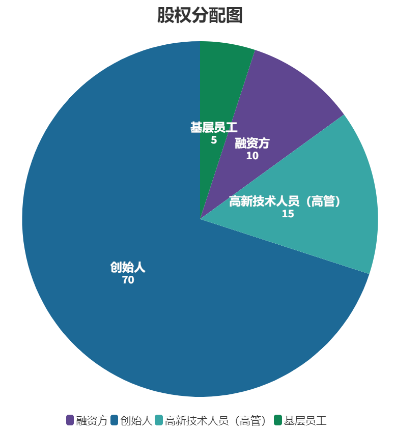

作为高新技术企业，人力成本在技术研发中占据最为主要的部分，由于我们的主要技术产品已经成型，因此在创业初期没有巨大的资金需求，无需进行大量的对外融资。因此为了减少财务杠杆给初创企业带来的财务风险和偿债压力，团队决定采用股权融资而非债权融资。同时团队要求保有90%的要求权，以保证初创团队对项目的控制和项目运行的稳定性。

70%由创始人持有，考略到可能存在多轮融资（天使轮、ABCD轮等等）带来的股权稀释问题，需要在初创情况下提高核心创始人所持有的股份，以防止创业团队经常面对的话语权（控制权）纷争，导致决策难以推进甚至失败的情况。

15%分给团队的一些骨干如高新技术人员，这是考虑到互联网企业的业务相对细分和垂直，需要许多不同方向的运营团队，亦即团队的高层可以较为精简，只能高层和基层员工较为庞杂。可以使用逐步释放股权的策略将高层人才留住，并吸引未来的合伙人或高管。

剩下5%则分配给其他剩余基层员工，作为激励用的期权池，促进各个团队间的良性竞争与合作。

#### 1.2 投资收益分析

根据投资收益分析的一般过程，下文中加分别对普通股每股净收益、股息发放率、本利比、市盈率、投资收益率、每股资产以及净资产倍率等指标进行分析。 

##### 1.2.1	普通股每股净收益

$$
普通股每股净收益 = \frac{净利优先股息}{发行在外的加权平均普通股股数}
$$

我国公司法没有关于发行优先股的规定，因此普通股每股净收益等于净利除以发行在外的股份总数。该指标反映了普通股的获利水平，指标值越高，每一股份可得的利润越多，股东的投资效益越好，反之则越差。

因此为保证每股净收益维持在一个较高的水平，一方面要控制发行在外的股份数，另一方面需要提高净利润。通过在南方财务网上一些企业的调研，得到2020年平均净收益大概在0.3到1.1左右，且面向不同行业服务的软件公司每股净收益有明显的区别。因此作为初创公司将目标每股净收益定位0.5左右较为合理。

##### 1.2.2	股息发放率

$$
股息发行率= \frac{每股股利}{每股净收益} × 100\%
$$

股息发放率反映了普通股股东从每股的全部净收益中分得多少。就单独的普通股投资者来讲，这一指标比每股净收益更直接体现了当前利益。股息发放率的高低要依据各公司对资金需要量的具体状况而定。

股息发放率的高低取决于公司的股利支付策略，作为初创公司应当采取**剩余股利政策**，即公司生产经营所获得的净收益首先应满足公司的资金需求，如果还有剩余，则派发股利。初创公司可能面临大量的投资机会，因此想要扩大公司的规模，必然将资金优先投入到投资当中而非发放股利。因此前期可能会产生股息发行率较低的情况，但是等到规模扩大后，会适当调整股利支付政策以提高该指标。

##### 1.2.3	市盈率

$$
市盈率= \frac{每股市价}{每股净利}
$$

市盈率是衡量股份制企业盈利能力的重要指标，能够反映投资者对每1元净利所愿支付的价格。一般来说市盈率越高，说明公众对该股票的评价越高，公司未来成长的潜力越大。可以看到近年来在科创版上市的科技创业公司，包括AI相关的新兴企业都能得到很高的“期望值评价”，市盈率被看好。本公司亦属于软件信息行业，在如今信息产业蓬勃发展的时代，市盈率的起点较高。

但是市盈率背后往往“暗藏杀机”，在市场过热、投机气氛浓郁时，常有被扭曲的情况，即“泡沫”的出现。因此公司不能只一味提高市盈率，还需将公司实际运营情况纳入考虑范围，科学综合地评价公司的前景。

##### 1.2.4	投资收益率

$$
投资收益率=\frac{投资收益}{(期初长、短期投资+期末长、短期投资)/2} × 100\%
$$

投资收益率等于公司投资收益除以平均投资额的比值，反映了公司利用资金进行长、短期投资的获利能力。作为初创企业，一方面我们需要把握投资机会，包括在资本市场（债券市场、股票市场）的资金投入，同时加大运营投入以换取长期稳定的资金流。另一方面我们也需要对我们每次投资决策进行细致的评估、反思，以提升下一次决策的成功率，进而提高投资收益率的指标。

##### 1.2.5	每股净资产

$$
每股净资产=\frac{净资产}{发行在外的普通股股数}
$$

每股净资产是指净资产除以发行在外的普通股股数的比值。其中“净资产”是**资产总额与负债总额之差**，即所有者权益。该指标反映了每股普通股所代表的股东权益额。与上面所有衡量指标类似，提高每股净资产的方式在于一方面控制发行在外的股份数，另一方面提高净资产，即增加资产总值、降低负债总值，这与企业的运营状况息息相关，能够较为真实地衡量企业的运营状况。因此作为初创企业从一开始就需要做到收支的相对平衡，不断调整资本配置以达到稳定每股净资产的目标。

##### 1.2.6	净资产倍率

$$
净资产倍率=\frac{每股市价}{每股净值}
$$

净资产倍率是指每股市价与每股净值的比值，又称为市净率。净资产倍率表明股价以每股净值的若干倍在流通转让，可以用于评价股价相对于净值而言是否被高估。净资产倍率越小，说明股票的投资价值越高，股价的支撑越有保证；反之则投资价值越低。这一指标同样是投资者判断某股票投资价值的重要指标。

### 2. 财务预测 

#### 2.1 会计假设和主要会计政策

1. 本公司在遵循国家法律、法规、政策的前提下进行运营，在财务核算上遵循中华人民共和国财政部颁布的《企业会计准则》等相关财会制度的规范，依法纳税，守法经营，所做财务预算和分析均基于法律允许范围的收入、成本、费用等数据。
2. 会计期间：本公司会计年度采用公历年度，即每年自 1 月 1 日起至 12 月 31 日止。
3. 记账本位币：本公司会计核算以人民币为记账本位币，编制报表采用的货币为人民币。
4. 会计计量属性：本公司会计核算以权责发生制为记账基础，除交易性金融资产、 可供出售金融资产以公允价值计量外，均以历史成本为计价原则。公司生产经营好，不考虑计提各项资产减值准备。
5. 应付职工薪酬：应付职工薪酬按每年最后一个月的职工薪酬之和计提。
6. 应纳税费：增值税、城市建设维护税、教育费附加、企业所得税、地方教育费附加、个人所得税等。
7. 固定资产计价及折旧：电子设备与公司自用的服务器直线折旧法折旧年限为3年，残值率为5%。
8. 无形资产计价及摊销：无形资产直线折旧法折旧期限为10年，残值为0。
9. 应收账款：假设上一年的应收账款净额均可在下一年收回，每一年按照5%计提坏账准备。
10. 盈余公积：公司计提法定盈余公积比例为10%；公司计提任意盈余公积从2022年开始计提，比例为4% 。计提依据均为税后利润。
11. 研发支出：自用服务器电子设备等固定资产均可同时用于研发与产品服务，研发人员在开发新产品的同时还承担了系统更新换代与后台运维的任务，考虑到研发工作转化为可商业化产品的高度不确定性，为简化计算，前三年将全部无形资产摊销与固定资产折旧计入当年主营业务成本，直接费用化。
12. 营业收入的确定：本公司提供服务收入及产品收入在所有权发生变化、并取得收款凭证时确认。

#### 2.2 预测财务报表

##### 2.2.1 项目收入预测

本着谨慎性和重要性的会计原则，结合网上查询和日常观察，我们对“Workeep”的项目收入进行了合理谨慎的预测。项目收入明细表如下：

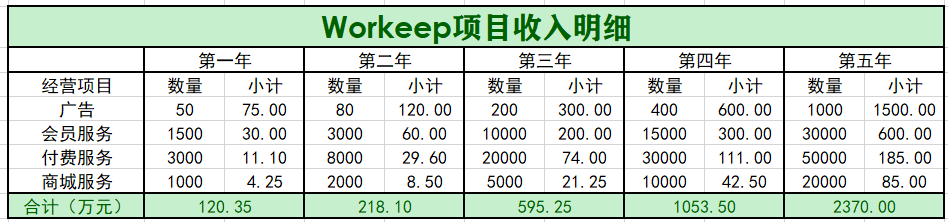

对于用户平台VIP来说，包年VIP价格为200元，单月VIP价格为20元。而对于在前期注册过VIP的客户再次需要续费时，我们可以长期续费的价格对其原有VIP直接进行续费，作为对老客户的福利。预计有50%的客户会选择在使用一年后会维持VIP充值。 

付费服务项目的单价通常较高，且不同项目之间的价格差距较大，一般在10至150元人民币区间范围内，根据目前与心理咨询师和营养师的洽谈情况和市场上不同运动健身课程的价格调查，预估在全部项目中50%的项目均价为10元，40%的项目均价在50元，剩余的10%均价为120元。

在好物商城，平台需要强大的服务器支持，以及完整高质量的供应链。很多个体用户选择直接在本平台购买平台精选的健康好物，因此我们与第三方物资商家以及厂家达成合作，从销售费用中抽成，抽成比例为50%，同时由于不同商品的价格差距较大，基于市场的走访调查，预估在全部销售中50%的订单均价为30元，40%的订单均价为100元，10%的订单均价为300元。

广告发放方面，不同商家的广告收费标准通常在1万元至2万元不等，此处为简化计算，预计其平均价格为每个广告项目1.5万元。

##### 2.2.2 项目支出预测

本着谨慎性和重要性的会计原则，我们细致考虑了公司的可能的成本费用，选取经常性科目列支，同时还通过网络查询、日常观察了解各项费用的价格或费率。项目支出明细表如下：

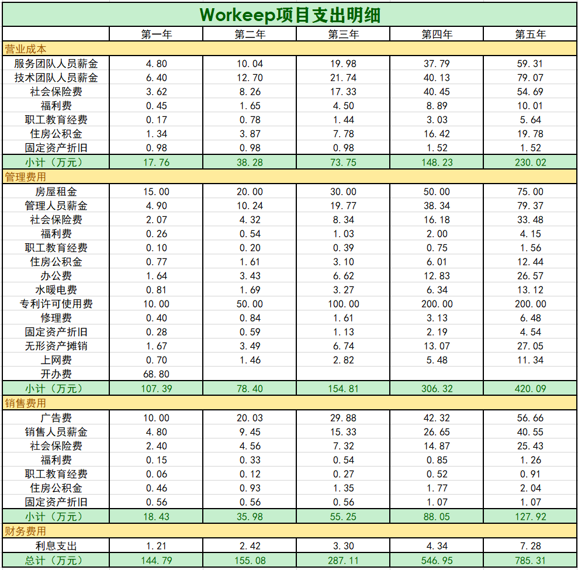

##### 2.2.3 资产负债预测

本着谨慎性和重要性的会计原则，结合现已确定的实际开支和洽谈情况，我们对“Workeep”的资产负债进行了合理谨慎的预测。项目资产负债明细表如下：

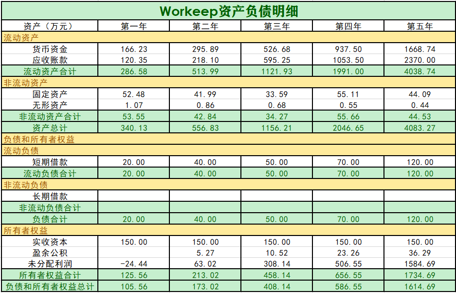

##### 2.2.4 财务报表预测

本着谨慎性和重要性的会计原则，结合项目收入预测明细表和项目支出预测明细表，“Workeep”的财务报表重要数据摘要如下：

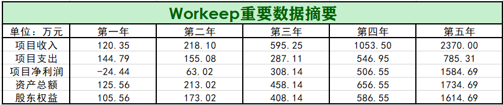

从上表可以看出，公司的营业收入、净利润连续五年迅速稳定增长，资产总额、股东权益迅速增多，公司规模不断扩大，前景良好。

#### 2.3 财务报表主要项目附注

##### 2.3.1 开办费用明细

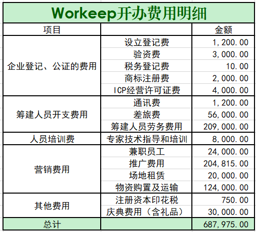

##### 2.3.2 固定资产、无形资产购置简表

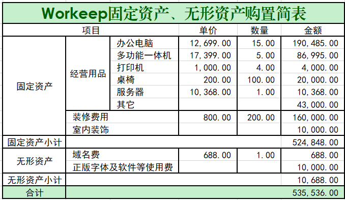

### 3. 财务比率分析

财务比率即一系列财务指标，而财务指标通常是从**偿债能力、营运能力、盈利能力、发展能力**四个方面进行衡量。

本着谨慎性和重要性的会计原则，结合现已确定的实际开支和洽谈情况，我们对“Workeep”的各种财务指标进行了合理谨慎的预测。项目财务比率分析表如下：

1.**偿债能力指标**主要有流动比率、速动比率和现金流动负债比率三项。

计算：

- 流动比率是指流动资产与流动负债的比率，表示每一元的流动负债有多少流动资产作为偿还保证。其计算公式如下:	

$$
流动比率= \frac{流动资产}{流动负债}
$$

- 速动比率又称酸性试验比率，是指企业的速动资产与流动负债的比率，用来衡量企业流动资产中速动资产变现偿付流动负债的能力。其计算公式如下:		

$$
速动比率=\frac{速动资产}{流动负债}
\\
其中，速动资产=流动资产-存货资产
$$

- 现金流动负债比率是企业一定时期的经营现金净流量同流动负债的比率，它可以从现金流量角度来反映企业当期偿付短期负债的能力。
  - 年经营现金净流量是指一定时期内，由企业经营活动所产生的现金及其等价物的流入量与流出量的差额。这里用每年的项目净利润作一个近似。

$$
现金流动负债比率=\frac{年经营现金净流量}{年末流动负债}×100%
$$

2.**营运能力**指的是企业的经营运行能力，即企业运用各项资产以赚取利润的能力。企业营运能力的财务分析比率有：存货周转率、应收账款周转率、营业周期、流动资产周转率和总资产周转率等。 这些比率揭示了企业资金运营周转的情况，反映了企业对经济资源管理、运用的效率高低。企业资产周转越快，流动性越高，企业的偿债能力越强，资产获取利润的速度就越快。

- 存货周转率是企业在一定时期内主营业务成本与平均存货余额的比率。用于反映存货的周转速度，促使企业提高资金使用效率，增强企业短期偿债能力。

  公式：
  $$
  存货周转率(次)=\frac{销售(营业)成本}{平均存货}
  \\
  平均存货=\frac{(年初存货+年末存货)}{2}
  \\
  存货周转率(天)=\frac{365}{存货周转率(次)}
  $$

- 应收账款是企业流动资产除存货外的另一重要项目。它是衡量企业应收账款周转速度及管理效率的指标。公式：

$$
销售净收入=销售收入-销售退回
\\
应收账款周转率=\frac
{当期销售净收入}{2} 
\\
当期销售净收入=期初应收账款余额 + 期末应收账款余额
$$

- 营业周期是指从外购承担付款义务，到收回因销售商品或提供劳务而产生的应收账款的这段时间。公式：

$$
营业周期=存货周转天数+应收账款周转天数
$$

- 流动资产周转率指企业一定时期内主营业务收入净额同平均流动资产总额的比率，公式为：

$$
流动资产周转率（次）=\frac{主营业务收入净额}{平均流动资产总额}
$$

- 总资产周转率是企业一定时期的销售收入净额与平均资产总额之比,它是衡量资产投资规模与销售水平之间配比情况的指标。总资产周转率越高，说明企业销售能力越强,资产投资的效益越好。

  公式为：
  $$
  总资产周转率（次）=\frac{营业收入净额}{平均资产总额}
  \\
  总资产周转率=\frac{销售收入}{总资产}
  $$

3.**盈利能力指标**主要包括营业利润率、成本费用利润率、盈余现金保障倍数、总资产报酬率、净资产收益率和资本收益率六项。

- 营业利润率＝（营业利润／营业收入）×100％
- 成本费用利润率=利润总额/成本费用总额×100%
- 盈余现金保障倍数=经营现金净流量/净利润
- 总资产报酬率=息税前利润/资产平均总额X100%
- 净资产收益率=净利润/净资产
- 资本收益率=净利润/实收资本×100%

4.**分析发展能力**主要考察以下八项指标：营业收入增长率、资本保值增值率、资本积累率、总资产增长率、营业利润增长率、技术投入比率、营业收入三年平均增长率和资本三年平均增长率。这里我们选取了前六项指标。

- 营业收入增长率=(营业收入增长额/上年营业收入总额)×100%
- 资本保值增值率=期末所有者权益÷期初所有者权益x 100%
- 资本积累率=当年所有者权益增长额÷年初的所有者权益×100%
- 总资产增长率=本年总资产增长额/年初资产总额×100%
- 营业利润增长率（销售利润增长率）=本年营业利润增长额/上年营业利润总额×100%
- 技术投入比率=本年科技支出合计/本年营业收入×100%

## 五、运营规划

### 1. 产品开发规划

1. 研发计划与时间表：1月10开始开发--4月1日产品内部测试--5月1日产品上线

| 开发内容   | 开始时间 | 结束时间 | 责任部门       | 工作人员 |
| ---------- | -------- | -------- | -------------- | -------- |
| 立项       | 1-10     | 1-17     | 产品部         | 全体     |
| 成立项目组 | 1-10     | 1-17     | 产品部、技术部 | 全体     |
| 产品设计   | 1-10     | 1-25     | 产品部         | 全体     |
| 美术设计   | 1-15     | 2-15     | 产品部         | 美工     |
| 程序开发   | 1-21     | 4-1      | 技术部         | 程序     |
| 测试       | 4-1      | 5-1      | 产品部、技术部 | 程序     |

### 2. 市场策略及业务拓展计划

#### 2.1 阶段分析

##### 2.1.1 试运行期-市场渗透-低利润期

在我们的产品刚进入市场时，为快速聚拢人气，将以北上广深四个超一线城市为试点地，不断向全国辐射。

- 区域：市场渗透的重点在普及上班族群体，因而选择北上广深四大超一线城市，以期快速提高知名度，拥有更高的存活可能性。
- 份额：在发展初期，势必要投入较大成本用以产品宣传，市场份额不是主要考核标准，知名度提升往往更为关键。

##### 2.1.2 发展期-市场开拓-扩大销量

渡过了艰难的试运行期后，产品将以北上广深四大超一线城市为根据地，努力在全国各大中心城市取得更大的市场份额。

- 区域：以北上广深四大超一线城市为强大的背后支撑，逐步在各大中心城市建立知名度，借此与更多心理咨询机构、第三方商家建立战略合作关系，不断更新产品，巩固市场地位。
- 份额：随着市场份额上升，我们迎来了销售量的增长，同时努力与供应商达成较低的价格，企业收入来源逐渐由高利润产品向高销售数量转变。

##### 2.1.3 成熟期-市场占领-利润回报

进入成熟期，产品在全国已有一定基础，将进一步进军全国市场，普及广义的上班族，如硕士生博士生、自由职业者等，以期更大的市场份额，更多的利润回报。

- 区域：经过一段时间的生存竞争和扩张，产品在全国已具有一定影响力。为进一步把握和控制市场的主动权，企业将着力打造企业文化、品牌故事，以品牌优势最大限度占领全国市场份额。
- 份额：为了取得竞争优势、遏制和驱赶竞争者，我们利用已有的品牌地位和掌握的大量顾客和合作者降低成本，力推产品的低成本优势，以不断创新的优质服务型商品和丰富化的定制化基本商品吸引更多的消费者，将高销售量作为企业的关键盈利点。

#### 2.2 策略与拓展计划

##### 2.2.1 概述

|            | 试运行期                                             | 扩张期                                                       | 成熟期                                                       |
| ---------- | ---------------------------------------------------- | ------------------------------------------------------------ | ------------------------------------------------------------ |
| 销量       | 低销售量                                             | 迅速增长                                                     | 销量高峰                                                     |
| 成本       | 单位顾客成本最高                                     | 单位顾客成本一般                                             | 单位顾客成本最低                                             |
| 顾客       | 超一线城市上班族                                     | 中心城市上班族                                               | 全国广义上班族                                               |
| 竞争者     | 极少                                                 | 增加                                                         | 稳定                                                         |
| 市场份额   | 占领市场                                             | 份额最大化                                                   | 保持份额                                                     |
| 利润       | 负利润                                               | 实现盈利，利润上升                                           | 稳定高利润                                                   |
| 服务       | 强身运动、养胃美食、暖心小舍和自由社区板块的基本服务 | 推出好物商城、健康助手等特色服务，建立健康闭环一条龙式服务   | 继续增加特色业务，并致力于提高服务质量                       |
| 价格       | 相对低廉固定的付费服务                               | 动态调整价格，商城浮动价格，付费服务采取中端的满意定价法，价格和用户行为相关 | 逐渐建立行业地位，适当下调成本维持高销量                     |
| 渠道       | 建立可用的线上线下推广渠道                           | 渠道推向全国，加强线上渠道覆盖率，线下渠道特色化品牌化       | 线上线下渠道结合，覆盖全国市场                               |
| 促销和广告 | 集中精力在四大城市开拓市场，借密集广告促销聚拢人气   | 完善会员机制与引荐激励计划，加强和城市上班族特点的结合       | 打造产品文化，通过突出特色精品服务，优化服务生态圈，提高客户黏性 |

##### 2.2.2 试运行期策略与拓展计划

- 标志
  - 产品下载量增速迅猛，注册会员数增加比例高，曲线陡峭
  - 公司利润低，可能尚未实现盈利
  - 促销和宣传支出占最大比例
- 特点
  - 竞争少但销量低，知名度低
- 目标
  - 提高产品知名度和下载注册量
  - 与知名公司达成战略合作关系
  - 与知名心理咨询机构达成战略合作关系
  - 与高品质第三方商家达成战略合作关系
- 战略
  - 动态调整完善提供服务和UI设计，准确定位消费者需求与喜好
  - 增加宣发成本以吸引试用
  - 在达成战略合作关系的知名公司进行线下定点宣传，并借此扩大在网络的影响力
  - 给予首发试用者和推荐新用户者适当福利
- 重点
  - 概念推广
  - 渠道推广
  - 用户激励

##### 2.2.3 扩张期策略与拓展计划

- 标志
  - 产品下载量稳定提升，注册会员数持续增长
  - 销售量逐渐增加，实现盈利，利润上升
- 特点
  - 成本降低，利润上升，建立更多稳定合作关系
- 目标
  - 最大限度地占有市场份额
  - 市场向全国铺开
- 战略
  - 不断创新服务型产品，建立健全健康闭环
  - 严格把控服务质量和商品质量
  - 建立健全用户反馈中心，不断提高用户友好度
  - 战略中心转向全国
  - 宣传推销由知名度建设转向产品文化建设
  - 适当时刻通过降低成本吸引顾客，占领市场
- 重点
  - 渠道建设
  - 服务质量
  - 动态调整

##### 2.2.4 成熟期策略与拓展计划

- 标志
  - 产品拥有完整的品牌文化，关注度持续增长
  - 销售量持续稳定高峰
- 特点
  - 成本继续降低，销售量上升，利润增加，运营趋于稳定
- 目标
  - 保持市场份额，获取最大利润
  - 扩大用户群体至广义上的上班族，甚至其余人群
- 战略
  - 宣传推销的投入大部转入产品文化建设
  - 借助低价优势争取竞争对手的顾客，提高用户黏性
  - 借助服务闭环的规模效应进一步扩大用户群体
  - 完善用户反馈中心，配合移动互联网的高迭代速度
  - 分别从已有服务提升、全新服务尝试和产品UI交互三方面完善产品，提高用户黏性
- 重点
  - 低价优势
  - 品牌文化
  - 用户体验

### 3. 财务规划

良好的财务是任何社会组织，包括政府、非营利性机构以及其他为盈利而产生的公司，所能持续生存和持续作用的最重要的前提。因此，做好财务管理极其重要。

而财务管理有两方面的内容，一方面是衡量“收入——支出“是否健康平衡，即衡量公司主体是否有健康的现金流、流动资产等等，一方面是决策如何进行投资，或者说叫资源的配置，以实现公司在未来一段时间的快速发展。

对于第一个方面，“收支平衡”方面，我们需要从项目的盈利能力、资金平衡能力等财务指标进行判断，实际上就是上一部分“四.财务分析”部分的内容，是以相对客观的指标对项目在财务上可行性的一种衡量。基于我们的判断，在项目的第一年，因为还没有培养出核心用户群，项目支出必然大于项目收入；在项目的第二年，我们判断收入会逆转，而大于支出，但幅度较小；而之后，项目收入将会提高，标志着软件进入成熟期。具体的不再赘述。

而对于第二个方面财务规划，实际上是从主观的角度来问，在付出了不可避免的成本后，如何对剩余的资金进行有效地配置？

**首先明确：**

1.基于我们的产品开发规划和市场策略及业务拓展计划，我们在项目的不同阶段，财务资源的配置肯定也要分阶段。

2.有哪些可以额外投入的部分？

大致归类为以下几类：公司与团队建设（包括团队组织、制度建设、企业文化建设以及各类内部活动）、推广宣发、加强研发、对外合作、消费补贴、各类基础设施、员工福利、生态建设（包括社区建设、周边产品的创造与销售、企业对外文化建设等）、清偿债务（市场信心充足时，大多人不会这样做）。

| 阶段     | 重点投入领域（2~3个）              | 规划意图                                                     |
| -------- | ---------------------------------- | ------------------------------------------------------------ |
| 开发期   | 公司与团队建设、加强研发、推广宣发 | 1.选公司与团队建设原因非常明显。一个团队在还没有成果时，是最容易调整与改动的，毕竟还没有人有太多的历史包袱。等到后来再改变团队架构，成本会大很多。尽早形成一个高效的团队，益处多多。    2.加强研发和推广宣发不必多说，这是为了协助招来产品的第一批用户。如果能有优秀的产品，就可以给这些用户们良好的第一印象，从而促使他们能协助进行宣传。 |
| 试运行期 | 加强研发、推广宣发、对外合作       | 1.试运行期的团队需要保持稳定高效、精力集中，所以不选公司与团队建设  2.这个时期是产品刚进入市场时，快速聚拢人气的时期，而产品高质量是产品长青的保证，产品强推广是产品长青的前提，二者对扩大用户群非常重要。 3.对外合作可以快速提高知名度，提高存活可能性，同时也可能弥补资金、技术或用户数等的不足。 |
| 扩张期   | 生态建设、消费补贴、对外合作       | 1.一个具体的产品不可能永远处在创新期，进入扩张期以后，需要暂时放下加强研发的想法。    2.产品进入扩张期后，需要在生态建设、品牌和文化建设上下功夫，尽可能地树立品牌形象、利用品牌形象，既用生态延长产品寿命，又用生态开辟新的收入来源。  3.消费补贴和对外合作可以吸引更多顾客，进一步占领市场，打击竞争对手，符合此阶段目标 |
| 成熟期   | 生态建设、加强研发、消费补贴       | 1.产品进入成熟期后，不可避免因为竞争对手、创新枯竭各种问题逐渐衰弱，这是极难以逆转的。因此该阶段有两个想法，一是继续让鸡下蛋、创造利润，二是延缓衰弱。 2.生态建设是既可以延缓衰弱，又可以创造利润，是该阶段最重要的事。 3.消费补贴本质是延长产品寿命。 3.加强研发也有两个意义，一个还是延长产品寿命，另一个则是继续为公司和下一个产品做技术积累。 |

### 4. 团队管理

考虑到本公司是互联网领域的初创公司，因此在早期不应当设置太过复杂、层级太多的管理架构，防止出现因层级过多导致上情不能下达的情况，一切以能够快速决策、直接管理为目标进行设计。

互联网公司最为核心的业务包括产品、运营、研发等等，因此在公司运营初期，团队架构设计如下：

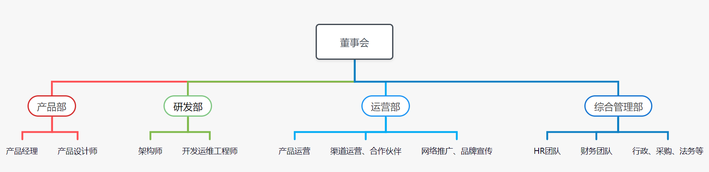

各部门人事组成和基本职能如下所示：

| 部门       | 职能                                                         |
| ---------- | ------------------------------------------------------------ |
| 董事会     | 把握公司前进方向，形成以CEO为核心的企业高管群体，为企业的未来谋篇布局，制定战略目标并统一管理、协调多个部门之间的工作。 |
| 产品部     | 产品经理负责获取产品需求、分析规划、设计产品的工作，组织开发、测试、验收、上线等项目管理工作。产品设计师负责具体的产品界面设计、交互方式设计、验收等等工作。 |
| 研发部     | 架构师负责技术选型、系统架构设计；开发运维工程师负责实现前后端联合开发、集成功能性能三大测试的工作 |
| 运营部     | 负责产品运营，包括用户拉新、激活转化留存等，以及渠道运营、合作伙伴联系、网络推广、市场品牌宣传等等。 |
| 综合管理部 | HR团队负责企业人才招聘、薪酬管理、员工培训等工作；财务团队负责进行企业资金预算等项目的统计与分析；其他包括行政、采购、法务等项目亦需要相关员工专门负责。 |

待后期公司规模扩大后，对一些部门可以进行扩充、合并或拆分。例如后期对企业员工的需求量增加，综合管理部就可以拆分为HR部门、财务部门和其他管理部门三个并列的部门，直属董事会，以提高各部门管理效率。

## 六、风险预测及解决方案

### 1. 风险识别

#### 1.1 市场推广风险

##### 1.1.1 竞争者

上班族群体拥有巨大的消费潜力，而受疫情和社会报道等影响，健康市场迅速发展且仍未饱和。而我们产品最大的优势就在于创意，所以势必会有许多竞争者模仿者出现，其中必然不乏已经拥有一定知名度和推广渠道的公司。这些已经拥有具备一定影响力推广渠道的公司势必为我们产品的市场推广带来巨大挑战。

##### 1.1.2 知名度

知名度是产品打造品牌聚拢人气的关键。建设知名度需要投入大量资金，但是仅凭知名度却无法增加销售额，对新产品而言更是如此。因而，新产品的知名度建设投入是非常艰难的权衡。作为新成立的公司知名度小，对扩展公司的规模有一定的制约；而新成立的公司在初期就投入大量资金建设知名度可能会造成现金流短缺，无法继续维持产品公司正常运转。

##### 1.1.3 市场偏好

疫情普遍提高了健康市场关注度，从大方向来看我们产品的市场偏好是精准且有前景的。但于市场推广而言，由于产品新推出不能产生较高利润，推广成本也因此受限，这意味着我们不能采用广撒网的方式以应对复杂多变的市场偏好，而必须要选择推广的关键点，是具体的某个关键业务，或是价值主张，亦或是多种组合，以迎合变化迅速且无法预测的市场偏好，进而扩大用户数量，占领市场份额。除此之外，如果无法实时获得市场偏好，动态调整推广策略，那么推广效果毋庸置疑会大大降低。

##### 1.1.4 推广渠道

在前期试运行阶段，我们往往只能找到普通的渠道进行推广，影响力大的渠道或价格高昂，或不愿意为未经过市场检验的新产品试错。因而推广渠道的选择也非常关键，即使多种小渠道推广达到的影响力可能还不如一个知名平台。

##### 1.1.5 过度营销

推广向来是双刃剑，适度的推广是提升知名度占领市场份额的必由之路，但推广较多可能反而会引起部分市场的不满，起到适得其反的效果。除此之外，大量的推广营销其实将产品和公司放到了极其危险的境地，一旦产品或公司出现问题，如产品质量风险或公司内部管理风险，信誉度将瞬间跌至谷底，面临突然大幅下滑的利润给资金链带来的巨大冲击。

#### 1.2 技术风险

##### 1.2.1 技术变化 

公司是否能适应行业的新技术变化，如网站的更新与升级、电子商务支付方式的变革。因为现在前端、后端和移动端开发技术变化很快，所以现在要考虑以后的技术是否会大幅度的变化，考虑新技术出现时是否要继续使用原来的老旧版本还是拥抱新技术，这是互联网产品常见的技术变化风险。

##### 1.2.2 产品质量

产品和服务的质量出现问题对一种新推出的来说尤为重要。怎样兼得高产品质量和高开发效率是我们必须关注的问题，因为我们提供的产品和服务类型很多，且提供的产品是健康类型的，更需要保证产品质量。

##### 1.2.3 生产能力不足

可能出现我们推出的特色产品和服务大受欢迎，而网站门店的生产能力不足的问题，将导致公司错过获利良机。主要考虑两个方面，第一是软件方面，就专指软件的可用性和稳定性，如果非常高的海量并发来袭，我们的网站很有可能崩溃；第二是线下部分，如果和我们的合作商门店无法承受大的客流量，无法承受大的订单量，就会出现生产能力不足的问题。

##### 1.2.4 供应商依赖

本产品     不自行生产商品，而是过分依赖门店的生产经营能力导致的风险。因为我们是一个多变商业平台，提供的主要是平台上的服务，而把其中好物商城、线下美食外卖、心理咨询等部分进行外包，如果这部分的供应商出现问题，例如无法保质保量的完成订单，就会影响我们的产品。

#### 1.3 法律道德风险

##### 1.3.1	用户隐私

近年来，用户权益尤其是用户隐私权的维护一直是社会的热点话题。我们的Workeep软件需要用到大量的用户数据。一方面我们的业务例如健康助手需要用到用户的日常运动数据进行分析，另一方面收集用户在软件上的使用痕迹也有助于描绘用户画像，为用户提供更加精准的推荐服务。但是一旦涉及到用户数据，就必须要慎重处理用户隐私的问题，包括用户账号密码等等。

##### 1.3.2	消费者权益

除了用户数据外，由于本软件还提供了"好物商城"功能，我们需要花费较大的精力来应对销售商品带来的一系列风险。比如说用户对我们的产品不满意，希望退换货等等，都需要我们及时迅速处理，防止造成对消费者权益侵害的法律风险。特别地，由于我们的商城还销售健康食品，因此保证食品安全是商城工作的重中之重。万一出现食品中毒等恶劣事件的发生，对品牌形象会产生严重打击，还会带来一系列的法律责任。

##### 1.3.3	知识产权

由于本软件涉及到与专业人士包括心理咨询师、营养师、健身教练等团队的合作，他们为平台提供的课程、发布的知识分享帖子等等都是智慧资产。平台若需要利用这些知识性资源进行宣传，就必须解决知识产权问题。

##### 1.3.4	违法言论

本软件提供了用户交流的平台，因此就需要对用户在平台的言论进行监管，避免违反法律规定的言论在平台上传播，导致平台承担法律责任的情况。

#### 1.4 财务风险

资本运动包括资本的筹集、运用、耗费、收回及分配等几个环节，概括而言就是筹资、投资和利润分配三个环节，这三个环节构成了企业的财务结构。根据资本运动的过程企业财务风险产生了几个环节：

##### 1.4.1	筹资环节

资金的不同来源和不同的筹资方式，会有不同的资金成本和相应的风险，公司在筹集资金时，必须在风险与成本之间权衡，以选用最佳的筹资方式。负债对权益比率反映财务杠杆程度，财务杠杆越大，股本的收益率越高，但相应的财务风险也越大。虽然在过去几十年内，许多公司都能在维持高杠杆的前提下，快速发展做大，但伴随着逆全球化进程、贸易战、新冠疫情和许多政府进行的去杠杆政策，我们必须对财务杠杆保持警惕。

另外，加强对流动负债的管理，可以提高短期资金的使用效益，降低成本，保证日常的生产经营需要。随着金融市场发展复杂化，企业在进行筹资决策时，筹资决策环境的不断变化，以及金融衍生工具的越来越广泛的应用，都会给企业带来财务风险。

##### 1.4.2	投资环节

公司可投资的流动资产包括现金、可交易性金融资产、应收账款和存货等，必须在流动性和获利性之间权衡做出最佳选择。对流动资产投资过多，虽然可以提高资金的流动性，从而增加公司的变现能力和短期偿债能力，但是可能会降低公司的获利能力，影响资金的周转。

公司也可投资于各类长期资产，如固定资产和长期证券。但较大的资本投资项目可能需要数年甚至几十年的时间实行计划和实施，由于资金数额大，时间跨度长，投资项目未来报酬是不确定的，存在较大风险和不确定性。但又反过来说，我国政府在此方面信誉良好，如果能参与我国政府主导的长期投资项目，可能是一种不错的选择。

再结合我们开发的目标软件，和我们预想的产品发展阶段来说，可能在产品扩张期甚至产品成熟期之前，我们都不会涉及、或者只会进行很小地对外投资。

##### 1.4.3	资金运营环节

传统的我国企业流动资产中，存货占比大，且很多表现为超储积压存货。存货流动性差，一方面占用了企业大量资金，另一方面企业必须为保管这些存货支付大量的保管费用，导致企业费用上升，利润下降。长期库存存货，企业还要承担市价下跌所产生的存货跌价损失及保管不善造成的损失，由此产生财务风险。在应收账款管理中，企业普遍存在只注重销售业绩，忽视应收账款的控制状况。一些企业为了增加销量，扩大市场占有率，大量采用赊销方式销售产品，导致企业应收账款大量增加。同时，由于企业在赊销过程中，对客户的信用等级了解不够，盲目赊销，造成应收账款失控，直至成为坏账，严重影响企业资产的流动性及安全性。

但我们开发的目标软件是典型的互联网轻资产软件，不存在存货积压、存货市价波动、赊账等问题，这是对我们的一个重大利好。

对于我们的软件来说，资金运营环节的最大压力来源于扩张期可能的研发投入、宣传推广、对外合作。原因在于，这个时期多半是我们和竞争对手竞争最激烈的时期。政府不会盲目地在新创赛道颁布规定，必然导致新创赛道发生资本大战。在多方激烈竞争的背景下，研发投入、宣传推广、销售补贴等等都会对资金运营造成巨大压力，这就要求我们及时开源节流、降本增效。

##### 1.4.4	利润分配环节

在按照有关法律规定的前提下，公司可以自主安排盈利中有多少用于给股东发放股利，有多少用于保留盈余作为公司进一步发展的资本，这就形成了公司股利分配政策。股利分派水平过低，股东的近期利益得不到满足；而股利分派水平过高，虽然满足了股东近期的愿望，但不利于企业长期发展。

同时，还要考虑2组矛盾，或者说2组关系；一是公司与员工间的分配，二是员工与员工间的分配。对于公司与员工之间，必然存在不是公司股东的员工，那么怎样让这些员工既有别于股东型的员工，又能切实给予利益，使其尽责、避免因利发生矛盾呢？

对于员工与员工之间，包括不同部门之间、同部门上下级之间的分配同样也是需要仔细考虑的问题。对不同部门之间偏心，弱势方工作效率会降低，会有被忽视之感；对不同部门一视同仁，那么多付出的部门、业绩好的部门又会感到不值；以部门的贡献进行利润分配的尺度，看似合理，实际上又会因为如何衡量贡献而陷入更多的难题之中；我们需要在两难困境中找到合适的位置。

### 2. 风险防范措施

#### 2.1 市场推广风险防范

##### 2.1.1 产品质量

防范市场推广风险的关键点和根源在产品质量。稳定可保证的产品质量消除了营销带来的负面影响，同时有利于知名度建设和推广渠道的稳定合作。因而，除了在产品开发时关注产品质量外，还应该建立用户反馈中心，及时收集用户关于产品质量相关反馈，并动态调整、迭代更新。除此之外，在重要版本发布前，可以招募适当的用户进行抢先体验，为产品提供的各项新服务质量增加一层保障，也可以适当了解市场对新服务的反应。同时，产品提供的高质量服务才是避免竞争者快速模仿，增大用户黏性的有效途径。

##### 2.1.2 推广体系建设

市场信息往往是纷繁复杂，多变且难预测的。因而，培养成立专业团队，或和相关机构建立稳定的合作关系以收集市场反馈用作决策调整非常重要。除了市场信息收集处理，建立推广渠道网也非常重要。早期建立的推广合作往往更加简单直接，而产品发展到一定程度后，愿意进行推广的平台渠道会迅速增加，这个时候需要对各家推广渠道进行评定分析，综合权衡投入成本、合作关系和渠道影响力等因素。

##### 2.1.3 线下渠道开拓

在软件产品试运行期，单纯依赖线上渠道推广难免过于单薄，这段时期也是线下渠道最能发挥作用的时期，相比线上渠道更为精准、高效。因此，初期在权衡各个小流量平台时，也有必要在适当的公司或其他地点开展线下宣传，更直接地去接触用户，帮助产品尽可能早地占领更多的市场份额。

#### 2.2 技术风险防范

##### 2.2.1 技术变化 

尽可能顺应技术的变化，因为软件的更新迭代是很快速的，使用最新的框架能保证软件的可用性和稳定性，所以技术部门要尽可能地采用更多的新技术，从而保证软件的实时高质量运行。

##### 2.2.2 产品质量

建立质量监管体系， 结合产品召回制度， 不断改进缺陷。我们会单独设立一个小部门，就是质量监管和保障部，他们的职责就是负责监察产品的质量；此外，我们会设立产品召回制度，不定期对上市产品进行抽测和检查，对不及格产品进行召回和重置，并设立相应的赏罚制度。以此反馈不断循环，从而改进缺陷，保证产品质量。

##### 2.2.3 生产能力不足

加强产品研发和创新、紧跟市场动态。使用新式技术加强产能。

##### 2.2.4 供应商依赖

与产品供应商建立稳定的供应关系，加强合同约束力。最重要的就是签订强有力的合同，需要公司中法务部门精心设计合同和推进。此外还要考虑人文关怀，要设身处地的为供应商着想。总之就是设立强有力的制度和合同保证供应商的高质量合作。

#### 2.3 法律道德风险防范

##### 2.3.1	隐私保护

平台需要重视用户隐私的保护。一方面对用户在平台上保存的数据进行加密处理，例如用户的密码等等，防止出现用户信息泄露等情况出现；另一方面若相关功能需要用到用户的数据，则必须询问用户，经用户同意后才能获取权限以得到数据，尽最大努力保障用户的隐私安全。

##### 2.3.2	消费者权益维护

对于消费者的权益保护，首先做到及时处理，即用户反馈的信息必须在24小时内由运营部门接受并给予回应和处理。同时对于一些较为严重的例如食品问题的反馈，需要专门成立调查小组进行处理。同时在与物资提供商的合作方面，需要定期检测产品质量，对产品不合标准的情况需要立即通知相关企业进行处理，采取惩罚措施。

##### 2.3.3	签约机制

在与相关专业团队进行合作的时候，需要进行知识资产归属的确认，确保其为企业提供的知识资产归企业所有，企业为其支付相应的酬金（通常包含在合作费或薪酬中），以避免侵犯知识产权的情况出现。

##### 2.3.4	监管机制

在平台上采用自动化的言论检测机制，当检测到用户违法言论时进行屏蔽、警告等操作，对于一些较为紧急的公关任务时调用专门的平台监管团队进行处理，以保证平台的健康发展。

#### 2.4 财务风险防范

未雨绸缪，防患未然，企业经营者面对财务风险，应发挥主观能动性，树立财务风险意识，对企业经营的外部环境以及企业自身的财务状况进行适时地分析研究，并采取有效措施，才能防范财务风险。财务风险的防范就是企业在识别风险、估量风险和分析风险的基础上，充分预见、有效控制风险，用最经济的方法把财务风险可能导致的不利后果减少到最低限度的管理方法。

##### 2.4.1 一般性原则

##### a)提高企业财务风险意识

　财务风险客观存在与财务管理的各个工作环节，要提高财务人员的风险意识，培养财务人员对风险的判断和应对能力，准确及时的发现潜在的财务风险。

##### **b)建立财务风险预警系统**

​	设置一些敏感性和可靠性高的财务指标，并构建指标体系，通过观察这些财务指标的变化，企业可以对将要面临的财务危机进行预测和预报。财务预警系统是以企业信息化为基础，对企业经营管理活动中潜在的风险进行实时监控，并贯穿于企业经营活动的全过程。预警系统依赖于对企业信息全面而精确的搜集，包括财务报表、经营计划及相关财务资料，利用财会、企业管理、金融等理论，采用数学模型的方法，发现企业潜在的财务风险，并向经营者示警。

##### **c)完善财务风险管理制度**

　管理的职能分为决策、计划和控制，财务管理的职能包括财务决策、财务计划和财务控制。在财务管理的各个职能中，必须及时的识别、分析和测试财务风险，采取科学方法防范和化解风险，并对财务管理的效果作出客观评价。

##### **d)强化企业内审制度**

　内部审计制度的健全有利于实现良好的内部控制。通过强化审计监督，能够及时发现并改善会计系统中存在的问题，进而提出改善会计控制系统的措施，并将审计结果报告给公司高层。在良好的内部控制制度下，才能保证财务信息的全面、准确和及时，为做出正确的财务决策和识别风险创造良好条件。

##### 2.4.2	筹资环节

​	如前所述，筹资环节的几大重点在于：负债（杠杆）、出让股权、其他金融工具。

​	对于负债多少，即财务杠杆程度的多少，我们认为需要保持在一个稳妥的程度。什么是稳妥？也就是参考美国美联储和中国央行的资产负债表扩张速度，在合理的情况下，进行几乎无后顾之忧的负债。众所周知，美联储的债务规模扩大，意味着美元本身的价值缩减，意味着不消费美元的美元持有者会经历资产的贬值。为了不让资产贬值，负债是必须的。但如果负债太多，当然会陷入传统的困局——利润赶不上利息增长的利滚利。我们会在债务可偿付的基础上进行负债。

​	出让股权在前文中也有讨论，在项目开发的前中期，我们不会出让大部分股权。

​	至于其他金融工具，因为非专业性的原因，我们必须要咨询专业的金融行业人士后在做判断。

​	至于我们在筹资环节保守的原因，是因为我们开发的轻资产软件，本身在开发期、试用期成本就有限。至于扩张期的可能大规模成本支出，我们可能会转向相对激进一些的筹资策略。

##### 2.4.3	投资环节

前文提到，在产品扩张期甚至产品成熟期之前，我们都不会涉及、或者只会进行很小地对外投资。

因此在对于投资环节，我们主要考虑产品有了稳定收入后、有了可观收入后的情况。

因为我们开发的轻资产属性和保守的筹资策略，我们可以不那么重视短期的对流动资产的投资，而相对更注重长期投资，即注重资金回报率的投资。流动资产虽然可以增加公司变现能力和短期偿债能力，但这种增加只是锦上添花，互联网公司本身就有强大的变现能力，需要补强的是产品可能衰弱后的收入来源，因此需要注重长期投资。

##### 2.4.4	资金运营环节

前文提到：

> 对于我们的软件来说，资金运营环节的最大压力来源于扩张期可能的研发投入、宣传推广、对外合作。原因在于，这个时期多半是我们和竞争对手竞争最激烈的时期。政府不会盲目地在新创赛道颁布规定，必然导致新创赛道发生资本大战。在多方激烈竞争的背景下，研发投入、宣传推广、销售补贴等等都会对资金运营造成巨大压力，这就要求我们及时开源节流、降本增效。

因此我们最重视的就是如何解决可能发生资本大战时的资金运营风险。

我们有几条思路，一、诉诸竞争对手间的的合作、合并与和解，但这样可能会引起社会和政府的不满，因此需要多方共同协商。 二、要求政府出台相关规定，避免无谓的烧钱大战。三、与竞争对手适当错位，调整目标服务客户或者调整部分业务，减小研发、宣传推广等的资金压力。 四、持续加强管理、持续进行新的融资和投资，击败竞争对手，这是在我们占据优势或者关键因素下的选择。

##### 2.4.5	利润分配环节

对于该环节，我们需要从几对关系入手进行风险化解。

即大环境与小环境的关系（共同富裕的政策与企业自主环境），企业上市分红与继续发展的关系（前者多少给人一种不好的预感），企业内部分配公平与效率的关系。

这几对关系当然都需要注意。但在产品的成熟期之前，我们认为需要在三对关系里选择注重小环境、企业继续发展和企业内部分配的效率优先这三项。因为一个初创企业是不能给予它太多要求和社会责任的，也不能动辄分红，影响士气、使人因钱动摇；企业的生存是初创企业最大的、最关键的问题。

但当产品进入成熟期以后，企业可能需要进行转向，配合大环境，适当分红，内部更注重公平的分配，以进行一种责任的弥补或补偿。

## 七、团队介绍

### 1. 队长介绍

钟山，南京大学软件学院2019级本科生。在校期间学习成绩优秀，曾获国家奖学金、南京大学优秀学生等荣誉。竞赛方面获得华东八校Hackthon决赛三等奖、全国大学生数学竞赛一等奖等。同时担任班级团支书，具备一定的团队组织管理能力，曾获得五四优秀团干部等奖项。

### 2. 队员介绍

关昕宇，南京大学软件学院2019级本科生。在校期间学习成绩优秀，年级排名名列前茅，曾获国家奖学金、南京大学优秀学生等荣誉。掌握Java、Python、MySQL等编程语言以及Spring Boot、Flask等框架。扎实干练，沉稳勤勉。

余欣然，南京大学软件学院2019级本科生。在校期间学习成绩优秀，曾获南京大学NITORI国际奖学金、南京大学优秀学生等荣誉。同时担任班级副班长，曾获五四优秀共青团员等奖项。

冯亚林，南京大学软件学院2019级本科生。在校期间学习成绩良好，曾获国家励志奖学金、二等人民奖学金等荣誉。同时担任班级团支书，具备一定的团队组织管理能力。

